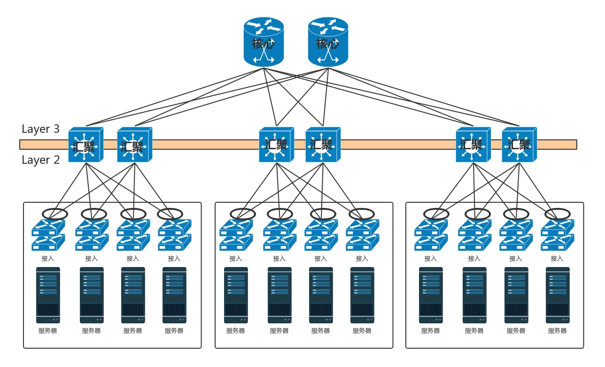
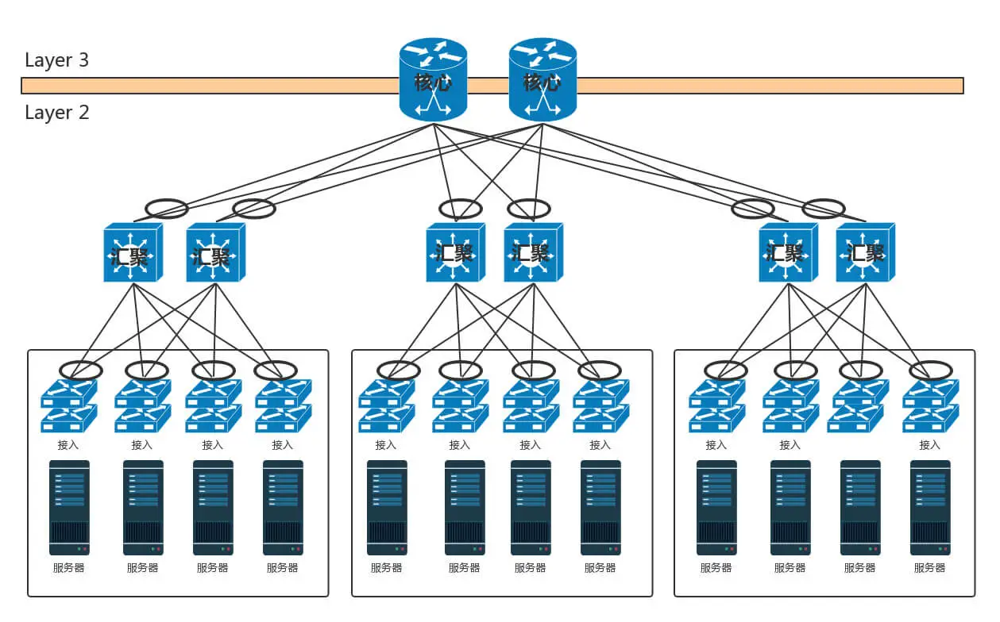
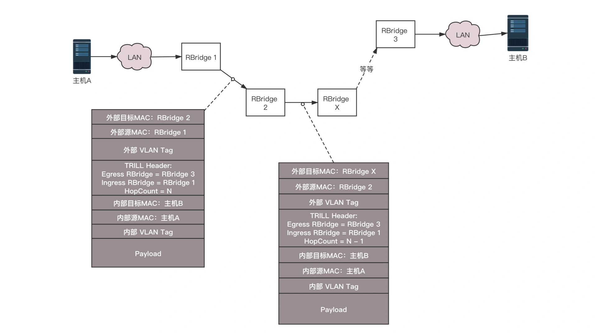
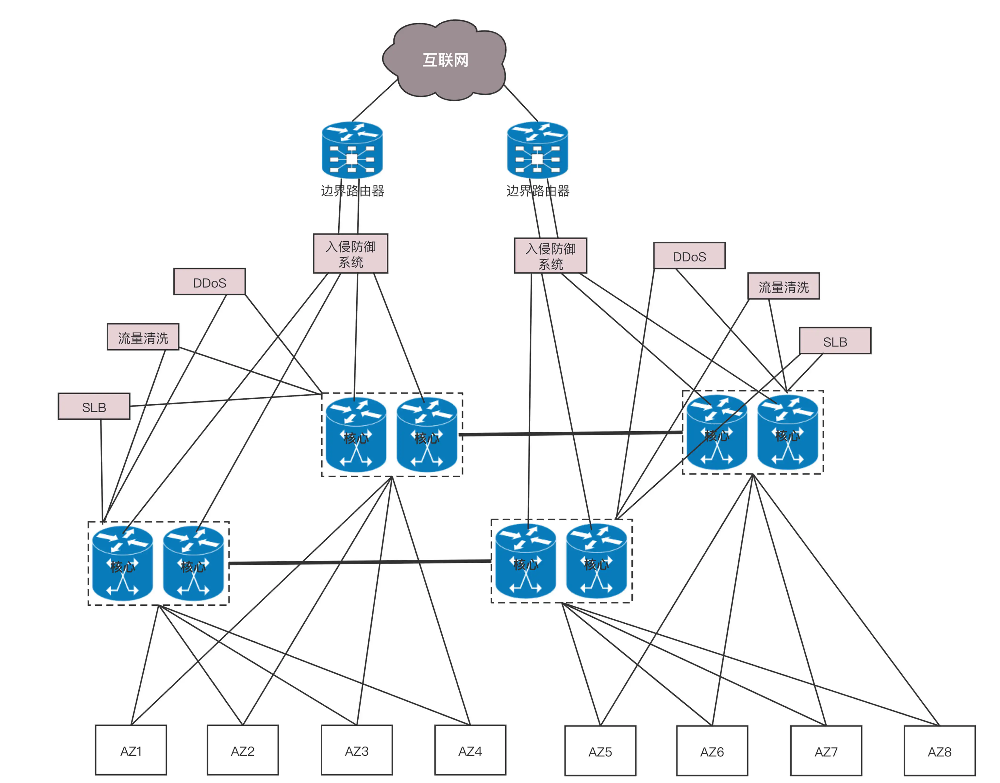
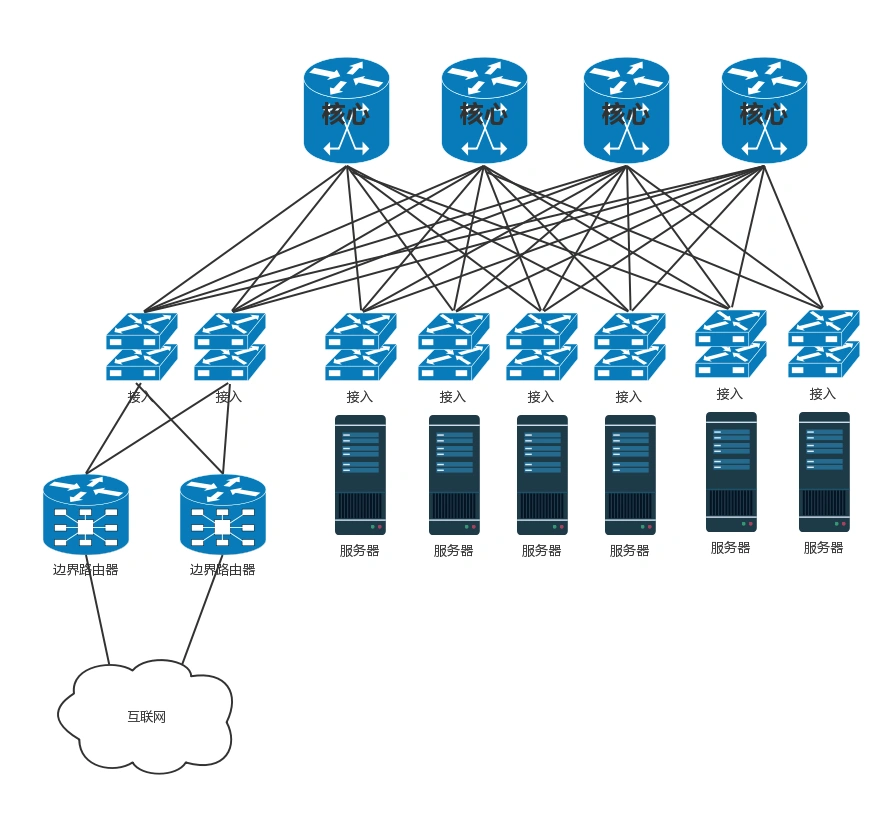
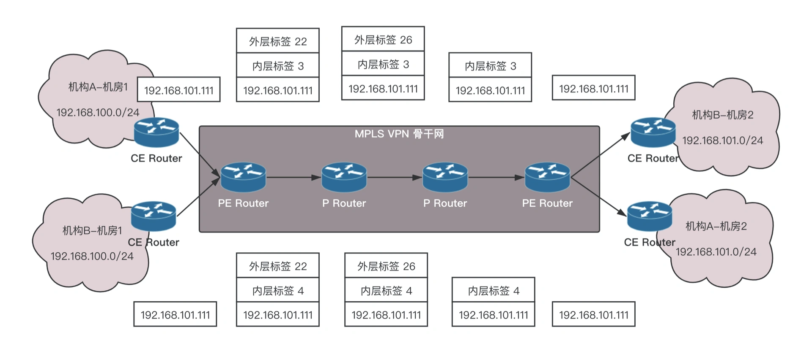

## [趣谈网络协议](https://time.geekbang.org/column/intro/85) 刘超

#course #network

- 一看觉得懂，一问就打鼓，一用就糊涂
- 内容以下主要架构，未涉及部分在本页面
  - [network](../network/network)
- 协议三要素
  - 语法 符合一定规则和格式
  - 语义 代表某种意义
  - 顺序
- 分层
  - **只要是在网络上跑的包，都是完整的。可以有下层没上层，绝对不可能有上层没下层**
  - 下层是上层实现的基础，下层要包含上层的语义
  - 完整数据包要经过 MAC 传输
- IP vs MAC 二层会依赖四层，四层也会依赖二层

## 综述

### 为什么学习网络协议

- 当网络包到达一个城关的时候，可以通过路由表得到下一个城关的 IP 地址，直接通过 IP 地址找就可以了，为什么还要通过本地的 MAC 地址呢
  - 在网络包里，有源 IP 地址和目标 IP 地址、源 MAC 地址和目标 MAC 地址。从路由表中取得下一跳的 IP 地址后，应该把这个地址放在哪里呢？如果放在目标 IP 地址里面，到了城关，谁知道最终的目标在哪里呢？所以要用 MAC 地址。
  - 所谓的下一跳，看起来是 IP 地址，其实要通过 ARP 得到 MAC 地址，将下一跳的 MAC 地址放在目标 MAC 地址里面。
- MAC（Media Access Control，介质访问控制）地址
  - 使得即便不能保证绝对唯一，但是能保证一个局域网内出现冲突的概率很小
- TCP 重试有没有可能导致重复下单
  - 因为 TCP 层收到了重复包之后，TCP 层自己会进行去重，发给应用层、HTTP 层。还是一个唯一的下单请求，所以不会重复下单。
  - 什么时候会导致重复下单呢？因为网络原因或者服务端错误，导致 TCP 连接断了，这样会重新发送应用层的请求，也即 HTTP 的请求会重新发送一遍。
  - 需要服务端除了实现无状态，还需要根据传过来的订单号实现幂等，同一个订单只处理一次。
- IP 地址和 MAC 地址的关系
  - IP 是有远程定位功能的，MAC 是没有远程定位功能的，只能通过本地 ARP 的方式找到。
- 如果最后一跳的时候，IP 改变了怎么办
  - 对于 IP 层来讲，当包到达最后一跳的时候，原来的 IP 不存在了。比如网线拔掉了，或者服务器直接宕机了，则 ARP 就找不到了，所以这个包就会发送失败了。对于 IP 层的工作就结束了。
  - IP 层之上还有 TCP 层，TCP 会重试的，包还是会重新发送，但是如果服务器没有启动起来，超过一定的次数，最终放弃。
  - 如果服务器重启了，IP 还是原来的 IP 地址，这个时候 TCP 重新发送的一个包的时候，ARP 是能够得到这个地址的，因而会发到这台机器上来，但是机器上面没有启动服务端监听那个端口，于是会发送 ICMP 端口不可达。
  - 如果服务器重启了，服务端也重新启动了，也在监听那个端口了，这个时候 TCP 的服务端由于是新的，Sequence Number 根本对不上，说明不是原来的连接，会发送 RST。
  - 有一个非常特殊的方式，就是虚拟机的热迁移，从一台物理机迁移到另外一台物理机，IP 不变，MAC 不变，内存也拷贝过去，Sequence Number 在内存里面也保持住了，在迁移的过程中会丢失一两个包，但是从 TCP 来看，最终还是能够连接成功的。
- ARP 协议属于哪一层
  - 一直是有争议的。比如《TCP/IP 详解》把它放在了二层和三层之间，但是既然是协议，只要大家都遵守相同的格式、流程就可以了，在实际应用的时候，不会有歧义的，唯一有歧义的是参加各种考试

### 网络分层的真实含义是什么

- 为什么要分层
  - 一个架构设计的通用问题，不仅仅是网络协议的问题。一旦涉及到复杂的逻辑，或者软件需求需要经常变动，一般都会通过分层来解决问题。
  - 为什么要把一些原子的 API 放在基础服务层呢？将数据库、缓存、搜索引擎等，屏蔽到基础服务层以下，基础服务层之上的组合逻辑层、API 层都只能调用基础服务层的 API，不能直接访问数据库。
  - 一旦分了层就好办了，定制化后要依赖于下一层的接口，只要实现自己的逻辑就可以了。如果 TCP 的实现将所有的逻辑耦合在了整个七层，不用 TCP 的可靠传输机制都没有办法。
- 层级之间真实的调用方式是什么样的
  - 《深入理解 Linux 网络技术内幕》
  - 下层的协议知道上层协议的，因为在每一层的包头里面，都会有上一层是哪个协议的标识，所以不是一个回调函数，每一层的处理函数都会在操作系统启动的时候，注册到内核的一个数据结构里面，但是到某一层的时候，是通过判断到底是哪一层的哪一个协议，然后去找相应的处理函数去调用。
  - 以 UDP 为例子，其实发送的包就是一个 sk_buff 结构  `int udp_send_skb(struct sk_buff *skb, struct flowi4 *fl4)`
  - UDP 层调用 IP 层函数 `int ip_send_skb(struct net *net, struct sk_buff *skb)`
  - IP 层通过路由判断，将包发给下一层 `int ip_output(struct net *net, struct sock *sk, struct sk_buff *skb)`
  - 发送的时候，要进行 ARP。如果有 MAC，则调用二层的函数，neigh 其实就是邻居系统，是二层的意思。`int neigh_output(struct neighbour *n, struct sk_buff *skb)`
  - 接收的时候，会调用接收函数 `int netif_receive_skb(struct sk_buff *skb)`会根据是 ARP 或者 IP 等，选择调用不同的函数。如果是 IP 协议的话，就调用这里的函数。`int ip_rcv(struct sk_buff *skb, struct net_device *dev, struct packet_type *pt, struct net_device *orig_dev)`
  - 这里也有路由判断。如果是本地的，则继续往上提交这个结构。`int ip_local_deliver(struct sk_buff *skb)`
  - 根据 IP 头里面协议号判断是什么协议，从而调用什么函数 `int udp_rcv(struct sk_buff *skb)`

### ifconfig：最熟悉又陌生的命令行

- [net-tools 和 iproute2 的“历史”故事](https://linoxide.com/linux-command/use-ip-command-linux/)
- A、B、C 类地址的有效地址范围
  - A 类 IP 地址第一个字段范围 0～127，由于全 0 和全 1 地址用作特殊用途，实际可指派范围 1～126。A 类地址范围和 A 类有效地址范围。
- 网络号、IP 地址、子网掩码和广播地址的先后关系是什么？
  - 在一个小公司里，总共就没几台机器，对于私有地址，一般选择 192.168.0.0/24 就可以
  - 192.168.0 网络号
  - 子网掩码 网络号是 1，其他是 0 255.255.255.0
  - 广播地址 除了网络号之外都是 1 182.168.0.255
  - 当规划完网络的时候，一般这个网络里面的第一个、第二个地址被默认网关 DHCP 服务器占用，你自己创建的机器，只要和其他的不冲突就可以了，当然你也可以让 DHCP 服务自动配置。
  - 公有云之后，有个概念虚拟网络（VPC），网络完全软件化了，任何人都可以做网络规划
- 组播和广播的意义和原理是什么？
  - C 类地址的主机号 8 位，去掉 0 和 255，就只有 254 个
  - 广播和组播分为两个层面，其中 MAC 层有广播和组播对应地址，IP 层也有自己的广播地址和组播地址。
  - 广播相对比较简单
    - MAC 层为 ff:ff:ff:ff:ff:ff
    - IP 层指向子网广播地址为主机号全 1 且有特定子网号的地址。
  - 组播复杂一些
    - MAC 层中，当地址中最高字节的最低位设置为 1 时，表示该地址是一个组播地址，用十六进制可表示为 01:00:00:00:00:00。
    - IP 层中，组播地址为 D 类 IP 地址，当 IP 地址为组播地址的时候，有一个算法可以计算出对应的 MAC 层地址。
  - 多播进程将目的 IP 地址指明为多播地址，设备驱动程序将它转换为相应的以太网地址，然后把数据发送出去。
    - 接收进程必须通知它们的 IP 层，它们想接收的发给定多播地址的数据报，并且设备驱动程序必须能够接收这些多播帧。
    - 这个过程就是“加入一个多播组”。当多播跨越路由器的时候，需要通过 IGMP 协议告诉多播路由器，多播数据包应该如何转发。
- MTU 1500 具体含义
  - MTU（Maximum Transmission Unit，最大传输单元）是二层的一个定义。以以太网为例，MTU 为 1500 个 Byte，前面有 6 个 Byte 的目标 MAC 地址，6 个 Byte 的源 MAC 地址，2 个 Byte 的类型，后面有 4 个 Byte 的 CRC 校验，共 1518 个 Byte。
  - 在 IP 层，一个 IP 数据报在以太网中传输，如果它的长度大于该 MTU 值，就要进行分片传输。如果不允许分片 DF，就会发送 ICMP 包
  - 在 TCP 层有个 MSS（Maximum Segment Size，最大分段大小），等于 MTU 减去 IP 头，再减去 TCP 头。即在不分片的情况下，TCP 里面放的最大内容。
  - 在 HTTP 层看来，它的 body 没有限制，而且在应用层看来，下层的 TCP 是一个流，可以一直发送，但其实是会被分成一个个段的。

### DHCP 与 PXE：IP 是怎么来的，又是怎么没的

- PXE 协议可以用来安装操作系统，但是如果每次重启都安装操作系统，就会很麻烦。你知道如何使得第一次安装操作系统，后面就正常启动吗？
  - 安装一台电脑的时候，都是有启动顺序的，如果改为硬盘启动，就没有问题了。
  - 服务器一般都提供 IPMI 接口，可以通过这个接口启动、重启、设置启动模式等等远程访问，这样就可以批量管理一大批机器。
  - Cobbler，这是一个批量安装操作系统的工具。在 OpenStack 里面，还有一个 Ironic，也是用来管理裸机的
- 在 DHCP 网络里面，手动配置 IP 地址会冲突吗?
  - 在一个 DHCP 网络里面，如果某一台机器手动配置了一个 IP 地址，并且在 DHCP 管理的网段里的话，DHCP 服务器是会将这个地址分配给其他机器的。一旦分配了，ARP 的时候，就会收到两个应答，IP 地址就冲突了。
  - 发生这种情况的时候 DHCP 的客户端和服务器都可以添加相应的机制来检测冲突。
    - 如果由客户端来检测冲突，一般情况是，客户端在接受分配的 IP 之前，先发送一个 ARP，看是否有应答，有就说明冲突了，于是发送一个 DHCPDECLINE，放弃这个 IP 地址。
    - 如果由服务器来检测冲突，DHCP 服务器会发送 ping，来看某个 IP 是否已经被使用。如果被使用了，它就不再将这个 IP 分配给其他的客户端了。
- DHCP 的 Offer 和 ACK 应该是单播还是广播呢？
  - 取决于 DHCP offer 中 Broadcst 中位设置值 1 广播 0 单播
  - 正常情况下，一旦有了 IP 地址，DHCP Server 还是希望通过单播的方式发送 OFFER 和 ACK。
  - 但是不幸的是，有的客户端协议栈的实现，如果还没有配置 IP 地址，就使用单播。协议栈是不接收这个包的，因为 OFFER 和 ACK 的时候，IP 地址还没有配置到网卡上。
  - 所以，一切取决于客户端的协议栈的能力，如果没配置好 IP，就不能接收单播的包，那就将 BROADCAST 设为 1，以广播的形式进行交互。
  - 如果客户端的协议栈实现很厉害，即便是没有配置好 IP，仍然能够接受单播的包，那就将 BROADCAST 位设置为 0，就以单播的形式交互。
- DHCP 如何解决内网安全问题?
  - DHCP 协议的设计是基于内网互信的基础来设计的，而且是基于 UDP 协议。
  - 一个普通用户无意地或者恶意地安装一台 DHCP 服务器，发放一些错误或者冲突的配置
    - DHCP 服务器和二层网络都是由网管管理的，可以在交换机配置只有来自某个 DHCP 服务器的包才是可信的，其他全部丢弃。
    - 如果有 SDN，或者在云中，非法的 DHCP 包根本就拦截到虚拟机或者物理机的出口。
  - 有恶意的用户发出很多的 DHCP 请求，让 DHCP 服务器给他分配大量的 IP。
    - 一方面进行监控，对 DHCP 报文进行限速，并且异常的端口可以关闭，一方面还是 SDN 或者在云中，除了被 SDN 管控端登记过的 IP 和 MAC 地址，其他的地址是不允许出现在虚拟机和物理机出口的，也就无法模拟大量的客户端。

## 二层到三层

### 物理层到 MAC 层

- RARP 协议，即已知 MAC 求 IP 的，你知道它可以用来干什么吗
  - 之前有无盘工作站，即没有硬盘的机器，无法持久化ip地址到本地，但有网卡，所以可以用RARP协议来获取IP地址。
  - RARP可以用于局域网管理员想指定机器IP（与机器绑定，不可变），又不想每台机器去设置静态IP的情况，可以在RARP服务器上配置MAC和IP对应的ARP表，不过获取每台机器的MAC地址，好像也挺麻烦的。
  - 这个协议现在应该用得不多了吧，都用BOOTP或者DHCP了。
- 如果一个局域网里面有多个交换机，ARP 广播的模式会出现什么问题呢
  - ARP广播时，交换机会将一个端口收到的包转发到其它所有的端口上。
  - 如果整个局域网存在一个环路，使得数据包又重新回到了最开始的交换机，这个包又会再次复制多份广播出去。如此循环，数据包会不停得转发，而且越来越多，最终占满带宽，或者使解析协议的硬件过载，行成广播风暴。
  - 解决
    - Hub：
      - 一个广播域，一个冲突域。
      - 传输数据的过程中易产生冲突，带宽利用率不高
    - Switch：
      - 在划分vlan的前提下可以实现多个广播域，每个接口都是一个单独的冲突域
      - 通过自我学习的方法可以构建出CAM表，并基于CAM进行转发数据。
      - 支持生成树算法。可以构建出物理有环，逻辑无环的网络，网络冗余和数据传输效率都甩Hub好几条街。SW是目前组网的基本设备之一。

### 交换机与 VLAN

- [[tcp_ip#STP Spanning Tree Protocol|STP]]
- STP 协议能够很好地解决环路问题，但是也有它的缺点
  - 当拓扑发生变化，新的配置消息要经过一定的时延才能传播到整个网络。
  - 由于整个交换网络只有一棵生成树，在网络规模比较大的时候会导致较长的收敛时间，拓扑改变的影响面也较大，当链路被阻塞后将不承载任何流量，造成了极大带宽浪费。
- 每台交换机的武力值是什么样的？
  - 当一台交换机加入或者离开网络的时候，都会造成网络拓扑变化，这个时候检测到拓扑变化的网桥会通知根网桥，根网桥会通知所有的网桥拓扑发生变化。
  - 网桥 ID 是由网桥优先级和网桥 MAC 地址组成的，网桥 ID 最小的将成为网络中的根桥。默认配置下，网桥优先级都一样，默认优先级是 32768。这个时候 MAC 地址最小的网桥成为根网桥。但是如果想设置某台为根网桥，就配置更小的优先级即可。
  - 在优先级向量里面，Root Bridge ID 就是根网桥的 ID，Bridge ID 是网桥的 ID，Port ID 就是一个网桥上有多个端口，端口的 ID。
  - 按照 RFC 的定义，ROOT PATH COST 是和出口带宽相关的，具体的数据
- 在 MAC 地址已经学习的情况下，ARP 会广播到没有 IP 的物理段吗
  - ARP 的目标地址是广播的，所以无论是否进行地址学习，都会广播
  - 对于某个 MAC 的访问，在没有地址学习的时候，是转发到所有的端口的，学习之后，只会转发到有这个 MAC 的端口。
- 802.1Q VLAN 和 Port-based VLAN 有什么区别
  - 所谓 Port-based VLAN，一般只在一台交换机上起作用，比如一台交换机，10 个口，1、3、5、7、9 属于 VLAN 10。1 发出的包，只有 3、5、7、9 能够收到，但是从这些口转发出去的包头中，并不带 VLAN ID。
  - 802.1Q 的 VLAN，出了交换机也起作用，也就是说，一旦打上某个 VLAN，则出去的包都带这个 VLAN，也需要链路上的交换机能够识别这个 VLAN，进行转发。

![[stp_vector_weight.png]]

### ICMP 与 ping

- 当发送的报文出问题的时候，会发送一个 ICMP 的差错报文来报告错误，但是如果 ICMP 的差错报文也出问题
  - 不会导致产生 ICMP 差错报文的有
    - ICMP 差错报文（ICMP 查询报文可能会产生 ICMP 差错报文）
    - 目的地址是广播地址或多播地址的 IP 数据报
    - 作为链路层广播的数据报
    - 不是 IP 分片的第一片
    - 源地址不是单个主机的数据报。这就是说，源地址不能为零地址、环回地址、广播地址或多播地址。
- ping 使用的是什么网络编程接口？
  - 使用 ICMP `socket(AF_INET, SOCK_RAW, IPPROTO_ICMP)`
  - SOCK_RAW 就是基于 IP 层协议建立通信机制。
- ICMP 差错报文是谁发送的呢
  - ICMP 包是由内核返回的，在内核中，有一个函数用于发送 ICMP 的包。 `void icmp_send(struct sk_buff *skb_in, int type, int code, __be32 info);`

### 世界这么大，想出网关：欧洲十国游与玄奘西行

- 在家里要访问 163 网站的时候，包需要 NAT 成为公网 IP，返回的包又要 NAT 成的私有 IP，返回包怎么知道这是你的请求呢？它怎么能这么智能地 NAT 成了你的 IP 而非别人的 IP 呢？
  - 安全里的 iptables 时， conntrack 功能，记录了 SNAT 一去一回的对应关系。
  - 要跟踪一个网络包，对于每一种路径，都需要设置两个记录点，这样内核才知道这个包的状态。
  - 发给我的，在 PREROUTING 调用 ipv4_conntrack_in，创建连接跟踪记录；在 INPUT 调用 ipv4_confirm，将这个连接跟踪记录挂在内核的连接跟踪表里面。为什么不一开始就挂在内核的连接跟踪表里面呢？因为有 filter 表，一旦把包过滤了，也就是丢弃了，那根本没必要记录这个连接了。
  - 发给别人的，在 OUTPUT 调用 ipv4_conntrack_local，创建连接跟踪记录，在 POSTROUTING 调用 ipv4_confirm，将这个连接跟踪记录挂在内核的连接跟踪表里面。
  - 从我这里经过的，在 PREROUTING 调用 ipv4_conntrack_in，创建连接跟踪记录，在 POSTROUTING 调用 ipv4_confirm，将这个连接跟踪记录挂在内核的连接跟踪表里面。
    - 如果是 PREROUTING 的时候，先调用 ipv4_conntrack_in，创建连接跟踪记录
    - 如果是 PREROUTING 的时候，有 NAT 规则，则调用 nf_nat_ipv4_in 进行地址转换
    - 如果是 POSTROUTING 的时候，有 NAT 规则，则调用 nf_nat_ipv4_out 进行地址转换
    - 如果是 POSTROUTING 的时候，调用 ipv4_confirm，将这个连接跟踪记录挂在内核的连接跟踪表里面。
  - 连接跟踪记录 每个网络包都是一个 struct sk_buff，有一个成员变量 ` _nfct  `指向一个连接跟踪记录 struct nf_conn。当然当一个网络包刚刚进来的时候，是不会指向这么一个结构的，但是这个网络包肯定属于某个连接，因而会去连接跟踪表里面去查找，之后赋值给 sk_buff 的这个成员变量。没找到的话，就说明是一个新的连接，然后会重新创建一个。
    - nf_conntrack 其实才是 `_nfct` 变量指向的地址，但是没有关系，学过 C++ 的话应该明白，对于结构体来讲，nf_conn 和 nf_conntrack 的起始地址是一样的；
    - tuplehash 虽然是数组，但是里面只有两个，IP_CT_DIR_ORIGINAL 为下标 0，表示连接的发起方向，IP_CT_DIR_REPLY 为下标 1，表示连接的回复方向。
    - 里面，最重要的是 nf_conntrack_tuple_hash 的数组。nf_conn 是这个网络包对应的一去一回的连接追踪记录，但是这个记录是会放在一个统一的连接追踪表里面的。
  - 连接跟踪表 nf_conntrack_hash 是一个数组，数组中的每一项都是一个双向链表的头，每一项后面都挂着一个双向链表，链表中的每一项都是这个结构。
    - 这个结构的第一项是链表的链，nf_conntrack_tuple 是用来标识是否同一个连接。
    - 从上面可以看出来，连接跟踪表是一个典型的链式哈希表的实现。
    - 每当有一个网络包来了的时候，会将网络包中 sk_buff 中的数据提取出来，形成 nf_conntrack_tuple，并根据里面的内容计算哈希值。然后需要在哈希表中查找，如果找到，则说明这个连接出现过；如果没找到，则生成一个插入哈希表。
    - 通过 nf_conntrack_tuple 里面的内容，可以唯一地标识一个连接：
      - src：包含源 IP 地址；如果是 TCP 或者 UDP，包含源端口；如果是 ICMP，包含的是 ID；
      - dst：包含目标 IP 地址；如果是 TCP 或者 UDP，包含目标端口；如果是 ICMP，包含的是 type, code
  - 过程
    - 当一个包发出去的时候，到达这个 NAT 网关的时候，首先经过 PREROUTING 的时候，先调用 ipv4_conntrack_in。这个时候进来的包 sk_buff 为： {源 IP：客户端 IP，源端口：客户端 port，目标 IP：服务端 IP，目标端口：服务端 port}，将这个转换为 nf_conntrack_tuple，然后经过哈希运算，在连接跟踪表里面查找，发现没有，说明这是一个新的连接。
    - 于是，创建一个新的连接跟踪记录 nf_conn，这里面有两个 nf_conntrack_tuple_hash：
      - 一去：{源 IP：客户端 IP，源端口：客户端 port，目标 IP：服务端 IP，目标端口：服务端 port}；
      - 一回：{源 IP：服务端 IP，源端口：服务端 port，目标 IP：客户端 IP，目标端口：客户端 port}。
    - 接下来经过 FORWARD 过程，假设包没有被 filter 掉，于是要转发出去，进入 POSTROUTING 的过程，有 NAT 规则，则调用 nf_nat_ipv4_out 进行地址转换。这个时候，源地址要变成 NAT 网关的 IP 地址，对于 masquerade 来讲，会自动选择一个公网 IP 地址和一个随机端口。
    - 为了让包回来的时候，能找到连接跟踪记录，需要修改两个 nf_conntrack_tuple_hash 中回来的那一项为：{源 IP：服务端 IP，源端口：服务端 port，目标 IP：NAT 网关 IP，目标端口：随机端口}。
    - 接下来要将网络包真正发出去的时候，除了要修改包里面的源 IP 和源端口之外，还需要将刚才的一去一回的两个 nf_conntrack_tuple_hash 放入连接跟踪表这个哈希表中。
    - 当网络包到达服务端，然后回复一个包的时候，这个包 sk_buff 为：{源 IP：服务端 IP，源端口：服务端 port，目标 IP：NAT 网关 IP，目标端口：随机端口}。
    - 将这个转换为 nf_conntrack_tuple 后，进行哈希运算，在连接跟踪表里面查找，是能找到相应的记录的，找到 nf_conntrack_tuple_hash 之后，Linux 会提供函数 nf_conntrack_tuple_hash 找到外面的连接跟踪记录 nf_conn，通过这个可以找到来方向的那个 nf_conntrack_tuple_hash，{源 IP：客户端 IP，源端口：客户端 port，目标 IP：服务端 IP，目标端口：服务端 port}，这样就能够找到客户端的 IP 和端口，从而可以 NAT 回去。
- NAT 能建立多少连接
  - SNAT 多用于内网访问外网的场景，鉴于 conntrack 是由{源 IP，源端口，目标 IP，目标端口}，hash 后确定的。
    - 如果内网机器很多，但是访问的是不同的外网，也即目标 IP 和目标端口很多，这样内网可承载的数量就非常大，可不止 65535 个。
    - 但是如果内网所有的机器，都一定要访问同一个目标 IP 和目标端口，这样源 IP 如果只有一个，这样的情况下，才受 65535 的端口数目限制，根据原理，一种方法就是多个源 IP，另外的方法就是多个 NAT 网关，来分摊不同的内网机器访问。
    - 如果使用的是公有云，65535 台机器，应该放在一个 VPC 里面，可以放在多个 VPC 里面，每个 VPC 都可以有自己的 NAT 网关。
  - 微信这种场景，应该是服务端在数据中心内部，无论多少长连接，作为服务端监听的都是少数几个端口，是 DNAT 的场景，是没有端口数目问题的，只有一台服务器能不能维护这么多连接，因而在 NAT 网关后面部署多个 nginx 来分摊连接即可。
- 公网 IP
  - 不是每一个虚拟机都要有一个公网 IP 的，只有需要对外提供服务的机器，也即接入层的那些 nginx 需要公网 IP
  - 没有公网 IP，使用 SNAT，共享 SNAT 网关的公网 IP 地址，也是能够访问的外网的。

### 路由协议：西出网关无故人，敢问路在何方

- 路由协议要在路由器之间交换信息，这些信息的交换还需要走路由吗？不是死锁了吗？
  - OSPF 是直接基于 IP 协议发送的，而且 OSPF 的包都是发给邻居的，也即只有一跳，不会中间经过路由设备。
  - BGP 是基于 TCP 协议的，在 BGP peer 之间交换信息。
- 多线 BGP 机房
  - BGP 主要用于互联网 AS 自治系统之间的互联，BGP 的最主要功能在于控制路由的传播和选择最好的路由。
  - 各大运营商都具有 AS 号，全国各大网络运营商多数都是通过 BGP 协议与自身的 AS 来实现多线互联的。
  - 使用此方案来实现多线路互联，IDC 需要在 CNNIC（中国互联网信息中心）或 APNIC（亚太网络信息中心）申请自己的 IP 地址段和 AS 号，然后通过 BGP 协议将此段 IP 地址广播到其它的网络运营商的网络中。
  - 使用 BGP 协议互联后，网络运营商的所有骨干路由设备将会判断到 IDC 机房 IP 段的最佳路由，以保证不同网络运营商用户的高速访问。

## 传输层

### UDP 协议

- 都说 TCP 是面向连接的，在计算机看来，怎么样才算一个连接呢？
  - TCP 的两端为了维护连接所保持的数据结构。

### TCP 协议（上）

- TCP的三次握手和四次挥手的必要性：它们的存在以及复杂度，就是为了消除不确定性
- TCP 的连接有这么多的状态，你知道如何在系统中查看某个连接的状态吗？
  - netstat losf|grep establish|listen|close_wait
- TIME_WAIT 状态太多是怎么回事儿？
  - 说明双方建立成功过连接，而且已经发送了最后的 ACK 之后，才会处于这个状态，而且是主动发起关闭的一方处于这个状态。
  - 存在大量的 TIMEWAIT，往往是因为短连接太多，不断的创建连接，然后释放连接，从而导致很多连接在这个状态，可能会导致无法发起新的连接。解决的方式
    - 打开 tcp_tw_recycle 和 tcp_timestamps 选项
    - 打开 tcp_tw_reuse 和 tcp_timestamps 选项
    - 程序中使用 SO_LINGER，应用强制使用 rst 关闭。
  - 当客户端收到 Connection Reset，往往是收到了 TCP 的 RST 消息，RST 消息一般在下面的情况下发送：
    - 试图连接一个未被监听的服务端；
    - 对方处于 TIMEWAIT 状态，或者连接已经关闭处于 CLOSED 状态，或者重新监听 seq num 不匹配；
    - 发起连接时超时，重传超时，keepalive 超时；
    - 在程序中使用 SO_LINGER，关闭连接时，放弃缓存中的数据，给对方发送 RST。
- 序号的起始序号随时间变化，...重复需要4个多小时,如果有两个TCP链接都在这个4ms内建立，是不是就是相同的起始序列号呢。
  - 序号的随时间变化，主要是为了区分同一个链接发送序号混淆的问题，两个链接的话，端口或者IP肯定都不一样了
- 报文最大生存时间（MSL）和IP协议的路由条数（TTL）什么关系呢，报文当前耗时怎么计算？TCP层有存储相应时间？
  - 都和报文生存有关，前者是时间维度的概念，后者是经过路由跳数，不是时间单位.
- 起始序列号是怎么计算的，会冲突吗？
  - 起始 ISN 是基于时钟的，每 4 毫秒加一，转一圈要 4.55 个小时。
  - TCP 初始化序列号不能设置为一个固定值，因为这样容易被攻击者猜出后续序列号，从而遭到攻击。 RFC1948 中提出了一个较好的初始化序列号 ISN 随机生成算法。`ISN = M + F (localhost, localport, remotehost, remoteport)`
  - M 是一个计时器，这个计时器每隔 4 毫秒加 1。F 是一个 Hash 算法，根据源 IP、目的 IP、源端口、目的端口生成一个随机数值。要保证 Hash 算法不能被外部轻易推算得出，用 MD5 算法是一个比较好的选择。

### TCP 协议（下）

- TCP 的 BBR 听起来很牛，你知道它是如何达到这个最优点的吗？
  - 设备缓存会导致延时？
    - 假如经过设备的包都不需要进入缓存，那么得到的速度是最快的。进入缓存且等待，等待的时间就是额外的延时。
    - BBR就是为了避免这些问题：充分利用带宽；降低buffer占用率。
  - 降低发送packet的速度，为何反而提速了？
    - 标准TCP拥塞算法是遇到丢包的数据时快速下降发送速度，因为算法假设丢包都是因为过程设备缓存满了。快速下降后重新慢启动，整个过程对于带宽来说是浪费的。通过packet速度-时间的图来看，从积分上看，BBR充分利用带宽时发送效率才是最高的。可以说BBR比标准TCP拥塞算法更正确地处理了数据丢包。对于网络上有一定丢包率的公网，BBR会更加智慧一点。
    - 回顾网络发展过程，带宽的是极大地改进的，而最小延迟会受限与介质传播速度，不会明显减少。BBR可以说是应运而生。
  - BBR如何解决延时？
    - S1：慢启动开始时，以前期的延迟时间为延迟最小值Tmin。然后监控延迟值是否达到Tmin的n倍，达到这个阀值后，判断带宽已经消耗尽且使用了一定的缓存，进入排空阶段。
    - S2：指数降低发送速率，直至延迟不再降低。这个过程的原理同S1
    - S3：协议进入稳定运行状态。交替探测带宽和延迟，且大多数时间下都处于带宽探测阶段。

### 套接字 Socket

- epoll 是 Linux 上的函数，那你知道 Windows 上对应的机制是什么吗？如果想实现一个跨平台的程序，你知道应该怎么办吗？
  - windows上有一个叫iocp，但是它还是有点不一样，它是proactor，而epoll是reactor。我觉得iocp效率会更高，epoll通知应用去读取数据，处理完之后还要返回内核发送数据，而完成端口直接在内核态进行处理数据，最后告诉应用，数据已经处理完了
  - epoll 是异步通知，当事件发生的时候，通知应用去调用 IO 函数获取数据。IOCP 异步传输，当事件发生时，IOCP 机制会将数据直接拷贝到缓冲区里，应用可以直接使用。
  - 如果跨平台，推荐使用 libevent 库，它是一个事件通知库，适用于 Windows、Linux、BSD 等多种平台，内部使用 select、epoll、kqueue、IOCP 等系统调用管理事件机制。

## 应用层

### HTTP 协议

- QUIC 是一个精巧的协议，所以它肯定不止今天我提到的四种机制，你知道还有哪些吗？
  - http2.0的多路复用和4g协议的多harq并发类似，quick的关键改进是把Ack的含义给提纯净了，表达的含义是收到了包，而不是tcp的＂期望包＂
  - 快速建立连接。放在下面 HTTPS 的时候一起说。
  - 另一个是拥塞控制，QUIC 协议当前默认使用 TCP 协议的 CUBIC（拥塞控制算法）
    - 每当收到一个 ACK 的时候，就需要调整拥塞窗口的大小。但是这也造成了一个后果，那就是 RTT 比较小的，窗口增长快。
    - 然而这并不符合当前网络的真实状况，因为当前的网络带宽比较大，但是由于遍布全球，RTT 也比较长，因而基于 RTT 的窗口调整策略，不仅不公平，而且由于窗口增加慢，有时候带宽没满，数据就发送完了，因而巨大的带宽都浪费掉了。
    - CUBIC 进行了不同的设计，它的窗口增长函数仅仅取决于连续两次拥塞事件的时间间隔值，窗口增长完全独立于网络的时延 RTT。
      - 当出现丢包事件时，CUBIC 会记录这时的拥塞窗口大小，把它作为 Wmax。
      - 接着，CUBIC 会通过某个因子执行拥塞窗口的乘法减小，然后，沿着立方函数进行窗口的恢复。
      - 一开始恢复的速度是比较快的，后来便从快速恢复阶段进入拥塞避免阶段，也即当窗口接近 Wmax 的时候，增加速度变慢；
      - 立方函数在 Wmax 处达到稳定点，增长速度为零，之后，在平稳期慢慢增长，沿着立方函数的开始探索新的最大窗口。
- HTTP 的 keepalive 模式是什么样？
  - 在没有 keepalive 模式下，每个 HTTP 请求都要建立一个 TCP 连接，并且使用一次之后就断开这个 TCP 连接。
  - 使用 keepalive 之后，在一次 TCP 连接中可以持续发送多份数据而不会断开连接，可以减少 TCP 连接建立次数，减少 TIME_WAIT 状态连接。
  - 长时间 TCP 连接容易导致系统资源无效占用，因而需要设置正确的 keepalive timeout 时间。当一个 HTTP 产生的 TCP 连接在传送完最后一个响应后，还需要等待 keepalive timeout 秒后，才能关闭这个连接。如果这个期间又有新的请求过来，可以复用 TCP 连接。

### HTTPS 协议

- HTTPS 协议比较复杂，沟通过程太繁复，这样会导致效率问题，那你知道有哪些手段可以解决这些问题吗？
  - 通过 HTTPS 访问的确复杂，至少经历四个阶段：DNS 查询、TCP 连接建立、TLS 连接建立，最后才是 HTTP 发送数据。
  - 首先如果使用基于 UDP 的 QUIC，可以省略掉 TCP 的三次握手。至于 TLS 的建立，如果按文章中基于 TLS 1.2 的，双方要交换 key，经过两个来回，也即两个 RTT，才能完成握手。但是咱们讲 IPSec 的时候，讲过通过共享密钥、DH 算法进行握手的场景。
  - 在 TLS 1.3 中，握手过程中移除了 ServerKeyExchange 和 ClientKeyExchange，DH 参数可以通过 key_share 进行传输。这样只要一个来回，就可以搞定 RTT 了。
  - 对于 QUIC 来讲，也可以这样做。当客户端首次发起 QUIC 连接时，会发送一个 client hello 消息，服务器会回复一个消息，里面包括 server config，类似于 TLS1.3 中的 key_share 交换。当客户端获取到 server config 以后，就可以直接计算出密钥，发送应用数据了。

### 流媒体协议

- 基于 RTMP 的视频流传输的机制存在什么问题？如何进行优化？
  - 基于TCP ,不适合做实时流直播
  - 当前有基于自研 UDP 协议传输的，也有基于 QUIC 协议传输的。

### P2P 协议

- 除了去中心化分布式哈希的算法，还能想到其他的应用场景
  - 应用在区块链网络上
  - 域名映射 IP 通过 DNS 查询
- 99% 卡住的原因
  - 99.99%的定义，是最后校验出了错误，漏失某个文件。
  - 为什么会漏失呢？还是p2p开宗明义说的，把压力转嫁给client，当client流量压力过大而下线了，其他人就无法找到这个文件了，顶多DHT网络告诉每个client，漏失的文件在某个下线的人手上。你们就乖乖等他上线，并且把手上的99.99%分享给其他新来的new node吧。
  - 为了解决这个问题，最早应该是迅雷，提供了p2sp，长效种子，让server也有义务承担一些压力。
  - 至于迅雷为什么也会99.99%，应该是更进阶的技术问题了。比如下载网站专门防止迅雷盗链。你有张良计，我有过墙梯。

## 数据中心

### DNS 协议

- 全局负载均衡使用过程中，常常遇到失灵的情况，知道具体有哪些情况吗？对应应该怎么来解决呢？
  - 因为流量过大，而导致的失灵，
    - 因为流量已经超过了当前机器的极限所导致的，针对此只能通过扩容来解决。
  - 因为机器故障了，导致的失灵。
    - 此情况的发生，说明机器存在负载均衡器有单点问题，须通过增加备机，或者更为可靠的集群来解决。
  - 因为网络故障，导致的失灵。
    - 此情况，案例莫过于支付宝的光纤被挖掘机挖断，此问题可通过接入更多的线路来解决，

### HttpDNS

- 使用 HttpDNS，需要向 HttpDNS 服务器请求解析域名，可是客户端怎么知道 HttpDNS 服务器的地址或者域名呢？
  - httpdns服务器的地址一般不变 可以使用dns的方式获取httpdns服务器的ip地址 也可以直接把httpdns服务器的ip地址写死在客户端中。
  - 让用户获取离用户最近的资源 一般是静态资源 这使用的是cdn技术

### CDN

- CDN 如何使用 HttpDNS
  - 参照阿里云CDN HTTPDNS方式
    - 客户端请求服务URL:umc.danuoyi.alicdn.com xxx，参数是客户端ip地址和待解析的域名
    - 返回多个ip地址，客户端轮训这些ip地址。
  - 如果把边缘节点比作小卖部，那数据中心就是超级市场，里面商品应有尽有，是所有子节点的父集。

### DC

- 每一个连接都要考虑高可用
- 服务器
  - 服务器被放在一个个机架 Rack
  - 至少两个网卡、两个网线插到 TOR 交换机上，
  - 网卡绑定 bond 两个网卡要工作得像一张网卡一样
    - 需要服务器和交换机都支持 LACP（Link Aggregation Control Protocol）
      - 互相通信，将多个网卡聚合称为一个网卡，多个网线聚合成一个网线，在网线之间可以进行负载均衡，也可以为了高可用作准备。
- 接入层 Access Layer 一层 TOR 交换机
  - TOR（Top Of Rack）交换机  放在机架顶端的交换机将服务器连接起来，可以互相通信
- 汇聚层交换机 Aggregation Layer 多个机架连接在一起，对性能的要求更高，带宽也更大
- 交换机高可用
  - 部署两个接入交换机、两个汇聚交换机
    - 服务器和两个接入交换机都连接，接入交换机和两个汇聚都连接，当然这样会形成环，所以需要启用 STP 协议，去除环，但是这样两个汇聚就只能一主一备
  - 堆叠 多个交换机形成一个逻辑的交换机
    - 服务器通过多根线分配连到多个接入层交换机上，接入层交换机多根线分别连接到多个交换机上，并且通过堆叠的私有协议，形成双活的连接方式
    - 由于对带宽要求更大，而且挂了影响也更大，所以两个堆叠可能就不够了，可以就会有更多的，比如四个堆叠为一个逻辑的交换机。
- POD（Point Of Delivery）|可用区（Available Zone）
  - 汇聚层将大量计算节点相互连接在一起，形成一个集群。集群里面，服务器之间通过二层互通
- 节点数目再多的时候，一个可用区放不下，用**核心交换机**将多个可用区连在一起
  - 核心交换机吞吐量更大，高可用要求更高，肯定需要堆叠
  - 往往仅仅堆叠，不足以满足吞吐量，因而还是需要部署多组核心交换机。
  - 核心和汇聚交换机之间为了高可用，也是全互连模式的
- 核心和汇聚交换机环路问题
  - 不同可用区在不同二层网络，分配不同网段。汇聚和核心之间通过三层网络互通，二层都不在一个广播域里面，不会存在二层环路的问题。三层有环是没有问题的，只要通过路由协议选择最佳的路径就可以了
    - 二层是广播域，会存在“循环广播风暴”，所以二层不能有环路
    - 核心层和汇聚层之间通过内部的路由协议 OSPF，找到最佳的路径进行访问，而且还可以通过 ECMP 等价路由，在多个路径之间进行负载均衡和高可用
- 云计算、大数据，集群规模非常大，而且都要求在一个二层网络里面。
  - 二层互连从汇聚层上升为核心层，也即在核心以下，全部是二层互连，全部在一个广播域里面，这就是常说的大二层（局域网组网）
  - 如果大二层横向流量不大，核心交换机数目不多，可以做堆叠，但是如果横向流量很大，仅仅堆叠满足不了，就需要部署多组核心交换机，而且要和汇聚层进行全互连。
  - 由于堆叠只解决一个核心交换机组内的无环问题，而组之间全互连，还需要其他机制进行解决
  - 如果是 STP，那部署多组核心无法扩大横向流量的能力，因为还是只有一组起作用。
  - 大二层就引入 TRILL（Transparent Interconnection of Lots of Link）多链接透明互联协议
    - 基本思想 二层环有问题，三层环没有问题，那就把三层的路由能力模拟在二层实现。
    - 运行 TRILL 协议的交换机称为 RBridge，具有路由转发特性的网桥设备，只不过这个路由是根据 MAC 地址来的，不是根据 IP 来的。
    - Rbridage 之间通过链路状态协议运作。通过它可以学习整个大二层的拓扑，知道访问哪个 MAC 应该从哪个网桥走；还可以计算最短的路径，也可以通过等价的路由进行负载均衡和高可用性。
    - TRILL 协议在原来 MAC 头外面加上自己的头，以及外层的 MAC 头。TRILL 头里面的 Ingress RBridge，有点像 IP 头里面的源 IP 地址，Egress RBridge 是目标 IP 地址，这两个地址是端到端的，在中间路由的时候，不会发生改变。而外层的 MAC，可以有下一跳的 Bridge，就像路由的下一跳，也是通过 MAC 地址来呈现的一样。
    - 对于大二层的广播包，也需要通过分发树的技术来实现。STP 是将一个有环的图，通过去掉边形成一棵树，而分发树是一个有环的图形成多棵树，不同的树有不同的 VLAN，有的广播包从 VLAN A 广播，有的从 VLAN B 广播，实现负载均衡和高可用。
- 在核心交换上面，往往会挂一些安全设备，例如入侵检测、DDoS 防护等等。这是整个数据中心的屏障，防止来自外来的攻击。核心交换机上往往还有负载均衡器
- 边界路由器 Border Router 在数据中心的边界,数据中心的入口和出口也是路由器
  - 为了高可用,会连接多个运营商网络
  - 多线 BGP
    - 数据中心往往就是路由协议中的自治区域（AS）
    - 数据中心里面机器要想访问外面网站，数据中心里面也是有对外提供服务的机器，都可以通过 BGP 协议，获取内外互通的路由信息
- 整个数据中心的网络结构
  - 三层网络结构 接入层、汇聚层、核心层
  - 南北流量 从外到内或者从内到外，对应到图里，就是从上到下，从下到上，上北下南
  - 东西流量 但是随着云计算和大数据的发展，节点之间的交互越来越多，例如大数据计算经常要在不同的节点将数据拷贝来拷贝去，这样需要经过交换机，使得数据从左到右，从右到左，左西右东
  - 叶脊网络（Spine/Leaf）解决东西流量的问题
    - 叶子交换机（leaf），直接连接物理服务器。L2/L3 网络的分界点在叶子交换机上，叶子交换机之上是三层网络。
    - 脊交换机（spine switch），相当于核心交换机。叶脊之间通过 ECMP 动态选择多条路径。脊交换机现在只是为叶子交换机提供一个弹性的 L3 路由网络。南北流量可以不用直接从脊交换机发出，而是通过与 leaf 交换机并行的交换机，再接到边界路由器出去。
- 运维人员通过 vpn 连入机房网络，再通过堡垒机访问服务器或网络设备
- 高可用是非常重要的，每个设备都要考虑高可用，那跨机房的高可用，你知道应该怎么做吗？
  - 跨机房的高可用分两个级别，分别是同城双活和异地灾备
  - 同城双活
    - 在同一个城市，距离大概 30km 到 100km 的两个数据中心之间，通过高速专线互联的方式，让两个数据中心形成一个大二层网络。
    - 最重要 数据如何从一个数据中心同步到另一个数据中心，并且在一个数据中心故障的时候，实现存储设备的切换，保证状态能够快速切换到另一个数据中心。在高速光纤互联情况下，主流的存储厂商都可以做到在一定距离之内的两台存储设备的近实时同步。数据双活是一切双活的基础。
    - 基于双数据中心的数据同步，可以形成一个统一的存储池，从而数据库层在共享存储池的情况下可以近实时地切换，例如 Oracle RAC。
    - 虚拟机在统一的存储池的情况下，也可以实现跨机房的 HA，在一个机房切换到另一个机房。
    - SLB 负载均衡实现同一机房的各个虚拟机之间的负载均衡。GSLB 可以实现跨机房的负载均衡，实现外部访问的切换。
    - 如果在两个数据中心距离很近，并且大二层可通的情况下，也可以使用 VRRP 协议，通过 VIP 方式进行外部访问的切换。
  - 异地灾备
    - 一大问题还是数据的问题，也即生产数据中心的数据如何备份到容灾数据中心。由于异地距离比较远，不可能像双活一样采取近同步的方式，只能通过异步的方式进行同步。可以预见的问题是，容灾切换的时候，数据会丢失一部分。
    - 由于容灾数据中心平时是不用的，不是所有的业务都会进行容灾，否则成本太高。
    - 对于数据的问题，比较建议从业务层面进行容灾。由于数据同步会比较慢，可以根据业务需求高优先级同步重要的数据，因而容灾的层次越高越好。
    - 例如，有的用户完全不想操心，直接使用存储层面的异步复制。对于存储设备来讲，它是无法区分放在存储上的虚拟机，哪台是重要的，哪台是不重要的，只会完全根据块进行复制，很可能就会先复制了不重要的虚拟机。
    - 如果用户想对虚拟机做区分，则可以使用虚拟机层面的异步复制。用户知道哪些虚拟机更重要一些，哪些虚拟机不重要，则可以先同步重要的虚拟机。
    - 对业务来讲，如果用户可以根据业务层情况，在更细的粒度上区分数据是否重要。重要的数据，例如交易数据，需要优先同步；不重要的数据，例如日志数据，就不需要优先同步。
    - 在有异地容灾的情况下，可以平时进行容灾演练，看容灾数据中心是否能够真正起作用，别容灾了半天，最后用的时候掉链子。






![[dc_double_live.png|同城双活]]
![[dc_other_back.png|异地灾备]]

### Virtual Private Network 虚拟专用网 vpn

- 通过隧道技术在公众网络上仿真一条点到点的专线
- 将一个机构的多个数据中心通过隧道的方式连接起来，让机构感觉在一个数据中心里面
- 通过利用一种协议来传输另外一种协议的技术,涉及三种协议：乘客协议(本地化)=>隧道协议(路径)=>承载协议(真实数据)
- 知道私有云和公有云应该如何打通吗？
  - 专线，跟运营商购买，需要花时间搭建
  - VPN 在公有云购买 VPN 网关，和私有云联通

#### IPsec VPN 基于 IP 协议的安全隧道协议

- 根据封装网络包的格式分两种协议
  - AH（Authentication Header）只能进行数据摘要 ，不能实现数据加密
  - ESP（Encapsulating Security Payload）能够进行数据加密和数据摘要
- 加密算法
- 摘要算法
- DH 算法
  - 一个比较巧妙的算法
  - 客户端和服务端约定两个公开的质数 p 和 q，然后客户端随机产生一个数 a 作为自己的私钥，服务端随机产生一个 b 作为自己的私钥，
  - 客户端可以根据 p、q 和 a 计算出公钥 A，服务端根据 p、q 和 b 计算出公钥 B，然后双方交换公钥 A 和 B。
  - 客户端和服务端可以根据已有的信息，各自独立算出相同的结果 K，就是对称密钥
- IKE 组件  用于 VPN 双方进行对称密钥的交换
- SA（Security Association）组件 VPN 双方连接进行维护
- 过程
  - 建立 IKE 自己的 SA
    - 这个 SA 用来维护一个通过身份认证和安全保护的通道，为第二个阶段提供服务。
    - 通过 DH（Diffie-Hellman）算法计算出一个对称密钥 K。这个过程，对称密钥从来没有在通道上传输过，只传输了生成密钥的材料，通过这些材料，截获的人是无法算出的。
  - 建立 IPsec SA
    - 在这个 SA 里面，双方会生成一个随机对称密钥 M，由 K 加密传给对方，使用 M 进行双方接下来通信的数据
    - 对称密钥 M 是有过期时间的，过一段时间，重新生成一次，防止被破解。
    - 内容
      - SPI（Security Parameter Index），用于标识不同的连接
      - 双方商量好的加密算法、哈希算法和封装模式
      - 生存周期，超过这个周期，就需要重新生成一个 IPsec SA，重新生成对称密钥。
  - 可以打包封装传输
    - 左面 原始的 IP 包，在 IP 头里面，会指定上一层的协议为 TCP。
    - ESP 要对 IP 包进行封装，因而 IP 头里面的上一层协议为 ESP。
    - ESP 正文里面，ESP 的头部有双方商讨好的 SPI，以及这次传输的序列号
    - 接下来全部是加密的内容。
  - 隧道出来后解封装
    - 通过对称密钥进行解密，解密后在正文最后，指明了里面的协议是什么
    - 如果是 IP，则需要先解析 IP 头，然后解析 TCP 头
- 有了 IPsec VPN 之后，客户端发送的明文 IP 包，都会被加上 ESP 头和 IP 头，在公网上传输，由于加密，可以保证不被窃取，到对端后，去掉 ESP 的头，进行解密。
- 这种点对点的基于 IP 的 VPN，能满足互通的要求，但是速度往往比较慢，这是由底层 IP 协议的特性决定的。
  - IP 不是面向连接的，是尽力而为的协议，每个 IP 包自由选择路径，到每一个路由器，都自己去找下一跳，丢了就丢了，靠上一层 TCP 的重发来保证可靠性。
  - 因为 IP 网络从设计的时候，就认为是不可靠的，所以即使同一个连接，也可能选择不同的道路，这样的好处是，一条道路崩溃的时候，总有其他的路可以走。当然，带来的代价就是，不断的路由查找，效率比较差。
- 另一种技术协议 ATM
  - 和 IP 协议的不同在于，是面向连接的
  - 传输之前先建立一个连接，形成一个虚拟的通路，一旦连接建立，所有的包都按照相同的路径走，不会分头行事
  - 好处 不需要每次都查路由表的，虚拟路径已经建立，打上标签，后续包跟着走就是了，不用像 IP 包一样，每个包都思考下一步怎么走，都按相同的路径走，这样效率会高很多。
  - 一旦虚拟路径上某个路由器坏了，则这个连接就断了，什么也发不过去了，因为其他的包还会按照原来的路径走，都掉坑里了，不会选择其他的路径走
  - 虽然没有成功，但其屏弃繁琐的路由查找，改为简单快速的标签交换，将具有全局意义的路由表改为只有本地意义的标签表，这些都可以大大提高一台路由器的转发功力。
- 多协议标签交换 MPLS，Multi-Protocol Label Switching
  - 在原始 IP 头之外，多了 MPLS 头，里面可以打标签
  - 二层头里面，类型字段 0x0800 表示 IP，0x8847 表示 MPLS Label
  - MPLS 头 结构
    - 标签值占 20 位
    - 3 位实验位
    - 1 位栈底标志位，表示当前标签是否位于栈底了。这样就允许多个标签被编码到同一个数据包中，形成标签栈。
    - 8 位 TTL 存活时间字段，如果标签数据包的出发 TTL 值为 0，那么该数据包在网络中的生命期被认为已经过期了。
  - 标签交换路由器（LSR，Label Switching Router）
    - 转发标签的路由设备，认这个标签，并且能够根据这个标签转发，有两个表格
      - 传统的 FIB，也即路由表
      - LFIB，标签转发表
    - 在 MPLS 区域中间，使用标签进行转发
    - 非 MPLS 区域，使用普通路由转发
    - 在边缘节点上，需要有能力将对于普通路由转发变成对于标签的转发。
    - LSP 通过标签转换而建立的路径
      - 要访问 114.1.1.1，在边界上查找普通路由，发现马上要进入 MPLS 区域了，进去了对应标签 1，于是在 IP 头外面加一个标签 1
      - 在区域里面，标签 1 要变成标签 3
      - 标签 3 到达出口边缘，将标签去掉，按照路由发出
      - 在一条 LSP 上，沿数据包传送方向，相邻 LSR 分别叫上游 LSR（upstream LSR）和下游 LSR（downstream LSR）。
    - LDP（Label Distribution Protocol） 动态的生成标签的协议
      - 标签分发 通过 LSR 的交互，互相告知去哪里应该打哪个标签
      - 往往是从下游开始的
      - 如果有一个边缘节点发现自己的路由表中出现了新的目的地址，它就要给别人说，能到达一条新的路径了。
      - 如果此边缘节点存在上游 LSR，并且尚有可供分配的标签，则该节点为新的路径分配标签，并向上游发出标签映射消息，其中包含分配的标签等信息。
      - 收到标签映射消息的 LSR 记录相应的标签映射信息，在其标签转发表中增加相应的条目。此 LSR 为它的上游 LSR 分配标签，并继续向上游 LSR 发送标签映射消息。
      - 当入口 LSR 收到标签映射消息时，在标签转发表中增加相应的条目。这时，就完成了 LSP 的建立。
  - MPLS VPN 中，网络中的路由器分类
    - CE（Customer Edge）：客户网络与 PE 相连接的边缘设备
    - PE（Provider Edge）：运营商网络与客户网络相连的边缘网络设备
    - P（Provider）：特指运营商网络中除 PE 之外的其他运营商网络设备
    - P Router 之间，使用标签是没有问题的，因为都在运营商的管控之下，对于网段，路由都可以自己控制
    - 客户接入网络，客户地址重复
      - BGP 协议处理 PE 路由器之间使用特殊的 MP-BGP 来发布 VPN 路由，在相互沟通的消息中，在一般 32 位 IPv4 的地址之前加上一个客户标示的区分符用于客户地址的区分，这种称为 VPN-IPv4 地址族，这样 PE 路由器会收到如下的消息，机构 A 的 192.168.101.0/24 应该往这面走，机构 B 的 192.168.101.0/24 则应该去另外一个方向。
      - 路由表处理 在 PE 上，可以通过 VRF（VPN Routing&Forwarding Instance）建立每个客户一个路由表，与其它 VPN 客户路由和普通路由相互区分。可以理解为专属于客户的小路由器。远端 PE 通过 MP-BGP 协议把业务路由放到近端 PE，近端 PE 根据不同的客户选择出相关客户的业务路由放到相应的 VRF 路由表中。
    - VPN 报文转发采用两层标签方式
      - 第一层（外层）标签在骨干网内部进行交换，指示从 PE 到对端 PE 的一条 LSP。VPN 报文利用这层标签，可以沿 LSP 到达对端 PE
      - 第二层（内层）标签在从对端 PE 到达 CE 时使用，在 PE 上，通过查找 VRF 表项，指示报文应被送到哪个 VPN 用户，或者更具体一些，到达哪一个 CE。这样，对端 PE 根据内层标签可以找到转发报文的接口
- DH 算法会因为传输随机数被破解吗？
  - DH 算法的交换材料要分公钥部分和私钥部分，公钥部分和其他非对称加密一样，都是可以传输的，所以对于安全性是没有影响的，而且传输材料远比传输原始的公钥更加安全。私钥部分是谁都不能给的，因此也是不会截获到的。




### 移动网络

- 移动网络是如何控制不同优先级的用户的上网流量的吗？
  - PCRF 协议进行控制的，可以下发命令给 PGW 来控制上网的行为和特性。

## 云计算

- 灵活：虚拟机和物理不同，会经常创建、删除，从一个机器漂移到另一台机器，有的互通、有的不通等等，灵活性比物理网络要好得多，需要能够灵活配置。
- overlay：在容器时代，在主机现有二层（数据链路层）或三层（IP 网络层）基础之上再构建起来一个独立的网络平面，这个 overlay 网络通常会有自己独立的 IP 地址空间、交换或者路由的实现；
- IPIP：一种基于 Linux 网络设备 TUN 实现的隧道协议，允许将三层（IP）网络包封装在另外一个三层网络包之上发送和接收，详情请看揭秘 IPIP 隧道；
- IPSec：跟 IPIP 隧道协议类似，是一种点对点的加密通信协议，一般会用到 overlay 网络的数据隧道里；
- VxLAN：最主要是解决 VLAN 支持虚拟网络数量（4096）过少的问题而由 VMware、Cisco、RedHat 等联合提出的解决方案；VxLAN 可以支持在一个 VPC(Virtual Private Cloud) 划分多达1600万个虚拟网络；
- BGP：主干网自治网络的路由协议，当代的互联网由很多小的 AS(Autonomous system)自治网络构成，自治网络之间的三层路由是由 BGP 协议实现的，简单来说，通过 BGP 协议 AS 告诉其他 AS 自己子网里都包括哪些 IP 地址段，自己的 AS 编号以及一些其他的信息；
- SDN(Software-Defined Networking)：一种广义的概念，通过软件方式快速配置网络，往往包括一个中央控制层来集中配置底层基础网络设施；

### 云中网络

### 共享与互通

- 共享：每个虚拟机都会有一个或者多个虚拟网卡，物理机上可能只有有限网卡。多虚拟网卡如何共享同一个出口？
- 互通
  - 同一台机器上的两个虚拟机，属于同一个用户的话，这两个如何相互通信？
  - 不同物理机上的两个虚拟机，属于同一个用户的话，这两个如何相互通信？

##### 同物理机互通

- 在物理机上，应该有一个虚拟交换机，在 Linux 上有一个命令叫作 brctl，可以创建虚拟网桥
  - 电脑上发现多了几个网卡,是虚拟交换机
- 将两个虚拟机虚拟网卡，都连接到虚拟网桥上
- 将两个虚拟机配置相同子网网段

#### 桥接

- 物理网卡连接到虚拟交换机上
- 登录虚拟机里看 IP 地址会发现，虚拟机地址和物理机，以及同一网段局域网主机
- 将物理机和虚拟机放在同一个网桥上，相当于网桥上机器在一个网段，全部打平
- 在数据中心里面，采取也是类似的技术，所有 br0 都通过物理网卡出来连接到物理交换机上
- 物理交换机连接各个物理机上虚拟网桥，所有设备都在二层网络。解决跨物理机的互通问题。
  - 广播问题严重，需要通过 VLAN 进行划分
  - 桌面虚拟机或者数据中心规模非常小，才可以使用这种相对简单的方式

```sh
brctl addbr br0
brctl addif br0 tap0
```

#### NAT 模式

- 登录虚拟机查看 IP 地址，会发现虚拟机的网络是虚拟机的，物理机的网络是物理机的，两个不相同。
- 虚拟机要想访问物理机的时候，需要将地址 NAT 成为物理机的地址。
- 物理机内置一个 DHCP 服务器，为物理机上虚拟机动态分配 IP 地址
- 手动配置
  - 将虚拟机所在网络网关地址直接配置到 br0 上，不用 DHCP Server，手动配置每台虚拟机的 IP 地址，通过命令 iptables -t nat -A POSTROUTING -o ethX -j MASQUERADE，直接在物理网卡 ethX 上进行 NAT，所有从这个网卡出去的包都 NAT 成这个网卡的地址。
  - 设置 net.ipv4.ip_forward = 1，开启物理机的转发功能，直接做路由器，而不用单独的路由器

### 隔离

- 安全隔离 两个虚拟机可能属于两个用户，那怎么保证一个用户的数据不被另一个用户窃听？
- 流量隔离 两个虚拟机，如果有一个疯狂下片，会不会导致另外一个上不了网？
- 一台机器上虚拟机不属于同一个用户
  - brctl 创建网桥支持 VLAN 功能，可以设置两个虚拟机 tag，在虚拟网桥上，两个虚拟机是不互通的
- 跨物理机互通，实现 VLAN 隔离
  - 由于 brctl 创建的网桥上面 tag 没办法在网桥之外范围内起作用，需要寻找其他的方式
  - 命令 vconfig 可以创建基于物理网卡 eth0 带 VLAN 的虚拟网卡
  - 从这个虚拟网卡出去的包，都带这个 VLAN，跨物理机的互通和隔离可以通过这个网卡来实现
  - 为每个用户分配不同 VLAN，例如有一个用户 VLAN 10，一个用户 VLAN 20。在一台物理机上，基于物理网卡，为每个用户用 vconfig 创建一个带 VLAN 的网卡。不同用户使用不同的虚拟网桥，带 VLAN 的虚拟网卡也连接到虚拟网桥上。
  - 同主机不同的用户由于网桥不通，不能相互通信，一旦出了网桥，由于 VLAN 不同，也不会将包转发到另一个网桥上。
  - 出了物理机，也是带着 VLAN ID 的。只要物理交换机支持 VLAN 的，到达另一台物理机的时候，VLAN ID 依然在，它只会将包转发给相同 VLAN 的网卡和网桥，所以跨物理机，不同的 VLAN 也不会相互通信。

![[net_isolation_vm_diff_psy.png]]

### 软件定义网络 SDN

- 控制与转发分离
  - 转发平面 一个个虚拟或者物理网络设备
  - 控制平面 统一的控制中心。原来是一起的，物业管理员要从监控室出来，到路上去管理设备，现在是分离的，路就是走人的，控制都在监控室。
- 控制平面与转发平面之间开放接口
  - 北向接口 控制器向上提供接口，被应用层调用
  - 南向接口 控制器向下调用接口，来控制网络设备
- 逻辑上集中控制
  - 逻辑上集中的控制平面可以控制多个转发面设备，也就是控制整个物理网络，因而可以获得全局的网络状态视图，并根据该全局网络状态视图实现对网络的优化控制，就像物业管理员在监控室能够看到整个小区的情况，并根据情况优化出入方案。
- 最大意义在于让网络功能可编程
- 通过 VIP 可以通过流表在不同的机器之间实现负载均衡，你知道怎样才能做到吗？
  - 可以通过 ovs-ofctl 下发流表规则，创建 group，并把端口加入 group 中，所有发现某个地址的包在两个端口之间进行负载均衡。
- SDN 控制器
  - 一个独立的集群，主要是在管控面，因为要实现一定的高可用性。
  - 主流的开源控制器有 OpenContrail、OpenDaylight 等。当然每个网络硬件厂商都有自己的控制器，而且可以实现自己的私有协议，进行更加细粒度的控制，所以江湖一直没有办法统一。
  - 流表是在每一台宿主机上保存的，大小限制取决于内存，而集中存放的缺点就是下发会很慢。

```sh
sudo ovs-ofctl -O openflow11 add-group br-lb "group_id=100 type=select selection_method=dp_hash bucket=output:1 bucket=output:2"

sudo ovs-ofctl -O openflow11 add-flow br-lb "table=0,ip,nw_dst=192.168.2.0/24,actions=group:100"
```

#### OpenFlow 和 OpenvSwitch

- OpenFlow 是 SDN 控制器和网络设备之间互通的南向接口协议
- OpenvSwitch 用于创建软件的虚拟交换机,支持 OpenFlow 协议的，当然也有一些硬件交换机也支持 OpenFlow 协议。都可以被统一的 SDN 控制器管理，从而实现物理机和虚拟机的网络连通。
- SDN 控制器通过 OpenFlow 协议控制网络
  - 有一个流表规则，任何通过这个交换机的包，都会经过这些规则进行处理，从而接收、转发、放弃。
  - 一个个表格串起来，每个表格好多行，每行都是一条规则。每条规则都有优先级，先看高优先级的规则，再看低优先级的规则。
  - 对于每一条规则，要看是否满足匹配条件。条件：从哪个端口进来的，网络包头里面有什么等等
  - 满足条件的网络包，就要执行一个动作，对这个网络包进行处理。
  - 可以修改包头里内容，可以跳到任何一个表格，可以转发到某个网口出去，也可以丢弃。
- 能力
  - 物理层
    - 匹配规则 从哪个口进来
    - 执行动作 从哪个口出去
  - MAC 层
    - 匹配规则
      - 源 MAC 地址是多少？（dl_src）
      - 目标 MAC 是多少？（dl_dst）
      - 所属 vlan 是多少？（dl_vlan）
    - 执行动作
      - 修改源 MAC（mod_dl_src）
      - 修改目标 MAC（mod_dl_dst）
      - 修改 VLAN（mod_vlan_vid）
      - 删除 VLAN（strip_vlan）
      - MAC 地址学习（learn）
  - 网络层
    - 匹配规则
      - 源 IP 地址是多少？(nw_src)
      - 目标 IP 是多少？（nw_dst）
    - 执行动作
      - 修改源 IP 地址（mod_nw_src）
      - 修改目标 IP 地址（mod_nw_dst）
  - 传输层
    - 匹配规则
      - 源端口是多少？（tp_src）
      - 目标端口是多少？（tp_dst）
    - 执行动作
      - 修改源端口（mod_tp_src）
      - 修改目标端口（mod_tp_dst）
- 架构
  - 在用户态有两个重要进程，也有两个重要的命令行工具
    - OVSDB 进程 ovs-vsctl 命令行会和这个进程通信，去创建虚拟交换机，创建端口，将端口添加到虚拟交换机上，OVSDB 会将这些拓扑信息保存在一个本地的文件中
    - vswitchd 进程 ovs-ofctl 命令行会和这个进程通信，去下发流表规则，规则里面会规定如何对网络包进行处理，vswitchd 会将流表放在用户态 Flow Table 中。
  - 在内核态，有内核模块 OpenvSwitch.ko，对应图中 Datapath 部分。会在网卡上注册一个函数，每当有网络包到达网卡的时候，这个函数就会被调用。
    - 函数里面，会拿到网络包，将各个层次的重要信息拿出来
      - 在物理层，会拿到 in_port，即包是从哪个网口进来的
      - 在 MAC 层，会拿到源和目的 MAC 地址
      - 在 IP 层，会拿到源和目的 IP 地址
      - 在传输层，会拿到源和目的端口号
    - 内核态 Flow Table 内核态模块在内核态的流表中匹配规则，如果匹配上了，就执行相应的操作，比如修改包，或者转发，或者放弃。如果内核没有匹配上，这个时候就需要进入用户态，用户态和内核态之间通过 Linux 的一个机制叫 Netlink，来进行相互通信。
    - 内核通过 upcall，告知用户态进程 vswitchd，在用户态的 Flow Table 里面去匹配规则，里面规则是全量流表规则，而内核态的 Flow Table 只是为了做快速处理，保留了部分规则，内核里面的规则过一段时间就会过期。
    - 当在用户态匹配到了流表规则之后，就在用户态执行操作，同时将这个匹配成功的流表通过 reinject 下发到内核，从而接下来的包都能在内核找到这个规则，来进行转发
    - 调用 openflow 协议的，是本地的命令行工具。当然也可以是远程的 SDN 控制器来进行控制，一个重要的 SDN 控制器是 OpenDaylight。
- 在云计算中使用
- 通过 VIP 可以通过流表在不同的机器之间实现复杂均衡
  - 负载均衡服务器和业务服务器绑定一个虚拟IP(VIP)，通过MAC地址实现多个机器的负载均衡
- 在物理网络里面使用 VLAN，数目还是不够
  - VXLAN解决Vlan最多只能分配4096个的终端的问题。
  - VXLAN通过在第４层UDP帧中封装２层Vlan，完成Vllan扩容 4096x4096

![[OpenvSwitch_arch.png|OpenFlow 结构]]
![[OpenFlowRule.png]]
![[OpenvSwitchArch.png]]

#### 实现 VLAN 功能

- access port
  - tag 就是一个 VLAN ID
  - 从这个端口进来包都会被打上这个 tag
  - 网络包本身带有某个 VLAN ID 并且等于这个 tag，则这个包就会从这个 port 发出去,发出的包就会把 VLAN ID 去掉
- trunk port
  - 不配置任何 tag ，配置 trunks 参数
  - trunks 为空，则所有 VLAN 都 trunk
    - 本身带什么 VLAN ID，还是让携带着这个 VLAN ID
    - 如果没有设置 VLAN，就属于 VLAN 0，全部允许通过
  - 如果 trunks 不为空，则仅仅允许带着这些 VLAN ID 的包通过。
- 测试
  - 收到包和 ping 不同不矛盾
    - 要想 ping 的通，需要发送 ICMP 包，并且收到回复，而仅仅收到包，则不需要回复。
  - 从 192.168.100.102 来 ping 192.168.100.103，用 tcpdump 抓包
    - 192.168.100.102 和 first_br 都配置 tag103，都属于同一个 VLAN 103 的，first_if 能够收到包
    - 根据 access port 规则，从 first_br 出来包头是没有带 VLAN ID 的。
    - second_br 是 trunk port，所有 VLAN 都会放行，因而 second_if 能收到包的，根据 trunk port 规则，出来包的包头里面带有 VLAN ID 的。
    - third_br 配置允许 VLAN 101 和 102 通过，不允许 103 通过，third_if 收不到包的。
  - 从 192.168.100.100 来 ping 192.168.100.105: ping 不通，但是能够收到包
    - 因为 192.168.100.100 是配置 VLAN 101 的，因为 second_br 是配置了 trunk 的，是全部放行的，所以说 second_if 是可以收到包的,而且看到包头里面是带 VLAN 101 的。
    - third_br 配置可以放行 VLAN 101 和 102，所以说 third_if 是可以收到包,包头里面也是带 VLAN I101 。ping 不通，因为从 third_br 出来的包是带 VLAN 的，而 third_if 本身不属于某个 VLAN
  - 从 192.168.100.101 来 ping 192.168.100.104
    - 192.168.100.101 属于 VLAN 102 的， 因而 second_if 和 third_if 都因为配置了 trunk，是都可以收到包的。
    - first_br 属于 VLAN 103 的，不属于 VLAN 102，所以 first_if 是收不到包的。
    - second_br 能够收到包，并且包头里面是带 VLAN ID 102 的。
    - third_if 能收到包，并且包头里面也是带 VLAN ID 102 的。

![[vlan.png]]

```sh
ovs-vsctl add-br br0

# 实现 VLAN
ovs-vsctl add-port br0 first_br
ovs-vsctl add-port br0 second_br
ovs-vsctl add-port br0 third_br

ovs-vsctl set Port vnet0 tag=101
ovs-vsctl set Port vnet1 tag=102
ovs-vsctl set Port vnet2 tag=103

ovs-vsctl set Port first_br tag=103
ovs-vsctl clear Port second_br tag
ovs-vsctl set Port third_br trunks=101,102

# 禁止 MAC 地址学习
ovs-vsctl set bridge br0 flood-vlans=101,102,103
```

#### 模拟网卡绑定，连接交换机

- bond_mode
  - active-backup(default)：一个连接是 active，其他的是 backup，只有当 active 失效的时候，backup 才顶上
  - balance-slb：流量按照源 MAC 和 output VLAN 进行负载均衡
  - balance-tcp：必须在支持 LACP 协议的情况下才可以，可根据 L2、L3、L4 进行负载均衡（L2、L3、L4 指的是网络协议 2、3、4 层）
- 测试
  - 默认 active-backup
    - 从 192.168.100.100 来 ping 192.168.100.102，从 192.168.100.101 来 ping 192.168.100.103 的时候，从 tcpdump 可以看到所有的包都是从 first_if 这条路通过。
    - 把 first_if 网卡设成 down 模式，则包走向会改变，发现 second_if 这条路开始有流量了，对于 192.168.100.100 和 192.168.100.101 从应用层来讲，感觉似乎没有受到影响。
  - 把 bond_mode 改为 balance-slb
    - 在 192.168.100.100 来 ping 192.168.100.102，同时也在 192.168.100.101 来 ping 192.168.100.103，包已经被分流了

![[openvSwitchCard.png]]

```sh
ovs-vsctl add-bond br0 bond0 first_br second_br
ovs-vsctl add-bond br1 bond1 first_if second_if
ovs-vsctl set Port bond0 lacp=active
ovs-vsctl set Port bond1 lacp=active

ovs-vsctl set Port bond0 bond_mode=balance-slb
ovs-vsctl set Port bond1 bond_mode=balance-slb
```

```sh
ovs-vsctl set port first_br qos=@newqos -- \
--id=@newqos create qos type=linux-htb other-config:max-rate=10000000 queues=0=@q0,1=@q1,2=@q2 -- \
--id=@q0 create queue other-config:min-rate=3000000 other-config:max-rate=10000000 -- \
--id=@q1 create queue other-config:min-rate=1000000 other-config:max-rate=10000000 -- \
--id=@q2 create queue other-config:min-rate=6000000 other-config:max-rate=10000000
```

### 云中的网络安全

- 所有虚拟机共享一个机房网和公网 IP 地址，从外网网口出去的，都转换成为这个 IP 地址
  - Netfilter 连接跟踪（conntrack）功能
  - 对于 TCP 协议来讲，上来先建立一个连接，用“源 / 目的 IP+ 源 / 目的端口”唯一标识一条连接，连接会放在 conntrack 表里面。
  - 这台机器去请求网站的，源地址已经 Snat 成公网 IP 地址，但是 conntrack 表里面还是有这个连接的记录的。
  - 网站返回数据，会找到记录，从而找到正确的私网 IP 地址

```sh
# 源地址转换 (Snat)
iptables -t nat -A -s 私网 IP -j Snat --to-source 外网 

# IP目的地址转换 (Dnat)
iptables -t nat -A -PREROUTING -d 外网 IP -j Dnat --to-destination 私网 IP

# iptables 通过 QUEUE 实现负载均衡
-A PREROUTING -p tcp -m set --match-set minuteman dst,dst -m tcp --tcp-flags FIN,SYN,RST,ACK SYN -j NFQUEUE --queue-balance 50:58
-A OUTPUT -p tcp -m set --match-set minuteman dst,dst -m tcp --tcp-flags FIN,SYN,RST,ACK SYN -j NFQUEUE --queue-balance 50:58
```

### 云中的网络 QoS S Quality of Service

- 通过 TC 控制网络的 QoS，就是通过队列的方式。
- 无类别排队规则 Classless Queuing Disciplines
  - pfifo_fast 分三个先入先出队列，称为三个 Band。
  - 根据网络包里面 TOS，看这个包到底应该进入哪个队列。TOS 总共四位，每一位表示的意思不同，总共十六种类型。
  - `tc qdisc show dev eth0` 输出结果 priomap，也是十六个数字。在 0 到 2 之间，和 TOS 的十六种类型对应起来，表示不同的 TOS 对应的不同的队列。其中 Band 0 优先级最高，发送完毕后才轮到 Band 1 发送，最后才是 Band 2
- 随机公平队列 Stochastic Fair Queuing
  - 会建立很多的 FIFO 的队列，TCP Session 会计算 hash 值，通过 hash 值分配到某个队列。
  - 在队列另一端，网络包会通过轮询策略从各个队列中取出发送。这样不会有一个 Session 占据所有的流量。
  - 如果两个 Session 的 hash 是一样的，会共享一个队列，也有可能互相影响。hash 函数会经常改变，从而 session 不会总是相互影响。
- 令牌桶规则 TBF Token Bucket Filte
  - 所有的网络包排成队列进行发送，但不是到了队头就能发送，而是需要拿到令牌才能发送。
  - 令牌根据设定的速度生成，所以即便队列很长，也是按照一定的速度进行发送的。
  - 当没有包在队列中的时候，令牌还是以既定的速度生成，但是不是无限累积的，而是放满了桶为止。设置桶的大小为了避免下面的情况：当长时间没有网络包发送的时候，积累了大量的令牌，突然来了大量的网络包，每个都能得到令牌，造成瞬间流量大增。
- 分层令牌桶规则 HTB Hierarchical Token Bucket
  - HTB 往往是一棵树，通过 TC 构建一棵 HTB 树
    - 对于网卡，需要规定发送速度。一般有两个速度可以配置，一个是 rate，表示一般情况下的速度；一个是 ceil，表示最高情况下的速度
    - 特性 同一个 root class 下子类可以相互借流量，如果不直接在队列规则下面创建一个 root class，而是直接创建三个 class，它们之间是不能相互借流量的。借流量策略，可以使得当前不使用这个分支流量的时候，可以借给另一个分支，从而不浪费带宽，使带宽发挥最大的作用。
    - 使用 TC 可以为某个网卡 eth0 创建一个 HTB 的队列规则，需要付给它一个句柄为（1:）,对于根节点来讲，两个速度是一样的，是创建一个 root class，速度为（rate=100kbps，ceil=100kbps）
    - 根节点，接下来会有分支。例如图中有三个分支，句柄分别为（:10）、（:11）、（:12）。最后参数 default 12，表示默认发送给 1:12，也即发送给第三个分支.每个子 class 统一有两个速度。三个分支分别为（rate=30kbps，ceil=100kbps）、（rate=10kbps，ceil=100kbps）、（rate=60kbps，ceil=100kbps）
    - 创建叶子队列规则，分别为 fifo 和 sfq
    - 通过 TC 设定发送规则
- 控制
  - 进入流量，可以设置策略 Ingress policy
  - 发出流量，可以设置 QoS 规则 Egress shaping，支持 HTB
    - 创建一个 QoS 规则，对应三个 Queue。min-rate 就是上面 rate，max-rate 就是上面 ceil
    - 通过交换机的网络包，要通过流表规则，匹配后进入不同的队列。然后就可以添加流表规则 Flow(first_br 是 br0 上的 port 5)
- 一个控制云中的虚拟机的入口流量的方式吗
  - 通过 ingress qdisc 策略将入口流量重定向到虚拟网卡 ifb,然后对 ifb的engress进行出口限制，从而变通实现入口流量
  - 在发送方的 OVS 上，可以统计发送方虚拟机的网络统计数据，上报给管理面。在接收方的 OVS 上，同样可以收集接收方虚拟机的网络统计数据，上报给管理面。当流量过大的时候，虽然不能控制接收方的入口流量，但是可以在管理面下发一个策略，控制发送方的出口流量。
- 对于 HTB 借流量的情况，借出去的流量能够抢回来吗？
  - 借出去的流量，当自己使用的时候，是能够抢回来的。
  - | [《HTB Linux queuing discipline manual》](http://luxik.cdi.cz/~devik/qos/htb/manual/userg.htm) |
    | -------------------------------------------------------------------------------------------- |

![[pfifo.png]]
![[htb.png]]

```sh
tc qdisc add dev eth0 root handle 1: htb default 12
tc class add dev eth0 parent 1: classid 1:1 htb rate 100kbps ceil 100kbps

tc class add dev eth0 parent 1:1 classid 1:10 htb rate 30kbps ceil 100kbps
tc class add dev eth0 parent 1:1 classid 1:11 htb rate 10kbps ceil 100kbps
tc class add dev eth0 parent 1:1 classid 1:12 htb rate 60kbps ceil 100kbps

tc qdisc add dev eth0 parent 1:10 handle 20: pfifo limit 5
tc qdisc add dev eth0 parent 1:11 handle 30: pfifo limit 5
tc qdisc add dev eth0 parent 1:12 handle 40: sfq perturb 10

tc filter add dev eth0 protocol ip parent 1:0 prio 1 u32 match ip src 1.2.3.4 match ip dport 80 0xffff flowid 1:10
tc filter add dev eth0 protocol ip parent 1:0 prio 1 u32 match ip src 1.2.3.4 flowid 1:11

ovs-vsctl set Interface tap0 ingress_policing_rate=100000
ovs-vsctl set Interface tap0 ingress_policing_burst=10000

ovs-vsctl set port first_br qos=@newqos -- --id=@newqos \
create qos type=linux-htb other-config:max-rate=10000000 queues=0=@q0,1=@q1,2=@q2 --\
--id=@q0 create queue other-config:min-rate=3000000 other-config:max-rate=10000000 -- \
--id=@q1 create queue other-config:min-rate=1000000 other-config:max-rate=10000000 -- \
--id=@q2 create queue other-config:min-rate=6000000 other-config:max-rate=10000000

ovs-ofctl add-flow br0 "in_port=6 nw_src=192.168.100.100 actions=enqueue:5:0"
ovs-ofctl add-flow br0 "in_port=7 nw_src=192.168.100.101 actions=enqueue:5:1"
ovs-ofctl add-flow br0 "in_port=8 nw_src=192.168.100.102 actions=enqueue:5:2"
```

### 云中网络的隔离

- Underlay 网络 底层物理网络设备组成的网络
- Overlay 网络 用于虚拟机和云中的这些技术组成的网络，一种基于物理网络的虚拟化网络实现。
- 虽然 VXLAN 可以支持组播，但是如果虚拟机数目比较多，在 Overlay 网络里面，广播风暴问题依然会很严重，你能想到什么办法解决这个问题吗？
  - overlay 一般对广播报文进行抑制和代理将广播限制在接入设备下面
  - 很多情况下，物理机可以提前知道对端虚拟机的 MAC 地址，因而当发起 ARP 请求的时候，不用广播全网，只要本地返回就可以了，在 Openstack 里面称为 L2Population。

#### GRE Generic Routing Encapsulation

- 一种 IP-over-IP 隧道技术。将 IP 包封装在 GRE 包里，外面加上 IP 头，在隧道的一端封装数据包，并在通路上进行传输，到另外一端的时候解封装
- 帧结构
  - key 一个 32 位的字段，里面存放的往往就是用于区分用户的 Tunnel ID
- NVGRE 专门用于网络虚拟化的 GRE 包头格式
  - 网络 ID 号 24 位
- GRE 隧道传输过程。这里面有两个网段、两个路由器，中间要通过 GRE 隧道进行通信。当隧道建立之后，会多出两个 Tunnel 端口，用于封包、解封包。
  - 主机 A 在左边的网络，IP 地址为 192.168.1.102，要访问主机 B，主机 B 在右边的网络，IP 地址为 192.168.2.115。于是发送一个包，源地址为 192.168.1.102，目标地址为 192.168.2.115。因为要跨网段访问，于是根据默认 default 路由表规则，要发给默认的网关 192.168.1.1，也即左边的路由器。
  - 根据路由表，从左边的路由器，去 192.168.2.0/24 这个网段，应该走一条 GRE 的隧道，从隧道一端的网卡 Tunnel0 进入隧道。
  - 在 Tunnel 隧道端点进行包的封装，在内部的 IP 头之外加上 GRE 头。对于 NVGRE 来讲，是在 MAC 头之外加上 GRE 头，然后加上外部的 IP 地址，也即路由器的外网 IP 地址。源 IP 地址为 172.17.10.10，目标 IP 地址为 172.16.11.10，然后从 E1 的物理网卡发送到公共网络里。
  - 在公共网络里面，沿着路由器一跳一跳地走，全部都按照外部的公网 IP 地址进行。当网络包到达对端路由器的时候，也要到达对端的 Tunnel0，然后开始解封装，将外层的 IP 头取下来，然后根据里面的网络包，根据路由表，从 E3 口转发出去到达服务器 B。
- 不足
  - Tunnel 数量问题。GRE 是一种点对点隧道，如果有三个网络，就需要在每两个网络之间建立一个隧道。如果网络数目增多，这样隧道的数目会呈指数性增长
  - 不支持组播，因此一个网络中的一个虚机发出一个广播帧后，GRE 会将其广播到所有与该节点有隧道连接的节点。
  - 有很多防火墙和三层网络设备无法解析 GRE，因此它们无法对 GRE 封装包做合适地过滤和负载均衡。

![[gre_struct.png]]
![[gre_flow.png]]

#### VXLAN

- VXLAN 则是从二层外面就套了一个 VXLAN 的头，包含 VXLAN ID 为 24 位。在 VXLAN 头外面封装 UDP、IP，以及外层的 MAC 头。
- VTEP（VXLAN Tunnel Endpoint）  VXLAN 作为扩展性协议，实现对 VXLAN 的包进行封装和解封装功能
  - VTEP 相当于虚拟机网络的管家。每台物理机上都可以有一个 VTEP。
  - 每个虚拟机启动的时候，都需要向这个 VTEP 管家注册，每个 VTEP 都知道自己上面注册了多少个虚拟机。
  - 当虚拟机要跨 VTEP 进行通信的时候，需要通过 VTEP 代理进行，由 VTEP 进行包的封装和解封装。
- VXLAN 不是点对点的，支持通过组播的来定位目标机器的
  - 当一个 VTEP 启动的时候，需要通过 IGMP 协议。加入一个组播组. 而当每个物理机上的虚拟机启动之后，VTEP 就知道，有一个新的 VM 上线了，它归我管。

#### 云平台中使用 overlay

- 多一个 br1 虚拟交换机呢？主要通过 br1 这一层将虚拟机之间的互联和物理机机之间的互联分成两层来设计，中间隧道可以有各种挖法，GRE、VXLAN 都可以
- 所有的 Flow Table 规则都设置在 br1 上，每个 br1 都有三个网卡，网卡 1 对内的，网卡 2 和 3 是对外的。
- Table 0 所有流量入口，所有进入 br1 流量，分为两种流量，一个是进入物理机的流量，一个是从物理机发出的流量。
- Table 1 用于处理所有出去网络包，分为两种情况，一种是单播，一种是多播。
- Table 2 紧接着 Table1 的，如果既不是单播，也不是多播，就默认丢弃
- Table 3 用于处理所有进来网络包，需要将隧道 Tunnel ID 转换为 VLAN ID。
- 对于进来包，Table 10 会进行 MAC 地址学习。学习结果放在 Table 20(MAC learning table) 里面。二层交换机应该做的事情，学习完了之后，再从 port 1 发出去
  - NXM_OF_VLAN_TCI 是 VLAN tag。在 MAC learning table 中，每一个 entry 都仅仅是针对某一个 VLAN 来说的，不同 VLAN 的 learning table 是分开的。在学习结果的 entry 中，会标出这个 entry 是针对哪个 VLAN 的
  - NXM_OF_ETH_DST[]=NXM_OF_ETH_SRC[]表示，当前包里面的 MAC Source Address 会被放在学习结果的 entry 里的 dl_dst 里。这是因为每个交换机都是通过进入的网络包来学习的。某个 MAC 从某个 port 进来，交换机就应该记住，以后发往这个 MAC 的包都要从这个 port 出去，因而源 MAC 地址就被放在了目标 MAC 地址里面，因为这是为了发送才这么做的。
  - load:0->NXM_OF_VLAN_TCI[]是说，在 Table20 中，将包从物理机发送出去的时候，VLAN tag 设为 0，所以学习完了之后，Table 20 中会有 actions=strip_vlan。
  - load:NXM_NX_TUN_ID[]->NXM_NX_TUN_ID[]的意思是，在 Table 20 中，将包从物理机发出去的时候，设置 Tunnel ID，进来的时候是多少，发送的时候就是多少，所以学习完了之后，Table 20 中会有 set_tunnel。
  - output:NXM_OF_IN_PORT[]是发送给哪个 port。例如是从 port 2 进来的，那学习完了之后，Table 20 中会有 output:2。
- Table 20 是 MAC Address Learning Table。如果不为空，就按照规则处理；如果为空，就说明没有进行过 MAC 地址学习，只好进行广播了，因而要交给 Table 21 处理。
- Table 21 用于处理多播的包
  - 如果匹配不上 VLAN ID，就默认丢弃。
  - 如果匹配上 VLAN ID，将 VLAN ID 转换为 Tunnel ID，从两个网卡 port 2 和 port 3 都发出去，进行多播。

![[overlay_archtect.png]]
![[overlay_flow_table.png]]

```sh
# 从 port 1 进来的，都是发出去的流量，全部由 Table 1 处理。
ovs-ofctl add-flow br1 "hard_timeout=0 idle_timeout=0 priority=1 in_port=1 actions=resubmit(,1)"

# 从 port 2、3 进来的，都是进入物理机的流量，全部由 Table 3 处理
ovs-ofctl add-flow br1 "hard_timeout=0 idle_timeout=0 priority=1 in_port=2 actions=resubmit(,3)"
ovs-ofctl add-flow br1 "hard_timeout=0 idle_timeout=0 priority=1 in_port=3 actions=resubmit(,3)"
# 如果都没匹配上，就默认丢弃。
ovs-ofctl add-flow br1 "hard_timeout=0 idle_timeout=0 priority=0 actions=drop"

# 对于单播，由 Table 20 处理。
ovs-ofctl add-flow br1 "hard_timeout=0 idle_timeout=0 priority=1 table=1 dl_dst=00:00:00:00:00:00/01:00:00:00:00:00 actions=resubmit(,20)"
# 对于多播，由 Table 21 处理
ovs-ofctl add-flow br1 "hard_timeout=0 idle_timeout=0 priority=1 table=1 dl_dst=01:00:00:00:00:00/01:00:00:00:00:00 actions=resubmit(,21)"

# Table 2 是紧接着 Table1 的，如果既不是单播，也不是多播，就默认丢弃。
ovs-ofctl add-flow br1 "hard_timeout=0 idle_timeout=0 priority=0 table=2 actions=drop"

# 如果匹配不上 Tunnel ID，就默认丢弃。
ovs-ofctl add-flow br1 "hard_timeout=0 idle_timeout=0 priority=0 table=3 actions=drop"

# 如果匹配上了 Tunnel ID，就转换为相应的 VLAN ID，然后跳到 Table 10。
ovs-ofctl add-flow br1 "hard_timeout=0 idle_timeout=0 priority=1 table=3 tun_id=0x1 actions=mod_vlan_vid:1,resubmit(,10)"
ovs-ofctl add-flow br1 "hard_timeout=0 idle_timeout=0 priority=1 table=3 tun_id=0x2 actions=mod_vlan_vid:2,resubmit(,10)"

ovs-ofctl add-flow br1 "hard_timeout=0 idle_timeout=0 priority=1 table=10  actions=learn(table=20,priority=1,hard_timeout=300,NXM_OF_VLAN_TCI[0..11],NXM_OF_ETH_DST[]=NXM_OF_ETH_SRC[],load:0->NXM_OF_VLAN_TCI[],load:NXM_NX_TUN_ID[]->NXM_NX_TUN_ID[],output:NXM_OF_IN_PORT[]),output:1"

ovs-ofctl add-flow br1 "hard_timeout=0 idle_timeout=0 priority=0 table=20 actions=resubmit(,21)"

ovs-ofctl add-flow br1 "hard_timeout=0 idle_timeout=0 priority=0 table=21 actions=drop"
ovs-ofctl add-flow br1 "hard_timeout=0 idle_timeout=0 priority=1table=21dl_vlan=1 actions=strip_vlan,set_tunnel:0x1,output:2,output:3"
ovs-ofctl add-flow br1 "hard_timeout=0 idle_timeout=0 priority=1table=21dl_vlan=2 actions=strip_vlan,set_tunnel:0x2,output:2,output:3"
```

## [容器技术中的网络](../cncf/docker.md)

### 容器网络

- 容器内的网络和物理机网络可以使用 NAT 的方式相互访问，如果这种方式用于部署应用，有什么问题呢？
  - 性能损耗，随机端口占用
  - 看不到真实 IP

### 容器网络之 Flannel

- 通过 Flannel 的网络模型可以实现容器与容器直接跨主机的互相访问，那你知道如果容器内部访问外部的服务应该怎么融合到这个网络模型中吗？
  - 默认路由发到容器网络的网关
  - underlay 网络
  - Pod 内到外部网络是通过 docker 引擎在 iptables 的 POSTROUTING 中的 MASQUERADE 规则实现的，将容器的地址伪装为 node IP 出去，回来时再把包 nat 回容器的地址。
  - 有的时候，想给外部的一个服务使用一个固定的域名，就需要用到 Kubernetes 里 headless service 的 ExternalName。我们可以将某个外部的地址赋给一个 Service 的名称，当容器内访问这个名字的时候，就会访问一个虚拟的 IP。然后，在容器所在的节点上，由 iptables 规则映射到外部的 IP 地址。

### 容器网络之 Calico

- 将 Calico 部署在公有云上的时候，经常会选择使用 IPIP 模式，你知道这是为什么吗？
  - 一个原因中间有路由，如果 VPC 网络是平的，但是公有云经常会有一个限制，那就是器的 IP 段是用户自己定义的，一旦出虚拟机的时候，云平台发现不是它分配的 IP，很多情况下直接就丢弃了。如果是 IPIP，出虚拟机之后，IP 还是虚拟机的 IP，就没有问题。

## 微服务

Amazon S3 在2008年7月就遇到过，单bit反转导致了一次严重线上事故，所以他们吸取教训加了 check sum。见<http://status.aws.amazon.com/s3-20080720.html>

### [RPC 协议](http://www.cs.cmu.edu/~dga/15-712/F07/papers/birrell842.pdf)

- 协议约定
  - 远程调用语法
  - 传递参数
  - 表示数据
  - 服务发现 知道服务端都实现了哪些远程调用？从哪个端口可以访问这个远程调用？
  - 传输问题 发生错误、重传、丢包、性能等问题怎么办
- 流程
  - 客户端应用发起一个远程调用时，实际是通过本地调用本地调用方的 Stub。负责将调用的接口、方法和参数，通过约定的协议规范进行编码，并通过本地的 RPCRuntime 进行传输，将调用网络包发送到服务器。
  - 服务器端 RPCRuntime 收到请求后，交给提供方 Stub 进行解码，然后调用服务端的方法，服务端执行方法，返回结果，提供方 Stub 将返回结果编码后，发送给客户端，客户端的 RPCRuntime 收到结果，发给调用方 Stub 解码得到结果，返回给客户端。
- 对于用户层和服务端，都像是本地调用一样，专注于业务逻辑的处理。
- 对于 Stub 层，处理双方约定好的语法、语义、封装、解封装。
- 对于 RPCRuntime，主要处理高性能的传输，以及网络的错误和异常。
- 二进制的传输性能好，文本类的传输性能差一些；二进制的难以跨语言，文本类的可以跨语言；要写协议文件的严谨一些，不写协议文件的灵活一些。虽然都有服务发现机制，有的可以进行服务治理，有的则没有。
- 文本 RPC 缺点
  - 效率问题，程序与文本之间转换效率低，因而不适合内部大数据交换，因为文本利用阅读，对外采用较好
  - 相比于二进制rpc,传输需要的带宽更大，二进制的rpc因为可以使用专用的客户短和服务器代码，可以更好的压缩数据，以提供更大的吞吐量
- RPC 调用，应该用二进制还是文本类？其实文本的最大问题是，占用字节数目比较多。比如数字 123，其实本来二进制 8 位就够了，但是如果变成文本，就成了字符串 123。如果是 UTF-8 编码的话，就是三个字节；如果是 UTF-16，就是六个字节。同样的信息，要多费好多的空间，传输起来也更加占带宽，时延也高。
- mount 的过程是通过系统调用，最终调用到 RPC 层。一旦 mount 完毕之后，客户端就像写入本地文件一样写入 NFS 了，这个过程是如何触发 RPC 层的呢？
  - 通过 VFS 实现的
  - 对于 nfs 来讲，也有一个 inode，这个 inode 里面有一个成员变量 file_operations，这里面是这个文件系统的操作函数。对于 nfs 来讲，因为有 nfs_file_read、nfs_file_write，所以在一个 mount 的路径中读取某个文件的时候，就会调用这两个函数，触发 RPC，远程调用服务端。

#### ONC RPC

- 最早的 RPC 的一种实现方式称为 Sun RPC 或 ONC RPC。Sun 公司是第一个提供商业化 RPC 库和 RPC 编译器的公司。这个 RPC 框架是在 NFS Network File System 协议中使用的。启动两个服务端
  - 一个是 mountd，用来挂载文件路径
  - 一个是 nfsd，用来读写文件。
  - NFS 可以在本地 mount 一个远程的目录到本地的一个目录，从而本地的用户在这个目录里面写入、读出任何文件的时候，其实操作的是远程另一台机器上的文件。
  - NFS 协议就是基于 RPC 实现的。当然无论是什么 RPC，底层都是 Socket 编程
- XDR（External Data Representation，外部数据表示法）是一个标准的数据压缩格式，可以表示基本的数据类型，也可以表示结构体。
- 在 RPC 的调用过程中，所有的数据类型都要封装成类似的格式。而且 RPC 的调用和结果返回，也有严格的格式。
- 调用过程中，所有数据类型都要封装成类似的格式。而且 RPC 的调用和结果返回，也有严格的格式。
  - XID 唯一标识一对请求和回复。请求为 0，回复为 1。
  - RPC 有版本号，两端要匹配 RPC 协议的版本号。如果不匹配，就会返回 Deny，原因就是 RPC_MISMATCH。
  - 程序有编号。如果服务端找不到这个程序，就会返回 PROG_UNAVAIL。
  - 程序有版本号。如果程序的版本号不匹配，就会返回 PROG_MISMATCH。
  - 程序可以有多个方法，方法也有编号，如果找不到方法，就会返回 PROC_UNAVAIL。
  - 调用需要认证鉴权，如果不通过，则 Deny。
  - 参数列表，如果参数无法解析，则返回 GABAGE_ARGS。
- 流程
  - 首先要定义一个双方都认可的程序、版本、方法、参数等。
  - ONC RPC 会提供一个工具，根据协议定义文件生成客户端和服务器端的 Stub 程序。
  - 最下层的是 XDR 文件，用于编码和解码参数。这个文件是客户端和服务端共享的，因为只有双方一致才能成功通信。
  - 在客户端，会调用 clnt_create 创建一个连接，然后调用 add_1，这是一个 Stub 函数，感觉是在调用本地一样。其实是这个函数发起了一个 RPC 调用，通过调用 clnt_call 来调用 ONC RPC 的类库，来真正发送请求。调用的过程非常复杂
  - 当然服务端也有一个 Stub 程序，监听客户端的请求，当调用到达的时候，判断如果是 add，则调用真正的服务端逻辑，也即将两个数加起来。
  - 服务端将结果返回服务端的 Stub，这个 Stub 程序发送结果给客户端，客户端的 Stub 程序正在等待结果，当结果到达客户端 Stub，就将结果返回给客户端的应用程序，从而完成整个调用过程。
- 传输问题
  - 为了解决传输问题，对于每一个客户端，都会创建一个传输管理层，而每一次 RPC 调用，都会是一个任务，在传输管理层，可以看到熟悉的队列机制、拥塞窗口机制等。
  - 由于在网络传输的时候，经常需要等待，因而同步的方式往往效率比较低，因而也就有 Socket 的异步模型。为了能够异步处理，对于远程调用的处理，往往是通过状态机来实现的。只有当满足某个状态的时候，才进行下一步，如果不满足状态，不是在那里等，而是将资源留出来，用来处理其他的 RPC 调用。
    - 进入起始状态，查看 RPC 的传输层队列中有没有空闲的位置，可以处理新的 RPC 任务。如果没有，说明太忙了，或直接结束或重试。如果申请成功，就可以分配内存，获取服务的端口号，然后连接服务器。
    - 连接的过程要有一段时间，因而要等待连接的结果，会有连接失败，或直接结束或重试。
    - 如果连接成功，则开始发送 RPC 请求，然后等待获取 RPC 结果，这个过程也需要一定的时间；如果发送出错，可以重新发送；如果连接断了，可以重新连接；如果超时，可以重新传输；如果获取到结果，就可以解码，正常结束。
- 服务发现问题
  - 通过 portmapper 实现的。
  - portmapper 会启动在一个众所周知的端口上，RPC 程序由于是用户自己写的，会监听在一个随机端口上，但是 RPC 程序启动的时候，会向 portmapper 注册。
  - 客户端要访问 RPC 服务端这个程序的时候，首先查询 portmapper，获取 RPC 服务端程序的随机端口，然后向这个随机端口建立连接，开始 RPC 调用
- 问题 二进制
  - 需要双方传输数据的压缩格式完全一致
  - 协议修改不灵活
  - 版本问题
- 这种 RPC 框架只能用于客户端和服务端全由一拨人开发的场景，或者至少客户端和服务端的开发人员要密切沟通，相互合作，有大量的共同语言，才能按照既定的协议顺畅地进行工作。

![[rpc_flow.png]]
![[xdr_datatype.png]]
![[xdr_struct.png]]
![[rpc_status.png]]
![[rpc_discover.png]]

#### 基于 XML 的 SOAP

- 二进制 RPC 有很多缺点，格式要求严格，修改过于复杂，不面向对象，于是产生基于文本的调用方式——基于 XML 的 SOAP
- 格式没必要完全一致
- 传输协议
  - 基于 XML 的最著名通信协议就是 Simple Object Access Protocol SOAP  简单对象访问协议
    - 使用 XML 编写简单的请求和回复消息，并用 HTTP 协议进行传输
    - HTTP 协议请求使用 POST 方法，发送一个格式为 application/soap + xml 的 XML 正文
- 协议约定
  - Web Service Description Languages Web WSDL 服务描述语言
  - 有工具可以生成
  - HTTP Binding 支持比较完整的Web Method，http GET/POST都是可以支持的，并且对应不同的模式
  - 对于某个服务可以通过在服务地址后面加上“?wsdl”来获取到这个文件，这个文件还是比较复杂，比较难以看懂。
  - 不过好在有工具可以根据 WSDL 生成客户端 Stub，让客户端通过 Stub 进行远程调用，就跟调用本地的方法一样。
- 服务发现问题
  - UDDI（Universal Description, Discovery, and Integration）统一描述、发现和集成协议
  - 其实是一个注册中心，服务提供方可以将上面的 WSDL 描述文件，发布到这个注册中心，注册完毕后，服务使用方可以查找到服务的描述，封装为本地的客户端进行调用。
  - 对于 HTTP 协议来讲，有多种方法，但是 SOAP 只用了 POST，这样会有什么问题吗？

```xml
POST /purchaseOrder HTTP/1.1
Host: www.geektime.com
Content-Type: application/soap+xml; charset=utf-8
Content-Length: nnn

<?xml version="1.0"?>
<soap:Envelope xmlns:soap="http://www.w3.org/2001/12/soap-envelope"
soap:encodingStyle="http://www.w3.org/2001/12/soap-encoding">
    <soap:Header>
        <m:Trans xmlns:m="http://www.w3schools.com/transaction/"
          soap:mustUnderstand="1">1234
        </m:Trans>
    </soap:Header>
    <soap:Body xmlns:m="http://www.geektime.com/perchaseOrder">
        <m:purchaseOrder">
            <order>
                <date>2018-07-01</date>
                <className>趣谈网络协议</className>
                <Author>刘超</Author>
                <price>68</price>
            </order>
        </m:purchaseOrder>
    </soap:Body>
</soap:Envelope>
```

```xml
 <wsdl:types>
  <xsd:schema targetNamespace="http://www.example.org/geektime">
   <xsd:complexType name="order">
    <xsd:element name="date" type="xsd:string"></xsd:element>
<xsd:element name="className" type="xsd:string"></xsd:element>
<xsd:element name="Author" type="xsd:string"></xsd:element>
    <xsd:element name="price" type="xsd:int"></xsd:element>
   </xsd:complexType>
  </xsd:schema>
 </wsdl:types>

 <wsdl:message name="purchase">
  <wsdl:part name="purchaseOrder" element="tns:order"></wsdl:part>
 </wsdl:message>

# 暴露端口
 <wsdl:portType name="PurchaseOrderService">
  <wsdl:operation name="purchase">
   <wsdl:input message="tns:purchase"></wsdl:input>
   <wsdl:output message="......"></wsdl:output>
  </wsdl:operation>
 </wsdl:portType>


# 编写一个 binding，将上面定义的信息绑定到 SOAP 请求的 body 里面
 <wsdl:binding name="purchaseOrderServiceSOAP" type="tns:PurchaseOrderService">
  <soap:binding style="rpc"
   transport="http://schemas.xmlsoap.org/soap/http" />
  <wsdl:operation name="purchase">
   <wsdl:input>
    <soap:body use="literal" />
   </wsdl:input>
   <wsdl:output>
    <soap:body use="literal" />
   </wsdl:output>
  </wsdl:operation>
 </wsdl:binding>


 <wsdl:service name="PurchaseOrderServiceImplService">
  <wsdl:port binding="tns:purchaseOrderServiceSOAP" name="PurchaseOrderServiceImplPort">
   <soap:address location="http://www.geektime.com:8080/purchaseOrder" />
  </wsdl:port>
 </wsdl:service>
```

#### 基于 JSON 的 RESTful

- RESTful Representational State Transfer，表述性状态转移
  - 不仅仅是指 API，而是一种架构风格
  - 来自一篇重要的论文《架构风格与基于网络的软件架构设计》（Architectural Styles and the Design of Network-based Software Architectures）,从深层次，更加抽象地论证了一个互联网应用应该有的设计要点，而这些设计要点，成为后来我们能看到的所有高并发应用设计都必须要考虑的问题，再加上 REST API 比较简单直接，所以后来几乎成为互联网应用的标准接口。
- 和 SOAP 不一样，REST 不是一种严格规定的标准，其实是一种设计风格。如果按这种风格进行设计，RESTful 接口和 SOAP 接口都能做到，只不过后面的架构是 REST 倡导的，而 SOAP 相对比较关注前面的接口。
- 客户端和服务端谁来维护状态
  - 由服务端来维护状态，很多 SOAP 接口设计的时候，也常常按这种模式
    - 因为客户端和服务端之间的比例没有失衡。因为一般不会同时有太多的客户端同时连上来
  - 互联网场景下，客户端和服务端就彻底失衡了.“双十一”，多少人同时来购物，作为服务端，记不过来
    - 多个服务端同时提供服务，大家分担一下。
    - 存在一个问题，服务端怎么把自己记住的客户端状态告诉另一个服务端呢
    - 状态与操作的分离
- 服务端无状态化，可以横向扩展
  - 服务端维护资源的状态，客户端维护会话的状态
  - 对于服务端来讲，只有资源的状态改变了，客户端才调用 POST、PUT、DELETE 方法来找我；
  - 如果资源状态没变，只是客户端状态变了，就不用告诉我了，对于我来说都是统一的 GET。
  - 服务端的资源状态不变，给了我们缓存的可能
- API 设计慢慢变成以资源为核心，而非以过程为核心。客户端只要告诉服务端想让资源状态最终变成什么样就可以了，而不用告诉过程以及动作。
  - 需要实现幂等，因为网络不稳定，就会经常出错，因而需要重试，但是一旦重试，就会存在幂等的问题，也就是同一个调用，多次调用的结果应该一样，不能一次支付调用，因为调用三次变成了支付三次
- 著名的基于 RESTful API 跨系统调用框架叫 Spring Cloud
  - 服务提供方，向 Eureka 做服务注册、续约和下线等操作，注册的主要数据包括服务名、机器 IP、端口号、域名等等。
  - 服务消费方，向 Eureka 获取服务提供方的注册信息。为了实现负载均衡和容错，服务提供方可以注册多个。
  - Spring Cloud 提供一个 RestTemplate 工具，用于将请求对象转换为 JSON，并发起 Rest 调用，RestTemplate 的调用也是分 POST、PUT、GET、 DELETE 的，当结果返回的时候，根据返回的 JSON 解析成对象。
- 讨论 RESTful 模型的时候，举了一个库存的例子，但是这种方法有很大问题，那你知道为什么要这样设计吗？
  - 库存修改时需要支持 cas 操作

#### 二进制类RPC协议

- 微服务架构
  - API 需要一个 API 网关统一的管理。API 网关有多种实现方式，用 Nginx 或者 OpenResty 结合 Lua 脚本是常用的方式。
  - API 的实现一般在一个叫作 Controller 层的地方。这一层对外提供 API。由于是让陌生人访问的，目前业界主流的，基本都是 RESTful 的 API，是面向大规模互联网应用的。业务逻辑的实现最好是无状态的，从而可以横向扩展
  - 组合层 因为基础服务层只是提供简单的接口，实现简单的业务逻辑，而复杂的业务逻辑，比如下单，要扣优惠券，扣减库存等，就要在组合服务层实现。
  - 基础服务层提供一些原子化的接口,将缓存和数据库对上层的业务逻辑屏蔽一道。有了这一层，上层业务逻辑看到的都是接口，而不会调用数据库和缓存。因而对于缓存层的扩容，数据库的分库分表，所有的改变，都截止到这一层，这样有利于将来对于缓存和数据库的运维。
  - 资源状态需要服务端去维护,不应该维护在业务逻辑层，而是在最底层的持久化层，一般会使用分布式数据库和 ElasticSearch。由于硬盘读写性能差，因而持久化层往往吞吐量不能达到互联网应用要求的吞吐量，因而前面要有一层缓存层，使用 Redis 或者 memcached 将请求拦截一道
- Controller 层、组合服务层、基础服务层就会相互调用，这个调用是在数据中心内部的，量也会比较大，还是使用 RPC 的机制实现的。
  - 由于服务比较多，需要一个单独的注册中心来做服务发现。服务提供方会将自己提供哪些服务注册到注册中心中去，同时服务消费方订阅这个服务，从而可以对这个服务进行调用。
  - 调用的时候有一个问题，这里的 RPC 调用，应该用二进制还是文本类？其实文本的最大问题是，占用字节数目比较多。比如数字 123，其实本来二进制 8 位就够了，但是如果变成文本，就成字符串 123。如果是 UTF-8 编码的话，就是三个字节；如果是 UTF-16，就是六个字节。同样的信息，要多费好多的空间，传输起来也更加占带宽，时延也高。
  - 对于数据中心内部的相互调用，很多公司选型的时候，还是希望采用更加省空间和带宽的二进制的方案。
- 著名例子就是 Dubbo 服务化框架二进制的 RPC 方式
  - Dubbo 会在客户端的本地启动一个 Proxy，其实就是客户端的 Stub，对于远程的调用都通过这个 Stub 进行封装。
  - Dubbo 会从注册中心获取服务端的列表，根据路由规则和负载均衡规则，在多个服务端中选择一个最合适的服务端进行调用。
  - 调用服务端的时候，首先要进行编码和序列化，形成 Dubbo 头和序列化的方法和参数。将编码好的数据，交给网络客户端进行发送，网络服务端收到消息后，进行解码。然后将任务分发给某个线程进行处理，在线程中会调用服务端的代码逻辑，然后返回结果。
- Dubbo 中默认 RPC 协议是 Hessian2。为保证传输的效率，Hessian2 将远程调用序列化为二进制进行传输，并且可以进行一定的压缩。
  - Hessian2 是解决了一些问题的。例如，原来要定义一个协议文件，然后通过这个文件生成客户端和服务端的 Stub，才能进行相互调用，这样使得修改就会不方便。Hessian2 不需要定义这个协议文件，而是自描述的。
    - 什么是自描述呢？所谓自描述就是，关于调用哪个函数，参数是什么，另一方不需要拿到某个协议文件、拿到二进制，靠它本身根据 Hessian2 的规则，就能解析出来。
    - 自描述场景，就像两个人说的每句话都带前因后果。例如，传递的是“函数：add，第一个参数 1，第二个参数 2”。这样无论谁拿到这个表述，都知道是什么意思。但是只不过都是以二进制的形式编码的。这其实相当于综合了 XML 和二进制共同优势的一个协议。
    - [Hessian2 的序列化语法描述文件](http://hessian.caucho.com/doc/hessian-serialization.html)
      - 从 Top 看起，下一层是 value，直到形成一棵树。里面的有个思想，为了防止歧义，每一个类型的起始数字都设置成为独一无二的。解析的时候，看到这个数字，就知道后面跟的是什么了。
      - Hessian2 是面向对象的，可以传输一个对象。
- 传输
  - 在 Dubbo 里面，使用 Netty 的网络传输框架
  - Netty 是一个非阻塞的基于事件的网络传输框架，在服务端启动的时候，会监听一个端口，并注册以下的事件。
  - 连接事件：当收到客户端的连接事件时，会调用 void connected(Channel channel) 方法。
  - 当可写事件触发时，会调用 void sent(Channel channel, Object message)，服务端向客户端返回响应数据。
  - 当可读事件触发时，会调用 void received(Channel channel, Object message) ，服务端在收到客户端的请求数据。
  - 发生异常时，会调用 void caught(Channel channel, Throwable exception)。
- 数据中心里面的相互调用。为了高性能，大家都愿意用二进制，但是为什么后期 Spring Cloud 又兴起了呢？这是因为，并发量越来越大，已经到了微服务的阶段。同原来的 SOA 不同，微服务粒度更细，模块之间的关系更加复杂。
  - 使用二进制的方式进行序列化，虽然不用协议文件来生成 Stub，但是对于接口的定义，以及传的对象 DTO，还是需要共享 JAR。因为只有客户端和服务端都有这个 JAR，才能成功地序列化和反序列化。
  - 当关系复杂的时候，JAR 的依赖也变得异常复杂，难以维护，而且如果在 DTO 里加一个字段，双方的 JAR 没有匹配好，也会导致序列化不成功，而且还有可能循环依赖
    - 建立严格的项目管理流程。
      - 不允许循环调用，不允许跨层调用，只准上层调用下层，不允许下层调用上层。
      - 接口要保持兼容性，不兼容的接口新添加而非改原来的，当接口通过监控，发现不用的时候，再下掉。
      - 升级的时候，先升级服务提供端，再升级服务消费端。
    - 改用 RESTful 的方式。
      - 使用 Spring Cloud，消费端和提供端不用共享 JAR，各声明各的，只要能变成 JSON 就行，而且 JSON 也是比较灵活的。
      - 使用 RESTful 的方式，性能会降低，所以需要通过横向扩展来抵消单机的性能损耗。
- 跨语言的，首先要定义非编程语言相关的协议，例如http，protobuf ,thrift，然后需要每个语言需要写相关客户端，至于复杂程度，就要看服务发现，均衡负载是在客户端实现还是另外写一个代理
- 对于微服务模式下的 RPC 框架的选择，Dubbo 和 SpringCloud 各有优缺点，你能做个详细的对比吗？

![[microservice_arch1.jpg]]
![[Hessian2_syntax_sealize.png]]

```sh
# add(2,3)
H x02 x00     # Hessian 2.0
C          # RPC call
 x03 add     # method "add"
 x92        # two arguments
 x92        # 2 - argument 1
 x93        # 3 - argument 2


class Car {
 String color;
 String model;
}
out.writeObject(new Car("red", "corvette"));
out.writeObject(new Car("green", "civic"));
---
C            # object definition (#0)
 x0b example.Car    # type is example.Car
 x92          # two fields
 x05 color       # color field name
 x05 model       # model field name

O            # object def (long form)
 x90          # object definition #0
 x03 red        # color field value
 x08 corvette      # model field value

x60           # object def #0 (short form)
 x05 green       # color field value
 x05 civic       # model field value
```

#### [跨语言类RPC协议 GRPC](../rpc/grpc)

- [[enovy]]
- [[service_mesh]]
- 在讲述 Service Mesh 的时候，我们说了，希望 Envoy 能够在服务不感知的情况下，将服务之间的调用全部代理了，你知道怎么做到这一点吗？
  - iptables 规则可以这样来设置
  - 首先，定义的一条规则是 ISTIO_REDIRECT 转发链。这条链不管三七二十一，都将网络包转发给 envoy 的 15000 端口。但是一开始这条链没有被挂到 iptables 默认的几条链中，所以不起作用。
  - 接下来，在 PREROUTING 规则中使用这个转发链。从而，进入容器的所有流量都被先转发到 envoy 的 15000 端口。而 envoy 作为一个代理，已经被配置好了，将请求转发给 productpage 程序。
  - 当 productpage 往后端进行调用的时候，就碰到了 output 链。这个链会使用转发链，将所有出容器的请求都转发到 envoy 的 15000 端口。
  - 这样，无论是入口的流量，还是出口的流量，全部用 envoy 做成了“汉堡包”。envoy 根据服务发现的配置，做最终的对外调用。
  - 这个时候，iptables 规则会对从 envoy 出去的流量做一个特殊处理，允许它发出去，不再使用上面的 output 规则。

## 知识串讲 双十一的故事

### 部署一个高可用高并发的电商平台

- 为了高可用性,需要有多个机房，形成多个可用区（Available Zone）
  - 服务器里面部署的都是计算节点，每台上面都有 Open vSwitch 创建的虚拟交换机，将来在这台机器上创建的虚拟机，都会连到 Open vSwitch 上。
  - 在云计算界面上创建一个 VPC（Virtual Private Cloud，虚拟私有网络），指定一个 IP 段，这样以后部署的所有应用都会在这个虚拟网络里，使用分配的这个 IP 段。
  - 为了不同 VPC 相互隔离，每个 VPC 都会被分配一个 VXLAN 的 ID。尽管不同用户的虚拟机有可能在同一个物理机上，但是不同的 VPC 二层压根儿是不通的。
  - 由于有两个可用区，在这个 VPC 里面，要为每一个可用区分配一个 Subnet，也就是在大的网段里分配两个小的网段。当两个可用区里面网段不同的时候，就可以配置路由策略，访问另外一个可用区，走某一条路由了。
  - 不同可用区之间，通过核心交换机连在一起，核心交换机之外是边界路由器。
  - 云平台一般会提供硬件的 VPC 互连的方式，当然也可以使用软件互连的方式，也就是使用 VPN 网关，通过 IPsec VPN 将不同地区的不同 VPC 通过 VPN 连接起来。
- 创建数据库持久化层 大部分云平台都会提供 PaaS 服务，不需要自己搭建数据库，采用直接提供数据库的服务，并且单机房的主备切换都是默认做好的，数据库也是部署在虚拟机里面的，只不过从界面上，看不到数据库所在的虚拟机而已。
  - 云平台会给每个 Subnet 的数据库实例分配一个域名。创建数据库实例的时候，需要指定可用区和 Subnet，这样创建出来的数据库实例可以通过这个 Subnet 的私网 IP 进行访问。
  - 为了分库分表实现高并发的读写，在创建的多个数据库实例之上，会创建一个分布式数据库的实例，也需要指定可用区和 Subnet，还会为分布式数据库分配一个私网 IP 和域名。
  - 对于数据库这种高可用性比较高的，需要进行跨机房高可用，因而两个可用区都要部署一套，但是只有一个是主，另外一个是备，云平台往往会提供数据库同步工具，将应用写入主的数据同步给备数据库集群。
- 创建缓存集群 云平台会提供 PaaS 服务，也需要每个可用区和 Subnet 创建一套，缓存的数据在内存中，由于读写性能要求高，一般不要求跨可用区读写。
- 部署应用程序 基础服务层、组合服务层、Controller 层，以及 Nginx 层、API 网关等等，这些都是部署在虚拟机里面的。它们之间通过 RPC 相互调用，需要到注册中心进行注册。
  - 它们之间的网络通信是虚拟机和虚拟机之间的。
  - 如果是同一台物理机，则那台物理机上的 OVS 就能转发过去；
  - 如果是不同的物理机，这台物理机的 OVS 和另一台物理机的 OVS 中间有一个 VXLAN 的隧道，将请求转发过去。
- 负载均衡 也是云平台提供的 PaaS 服务，也是属于某个 VPC 的，部署在虚拟机里面的，但是负载均衡有个外网的 IP，这个外网的 IP 地址就是在网关节点的外网网口上的。在网关节点上，会有 NAT 规则，将外网 IP 地址转换为 VPC 里面的私网 IP 地址，通过这些私网 IP 地址访问到虚拟机上的负载均衡节点，然后通过负载均衡节点转发到 API 网关的节点。
- 网关节点的外网网口是带公网 IP 地址的，里面有一个虚拟网关转发模块，还会有一个 OVS，将私网 IP 地址放到 VXLAN 隧道里面，转发到虚拟机上，从而实现外网和虚拟机网络之间的互通。
- 智能 DNS  对于不同地区和不同运营商的用户，希望能够就近访问到网站，而且当一个点出了故障之后，希望能够在不同的地区之间切换
- 对于一些静态资源，可以保持在对象存储里面，通过 CDN 下发到边缘节点，这样客户端就能尽快加载出来。

![[Available_Zone.png]]

### 如何访问到这个电商网站广播给全网

- 外网 IP 是放在虚拟网关的外网网口上的，这个 IP 通过 BGP 路由协议让全世界知道
- 每个可用区都有自己的汇聚交换机，如果机器数目比较多，可以直接用核心交换机，每个 Region 也有自己的核心交换区域。
- 在核心交换外面是安全设备，然后就是边界路由器。边界路由器会和多个运营商连接，从而每个运营商都能够访问到这个网站。边界路由器可以通过 BGP 协议，将自己数据中心里面的外网 IP 向外广播，也就是告诉全世界，如果要访问这些外网 IP，都来我这里。
- 每个运营商也有很多的路由器、很多的点，于是就可以将如何到达这些 IP 地址的路由信息，广播到全国乃至全世界。

![[Available_Zones.png]]

### 用户访问

- 客户的手机开机以后，在附近寻找基站 eNodeB，发送请求，申请上网。基站将请求发给 MME，MME 对手机进行认证和鉴权，还会请求 HSS 看有没有钱，看看是在哪里上网。
- 当 MME 通过了手机的认证之后，开始建立隧道，建设的数据通路分两段路，其实是两个隧道。一段是从 eNodeB 到 SGW，第二段是从 SGW 到 PGW，在 PGW 之外，就是互联网。PGW 会为手机分配一个 IP 地址，手机上网都是带着这个 IP 地址的。
- 当在手机上面打开一个 App 的时候，首先要做的事情就是解析这个网站的域名。在手机运营商所在的互联网区域里，有一个本地的 DNS，手机会向这个 DNS 请求解析 DNS。当这个 DNS 本地有缓存，则直接返回；如果没有缓存，本地 DNS 才需要递归地从根 DNS 服务器，查到.com 的顶级域名服务器，最终查到权威 DNS 服务器。
- 如果使用云平台的时候，配置了智能 DNS 和全局负载均衡，在权威 DNS 服务中，一般是通过配置 CNAME 的方式，可以起一个别名，例如 vip.yourcomany.com ，然后告诉本地 DNS 服务器，让它请求 GSLB 解析这个域名，GSLB 就可以在解析这个域名的过程中，通过自己的策略实现负载均衡。
- GSLB 通过查看请求它的本地 DNS 服务器所在的运营商和地址，就知道用户所在的运营商和地址，然后将距离用户位置比较近的 Region 里面，三个负载均衡 SLB 的公网 IP 地址，返回给本地 DNS 服务器。本地 DNS 解析器将结果缓存后，返回给客户端。
- 对于手机 App 来说，可以绕过刚才的传统 DNS 解析机制，直接只要 HTTPDNS 服务，通过直接调用 HTTPDNS 服务器，得到这三个 SLB 的公网 IP 地址。

### 浏览静态资源

- 部署电商应用的时候，一般会把静态资源保存在两个地方，一个是接入层 nginx 后面的 varnish 缓存里面，一般是静态页面；对于比较大的、不经常更新的静态图片，会保存在对象存储里面。这两个地方的静态资源都会配置 CDN，将资源下发到边缘节点。
- 配置 CDN 之后，权威 DNS 服务器上，会为静态资源设置一个 CNAME 别名，指向另外一个域名 cdn.com ，返回给本地 DNS 服务器。
- 当本地 DNS 服务器拿到这个新的域名时，需要继续解析这个新的域名。这个时候，再访问的时候就不是原来的权威 DNS 服务器了，而是 cdn.com 的权威 DNS 服务器。这是 CDN 自己的权威 DNS 服务器。
- 在这个服务器上，还是会设置一个 CNAME，指向另外一个域名，也即 CDN 网络的全局负载均衡器。
- 本地 DNS 服务器去请求 CDN 的全局负载均衡器解析域名，全局负载均衡器会为用户选择一台合适的缓存服务器提供服务，将 IP 返回给客户端，客户端去访问这个边缘节点，下载资源。缓存服务器响应用户请求，将用户所需内容传送到用户终端。
- 如果这台缓存服务器上并没有用户想要的内容，那么这台服务器就要向它的上一级缓存服务器请求内容，直至追溯到网站的源服务器，将内容拉到本地。

### 下单

- 对下单的情况提供 RESTful 的下单接口，而对于下单这种需要保密的操作，需要通过 HTTPS 协议进行请求。
- 建立 TCP 的连接。在手机上 App 和负载均衡器 SLB 之间的
  - 尽管中间要经过很多的路由器和交换机，但是 TCP 的连接是端到端的。TCP 这一层和更上层的 HTTPS 无法看到中间的包的过程。
  - 尽管建立连接的时候，所有的包都逃不过在这些路由器和交换机之间的转发，转发的细节放到那个下单请求的发送过程中详细解读，这里只看端到端的行为。
  - 对于 TCP 连接来讲，需要通过三次握手建立连接，为了维护这个连接，双方都需要在 TCP 层维护一个连接的状态机。
  - 一开始，客户端和服务端都处于 CLOSED 状态。
  - 服务端先是主动监听某个端口，处于 LISTEN 状态。然后客户端主动发起连接 SYN，之后处于 SYN-SENT 状态。
  - 服务端收到发起的连接，返回 SYN，并且 ACK 客户端的 SYN，之后处于 SYN-RCVD 状态。
  - 客户端收到服务端发送的 SYN 和 ACK 之后，发送 ACK 的 ACK，之后处于 ESTABLISHED 状态。因为，它一发一收成功了。服务端收到 ACK 的 ACK 之后，也会处于 ESTABLISHED 状态，因为它的一发一收也成功了。
- 当 TCP 层的连接建立完毕之后，接下来轮到 HTTPS 层建立连接
  - 在 HTTPS 的交换过程中，TCP 层始终处于 ESTABLISHED。
  - 对于 HTTPS，客户端会发送 Client Hello 消息到服务器，用明文传输 TLS 版本信息、加密套件候选列表、压缩算法候选列表等信息。另外，还会有一个随机数，在协商对称密钥的时候使用。
  - 服务器会返回 Server Hello 消息，告诉客户端，服务器选择使用的协议版本、加密套件、压缩算法等。这也有一个随机数，用于后续的密钥协商。
  - 服务器会给一个服务器端的证书，然后说：“Server Hello Done，我这里就这些信息了。”
  - 客户端当然不相信这个证书，于是从自己信任的 CA 仓库中，拿 CA 的证书里面的公钥去解密电商网站的证书。
  - 如果能够成功，则说明电商网站是可信的。这个过程中，你可能会不断往上追溯 CA、CA 的 CA、CA 的 CA 的 CA，反正直到一个授信的 CA，就可以了。
  - 证书验证完毕之后，觉得这个服务端是可信的，于是客户端计算产生随机数字 Pre-master，发送 Client Key Exchange，用证书中的公钥加密，再发送给服务器，服务器可以通过私钥解密出来。
  - 无论是客户端还是服务器，都有了三个随机数，分别是：自己的、对端的，以及刚生成的 Pre-Master 随机数。通过这三个随机数，可以在客户端和服务器产生相同的对称密钥。
  - 有了对称密钥，客户端就可以说：“Change Cipher Spec，咱们以后都采用协商的通信密钥和加密算法进行加密通信了。”然后客户端发送一个 Encrypted Handshake Message，将已经商定好的参数等，采用协商密钥进行加密，发送给服务器用于数据与握手验证。
  - 同样，服务器也可以发送 Change Cipher Spec，说：“没问题，咱们以后都采用协商的通信密钥和加密算法进行加密通信了”，并且也发送 Encrypted Handshake Message 的消息试试。
  - 当双方握手结束之后，就可以通过对称密钥进行加密传输了。真正的下单请求封装成网络包的发送过程，我们先放一放，我们来接着讲这个网络包的故事。

### 下单请求网络包出网关

- 在用户层发送 HTTP 的 RESTful API 请求网络包
- HTTP 报文大概分为三大部分。第一部分是请求行，第二部分是请求的首部，第三部分才是请求的正文实体。
- HTTP 请求的报文格式就拼凑好了。接下来浏览器或者移动 App 会把它交给下一层传输层。用 Socket 进行程序设计
- TCP 协议使用面向连接的方式发送请求，通过 Stream 二进制流的方式传给对方,到了 TCP 层，会把二进制流变成一个个报文段发送给服务器。头里面，会有源端口号和目标端口号，目标端口号一般是服务端监听的端口号，源端口号在手机端，往往是随机分配一个端口号。这个端口号在客户端和服务端用于区分请求和返回，发给那个应用。
- 在 IP 头里面，都需要加上自己的地址（即源地址）和它想要去的地方（即目标地址）。当一个手机上线的时候，PGW 会给这个手机分配一个 IP 地址，这就是源地址，而目标地址则是云平台的负载均衡器的外网 IP 地址。
  - 在 IP 层，客户端需要查看目标地址和自己是否是在同一个局域网，计算是否是同一个网段，往往需要通过 CIDR 子网掩码来计算。
- 通过 DHCP 分配 IP 地址的时候，同时配置默认网关的 IP 地址。客户端不会直接使用默认网关的 IP 地址，而是发送 ARP 协议，来获取网关的 MAC 地址，然后将网关 MAC 作为目标 MAC，自己的 MAC 作为源 MAC，放入 MAC 头，发送出去。

![[http_packet.png]]

### 一座座网关，流控拥塞与重传

- 对于手机来讲，默认的网关在 PGW 上。在移动网络里面，从手机到 SGW，到 PGW 是有一条隧道的。在这条隧道里面，将上面包作为隧道的乘客协议放在里面，外面 SGW 和 PGW 在核心网机房的 IP 地址。网络包直到 PGW（PGW 是隧道的另一端）才将里面的包解出来，转发到外部网络。
  - 手机发送出来的网络包结构
    - 源 MAC：手机也即 UE 的 MAC
    - 目标 MAC：网关 PGW 上面的隧道端点的 MAC
    - 源 IP：UE 的 IP 地址
    - 目标 IP：SLB 的公网 IP 地址
  - 进入隧道后，要封装外层的网络地址，因而网络包的格式
    - 外层源 MAC：E-NodeB 的 MAC
    - 外层目标 MAC：SGW 的 MAC
    - 外层源 IP：E-NodeB 的 IP
    - 外层目标 IP：SGW 的 IP
  - 隧道在 SGW 时候，从 SGW 切换 PGW 的隧道
    - 外层源 MAC：SGW 的 MAC
    - 外层目标 MAC：PGW 的 MAC
    - 外层源 IP：SGW 的 IP
    - 外层目标 IP：PGW 的 IP
- 在 PGW 的隧道端点将包解出来，转发出去的时候，一般在 PGW 出外部网络的路由器上，会部署 NAT 服务，将手机的 IP 地址转换为公网 IP 地址，当请求返回的时候，再 NAT 回来。
- 出了 NAT 网关，就从核心网到达了互联网。在网络世界，每一个运营商的网络成为自治系统 AS。每个自治系统都有边界路由器，通过它和外面的世界建立联系。
- 云平台可以被称为 Multihomed AS，有多个连接连到其他的 AS，但是大多拒绝帮其他 AS 传输包。例如一些大公司的网络。
- 对于运营商来说，可以被称为 Transit AS，有多个连接连到其他的 AS，并且可以帮助其他的 AS 传输包，比如主干网。
- 从出口的运营商到达云平台的边界路由器 在路由器之间通过 BGP 协议实现，自治系统之间、边界路由器之间使用 eBGP 广播路由。
- 边界路由器将 BGP 学习到的路由导入到内部网络 通过运行 iBGP，使内部的路由器能够找到到达外网目的地最好的边界路由器。
- 网站的 SLB 的公网 IP 地址早已经通过云平台的边界路由器，让全网都知道了。下单的网络包选择的下一跳是 A2，也即将 A2 的 MAC 地址放在目标 MAC 地址中。
- 到达 A2 之后，从路由表中找到下一跳是路由器 C1，于是将目标 MAC 换成 C1 的 MAC 地址。到达 C1 之后，找到下一跳是 C2，将目标 MAC 地址设置为 C2 的 MAC。
- 到达 C2 后，找到下一跳是云平台的边界路由器，于是将目标 MAC 设置为边界路由器的 MAC 地址。
- 在云平台的边界路由器，会将下单的包转发进来，经过核心交换，汇聚交换，到达外网网关节点上的 SLB 的公网 IP 地址。
- 滑动窗口协议 整个 TCP 的发送，一开始会协商一个 Sequence Number，从这个 Sequence Number 开始，每个包都有编号
  - 已经接收，已经 ACK，已经交给应用层包
  - 已经接收，已经 ACK，未发送给应用层
  - 已经接收，尚未发送 ACK
  - 未接收，尚有空闲的缓存区域

![[../_static/packet_flow1.png]]
![[../_static/windows_sliding.png]]

### 从数据中心进网关，公网 NAT 成私网

- 在虚拟网关节点的外网网口上，有一个 NAT 规则，将公网 IP 地址转换为 VPC 里面的私网 IP 地址，这个私网 IP 地址就是 SLB 的 HAProxy 所在的虚拟机的私网 IP 地址。
- 为了承载比较大的吞吐量，虚拟网关节点会有多个，物理网络会将流量分发到不同的虚拟网关节点。同样 HAProxy 也会是一个大的集群，虚拟网关会选择某个负载均衡节点，将某个请求分发给它，负载均衡之后是 Controller 层，也是部署在虚拟机里面的
- 当网络包里面的目标 IP 变成私有 IP 地址之后，虚拟路由会查找路由规则，将网络包从私网网口发出来

![[virtual_to_pychical.png]]

### 进入隧道打标签，RPC 远程调用下单

- 在虚拟路由节点上，也会有 OVS，将网络包封装在 VXLAN 隧道里面，VXLAN ID 就是给租户创建 VPC 的时候分配的
- 在物理机 A 上，OVS 会将包从 VXLAN 隧道里面解出来，发给 HAProxy 所在的虚拟机。HAProxy 所在的虚拟机发现 MAC 地址匹配，目标 IP 地址匹配，根据 TCP 端口，将包发给 HAProxy 进程，因为 HAProxy 是在监听这个 TCP 端口的。因而 HAProxy 就是这个 TCP 连接的服务端，客户端是手机。对于 TCP 的连接状态、滑动窗口等，都是在 HAProxy 上维护的。
- 在这里 HAProxy 是一个四层负载均衡，也即它只解析到 TCP 层，里面的 HTTP 协议它不关心，就将请求转发给后端的多个 Controller 层的一个。
- 这个包发出去之后，还是会被物理机上的 OVS 放入 VXLAN 隧道里面
- 在物理机 B 上，OVS 会将包从 VXLAN 隧道里面解出来，发给 Controller 层所在的虚拟机。Controller 层所在的虚拟机发现 MAC 地址匹配，目标 IP 地址匹配，就根据 TCP 端口，将包发给 Controller 层的进程，因为它在监听这个 TCP 端口。

### 下单扣减库存优惠券，数据入库返回成功

- Controller 层会通过 RPC 调用这个组合服务层。假设使用的是 Dubbo，则 Controller 层需要读取注册中心，将下单服务的进程列表拿出来，选出一个来调用。
- Dubbo 中默认的 RPC 协议是 Hessian2。Hessian2 将下单的远程调用序列化为二进制进行传输。
- Netty 是一个非阻塞的基于事件的网络传输框架。Controller 层和下单服务之间，使用 Netty 网络传输框架。有了 Netty，就不用自己编写复杂的异步 Socket 程序了。Netty 使用的方式，一个项目组支撑多个项目（IO 多路复用，从派人盯着到有事通知）这种方式。
- 收到请求后，先用 Hessian2 的格式进行解压缩。然后将请求分发到线程中进行处理，在线程中，会调用下单的业务逻辑。
- 下单服务调用库存服务和优惠券服务，通过 Dubbo 框架注册中心拿到库存服务和优惠券服务的列表，然后选一个调用。
- 调用的时候，统一使用 Hessian2 进行序列化，使用 Netty 进行传输，底层如果跨物理机，仍然需要通过 VXLAN 的封装和解封装。
- 以库存为例子的时候，讲述过幂等的接口实现的问题。因为如果扣减库存，仅仅是谁调用谁减一。
  - 这样存在的问题，如果扣减库存因为一次调用失败，而多次调用，指的不是 TCP 多次重试，而是应用层调用的多次重试，就会存在库存扣减多次的情况。
  - 常用方法 乐观锁（Compare and Set，简称 CAS）。CAS 要考虑三个方面，当前的库存数、预期原来的库存数和版本，以及新的库存数。在操作之前，查询出原来的库存数和版本，真正扣减库存的时候，判断如果当前库存的值与预期原值和版本相匹配，则将库存值更新为新值，否则不做任何操作。
  - 这是一种基于状态而非基于动作的设计，符合 RESTful 的架构设计原则。这样的设计有利于高并发场景。当多个线程尝试使用 CAS 同时更新同一个变量时，只有其中一个线程能更新变量的值，而其它线程都失败，失败的线程并不会被挂起，而是被告知这次竞争中失败，并可以再次尝试。
- 当下单更新到分布式数据库中之后，整个下单过程才算真正告一段落。

## 环境搭建

- VirtualBox 安装 Ubuntu
- 创建两个网卡
  - Host-only，只有笔记本电脑上能够登录进去。这个网卡上的 IP 地址也只有在笔记本电脑上管用。这个网卡的配置比较稳定，用于在 SSH 上做操作。这样笔记本电脑就可以搬来搬去，在公司里安装一半，回家接着安装另一半都没问题。
    - 虚拟网桥 在管理 > 主机网络管理里面进行配置,可以虚拟网桥的的 IP 地址，同时启用一个 DHCP 服务器，为新创建的虚拟机配置 IP 地址。
  - 另一个网卡配置为 NAT 网络，用于访问互联网
- 拉取[镜像](https://hub.c.163.com/liuchao110119163/ubuntu:tcpip)
- 启动 [环境脚本](https://github.com/popsuper1982/tcpipillustrated/setupenv.sh)
  - 每一个节点启动一个容器。使用–privileged=true 方式，网络先不配置–net none
  - 创建两个二层网络 用 ovs-vsctl 的 add-br 创建两个网桥
  - pipework 将容器连接到两个二层网络上
  - 图里有两个比较特殊的网络，一个是从 slip 到 bsdi 的 P2P 网络，需要创建一个 peer 的两个网卡，然后两个 Docker 的网络 namespace 里面各塞进去一个。
    - 注意 P2P 网络和下面的二层网络不是同一个网络。P2P 网络 CIDR 是 140.252.13.64/27，下面二层网络 CIDR 是 140.252.13.32/27。如果按照 /24，看起来是一个网络，但是 /27 就不是了。
  - 配置从 sun 到 netb 点对点网络，方法还是通过 peer 网卡和 ip netns 的方式。
  - 对于 netb 来讲，不是一个普通的路由器，因为 netb 两边是同一个二层网络，所以需要配置 arp proxy
  - 为了所有节点之间互通，通过 ip route 命令配置路由策略
    - 对于 slip 来讲，bsdi 左面 13.66 这个网口是网关
    - 对于 bsdi 和 svr4 来讲，去外网，sun 下面网口 13.33 是网关
    - 对于 sun 来讲，上面网口 1.29 属于上面二层网络，如果去外网，gateway 下面的网口 1.4 是外网网关
    - 对于 aix，solaris，gemini 来讲，如果去外网，网关也是 gateway 下面的网口 1.4。如果去下面的二层网口，网关是 sun 上面的网口 1.29。
- 第二次启动时候
  - 需要删除已经存在docker `docker rm $(docker ps -a -q)`
  - 需要删除已经存在网卡 `ovs-vsctl del-br net1 ,ovs-vsctl del-br net2`,
  - 重新运行脚本
  - 配置完，图中所有节点都能相互访问，最后解决如何访问外网问题
    - 创建一个 peer 网卡对。一个放在 gateway 里面，一个放在 gateway 外面
    - 外面网卡去外网网关
    - 在虚拟机上面还需要配置一个 iptables 地址伪装规则 MASQUERADE，其实就是一个 SNAT。因为容器里面要访问外网，外网是不认的，所以源地址不能用容器地址，需要 SNAT 成虚拟机地址出去，回来再 NAT 回来

```sh
ls /sys/class/net
sudoedit /etc/network/interfaces

sudo apt-get remove docker docker-engine docker.io
sudo apt-get -y update
sudo apt-get -y install apt-transport-https ca-certificates curl software-properties-common

curl -fsSL https://download.docker.com/linux/ubuntu/gpg > gpg

sudo apt-key add gpg
sudo apt-key fingerprint 0EBFCD88
sudo add-apt-repository "deb [arch=amd64] https://download.docker.com/linux/ubuntu $(lsb_release -cs) stable"
sudo apt-get -y update
sudo apt-cache madison docker-ce
sudo apt-get install docker-ce docker-ce-cli containerd.io

sudo apt-get -y install openvswitch-common openvswitch-dbg openvswitch-switch python-openvswitch openvswitch-ipsec openvswitch-pki openvswitch-vtep

sudo apt-get -y install bridge-utils

sudo apt-get -y install arping


docker pull hub.c.163.com/liuchao110119163/ubuntu:tcpip

# 启动环境脚本
git clone https://github.com/popsuper1982/tcpipillustrated.git
cd tcpipillustrated
docker pull hub.c.163.com/liuchao110119163/ubuntu:tcpip
chmod +x setupenv.sh 
./setupenv.sh enp0s3 hub.c.163.com/liuchao110119163/ubuntu:tcpip
```

![[network_experiment_struct.png]]

### Open vSwitch 实验

- Open vSwitch 门槛比较高，里面概念也非常多，可谓千头万绪。
- 有一个很好的线索，那就是 Open vSwitch 会将自己对于网络的配置保存在一个本地库里面。库的表结构之间关系如下
- 这个库是一个 JSON，把这个 JSON 打印出来，能够看到更加详细特性。按照这些特性一一实验，可以逐渐把 Open vSwitch 各个特性都掌握。
- 最重要概念就是网桥
  - 会有流表控制网络包的处理过程
  - 会有控制器下发流表
  - 一个网桥上会有多个端口，可以对端口进行流控
  - 一个端口可以设置 VLAN
  - 一个端口可以包含多个网卡，可以做绑定
  - 网卡可以设置成为 GRE 和 VXLAN
- [实验](https://github.com/popsuper1982/tcpipillustrated/Openvswitch实验教程.pptx)
  - 实验一：查看 Open vSwitch 的架构。可以查看 Open vSwitch 的各个模块以及启动的参数
  - 实验五：配置使用 OpenFlow Controller，体验一把作为小区物业在监控室里面管控整个小区道路的样子。
  - 实验八：测试 Port 的 VLAN 功能。看一下 VLAN 隔离究竟是什么样的。
  - 实验十：QoS 功能。体验一把如果使用 HTB 进行网卡限流。
  - 实验十一：GRE 和 VXLAN 隧道功能，看虚拟网络如何进行租户隔离。
  - 实验十五：对 Flow Table 的操作，体验流表对网络包随心所欲的处理。

![[Open_vSwitch_concept_graph.png]]
![[Open_vSwitch_concept_struct.png]]

## 总结

- 常常是自己讲得很爽，完全不管听的人是不是真的接受了，如何把控内容，写给广大未知受众
- 很多人对某一领域或者行业研究得很深入，也有自己长期的实践，但是有多少人可以从感性认识上升到理性认知的高度呢？
  - 基础掌握不扎实的问题一下子全都“暴露”出来了
- 每个人都有自己的相对优势。对于某个东西，研究的时间不一定是最长的，但是可能有特殊的角度、表达方式和应用场
- 放弃完美主义，执行力就是限时限量认真完成
  - 不是为了做技术而做技术，做技术是为了满足人类需求的
- | 保持饥渴，不怕被“鄙视”，勇于脱离舒适区 |
  | -------------------- |

![[network_knowledge.jpg|# 网络协议知识图谱]]

## 图书

- Unix 网络编程
