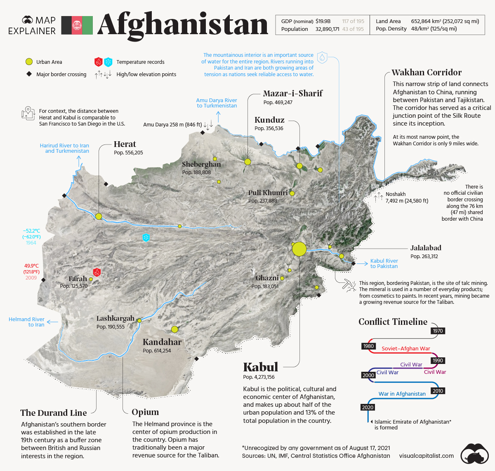

## 亚洲

- 伊朗和印度没有东亚文化根基

## 东北亚|远东

- 东亚国家现代化路径
  - 日本走的是英国保守主义路线
  - 韩国的发展显然更符合东亚文化:韩国（朴正熙）、新加坡（李光耀）及中国台湾（蒋经国），其现代化之路有着类似的路径，只是财阀势力、既得势力的程度有差异
    - 受东亚“有为政治”的驱动，先经济改革，用政策扶持经济势力，吸收外来资本与技术
    - 进而出现开放经济与保守政治发生冲突，在外部压力下，推动言论自由化和政治民主化，实现历史性跨越（多数无法完成）
    - 既得势力与民运势力展开旷日持久的政治斗争
- [China](./china.md)
- [Japan](./japan.md)
- [Korea](./korea.md)

## [中东](./middle_east.md)

### 西亚

- 这里有21世纪的现代生活，却是靠中世纪的劳力制度来支撑的。

## 南亚

- [India](./india.md)

## 东南亚

- 中南半岛 IndoChina Peninsula
  - 位于东南亚的半岛，亚洲南部三大半岛之一。因处于中国南方，中国称为“中南半岛”。又因位置临近印度和中国，受到印度和中国的影响，国际上称为“印度支那”
  - 位于中国和南亚次大陆之间，西临孟加拉湾、安达曼海和马六甲海峡，东临太平洋的南海，为东亚与群岛之间的桥梁.包括越南、老挝、柬埔寨、缅甸、泰国五国以及马来西亚西部、中国云南南部
  - 包括越南、老挝、柬埔寨、缅甸、泰国五国以及马来西亚西部、中国云南南部
  - 民族众多，其中最主要的有泰族、缅族、高棉人和京族四个民族。在这四个民族中，最早建国并有着最悠久历史的是高棉人。
  - 葡萄牙、荷兰、英国和法国的殖民者在地理大发现后，为了东南亚的资源先后来到南亚和中南半岛。他们利用泰缅之间战乱不断的时机想要获得特权，也曾在缅甸的沙林建立殖民据点，但因为这时候他们的侵略重点在印度和马六甲等交通便利的地方，交通相对不重要的泰缅暂时还不是他们侵略的重点。人数极少的殖民者这个时候难以撼动相对繁盛的泰缅的统治，他们的殖民活动先后失败了。
  - 18世纪后期，英法两国在亚洲的争斗主要集中在南亚和东南亚地区。英国经过与法国的七年战争后，实现了独占印度，而法国不甘心自己丧失在这个地区的特权，转而从越南入侵中南半岛。英国既为了扩大自己的势力范围，也为了阻止法国独占中南半岛，开始从印度入侵中南半岛。英法的侵略和缅泰的扩张刚好碰到了一起，结果是缅泰惨败。
  - 法国想以越南南部为基地打造它在中南半岛的势力范围，并且法国还想以此为跳板将侵略势力扩张到中国的西南。法国的扩张引发了英国的担忧，英国不想法国独占中南半岛，因而从与印度接壤的缅甸入侵中南半岛。两国一东一西开始将中南半岛纳入了自己的控制之下。
  - 英法两国在中南半岛激烈争夺，但是又不想爆发战争，因而泰国在两国相互制约下保住了自己的独立地位，成为了英法在东南亚殖民扩张的缓冲地带。
  - 1896年法英两国签订协议，划分了双方在中南半岛的势力范围。其中泰国以西的缅甸等地属于英国，泰国以南以东的越南、老挝和柬埔寨属于法国，泰国则成了两国的缓冲地带。根据该协议，泰国必须将西柬埔寨（马德望、暹粒、诗梳风）还给柬埔寨，但柏威夏寺及其周围地区还掌控在泰国手里
  - 自身难保的泰缅无暇再去争夺地区的霸权，长达三个世纪的战争宣告结束，但是两国历史上的不断争夺，造成了在马来半岛留有一段复杂的国界线。
  - 第二次世界大战促进了民族主义的发展，中南半岛各国为了自己的独立与日本进行了艰苦斗争。他们相信既然反抗日本能够取得胜利，那面对法国的再次侵略也能够取胜。二战后的法国实力大大下降，忙于本土的经济恢复因而放松了对殖民地的控制。趁此机会越南、柬埔寨人民进行了反法的斗争
  - 二战后的泰国和缅甸走上了不同的发展道路。泰国国内相对稳定，经济迅速增长。反观缅甸则是国内内乱不断，严重阻碍了发展。国内政局的变化影响到了双方的国力，进而影响到它们在东南亚的地位。

### 泰国

- 泰族人一开始生活在中国的云南等地，由于西南地区各民族之间的战乱，他们南迁与当地的居民融合而成了泰族。到了14世纪，泰族人乌通王实现了对泰人各政权的统一，定都阿瑜陀耶，史称阿瑜陀耶王国。
- 作为一个新兴的国家，阿瑜陀耶王朝限于地形的阻碍，它的东边和京族人建立的越南之间是山地，西边和缅甸之间也是山地。它主要的扩张方向就顺着湄公河向北和向南，向北向湄公河上游扩展，往南则是进攻柬埔寨，掠夺柬埔寨的财富。
- 公元13世纪后，吴哥帝国因为国内政治混乱迅速衰落。生活在吴哥帝国北部的泰人趁此机会先后建立了素可泰、清迈、兰纳等割据政权，这些政权一开始为了自身的独立，联合起来共同抵抗吴哥帝国。
- 泰人政权的壮大刚好赶上了元军的扩张。素可泰等泰人政权主动与元朝交好来获得元朝的支持和认可。泰人政权南边的吴哥帝国国内王位争夺混战不断，西边的邻国缅甸因为攻击元军控制地区则是遭到了元军的打击。在这种有利的形势下，素可泰等政权逐渐站稳了脚跟并不断向南扩张。
- 14世纪，素可泰政权被阿瑜陀耶王朝兼并。阿瑜陀耶王朝为了掠夺柬埔寨的财富不断对柬埔寨用兵。1351年，泰国阿瑜陀耶王朝出兵占领了吴哥城。
- 新兴泰国军队的战斗力远远强于和平了几个世纪的柬埔寨军队，它经过征战占领了柬埔寨的首都，使得柬埔寨成为它的附属国。可以说，15世纪的泰国是中南半岛的霸主。
- 泰国因忙着入侵柬埔寨，与缅甸的交往以和平为主，但泰国这时候的国力因强于四分五裂的缅甸，时有侵略缅甸边境的情形发生。
- 东南亚地区气候湿热适合大象这种庞然大物的生存，缅甸和泰国都有一只特殊的部队——象兵。泰国为了扩充自己的军备，到野外去捕获大象，竟然捉获了祥瑞之兽——七只白象。莽应龙凭借着自己实力强于泰国而要求泰国将白象赠送给自己，泰国以平等国家不能赠送瑞兽为理由拒绝了莽应龙。
- 泰国尽管成为了缅甸的附庸，但它新国王不甘心做一个傀儡。泰国先是假借柬埔寨威胁其南部边境而储备了大量物资并训练了一支部队。1581年，莽应龙去世，缅甸国内爆发了争夺王位的战争。泰国趁缅甸陷入困境宣布独立。
- 纳黎萱积极对外扩张，重新将柬埔寨纳入了泰国的控制之下。为了对缅甸的侵略进行报复，纳黎萱趁缅甸实力衰落的时机，率部队围困过缅甸的首都长达四个月。纳黎萱大帝在1605年征讨缅甸的途中去世，泰国的反击结束。
- 在1605年后的一个半世纪里，泰缅之间国力相对均衡，双方都难以发动大规模的入侵，因而争夺主要集中在清迈、马都八等边境地区。在两国争夺不休的时候，他们开始遇到一个新的敌人——西方殖民者。
- 18世纪中期，泰国正好相反，国内统治混乱，王子之间为争夺王位争斗不休。泰缅之间力量均衡的态势再次被打破。
- 清缅战争为泰国复国提供了机会。泰国在将领耶达信（郑信）的带领下，收复了首都实现了独立。泰国尽管独立，但因为之前缅甸的入侵导致了国内四分五裂，因而耶达信首要任务是实现了泰国的统一而无力去攻打缅甸。
- 从1549年到1785年，泰缅两国经过了若干次大大小小的战争，泰国总体处于劣势，两次亡国两次独立，但是缅甸并没有真正的控制住泰国。1785年后由于双方国力再次均衡，谁也不能占领谁，所以双方由大规模冲突开始变成局部的边境冲突，它们也将对外扩张的对象变成了周边的其他国家。
- 1940年，法国在德国的闪电战下迅速沦陷，这导致了其在中南半岛的殖民地政府孤立无援。而日本趁法国沦陷的时机，侵入到中南半岛，泰国认为这是出击法军夺回被割占领土的大好时机。
- 1941年，泰国在日本的帮助下迫使法国将争议领土（柏威夏寺）以及柬埔寨的马德望省等领土给泰国。二战结束后法国卷土重来，法国强调如果泰国不归还1941年割占的领土，那法国就反对泰国加入联合国。在法国的逼迫下，泰国又将这些地方还给了柬埔寨。
-
- 泰国在缅甸独立后就与缅甸建立了外交关系。一开始，泰缅之间因三百年战争造成的隔阂以及缅甸国内政局混乱引发的矛盾，如缅甸的反政府军经常潜入泰国境内，导致了双方的关系经常处于紧张状态，也没有什么深层次的合作。
- 90年代后随着缅甸国内政局的稳定以及两国为了维护中南半岛的安全，才在禁毒等方面进行了广泛的合作。近几年，泰缅两国的关系越来越密切，在2018年泰缅建交70周年的庆祝典礼上，泰缅双方将两国关系提升为战略合作伙伴关系。

### 尼泊尔

- 这一天，一向对酒精很有自制力的王储迪彭德拉一反常态，很快就喝得东倒西歪，国王比兰德拉还没到场他就已经不省人事了，他的姑妈和妹夫将他抬到房间里休息。
- 8点39分，王储迪彭德拉给恋人德维雅妮·拉纳打了一个电话，说他明天会去见她。随后他穿上迷彩服，从自己的军械库里找出了5件武器：M16自动步枪和一把UZI冲锋枪，两把手枪和一把12口径猎枪。穿戴整齐后，他向宴会场走去。
- 此时国王比兰德拉已经到达了会场，人们正在纷纷向国王敬酒致意，王储迪彭德拉的装扮引发了大家的讨论，但他毫不在意，在众目睽睽之下，一步步走向他的国王父亲，并且举起了手中的枪。国王比兰德拉以为儿子要向他展示什么，于是也上前一步。王储迪彭德拉面无表情，非常专注地扣下了扳机。
- 国王倒向右边，鲜血沿着右肩喷涌而出。整个会场突然凝固，所有人都被这一幕所震惊。在漫长而又短暂的安静之后，有人开始尖叫，迪彭德拉的叔叔想上前阻止他全副武装的侄子，却被一枪打倒。接下来，手持双枪的王储开始四下走动，扫射四散奔逃的血亲。
- 德维雅妮·拉纳正是来自于前面提到的将尼泊尔王室架空成傀儡的拉纳家族，受制于人的耻辱难以忘怀，两个家族依旧世代敌对。德维雅妮·拉纳的父亲更是与王后家族的势如水火。4天后，迪彭德拉做出了自己的选择：他放弃了德维雅妮·拉纳，也放弃了王位，他选择了毁灭。
- 一夜间，尼泊尔14名皇室成员死于非命，包括国王比兰德拉，王后艾什瓦尔雅，以及他们全部子女.最后，王储迪彭德拉自己也饮弹自尽。
- 2006年，尼泊尔再次爆发群众运动，粉碎君权神授说，宣布尼泊尔为世俗国家。2008年，尼泊尔第一次制宪会议宣布废除君主制，改国体为共和制。

### 柬埔寨

- 东南亚最早建国并且创造出辉煌灿烂文化的国家。不仅如此，柬埔寨一度还是中南半岛的霸主。
- 高棉人（柬埔寨人）在公元1世纪就在湄公河流域建立了扶南国，其后虽历经多个王朝，但柬埔寨在中南半岛霸主的位子上一直坐到了15世纪初，其鼎盛时期控制了中南半岛的大部分土地。
- 因为离印度近，相互之间也没有险峻地形阻挡，因而印度教在公元3世纪就传入了中南半岛。扶南国及其之后近千年的帝国统治者都接受了印度教并把它作为控制人民思想的一种手段。
- 柬埔寨相继进入了真腊和吴哥时期，其中9-15世纪的吴哥王朝是柬埔寨最辉煌的时刻。吴哥帝国在这段时期曾统治中南半岛大部分地区，其疆域从东部的越南向西延伸到缅甸，从南边马来半岛向北延伸到中国边境。现在泰国、柬埔寨和老挝所在地区都曾是吴哥帝国的领土。
  - 统一的吴哥王朝拥有着肥沃的土地，再加上政府修建的水利灌溉工程，使得其农业发达，据记载当地的水稻可以达到一年三到四熟。农业发达、物产丰富、国家强盛，在这些有利的条件下，吴哥的国王为了彰显自己的功绩，修建了一大批寺庙建筑群，其中就有柏威夏寺。
- 泰柬之间的争斗不断。在这段时间泰国是柬埔寨的苦主，泰国屡次入侵柬埔寨。在泰国的蚕食下，柬埔寨的北部领土逐渐丧失、疆域越来越小，而泰国的边界则在不断向南推进。
- 亡国不久的柬埔寨趁阿瑜陀耶与清迈争斗的机会重新恢复了独立。泰国不甘心放弃到手的土地，1431年再次占领吴哥城，想要将柬埔寨彻底纳入它的统治之下。
- 在泰国想要将柬埔寨吞掉的时候，它的西北部缅族人实现了统一。刚统一的缅甸兵强马壮，为了掠夺泰国的财富，发起了对泰国的进攻，因而泰国只能暂时放松对柬埔寨的控制。但泰国在扩张的过程中先后将柬埔寨北部和东部的马德望、暹粒和乌汶以及柏威夏寺所在的地区纳入了自己的控制下。
- 在柬埔寨遭受到泰国入侵的时候，它东侧的越南经过扩张统一了南北也成为了一个强国。到了17世纪，越南为了获得柬埔寨富饶的湄公河三角洲也加入了对柬埔寨的争夺。在泰国和越南这两大势力的入侵下，柬埔寨彻底沦陷了。
- 泰柬战争后，柬埔寨一蹶不振，进入了“衰落时代”，同时丧失了对中南半岛的争夺资格。中南半岛由曾经柬埔寨一家独大的局面开始变成了泰缅两强相争。
- 柬埔寨想要摆脱被泰国和越南控制的情况，保持国家的独立，但是因为自身太弱小，因而期望有个强国帮助。法国的出现正好符合柬埔寨的需求。柬埔寨想要驱虎吞狼，怎知道引来的猛虎更贪婪。法国为了将柬埔寨变成自己的殖民地，要求泰国归还占领的柬埔寨土地，而泰国却不想放弃在柬埔寨的宗主国地位。最终在法国的武力逼迫下泰国归还了暹粒省等地。
- 法国为了扩大自己控制区的范围，还强迫泰国签订条约来扩大保护国柬埔寨的领土。1904年，驻中南半岛的法国殖民者与泰国政府成立了一个联合委员会来重新商定泰柬的边界。双方一致同意沿马夸山山脊作为两国的边界线。
- 按照这个条约，柏威夏寺应该属于泰国，但是由于泰国没能力绘制地图，因而这份工作就由法国官员负责。勘界的法国军官为了扩大法国的控制区，将柏威夏寺划归柬埔寨。地图绘制后，泰国官员限于对地图的不懂没有发现地图的异常，因而没有任何异议地领取并分发了地图。
- 泰国直到1935年才发现了地图有问题，但却慑于法国的强大仅仅只是表达了不满。
- 泰国和柬埔寨在两国边界有一块大约4.6万平方公里的争议土地，这块争议地区南侧的马夸山摩艾丹崖顶上有一座印度教寺庙遗址—柏威夏寺，泰柬两国围绕柏威夏寺爆发过激烈的冲突，称之为“柏威夏寺之争”。
  - 柏威夏寺坐落在当时吴哥帝国首都吴哥城东北方海拔550米的马夸山（扁担山）上。作为一个横跨中南半岛的大帝国来说，马夸山刚好在帝国腹地。在古代君王的眼里山地是藏有灵气的地方，再就是这个地方的位置极佳。马夸山的南侧是一望无垠的柬埔寨北部平原，站在柏威夏寺所在的悬崖上可以俯瞰整个柬埔寨北部平原甚至天气好的时候能够看到当时吴哥帝国都城吴哥城旁边的东南亚第一大湖——洞里萨湖。作为一个君主能够将自己国土一览无余，那绝对有一种巨大的成就感。
  - 公元9世纪耶输跋摩一世时期就开始修建柏威夏寺，经过200多年十几位君王的努力才得以建成。从扶南国建立到柏威夏寺建成这段时间，由于印度教在柬埔寨居于主要地位，因而这座寺院供奉的是印度教三大主神之一的湿婆。
  - 当法军撤出柏威夏寺地区后，泰柬两国都宣称对该寺附近地区拥有主权。1954年泰国先下手为强出兵占领了柏威夏寺，柬埔寨立刻提出抗议，并将泰国告上了海牙国际法庭。
  - 1962年，海牙国际法庭以泰法勘界地图泰国没有提出异议为理由，裁定柏威夏寺归柬埔寨所有，但将神庙的入口通道划给泰国。这样一来，尽管神庙属于柬埔寨所有，但泰国却掌握了进出神庙的主通道。海牙法庭只是判决了柏威夏寺的归属，并没有将柏威夏寺所在4.6万平方公里的争议土地的归属以及分界线进行裁决，这为之后双方的冲突埋下了祸端。
  - 1963年后，柬埔寨调整了其行政区划，将柏威夏寺和周边一些地区新建立了柏威夏省。为了缓和同泰国的矛盾，西哈努克亲王宣布，泰国公民进入寺庙可以不用办理任何通行证件。柬埔寨的决定使得两国进入了一个和平时期。其后尽管柬埔寨国内动荡不安，但是两国还是坚持共同开发柏威夏寺的原则。
  - 泰国曾想和柬埔寨一起将柏威夏寺及其周围地区“申遗”，但遭到了柬埔寨的拒绝。柬埔寨独自“申遗”的行为遭到泰国的反对。两国关系因此恶化。按照《联合国申请世界遗产公约》规定只有周边邻国没有争议的古文物才能“申遗”，泰国认为柏威夏寺周围的领土还属于争议地区不能申遗，最后只有柏威夏寺列为世界文化遗产。
  - 2013年4月15日，海牙国际法庭举行了关于泰柬边境柏威夏寺附近地区领土争端问题的听证会。针对这片争议地区，泰柬双方从2008年到2011年先后发生多次军事冲突，甚至动用了榴弹炮等重型武器。在2011年的冲突中，双方死亡人数就超过了十人。
  - 柏威夏寺虽地处泰柬边界，但它的位置对泰国十分有利。这座寺庙在柬埔寨一侧是悬崖，只能从泰国一侧进入。而且该地区还是一望无垠的柬埔寨北部平原的制高点。
  - 柏威夏寺尽管近几十年在柬埔寨的掌控中，但是其周边地区的归属却是悬而未决。在2008年柬埔寨将柏威夏寺及其周边地区一起申请为世界文化遗产。泰国以争议领土不能申遗为由，强烈反对柬埔寨的申遗行为，自此后的三年双方冲突不断。
  - 海牙法庭重申了柏威夏寺归属柬埔寨，但是对于泰柬在4.6万平方公里争议土地的界限还是没有做出划分。泰国和柬埔寨政府都接受了海牙法庭的裁决，泰国也接受了柏威夏寺属于柬埔寨，而入口属于自己的现实，但对于争议地区的解决则回到需要双方和平协商的起点。对于柏威夏寺泰柬两国继续沿用西哈努克亲王时期的政策，两国人可以免签进入寺庙。双方的和解使得两国的边境再次归于平静。柬埔寨在申遗成功后，修筑了一条连接吴哥窟和柏威夏寺的公路，大力发展旅游业，成为了柬埔寨旅游业中的一条热点线路。
- 在西哈努克亲王的领导下于1953年获得了独立
- 红色高棉起源于1951年成立的高棉人民革命党，是柬埔寨共产党的前身
- 1962年，西哈努克宣称发现人民派受外国势力领导的证据并将其解散，自此柬共完全转入地下活动，并在北越军队、越共游击队、老挝巴特寮及中国共产党的支持下逐渐组建起自己的军队。
- 西哈努克的外交政策摇摆，亲苏亲中，与美国先断交后建交，允许越共在柬埔寨活动的同时亦纵容美军轰炸丛林中的越共，导致朗诺等人发动了1970年政变，推翻了西哈努克的统治、建立了亲美的高棉共和国。
- 1973年，波尔布特一声令下，以美国即将空袭为借口，要求金边几百万市民立刻离开这座城市，前往热带丛林。接到命令之后，很多家庭成员还来不及聚齐，一家子就被这股突然爆发的政治洪流冲散了
  - 此时的波尔布特内心燃烧着一个真诚和炙热的乌托邦冲动：全民离开城市，放弃工业，铲除商业，去山林建立一个人人平等，人人为公的共产主义农业天堂。那场运动在本质上是大跃进的升级版
  - 在行动和理念上，波尔布特却远远超越了大跃进，把工业、学校、家庭、甚至货币和城市皆视为罪恶的根源。他相信，唯有捻灭人心深处的所有私欲，人间一切罪恶就会消失。
  - 认为城市是滋生罪恶的温床，将大量城市居民驱逐到农村进行建设。废除货币、禁止宗教信仰、没收一切私有财产、取消城市、拆散家庭、禁止知识和书籍的传播，试图逐步将柬埔寨改造为无分任何阶级的社会
  - 以“大清洗”等名义处决了大量平民以及柬共党内和军队人员，各种原因最终造成约200万人非正常死亡
- 西哈努克流亡中国，而红色高棉在中共协调下转而支持西哈努克。为清除共产主义势力，美军此后在柬埔寨境内进行了大规模轰炸、造成大量人员伤亡，引起柬埔寨平民不满，红色高棉势力则不断壮大并最终于1975年推翻高棉共和国，与西哈努克联合建立柬埔寨王国民族团结政府并掌握实权。
- 1976年，红色高棉就将国名改为“民主柬埔寨”，西哈努克辞职并遭软禁。
- 1978年底，越南在苏联支持下大举入侵柬埔寨，于1979年初扶植建立柬埔寨人民共和国政权，在越南入侵的骚动下，极左的民主柬埔寨很快覆灭，红色高棉退到泰柬边境一带继续对抗越南。
- 1981年12月，波尔布特宣布解散柬埔寨共产党，改组为民主柬埔寨党，并与西哈努克的奉辛比克党、宋双的高棉人民解放全国阵线组成了抗越的三方联合政府——民主柬埔寨联合政府，得到中国、美国、泰国等国不同程度的支持，而该政府也继续掌握着柬埔寨的联合国席位，各方不断争执
- 1989年，越南开始自柬埔寨撤军后，红色高棉、奉辛比克党、高棉人民解放全国阵线、柬埔寨人民共和国四方达成和解，在国际的监督下，于1991年签订《巴黎和平协定》，柬埔寨王国得以恢复，各势力转型为政党选举竞争，但波尔布特拒绝让红色高棉参加1993年的大选，也拒绝让红色高棉游击队缴械，引发红色高棉内讧
- 1998年4月，波尔布特逝世；1999年3月6日，塔莫克在泰柬边境被柬埔寨军方抓获，标志着红色高棉势力的覆灭

### 印尼

- 国土由17000多个大大小小的岛屿组成，是世界上最大的群岛国家（面积191万平方公里）。尽管印尼岛屿相对分散，但人口主要集中在其第五大岛-爪哇岛
- 伊斯兰教却跟随阿拉伯商人的脚步来到了帝国之外的地方，包括东南亚的马来半岛以及印尼群岛
  - 公元13世纪开始，随着生产力发展，人们对于香料等保鲜产品的需求越来越旺盛。尤其是原产于印尼的丁香、胡椒等香料，备受欧洲人的追捧，一时间，这些香料的价格等同于黄金.阿拉伯商人自然不会放过这个机会。他们渡过印度洋来到马来半岛、印尼群岛，寻找香料原产地并建立定居点，通过当地人通婚的方式，传播了伊斯兰教
- 在阿拉伯商人和亚齐的影响下，伊斯兰教在短短的200多年里影响到了印尼其他群岛，印尼逐渐完成了伊斯兰化的过程。
- 印尼群岛在历史上并不是一个相对统一的整体，不同岛屿曾建立过多个国家，如爪哇岛的马打蓝、万丹，苏门答腊岛的亚齐等。17世纪荷兰殖民者占领了这些岛屿后，把它们组合成一起，称之为“荷属东印度”
- 一战后，民族解放运动兴起，包括亚齐在内的印尼人民反抗荷兰统治达到了高潮。但亚齐和印尼组成统一战线是有条件的，那就是印尼独立后，给予亚齐更多的自治权利，包括在亚齐恢复伊斯兰教法。作为最晚并入荷属东印度的地区，亚齐长期以来保持着与爪哇人等印尼其他民族不同的文化。但相同的伊斯兰教信仰，相似的命运，让亚齐和印尼其他地区的人们团结起来，共同对抗荷兰殖民者。
- 二战爆发后，印尼的宗主国-荷兰被德国占领。趁荷兰被德国占领之际，1942年日本入侵印尼并赶走了荷兰人。然而日本占领印尼的时间并不长。太平洋战争中，日本的节节失利，加剧了印尼独立的步伐。1945年8月，印尼在苏加诺的带领下爆发了八月革命，宣布成立共和国
- 印尼的独立运动，与志在恢复殖民统治的荷兰，矛盾日趋尖锐，1946年双方爆发战争。1949年，荷兰承认印尼独立
- 独立后，出于巩固新生政权的需要，苏加诺把印尼建成一个中央制国家，这与亚齐要求的自治权背道而驰。印尼其他地区虽然大多数信仰伊斯兰教，但由于受到荷兰的影响较早，接受了西方的世俗化思想，印尼全国建立起世俗国家。但最晚并入荷属东印度（印尼）的亚齐却是个例外
- 印尼国父苏加诺跟中共的关系是非常好的，跟华人社会关系也好，这时的印尼华人在印尼日子过得很不错。
- 在1963年，印尼发生了政变，陆军将领苏哈托软禁了国父苏加诺，开始了长达30年的军事独裁生涯！值得注意的是，这个苏哈托是亲美的，跟台湾关系非常好
- 亚齐特区
  - 位于印尼第一大岛-苏门答腊岛的北端，面积大约6万平方公里，占印尼的3%，人口约500万，占印尼的2%
  - 历史上是东南亚最早建立伊斯兰教政权的国家之一
  - 因既靠近香料原产地，又扼守东西方贸易必经之路马六甲海峡的优势，成为了阿拉伯商人定居并传教的最前沿。亚齐所在的苏门答腊岛成为了印尼最早皈依伊斯兰教的地区之一
  - 公元1500年，亚齐当地的首领阿里-穆哈亚-沙，自称为苏丹，在印尼建立了第一个伊斯兰教法的政教合一的体制。
  - 到16世纪，亚齐日益繁盛，成为了苏门答腊岛乃至整个印尼最强大的国家。其首都班达亚齐更是凭借香料贸易的繁荣，成为了当时东南亚繁荣的城市之一。
  - 在东南亚的强势地位，面临着葡萄牙的挑战。新航路开辟后，对香料执着的葡萄牙人利用坚船利炮的优势，在马来半岛建立殖民据点。1511年，葡萄牙殖民者占领马六甲
  - 葡萄牙占领马来半岛之后，大量原先居住在马来半岛的穆斯林逃亡到对岸的苏门答腊岛。人口的涌入，带动了亚齐的繁荣
  - 马六甲海峡两岸形成了葡萄牙和亚齐对峙的局面。与亚齐相比，葡萄牙占领的地区受制于人口少，以殖民据点为主，在战场上屡战屡败，在同亚齐的竞争中逐渐败下阵来
  - 1629年，亚齐和葡萄牙进行的杜勇河战役，成为了亚齐由盛转衰的开始。在杜勇河战役中，亚齐军队遭遇惨败。逐渐没落的亚齐，因扼守马六甲海峡，成为了列强觊觎的目标.此时，葡萄牙的国力也走向衰落，在亚洲的殖民地也被荷兰、英国等后起大国占据。
  - 1602年，荷兰成立东印度公司，专门从事在远东地区的殖民贸易活动。1619年，荷兰占领了位于爪哇岛的雅加达。荷兰以雅加达为据点，将爪哇岛的多个穆斯林王国占领，并向外扩张，夺去了有香料群岛之称的摩鹿加群岛。荷兰凭借着强大的军事实力，将葡萄牙逐出马六甲海峡，占领了除亚齐之外的所有印尼群岛地区。
  - 占领了印尼大部分岛屿后，荷兰将目标放在了亚齐上。1873年，荷兰派远征军远征亚齐。次年1月，首都班达亚齐被荷兰殖民者占领。随后，荷兰宣布亚齐并入荷属东印度。1903年，亚齐正式沦为了荷兰的殖民地。
  - 亚齐作为东南亚第一批接受伊斯兰影响的地区，有着浓厚的宗教基础，因此，亚齐希望恢复亚齐苏丹国时期实行的政教合一政体，这使得亚齐和中央政府之间的矛盾尖锐
  - 亚齐所在的地区扼守着马六甲海峡的入口处，是重要的交通要道。亚齐的自然资源丰富，拥有丰富的石油、天然气、橡胶树等重要经济资源.印尼的主要人口集中在爪哇岛。在财富的分配上，印尼把从亚齐收得的税收，主要用于建设爪哇岛等经济发达地区，留给亚齐的则少之又少。1997-1998年，亚齐凭借天然气资源为印尼中央贡献了4.5亿美元的收入，但得到的财政资金只有2100万美元。财政收入分配的不均让两地的矛盾更加尖锐
  - 早在1976年，亚齐发起了“自由亚齐运动”，目标是亚齐脱离印尼，建立一个以伊斯兰教法为主的政教合一的国家。双方进行了30多年的冲突，共造成了1.5万居民流离失所
  - 居民大多数信仰伊斯兰教。但亚齐的制度却与印尼本土不同，印尼本土实行的世俗化政策，而亚齐曾经却欲脱离印尼，建立一个政教合一的国家
  - 30年的战争，不仅仅破坏了亚齐的经济，更使得印尼面临着国家分裂的危险。1999年，为了防止亚齐的分离运动，印尼政府采取了怀柔措施，愿意给予亚齐更多的自治权.此后，印尼政府通过分配调整，1999年印尼政府在利用亚齐自然资源的同时，给予亚齐当地2.2亿美元的补贴，用于改善民生。
  - 为了安抚亚齐当地的宗教人士，印尼又允许亚齐以伊斯兰教法为规定，管理本地区的事务，例如在印尼早就废止的石刑，在亚齐就得到了保留
  - 2004年12月26日，印度洋地区发生罕见的地震并引发海啸，严重破坏了苏门答腊岛的经济。长期内战，经济不景气的亚齐，更是无法抵御海啸自然灾害的破坏。亚齐政府宣布放弃独立，与印尼达成和解
  - 2005年，印尼中央与亚齐在芬兰首都赫尔辛基签订谅解备忘录。12月，印尼完成撤军。2006年7月，印尼国会通过《亚齐自治法》，成立亚齐特别行政区，赋予亚齐更多自治权，并成立特别行政区，开始在全行政区实行伊斯兰教法，饮酒、赌博等一系列在印尼合法存在的活动，在亚齐被宣布为不合法。亚齐成为了印尼这个世俗国家中的唯一例外
- 20世纪80年代末、90年代初，林绍良已经建造起一个由两大集团组成的，庞大得令人咋舌的企业王国。这两大集团，一个是以林绍良三兄弟命名的三林集团。该集团旗下拥有“中亚银行”以及经营进出口贸易、制造业、建筑业的多个企业。另一个是由林绍良与林文镜合资组成的华仁谊集团，该集团以专营金融业务的第一太平投资公司和专营贸易的第一太平企业公司为主，业务跨越亚、美、欧、非各洲。两大集团下属的企业多达数百家，分布在印尼各个城市及其他一些国家和地区，业务涉及到金融、地产、矿产、汽车制造、电子、交通、种植、木材、航运、建筑、旅游、保险等70多个行业。
- 1965屠华
  - 导火索
    - 当时军方和苏加诺总统、印尼共产党（以下简称印共）之间的政治火拼——史称“930”政变。
    - 这次政变中，以苏哈托少将为首的军方获得胜利，苏加诺总统遭软禁，而印共这个苏加诺的政治盟友则惨遭军方强力铲除，以党领袖艾地在内的30万党员惨遭屠杀，党组织被摧毁，印共从此一蹶不振，逐渐衰亡。
    - 苏哈托也搂草打兔子，对在印华人大开杀戒
- 1998屠华
  - 1997年亚洲金融危机使一切美好化为泡影。
  - 1998年1月5日，新年刚过，万隆当地有媒体煽动性指出，物价飞涨，钱币贬值的幕后操纵者是华人商家。煽动的结果：几百名青年手持刀具，棍棒，喊着“反涨价”口号，冲向购物街。抢劫砸毁华人商铺，华人纷纷逃避，逃不走的当街打死打伤，印尼警方无动于衷。
  - 1998 年发生在印尼的“黑色五月暴动”就这样在棉兰、巨港、楠榜、雅加达、梭罗和泗水等城市蔓延。
  - 5月14日，一场严重的暴乱蔓延至雅加达地区，而此时没有任何军队在街道上，印尼华人成为这场血腥暴乱的主要目标，而印尼军方无视暴民们对华人的抢劫和对华人妇女的强奸。雅加达人权与妇女研究组织经整理后的报告显示，5月发生的骚乱中，印尼各地总共发生5000多起暴徒强奸或轮奸华裔妇女的惨案，其中以雅加达每天发生100多起最为严重。
  - 6月，暴徒穿着军靴被军用卡车运送到华人区，他们高呼“宰了中国人，烧死他们，这些中国狗”，然后开始抢劫商店和市场，随后，他们开始把妇女集中起来进行集体轮奸，印尼警察到场之后，并没有阻止暴徒的行动。
  - 印尼雅加达等地发生的严重骚乱，导致1200多人在骚乱中丧生，其中大部分是华人，5000多间华人商店和住宅惨遭烧毁，更令人发指的是，印尼暴徒还在光天化日之下，丧心病狂地强暴了数百名华人妇女。据妇女组织说，骚乱中约有170名华人妇女被强暴和轮奸，其中有20多名华人妇女因此而重伤死亡，包括一个9岁和一个11岁女童。另据估计被强奸的华人妇女总数多达300人。
  - 林绍良的银行发生挤兑风波，他的企业资不抵债破产了，同时他的个人安全也受到了影响，1998年5月暴乱期间，林绍良在雅加达的住所遭到攻击和洗劫，他的城市酒店被烧得面目全非。
  - 98风波之后，林氏家族开始把更多的精力投放到海外市场，比如收购新加坡电话公司，加大对中国内地的投入，深受西方文明教育的林氏家族的新掌门人决定将王国之车驶入另一个不同于他父亲信仰的领域――以商业技巧来奠定成功基础，而不再依赖政治上的某种关系。
- 社会矛盾，经济危机，……，所有的问题发展到无解时，就将矛头指向当地华人，甚至以屠杀华人作为化解矛盾的突破口，这就是近代印尼的状况。

### 马来西亚

- 二战之后，英国再也无力维持其庞大的殖民体系，其海外殖民地纷纷自立门户，新加坡与当时一起脱离英国的马来亚、沙巴、砂劳越共同组建了马来西亚联邦
- 新加坡与马来西亚是东南亚乃至全世界，海外华人比例最高的两个国家，近代开始，大批的东南沿海华人纷纷下南洋谋生，新加坡与马来西亚都是他们的主要目的地，然而在这两个地方，华人的处境却完全不同。
  - 在新加坡，由于当地奉行的诸族均等，华人并没有受到不公正对待，反而凭借实力上的巨大优势，主导了当地的几乎一切方面。
  - 在马来西亚，由于当地的巫统奉行马来人至上原则，华人虽然数量不少，而且经济实力非常强悍，但是却处处都到打压与压榨。
- 战后，由于新加坡的加入，马来西亚联邦的华人占据总人口的比例陡然上升到了40%以上，与马来人的数量几乎对等。虽然数量上差不多，但是马来人的发展水平与综合素质远远不如华人，若是平等竞争的话，马来人被淘汰也是必然的，这对于奉行马来人至上的巫统来说，是绝对不能允许的。
- 马来人发现华人的实力过于强大，使得马来人愈发处于弱势地位之后，心中越来越担心将来马来西亚被被华人所掌握，想来想去，觉得华人为主的新加坡是留不得了。

### [SIngapore](./singapore.md)

### 缅甸 Myanmar

- 公元7世纪，缅人在柬埔寨王国的西北侧建立了早期国家—骠国。骠国在9世纪被南诏所灭，其统治的区域分裂成了若干个小国。
- 11世纪，蒲甘王朝通过征战统一了缅甸地区，但这时候的缅甸主要还是一些诸侯国的联合，并没有统一的经济政治基础，因而国内时有反叛发生。
- 13世纪，蒙古人在击败宋朝后想要南下占领中南半岛。蒙古人派使者招降缅甸，但使者被缅甸所杀，更厉害的是缅甸竟然派兵进攻元军控制的地区。螳臂当车不自量力，在强大的元军面前以及其自身内部存在的矛盾，缅甸再次分裂成了若干个小国。
- 16世纪，缅甸的东吁王国强大起来，在国王莽瑞体领导下统一了缅甸。缅甸的统一打破了中南半岛泰国一家独大的局面。刚统一的缅甸国内经济凋敝百废待兴，经过200年发展和掠夺积累了大量财富的泰国成为了它掠夺的目标。
- 缅甸统一走向强大而泰国国内却爆发了争夺王位的混战。此消彼长，军队战斗力强大的缅甸为了泰国的财富、土地等，1549年发动了对泰国的战争。
- 在缅甸的攻势下泰国溃败，缅军围困了其首都。缅甸国王乐观的认为能够迅速解决掉泰国，谁知道战争的持续时间远远超出了其估计。最后因为缅军未携带重型武器、粮草等补给不足，再加上雨季的到来，在围困四个月后缅甸被迫撤走。
- 回国不久莽瑞体病逝，莽应龙继位。莽应龙为了确立中南半岛的霸主地位准备再次出征泰国。而泰国在缅甸的上次进攻中因见识到缅甸的强大而积极备战。
- 莽应龙以此为借口再次进攻泰国。泰国尽管做了一定的准备，但是在缅甸的强大攻势下，还是落了个首都被占领、国王被俘虏、领土被占领的境地。从1569年起的15年里，缅甸在泰国建立起傀儡政权，将泰国变成了自己的附庸。缅甸取代泰国成为了中南半岛的霸主。而这个时候柬埔寨趁机摆脱了泰国的控制。
- 缅甸不能容忍泰国脱离它的控制，先后多次派兵攻打泰国，但都以失败而归。多年的战争消耗了缅甸的国力，导致了国内经济凋敝、兵源不足。反观泰国，在其新国王纳黎萱的带领下逐渐走向军事上的强盛。
- 18世纪中期，缅甸又出现了一个伟大的首领——雍籍牙，雍籍牙建立起强大的军队
- 雍籍牙渴望通过对外掠夺迅速获得大量的财富、土地和人口，朝政混乱不堪的邻国泰国自然就成为了他进攻的首选。缅军再次攻陷泰国首都，泰国再次沦陷。
- 膨胀的缅甸这时候不仅进攻泰国，还出兵侵扰清朝边境。面对着缅军的侵略，清朝进行了坚决的抵抗。
- 缅甸与清朝议和后，不甘心它的属国泰国再次独立，转过头来继续对泰国用兵。从1770年后双方发生了多次大规模的冲突，结果泰国一改之前被动挨打的局面先后取得了胜利。1785年，缅甸再次派重兵进攻泰国，结果损失惨重大败而归。
- 缅甸因为位于中南半岛的西北部，其北面是强大的清王朝，东面和南边是打了几百年相互都控制不了对方的泰国，因而只能向西扩张自己的势力。缅甸向西先后占领了阿拉干、阿萨姆、曼尼普尔邦等小国。缅甸占领这些小国后它的疆域就与英国的殖民地印度接壤。英国在17世纪泰缅大战的时候就觊觎缅甸国内的硝石、木材等资源，但因为当时要与法国争夺北美洲、印度等地的霸权而暂时放弃了对缅甸的侵略。
- 缅甸在成为英国的殖民地后，国内的民众进行了艰苦的抗争，最终在二战后获得独立，两国复杂边界也就保留了下来
- 1824年~1826年以及1852年两次的英缅战争中达到高峰。英国在这两次的战争中均获得胜利，最后攻占勃固城并将此地称为下缅甸
- 1885年，英国发兵灭缅甸，1886年1月1日并入大英帝国所下属的印度，成为英属印度的一个省份
- 1886年，英国再度赢得第三次英缅战争，中国被迫与英国签订《中英缅甸条约》，规定中国承认英国对缅甸有支配权，但缅甸对中国仍照往例，每十年一贡。至于中缅边境未定界，应由两国会商勘定。此时英国将缅甸纳为印度的一省，并将政府设于仰光。
- 在英国的殖民统治时期，缅甸的交通和教育获得大幅改善。英国人致力开发水路，使得无数蒸气船得以航行于伊洛瓦底江。铁路和道路也获兴建和改善以弥补水路的不足。此时，大量的印度移民涌入导致劳工廉价，造成地方经济受到威胁。因此缅人开始产生对印度人的仇视，以致在1930年爆发反印度人的暴动。
- 1890年~1947年，掸邦、佤邦成为大英帝国的保护国。克钦邦、钦邦则为分开的行政区。
- 1942年，昂山率军与日军一起参加了对英军及中国远征军的战斗，然后在日军支持下宣布缅甸从英国独立。 1943年，巴莫与昂山等人受邀访问日本，他们回国重组缅甸傀儡政府，昂山成为国防部长。 1944年，日军在战场节节败退，昂山开始支持美英的同盟国一方，并组织“反法西斯人民自由同盟”以对抗日军。
- 1948年1月4日缅甸脱离英联邦宣布独立，成立缅甸联邦。
- 1962年，军事将领奈温将军（General Ne Win）发动政变并成立以军事统治的政府，宣布要使缅甸成为社会主义国家。奈温执政后，对内实行“缅甸式社会主义”，一度对主要工商企业实行国有化。奈温一直强调缅甸奉行独立自主的、中立的不结盟对外政策。主张同一切国家保持友好，但不为任何大国所左右，不参加大国集团，也反对把不结盟国家变成第三集团。人民对于自由受到限制感到十分不满。同年7月7日，学生在仰光大学发起示威活动抗议军事政权。军队则在奈温将军的间接指使下以血腥镇压了这个活动。
- 1974年1月改称缅甸联邦社会主义共和国。
- 1988年7月，因经济形势恶化，缅甸全国爆发游行示威。同年9月18日，以国防部长苏貌将军为首的军人接管政权，成立“国家恢复法律和秩序委员会”（1997年改名为“缅甸国家和平与发展委员会”），宣布废除宪法，解散人民议会和国家权力机构。1988年9月23日，国名由“缅甸联邦社会主义共和国”改名为“缅甸联邦”。
- 昂山的女儿昂山素季，1991年诺贝尔和平奖得主，在1988年成为缅甸迈向民主之路的精神动力。昂山素季因公然批评奈温将军而在1989年7月20日遭到囚禁。虽然她曾在1995年获得释放，之后再次遭到软禁，直到2010年11月13日获释。
- 2008年5月，缅甸联邦共和国新宪法获得通过，规定实行总统制。缅甸于2010年依据新宪法举行多党制全国大选。2011年2月4日，缅甸国会选出吴登盛为缅甸第一任总统。2016年3月15日，缅甸联邦议会选出吴廷觉为半个多世纪以来缅甸首位民选非军人总统。 [1]
- 缅甸是世界最不发达国家之一，以农业为主，从事农业的人口超过60%，农产品有稻米、小麦、甘蔗等等。2018年3月21日，缅甸总统吴廷觉辞职。
- 7邦多为少数民族聚居地
- 坤沙
  - 1949年，在中国解放战争中被解放军击败的国民党军第8军、第26军残部从云南溃逃到缅甸，进驻金三角地区，这些溃兵种鸦片以解决给养来源。坤沙从泰国潜回金三角，娶了一位首领的女儿，并很快成了岳父的左膀右臂。
  - 1967年，坤沙贩毒集团与罗兴汉大战一场，得胜后他控制了“金三角”70%的毒品生产和大部分贩运业务，因此，他曾得意地自称为“鸦片大王”。
  - 1989年，金三角毒品贸易达到最高峰时，坤沙控制了整个金三角地区毒品贸易的80%。
  - 巴勃罗被击毙那一年，金三角密林中，缅甸毒枭坤沙宣布建国。
  - 1993年12月，坤沙公开宣布成立掸邦共和国，自任总统，并在泰国清莱府距美斯乐约30公里的“满星叠”设立大本营
  - 1995年，由于掸族长老发动了“纯洁掸邦运动”，部队出现分裂，近6000名掸邦军士兵脱离坤沙集团，“掸邦共和国”总理也随之出走。佤联军集结1万余人部队，在泰缅边 境摆开决战架势，同时政府军3个作战师也做好进攻准备。
  - 1996年1月5日，坤沙领导的蒙泰武装开始向政府投降，到18日，共有9749人向政府缴械，共交出轻重武器6004件，其中包括地对空导弹。当天，他出席在他总部洪孟举行的受降仪式。此后，坤沙与4个老婆居住在首都仰光由军队保护的豪宅，缅甸政府出于安定北部民族矛盾的考虑，拒绝向美国引渡坤沙。
- 迈扎央是缅甸克钦邦的经济特区

### 东南亚金融危机

- 亚洲四小虎：泰国、马来西亚、菲律宾和印度尼西亚
- 八九十年代，由于日元强势升值，欧美和日本商人南下，在东南亚投资了大量劳动密集型产业，带动四小虎经济腾飞。 但四小虎犯了和拉美国家一样的错误：没学会走，就想着跑。
- 泰国为例：
  - 原本金融风险抵抗力就很弱，却还要放松金融监管，允许资本在境内外自由使用外汇，对外国投资股票不做任何限制；
  - 原本工业基础就相当薄弱，但为了快速拉动经济增长，允许企业自由对外借债。
  - 而这些泰国企业借来外债后，却不肯踏实做实业，跟着外国资本一起炒股、炒房、炒地皮……然后又制造出一个金融泡沫。
  - 泰国百姓没有分辨能力，眼看股市和房价飙涨，跟着进场，充当为国接盘的韭菜。
- 最先狙击泰国的，是以索罗斯为首的资本财团，索罗斯有句经典名言是：「在金融运作方面，说不上有道德还是无道德，这只是一种操作。」
- 手里握有大量泰铢，一旦在国际市场上抛售泰铢、换取美元，泰铢价格就会瞬间暴跌； 当泰铢的价格跌至谷底时，他们可以用美元回购泰铢，赚取差价，还能收购濒临破产的泰国企业。 泰国政府要想稳住泰铢价格，只能动用自己的美元储备来回购：索罗斯们抛售多少泰铢，泰国政府就要用美元回购多少。
- 泰国政府一穷二白，根本没有多少美元储备，而且敌人不仅仅是索罗斯们，还有一群跟风盲目的资本，也要抛售泰铢，所以泰国政府只撑了一周就投降。 1997年7月，泰铢贬值30%，大量资本逃离，亚洲金融危机正式引爆。
- 资本大鳄吃完泰国后，下一站是菲律宾，然后是印尼、马来西亚……亚洲四小虎一夜回到解放前。 马来西亚生气：既然你要抛售我的货币，那我就实施汇率管制，不让你卖出！ 马来西亚这一举动，让西方国家集体懵逼。 美联储前主席有点无语：你现在禁止外国资本离开，是很爽，但以后就别想吸引外国投资者进来了。
- 当亚洲四小虎全面瘫痪后，唱红脸的IMF又站了出来：我这里有现金，可以贷款给你们度过危机，当然，前提条件是…… 泰国、菲律宾和印尼热泪盈眶，和IMF签了许多不平等条约。 只有马来西亚翻白眼：哪里凉快哪里去。
- 又将目标瞄准「四小龙」，中国香港特区、中国台湾省、新加坡和韩国。索罗斯是利用人的恐惧心理和盲从心理，只要他先点燃导火线，后面的资本就会跟着燃烧。
  - 很快，新加坡和台湾省跪着唱征服。
  - 韩国无法幸免，眼看韩元下跌，需要大量资金来稳住，于是从俄罗斯撤走韩资：俄兄，抱歉哈，我家里着火了。
  - 韩资从俄罗斯一撤走，产生连锁反应，外国投资者也跟着从俄罗斯撤资，导致俄罗斯引发第一轮金融危机。
- 华尔街不留任何情面，誓要将韩元打趴。最终，韩企破产，社会紊乱。走投无路的韩国，接受了IMF的570亿美元援助，前提条件是：
  - 放松资本市场管控，实行自由化。
  - 向外国投资者开放证券市场。
  - 将本国企业中的外资占有比例从25%提高到50%。
- 那一年，韩国的自杀率飙升50%，西方媒体用「被圣诞老人遗忘了的城市」，来记录汉城人民的圣诞节。 对韩国的经济掠夺还没结束。 除了欧美公司正常的经济殖民外，韩国财阀相继沦落： 三星集团被肢解，大宇集团的汽车部门被廉价收购，韩国邮政跪倒在英国电信面前，韩国八大银行被外资牢牢掌控。
- 香港是唯一顽强挡住资本大鳄的掠夺，让索罗斯们尝到了挫折滋味
  - 1998年3月19日，总理朱镕基明确表态： 「万一特区需要中央帮助，只要特区政府向中央提出要求，中央将不惜一切代价维护香港的繁荣稳定，保护它的联系汇率制度！」

## 中亚

- 历史十分悠久，是古代中华、波斯、印度文明的交汇点。丝绸之路贯穿着整个中亚地区，沟通起欧亚大陆两端的同时，也给这里带来了繁荣的商业
- 以山地和高原地形为主，气候干燥，平均年降水量低于300毫米，不利于农耕，因而历史上一直是游牧民族的天下。波斯人、突厥人、蒙古人都曾经是中亚的主人，最终形成了以突厥人为主的局面。
- 中亚地区更适合放牧，多山却不闭塞，无法阻挡外来民族的侵入。帕米尔高原是“亚洲水塔”，无数河流发源于此，但河谷平地的面积较小，不足以产生强大的内生文明。最大的河谷是费尔干纳盆地，有多条河流汇集于此，适合发展农业。
- 波斯
  - 公元前2000年左右，发源于中亚和伊朗高原的古波斯人，分布在东至中国的河西走廊、南达印度次大陆、西到里海的广大区域内。他们有很多分支，比如粟特人、乌孙人等等，都属于印欧人种、讲古波斯语。这片地域差不多构成了广义上的中亚，现在的“五斯坦”则是狭义的中亚，他们分别是哈萨克斯坦、土库曼斯坦、吉尔吉斯斯坦、乌兹别克斯坦、塔吉克斯坦。“斯坦”是五国国名的共同特点，而这个词起源于古波斯语。“斯坦”（-stan）是地名的后缀词根，用来表示某个面积较为广大的地区，后来演化为代指某个民族聚居的地方，并一直使用到今天。
- 东亚的中原王朝每次实现大一统，如汉朝、唐朝，都是对中亚控制最为紧密的时候。但是，干燥的气候和零星的绿洲不足以支持大规模移民和驻军，一旦发生内乱，中原王朝便不得不撤出西域。汉朝衰亡之后，草原上新生的突厥人开始向中亚扩张，改变了当地的人种构成。
- 突厥
  - 6世纪兴起于蒙古草原和中亚，幅员一度非常辽阔。汉朝之后的另一个强大中原王朝-唐朝建立后，对突厥进行持续不断地打击。突厥王庭覆灭，各个部落纷纷西迁。
  - 原始的突厥人属于黄种人，讲突厥语，在不断扩张和迁移的过程中，逐渐与中亚当地的印欧民族融合，成为黄白混血人种。他们凭借武力占据了大部分水草丰美的河谷和绿洲。不过，古波斯人的一些语言和文化习惯并没有完全消失，像“-stan”的用法也逐渐被突厥人所接受。
  - 一部分没有被突厥融合的古波斯人后裔不得不退居到费尔干纳盆地，最终演变成今天的塔吉克人。因而现代的塔吉克斯坦也是中亚五国中唯一的非突厥国家。
  - 汉朝退出西域后，有一部分汉人留了下来，可能是汉武帝时期投降匈奴的大将李陵以及他的手下，再加上来不及撤回去的汉人，自发组成一个部落，生活在天山南北，被称为“坚昆人”，也就是吉尔吉斯人的先民。中国史书有相关记载，但无法证实其确切来源。
  - 公元7世纪，信奉伊斯兰教的阿拉伯帝国崛起，很快吞并了波斯，并成功将其伊斯兰化。与此同时，唐朝重新控制西域，恢复丝绸之路，把帕米尔高原及以东地区纳入了版图。唐朝在西域的主要对手其实是青藏高原上的吐蕃，吐蕃对西域一直有觊觎之心，也颇具实力，但对西域的唐军无可奈何。
  - 公元751年，阿拉伯帝国与唐朝两个帝国的各自扩张，终于在怛罗斯发生了武力碰撞，战场在现代哈萨克斯坦的塔拉斯市附近。阿拉伯帝国虽然赢得了胜利，但也达到扩张的极限，没有继续向东进军，改为向突厥人传播伊斯兰教。怛罗斯之战的失败对唐朝的伤害并不算大，却因为四年后的安史之乱，不得不永久性地撤出了西域驻军。吐蕃趁机占领西域，填补了唐朝留下的空白。但吐蕃的统治仅仅维持了数十年，也同样是因为内乱而崩溃。
  - 公元9世纪左右，由突厥人建立的喀喇汗国（也称黑汗王朝）接受伊斯兰教，得到阿拉伯帝国的援助，吞并了中亚，唐朝曾经的西域疆土几乎全部沦陷于喀喇汗国。中原与中亚的交流基本停止，丝绸之路断绝，取而代之的是由阿拉伯人主导的海上丝绸之路。在喀喇汗国的强力推行下，伊斯兰教覆盖了整个中亚地区，即使是古波斯人后裔塔吉克人也接受了伊斯兰教。至此，中亚完成了伊斯兰化和突厥化。
- 蒙古
  - 13世纪被蒙古帝国征服。蒙古帝国疆域之广超出了蒙古人的治理能力，很快分裂为四大汗国。而中亚正好处在四大汗国的交界地带，大部分地区被金帐汗国和察哈台汗国所占据。
  - 处在金帐汗国统治下的中亚北部草原，现代叫南俄罗斯草原，公元6-13世纪，这里的主人是好多个突厥部落，由乌孙、康居等古波斯人与突厥人融合而来，其中是最大的部落是钦察人。蒙古人到来后，又经过两百年的融合，此地的蒙古人被突厥化和伊斯兰化。
  - 14世纪，突厥化的蒙古人穆罕默德·乌兹别克成为白帐汗国的大汗，然后这个汗国被改称为乌兹别克汗国。
  - 南俄罗斯草原上的牧民们逐草而居，随着季节变化向水草丰美的地方迁移。1456年，一部分部落脱离乌兹别克汗国，向东迁移到属于察哈台汗国的巴尔喀什湖以南的楚河流域，他们自称哈萨克人，建立了哈萨克汗国，仍然保持着游牧的生活方式。
  - 乌兹别克人从16世纪开始，逐渐迁移到富饶的费尔干纳盆地，变成了定居的农耕民族。不但挤占了塔吉克人的地盘，还把另外一个生活在这里的突厥部落古思人给赶走了。
  - 乌兹别克人和哈萨克人原本是血缘相同的突厥人，语言也相通，分开后由于各自不断兼并新的部落，生活方式也出现变化，慢慢出现一些差异。不过，他们的语言和习俗非常接近，外人经常分不清有何区别。
  - 被乌兹别克人赶出来的古思人逃到靠近波斯和里海的卡拉库姆沙漠，向察合台汗国称臣，但保持着自己的语言和习俗，被称为“土库曼人”。
  - 至16-17世纪，“五斯坦”的主体民族全部形成，他们都是印欧和黄种人的混血，区别在于混血的比例不同
    - 古波斯人的直系后裔是塔吉克人
    - 保留最多突厥血统的是土库曼人
    - 血统以突厥为主、蒙古为辅的是乌兹别克人和哈萨克人
    - 有部分汉人血统的是吉尔吉斯人
- 沙俄
  - 俄国人一直有向南打通印度洋出海口的梦想。于是在19世纪前期，俄国人进入了哈萨克人放牧的草原。英国在18世纪完成对印度次大陆的殖民后，鉴于印度历史上一直被来自中亚的势力征服，开始向中亚渗透自己的势力。俄国显示出对中亚的野心后，英国加快了控制阿富汗的步伐，以阻止俄国势力南下威胁印度。
  - 俄国人借助先进的军事技术，以及哈萨克汗国的内斗，首先征服了哈萨克人。1822年，俄国废除哈萨克的可汗制度，由总督实行直接统治。一部分哈萨克人不愿意忍受俄国人的残酷统治，逃往清朝境内，形成了中国的哈萨克族。
  - 1881年的《伊犁条约》，俄国吞并了44万平方公里的中国领土，把中俄国境线挤压至伊犁河下游。在这片被称为“外西北”的土地上生活的吉尔吉斯人和塔吉克人全部被划归俄国。
  - 19世纪末又征服土库曼人和乌兹别克人。这两个民族原本也都处于封建落后的汗国统治下，无力抵御俄国人的军事优势。至1885年，俄国彻底吞并了中亚。
  - 实行鼓励移民到中亚的政策。1861年，俄国废除农奴制后，大批获得人身自由的农民选择来到中亚定居。1871到1917年间，从东欧迁往中亚北部的俄罗斯农民就高达163万余人。大量外来人口的迁入，不但带动了当地的社会经济发展，同时也迅速充实了当地人口。
  - 1917年十月革命后，苏联继承了俄国对中亚的统治，并进行了大规模的民族划分，很多语言、习俗相近的民族都被并入几个大的民族。
  - 另一方面，除了塔吉克外，中亚各民族都有不少突厥基因，又信仰伊斯兰教，容易受到泛突厥主义的影响。而泛突厥主义的倡导国是奥斯曼帝国及其继承者土耳其，俄国与奥斯曼在历史上就是宿敌，苏联自然不愿意泛突厥主义在自己境内泛滥。
  - 1924年，苏联废除了俄国的总督区，按民族成立各自的共和国，其中哈萨克、乌兹别克、克尔吉斯、土库曼四个加盟共和国，直属于苏联。塔吉克共和国由于面积和人口较少，暂时归属于相邻的乌兹别克加盟共和国。塔吉克人认为自己的历史渊源和民族特性迥异于其他几个突厥化民族，因此一直要求改变这种隶属关系。直到1929年才成功升格为直属苏联的加盟共和国。
  - 20世纪20年代，苏联在当地进行了土地改革和水资源改革，使得贫困农民的生活条件有了明显好转，降低了人口死亡率。
  - 苏联落幕后，中亚五国相继宣布独立，并继续与俄罗斯保持着较为密切的关系。苏联时代被压制的该区域民族和边界纠纷开始爆发出来，一度演变为武装冲突和内战。直到新世纪才基本平息，各国的发展走上了正轨。
- 费尔干纳盆地
  - 乌兹别克斯坦、塔吉克斯坦、吉尔吉斯斯坦三国交界处的费尔干纳盆地，是一个长约300公里、宽约70公里，夹在群山之间的三角形谷地。
  - 该处周围是常年积雪的群山，盆地里遍布由积雪融化而成的河流，中亚第一长河-锡尔河也在此汇聚而成。不仅为农业灌溉提供了基本条件，也为人口增长提供了必要的水源。
  - 从中亚的地貌上来看，阿姆河和锡尔河流域（河中地区）以及费尔干纳盆地是中亚自然条件最好的地域。与其相比，中亚其他地区则充斥着沙漠、山地和干燥草原，并不利于人口大规模定居。
  - 河中地区和费尔干纳盆地发展农业的历史也相当悠久。当地灌溉农业与中亚其他地区相比，一直处于一个较为发达的水平。
- 在中亚五国中，除了塔吉克斯坦、吉尔吉斯斯坦两国油气资源分布较少外，其他三国都有着丰富的油气资源。相比农业而言，油气带来的经济利益要更高，油气工业区附近也往往集中着大量的人口。
- 伊斯兰教主张多生多育的传统和苏联推行的“母亲英雄”“光荣母亲”鼓励生育的政策，也对中亚人口增长起到了推波助澜的作用。1939年时，苏联国内乌兹别克人总共408万人，到1989年，乌兹别克人已增长至1414万人。

### 哈萨克斯坦

- 主体民族—哈萨克族形成相当晚，其族源也十分复杂，一般认为它是一个中亚地区多个民族的集合体
- 13世纪被蒙古帝国征服，归属金帐汗国
- 15世纪金帐汗国分裂后
  - 15世纪中叶，黄金家族后裔才带领着哈萨克族祖先脱离金帐汗国统治，逐渐迁徙到巴尔喀什湖以南定居，就此建立起独立的哈萨克汗国，并逐渐强盛起来。而这批游牧民族也被称为“哈萨克人”
  - 1456年，金帐汗国其中的一部分建立起哈萨克汗国，成为哈国的国家雏形
  - 汗国建立后，在与西边伊斯兰文明接触的过程中，哈萨克族逐渐皈依了伊斯兰教
- 16世纪初哈萨克部族基本形成，分为三玉兹，即大、中、小玉兹.沙俄在东扩的过程中，逐渐蚕食了哈萨克草原。
- 17世纪中亚新兴起一个强大的游牧政权—漠西蒙古建立的准噶尔汗国。在准噶尔汗国的侵略下，
- 哈萨克汗国雄主头克汗于1718年去世后，由于其继任者并无治国能力，再加上准噶尔部落的入侵，哈萨克汗国逐渐衰落并陷入分裂之中
- 当时沙俄在对阵瑞典的“大北方战争”中大获全胜，确立了东欧霸主地位，并积极谋求更进一步的霸权。当沙俄统治者看到中亚内部的分裂态势后，逐步产生了扩张领土的想法.在沙俄对中亚的征服过程中，不但在新式武器装备上占据了科技优势，同时还在两国边境线上大肆修建军事要塞，并建成了一条从里海到阿尔泰山漫长的哥萨克防线。沙俄此举不但可以阻止哈萨克游牧民袭扰沙俄腹地，同时，他们也能以此为前哨基地，步步为营向中亚推进
- 在采用军事手段的同时，沙俄也利用外交政策胁迫哈萨克的中玉兹、小玉兹两大部落先后臣服于己，或是扶植亲俄的首领.小玉兹于1730年9月派遣使团请求俄国接受加入俄国；1735年12月中玉兹也加入俄国
- 18世纪中叶，清朝消灭了准噶尔汗国（1757年），哈萨克三玉兹也曾先后表示归顺清朝，特别是中玉兹和大玉兹，与清朝的关系更为密切
- 但进入19世纪后，随着沙俄国力的进一步提升，它显然不能满足于这种形式上的臣服，开始加大了对中亚的征服进程.
- 1822年和1824年，沙俄先后废除了中玉兹和小玉兹的汗号和管辖方法，将其领地改置成俄国的行政单位，并以俄国法律代替哈萨克习惯法
- 沙俄所侵占的仅仅是部分哈萨克草原，在哈萨克草原以南的广大区域，仍然存在着尚未被沙俄纳入统治的布哈拉汗国、浩罕汗国、希瓦汗国
- 1830年，沙俄在哈萨克草原北部，建立了一处名为“阿克莫拉”的军事要塞，这也是努尔苏丹的建城之始
- 为了征服希瓦汗国，沙俄曾在1839年派出了一支远征队伍，结果大败而归.沙俄征服者意识到他们还需要更加深入草原腹地的军事基地。在此之后的几十年内，沙俄一直在采用修建军事要塞和武力征服的方式，不断蚕食中亚本土游牧民的领地
- 在沙俄不断征服中亚诸国的同时，中国也碰上了“数千年来未有之变局”—鸦片战争的爆发，使得逐步沦为半殖民地半封建社会，而沙俄也在此时不断入侵巴尔喀什湖以南的中国领土。由于清政府的腐败无能，因此当时并没有对沙俄在西北的入侵做出十分有效的抵抗
- 1847年，俄国完成了对哈萨克地区的征服。
  - 大量俄罗斯人从东欧移民至这里，哈萨克斯坦目前还有大约20%的人口是俄罗斯族
- 1854年，一支沙俄远征队在伊犁河谷、阿拉套山山脚下的古尔班阿里玛图附近，建立了一座名为“韦尔内”的城镇，即今阿拉木图市的前身
- 1864年，沙俄逼迫清政府与其签订了条约，约44万平方公里领土就此沦为异域，伊犁河谷也被一分为二。阿拉木图也在被割让领土之中
  - 阿拉木图三面环山，来自大西洋的湿润水汽无法继续前进，只能在此聚集下沉，因而在当地形成了一片水草丰茂、土地肥沃的肥沃谷地。此外，沙俄为了进一步侵略中国内地，也试图把当地作为前哨站从加大了开发力度，并以之作为草原总督区下辖的七河州首府（1882-1897）
  - 早期的阿拉木图城中只有少数俄罗斯人居住，哈萨克人则聚居在其周边。但19世纪中期开始，阿拉木图也出现了民族混居的模式，而且当地而已凭借着比北部更为温暖的气候和适宜的水文条件吸引了更多外来移民
  - 短短几十年内，阿拉木图便逐渐从一个普通军事据点成长为哈萨克草原南方的重要经济中心。到1906年时，阿拉木图的人口已增长至2.7万余人
- 1917年十月革命之后，苏维埃政权的建立。列宁根据民族自治的原则，赋予了哈萨克地区更多的自治权。在哈萨克斯坦建立了苏维埃政权。
- 20世纪初时，哈萨克人大多还处在游牧社会，因此苏联强制推行的“居民定居化”的政策，导致了大量牧民和牲畜非正常死亡。据学者研究，当时哈萨克斯坦可能因此损失了上百万人口。
- 1926年，苏联政府为了沟通中亚和内地交通，决定兴建一条从塔什干通往新西伯利亚与西伯利亚大铁路汇合的中亚铁路动脉.不久后，阿拉木图也开设了直达莫斯科的航班。随着交通条件的日益便利，阿拉木图在物流、商贸、工业等方面都得到了迅速的发展
- 1936年，哈萨克地区被赋予苏联加盟共和国的地位，这就是今天哈萨克斯坦的原型。在苏联时期，哈萨克斯坦的经济和工业实力仅次于俄罗斯和乌克兰，位居第三位。
- 苏德战争爆发后，阿拉木图迎来了它的高速发展期。战前的苏联欧洲部分是全苏联的工业中心，囿于德国闪电战的凌厉攻势，苏联政府不得不把大批工厂、医院、研究所、大学从东欧撤离到其统治腹地
- 二战后，受到苏联政府的号召，为了巩固对中亚的统治，大量俄罗斯移民前往哈萨克斯坦垦荒定居。苏联的人口迁移政策给中亚带来了大量知识分子群体，促进了当地国民素质的提高，也促进了当地经济发展。大量的俄罗斯族移民也一度改变了当地民族结构，俄罗斯族一度成为哈萨克斯坦境内的第一大民族，占总人口的42%之多。哈萨克斯坦也从一个落后的游牧区逐渐成长为苏联内部重要的粮仓和工业基地。
- 阿拉木图在此期间接纳了不少机构，使自己成为了哈萨克草原上重要的轻工业中心，从而大大促进了本地社会经济发展。据统计，到1968年时，阿拉木图人口已从1919年的10万余人增加到36.5万余人。然而随着时间的推移，阿拉木图也逐渐暴露出了它的不少缺点
  - 三面环山，其北部则是大片荒蛮沙漠。虽然有着高山河流的灌溉，但城市发展空间却极为有限。此外，阿拉木图主城区也位于地震带上，地壳活动频繁,尤其是1911年的一场地震，阿拉木图几乎被地震夷平，震后仅剩一座木制的东正教堂仍然耸立
  - 空气污染极其严重，长时间内没有得到很好的解决。虽然有来自西伯利亚方向的凛冽北风，但鉴于其位于谷地，周边群山环抱，因此雾霾多年聚集于此，难以消散
  - 自19世纪开始到20世纪后期，大量俄罗斯移民涌入当地，改变了当地的民族结构，尤其是北方各州由于受到俄国开发较早，因此俄罗斯人占比更高一些,随着苏联的解体，哈萨克斯坦境内存在着众多的俄罗斯族人也成为哈国的重要隐患，稍有不慎，就会酿成严重的分离主义运动.1989年时，俄罗斯人是哈萨克斯坦境内的第二大民族，占当地总人口的37.4%约600余万人，哈萨克族也只占40.1%左右约650余万人
- 对哈萨克斯坦统治阶层而言，靠近吉尔吉斯斯坦国境线的阿拉木图也太过偏僻，其政治影响力难以辐射到俄罗斯族人占多数的北方地区,早在独立之初，就有俄罗斯人试图脱离哈萨克斯坦或要求自治，不过在哈萨克斯坦政府看来，这些俄罗斯人并非当地本土居民而是属于外来者，因此也谈不上自治.也有北方地区的俄罗斯人大量移民至俄罗斯，而这些人恰恰具备较高技术水平和管理能力，使得独立之初的哈萨克斯坦经济发展受到了一定影响
- 苏联解体后，俄罗斯族为避免迫害也大量出逃，哈萨克斯坦人口增长率在20世纪末不断下降，人口数量甚至在20世纪的最后十年出现负增长。
- 独立后不久，政治强人纳扎尔巴耶夫就不得不考虑迁都事宜。在他看来，新首都应该满足社会经济状况、气候、地貌、地震风险、交通基础设施等32个条件.根据这些指标衡量，当时哈萨克斯坦共选出了四个备选城市卡拉干达州的乌勒套市和首府卡拉干达市、阿克纠宾斯克州的首府阿克托别市和阿克莫拉州的首辅阿克莫拉市
  - 阿克莫拉，即现在的哈萨克斯坦首都努尔苏丹。历史上的努尔苏丹几度更名，最早可以追溯到1830年沙俄在当地修建的军事要塞“阿克莫林斯克”.1954年，苏联领导人赫鲁晓夫发起了著名的“垦荒运动”。当时，阿克莫拉及其周边地区也被苏联政府列为重要的粮食生产基地，大量俄罗斯年轻人来到此地垦荒，而该城也因此更名为“切利诺格勒”（意为“垦荒城”）。直到苏联解体后，哈萨克斯坦才恢复了该城旧称—阿克莫拉（意为“白色坟墓”）
  - 阿克莫拉地处半沙漠草原地带，伊希姆河穿城而过，不但视野开阔，而且土地资源、水资源都极为丰富，同时当地历史上也没有严重地质灾害的记录，并且也有着基础工业设施和交通条件
  - 阿克莫拉对哈萨克斯坦而言，几乎有着无垠的扩张面积和无尽的人口增长潜力。过于寒冷的气候可能是这座城市唯一的缺点
  - 经过仔细甄选和详细研判，最终哈萨克斯坦最高苏维埃在1994年决定把首都从阿拉木图迁往中北部的阿克莫拉。但直到1997年，总统纳扎尔巴耶夫才正式颁布“迁都令”，并次年将其改名为“阿斯塔纳”
- 处理同国内的俄罗斯族以及俄罗斯的关系，是哈国独立后需要解决的重要问题
  - 在地理位置上离西方世界相对遥远，因此注定了不能和俄罗斯闹僵。在外交关系上，纳扎尔巴耶夫制定了优先发展同俄罗斯的关系的策略。1994年5月，哈俄签署了军事合作条件，使两国具有了盟国的性质。哈国可以在俄罗斯的庇护之下发展经济。
  - 为了安抚俄罗斯族，哈国首先确立了俄语的重要地位。虽然官方语言定位为哈萨克语，但俄语在日常生活中同哈语并列使用。在哈国的大街小巷和电影电视等出版媒体，哈俄双语随处可见。
  - 独立之初，俄罗斯族所占比例最高的北部三州分裂危机时起时伏。而当时的首都—阿拉木图却偏距东南一角，一旦北部俄罗斯族地区发生分离危机，哈国坦将鞭长莫及。为加强对俄罗斯族聚居区的控制，1997年，哈国把首都从富裕的阿拉木图迁往了中北部的阿斯塔纳。迁都改变了哈北部的人口结构，大量哈萨克族迁入这里，使这里的族群比例发生逆转，哈萨克族逐渐占据了这里的主导地位。因此，这次迁都颇有天子守国门的味道。
  - 政府还不断采取措施，提高哈萨克族在其他民族区域的比例，提高哈萨克族文化在全国的影响力。
  - 既要汲取西方的先进技术和管理经验，还要时刻警惕西方的经济控制和颜色革命。曾接受西方经济政策，尤其是休克疗法，来挽救经济。不仅没有挽救哈国在苏联解体后的经济颓势，反而带来了恶性通货膨胀。纳扎尔巴耶夫果断采取措施，提出反对过度自由化的政策，在制定经济政策上，逐步开始走独立自主之路。
  - 矿产资源极其丰富，拥有丰富的油气储量以及世界四分之一的铀矿资源。利用丰富的资源，主动寻求西方国家的合作，鼓励西方国家带来先进技术开发本国的资源。这种互利互惠的政策，不仅仅缓解西方国家的能源危机，还带动了哈国经济的发展。
  - 警惕西方通过控制经济来进行“和平演变”。2005年，哈反对派以黄色为标志，曾预谋搞颜色革命。纳扎尔巴耶夫也把竞选口号变成了黄色，此外，还利用其影响力，通过电视宣传颜色革命的危害，成功阻止了颜色革命。
  - 另一个重要对象就是东边的邻国—中国。一个重要方面是能源合作。中国经济的发展，对石油的需求量越来越大。哈国丰富的油气的资源恰好可以缓解中国的燃眉之急。
- 在前苏联时期，乌克兰无论在任何方面，都是远远强于哈国的。但将近30年来，两国的面貌可谓是“天地之别”。
- 2019年
  - 3月，执政了近30年的总统努尔苏丹·纳扎尔巴耶夫宣布辞职。一天后，纪念这位开国总统将首都阿斯塔纳再一次改名为“努尔苏丹”。这对阿斯塔纳而言，已经是哈萨克斯坦独立后的第三次更名.努尔苏丹（阿斯塔纳）尽管贵为首都，但却并非是哈萨克斯坦的最大城市。哈国东南边境的历史名城—阿拉木图不但经济实力雄厚，人口也雄踞哈国第一，却出人意料地失去了首都的宝座
- 迁都
  - 成本是巨大的，当纳扎尔巴耶夫宣布迁都到阿斯塔纳之时，新首都的建设尚在进行之中。公务员们只能借用原来的州政府大楼办公，而且早期楼里只有一部直拨电话,由于不少建筑尚未完工，很多公务员甚至只能暂时居住在旅社里，以至于有部分公务员因难以忍受恶劣的办公、生活环境而选择了辞职
  - 迁都阿克莫拉之初，也遭遇了重大的质疑和反对的声音，当时哈国内部便有反对派以“劳民伤财”为由批评迁都的行为。但随着时间的推移，反对声音也逐渐消失了.尤其是在改变哈萨克斯坦北方民族结构这一方面，迁都起到了良好的作用。据统计，2010年人口统计资料和1999年相比，哈萨克斯坦北方三州的哈族居民比例已有明显上升
  - 经过二十多年的发展，努尔苏丹已经成为一个拥有110万人口的现代化大都市，尽管和180万人口的阿拉木图还有所差距。然而随着政府、议会、央行以及其他科技机构的相继迁入，阿斯塔纳取代阿拉木图成为哈萨克斯坦新的政治中心、文化中心和科技中心，只是时间问题
  - 境内的众多外企总部，迄今为止仍然选择驻留在阿拉木图，鲜有搬迁计划。可以预见，哈萨克斯坦的经济中心在很长一段时间内并不会随之改变，并会在此后形成南北两大城市共同带领哈国未来发展的局面

### 乌兹别克斯坦

- 世界上仅有的两个双重内陆国之一（另一个为欧洲的列支敦士登），不但自己为内陆国，其邻国也都为内陆国。
- 人口数量却是中亚五国中最多的（约3300万人），约占中亚人口的45%，将近一半。但是，乌兹别克斯坦的国土面积却只占有中亚的11%（45万平方千米）。80%左右的领土为平原。这些平原主要是一望无垠的荒芜沙漠，难以定居。国民主要居住在东部群山环绕的山谷-费尔干纳盆地之中。费尔干纳盆地主体部分正好为乌兹别克斯坦所占有。
- 首都塔什干不但是中亚人口最多的城市（约250万），而且塔什干所在的费尔干纳盆地，也是整个中亚人口最为稠密的地区。
- 西部，靠近土库曼斯坦的边境还分布着另一条重要河流-阿姆河，是中亚水量最为丰富的河流，阿姆河下游形成一片三角洲，最终流入咸海。深居内陆，最大的气候特点就是干旱，因此在有充足水源的地方，往往也就有发展农业文明的基本条件。
- 农耕定居式文明的出现，使得乌兹别克人能够获得大量且稳定的食物供给，而这往往是促进人口增长的重要条件。
- 进入河中地区后，也随之养成了经商的风俗。当时，他们遍布中亚及其周边各地。清代时，已有为数不少的乌兹别克人前往新疆经商，并与当地居民通婚定居下来。16-19世纪期间，乌兹别克人在中亚南部确立统治地位后，进一步同化了当地原有居民，逐步从游牧转向农耕定居的民族，并先后建立起以乌兹别克人为主体的希瓦、布哈拉、浩罕三大汗国。在这三大汗国存续期间，乌兹别克的社会十分繁荣，给人口增长创造了十分有利的基础。
- 19世纪沙皇俄国的大举南侵，迅速兼并了中亚。俄国人在当地推进的工业化，使得中亚地区逐步从一个农业社会向工业社会转变，大多数农村劳动力也因此开始向城市和工矿地区集中。俄国在乌兹别克人居住地确立统治后，积极推行土地国有化。一方面俄国强力剥夺乌兹别克人的农场和牧场
- 中亚地区气候干燥、昼夜温差大、灌溉发达、土壤肥沃，适合棉花的生长。当棉花于1884年在乌兹别克斯坦顺利引种后，使得棉花种植业在中亚迅速普及开来。不但是苏联境内的主要棉花生产基地，也是重要的农业基地，当地生产的水果、蔬菜也能提供莫斯科等大城市。
- 苏联时期，乌兹别克斯坦的发展资金有三分之二都由苏联中央提供。二战中，大量工业企业和技术工人迁往中亚大后方，乌兹别克斯坦从中获益颇丰。到苏联解体前，乌兹别克斯坦已经有了较为健全的经济体系，冶金、石油天然气、机器制造业等门类得到了迅猛的发展。

### Afghanistan

- 北面分别与土库曼斯坦、乌兹别克斯坦、塔吉克斯坦接壤，西接伊朗，南部和东部连巴基斯坦，东北部有一条狭长地带（瓦罕走廊）与中国接壤。

#### 杜兰尼王朝

- 一名负责保护国王后宫嫔妃的守卫军官
- 原先在波斯帝国中服役，因屡建战功，便授命组织了一支由阿富汗人组成的国王卫队。
- 1747年，波斯帝国皇帝纳迪尔沙被刺身亡，艾哈迈德率领卫队回到家乡坎大哈。在阿富汗各部落会议上，年仅25岁的艾哈迈德被推举为国王
- 定都坎大哈
- 荣登大宝后，没有走专制之路，反而把不同部落的首领团结到一块，成立9人制的顾问委员会，一起治理国家。在他的治下，不同部族和谐相处，城市乡村互通有无，国家一派欣欣向荣之象，说波斯语的塔吉克人、信仰什叶派的哈扎拉人，以及隶属突厥语族的乌兹别克人，都向年轻的国王俯首称臣，帝国疆域西至今日伊朗，东至印度河畔，盛极一时。
- 阿富汗人民，第一次形成民族意识，共同居住的区域也第一次被人叫阿富汗，后人因此尊称艾哈迈德为“国父”。
- 不断攻打印度莫卧儿帝国，迫使莫卧儿帝国将印度河以西一直到阿拉伯海的领土全部划入了阿富汗的版图。
- 1749年，艾哈迈德调转枪头，挥师波斯，围攻重镇赫拉特，一直将领土推至阿姆河南岸。此后艾哈迈德又频繁侵犯莫卧儿帝国，两次掠夺德里，使得杜兰尼王朝成为18世纪仅次于奥斯曼帝国的世界第二大伊斯兰帝国。

#### 巴拉克查伊王朝

- 1772年，艾哈迈德死于颌骨癌，他的不孝子孙为争夺王位打得血肉模糊，此后半个多世纪，国家陷入绵延不绝的分裂和内斗，期间一共换了6位皇帝。直到1826年，另一位强势的皇帝多斯特·穆罕默德登基，才重新统一国家。
- 多斯特·默罕默德不算是艾哈迈德的直系后裔，但同属一族血脉.唯一不幸的是运气差了点：就在阿富汗重新恢复秩序之际，西方尤其是以英国为代表的工业国家，突飞猛进至现代社会，把阿富汗、印度等老弱病残远远甩至身后，更要命的是，在拿破仑入侵的刺激下，阿富汗头顶上的另一个大帝国沙皇俄国苏醒
- 当时的俄国，除了黑海有个不冰冻的出海口外，偌大的帝国被常年积雪的北冰洋生生围成了一个内陆国家，而黑海本身也被陆地包围无法通达五洋，只有继续往南扩张，或还有机会夺取阿拉伯海出海口。但如此一来，势必威胁英国人占领的印度次大陆，所以英国人急需在中间扶持亲英属国，抵御俄国人日益逼近的威胁。就这样，夹在两个大帝国中间的阿富汗成为夹心饼干，谁都想咬一口。在这种情况下，阿富汗如果国力强盛可左右逢源，可一旦衰落势必五马分尸。当时穆罕默德倾向与英属印度合作，但英属印度总督奥克兰有点不信任他。奥克兰这人顽固迂腐、疑心重，他认为穆罕默德的个性过于强势，不太可能听命于英国女王。
- 第一次英阿战争
  - 1837年，为了拉拢阿富汗共同对抗俄国，英国派使节亚历山大·伯恩斯到喀布尔，希望和多斯特结盟。随后俄国也派了使节来到喀布尔。当时锡克帝国（18世纪存在于今天巴基斯坦的一个封建国家）刚刚夺去了阿富汗重镇白沙瓦，多斯特希望得到英国人的支持，但英国人却表示拒绝。而俄国使节表示支持多斯特收复白沙瓦。同时英国在明里暗里支持前杜兰尼王朝的王族开展复辟活动。于是多斯特倒向了俄国，这使得英国人恼羞成怒，决定武装侵略阿富汗。
  - 1839年，17000名英国侵略军从信德和旁遮普侵入阿富汗。一个落后的封建小国根本无力和新兴的工业强国正面对抗，4月25日，英军轻松占领了首都坎大哈。可他们不知道，其实战争才刚刚开始。
  - 虽然多斯特的军队未能阻挡住英军，但分布于阿富汗山区的各民族各部落却活跃了起来。他们纷纷拿起武器，让英国侵略者陷入了人民战争的汪洋大海。
  - 1841年11月3日，20余个部落云集喀布尔发动武装起义围困了英军。结果，英国公使被打死，英军被迫撤退。
  - 1842年的那八天是英國軍史中最淒厲的撤退：將近一萬七千多人的行軍隊伍慢慢被山谷兩旁的阿富汗人射殺，倖存者則在零下十五度的天氣裡被凍死，活著的人開始吃他們的肉求生。最後只有一個人活著到達。途中被擄、而後獲釋的外交官夫人 Florentia Sale 在倫敦出版了這段經歷的日記，情節之恐怖甚至要刪節，原件還在大英博物館。
  - 据马克思的《印度编年史》记载，当时只有一名叫布莱德的医生最终撤回印度。此后虽然英国加强了兵力再度攻占喀布尔學會了三件事：1、不要住在城裡。2、不要和他們的女人接觸。3、打敗他們以後，就離開。
  - 由于阿富汗各族人民的不断反抗，最终英国人不得不于1842年11月撤回印度，灰溜溜地结束了这场战争。
- 第二次英阿战争
  - 时间到了1878年，俄国加快了在阿富汗的扩张步伐，派出一个使团强行进驻阿富汗，并暗地里向当时的阿富汗埃米尔希尔·阿里抛出一个攻守同盟的协约草案。希尔·阿里似乎觉得自己傍上一个大哥，就拒绝了英国也要派出使团进驻阿富汗的要求。这一举动，再次引发了英国人的侵略。
  - 1878年11月20日，英军分兵三路侵入阿富汗。当希尔·阿里向大哥沙俄告急之时，却发现大哥并不想为了区区一个阿富汗和英国正面硬刚，一切的承诺都成了过眼云烟，希尔·阿里绝望而死。1879年5月26日，希尔·阿里之子雅库布被迫投降，与英国签订《甘达马克条约》。这一条约的签订使得阿富汗沦为英国的保护国。
  - 剧本和上次一样，虽然上层统治者被轻松打败，但阿富汗的全国性抵抗才刚刚开始，各地爆发武装起义，英国殖民者处处挨打，首尾难顾。除了小规模的游击战，阿富汗人也不惧于和强大的殖民者正面对抗。
  - 1880年7月27日，由阿尤布·汗统领的2.5万阿富汗军队在喀布尔附近的迈万德遭遇到英军一个旅，迈万德会战爆发。阿尤布动用四个野战炮队，一个马驼炮队，共三十门火炮对英国殖民军进行集中轰击，给予殖民军重大伤亡。此役，英军损失了1130人。
  - 迫于阿富汗不断高涨的抗英局势，最终英国人在获得外交权的前提下将政权移交给阿布杜尔·拉赫曼，并于1881年4月撤出阿富汗。阿富汗人民再次取得了抗英战争的胜利。
  - 英国两次侵阿的失败都证明一个道理，阿富汗的上层封建统治者可以被轻而易举打败，但阿富汗是一个部族社会，英国即使打下一两座大城市，也没能真正征服阿富汗，一旦分布于阿富汗山区里的各部落在抗英的旗帜下集结在一起，侵略者也只能抱头鼠窜了。

#### 新喀布尔与旧阿富汗

- 自默罕默德家族统治以来，一直有两个阿富汗：一个是旧阿富汗——广大山区农村，大大小小的部落首领、封建地主与伊斯兰宗教势力实施农村自治；另一个是新阿富汗，以喀布尔为代表的城市，由政府、城市精英、富商管理。
  - 阿富汗的百年历史，可以浓缩为旧阿富汗与新阿富汗之间的斗争史。在这片土地上，新阿富汗的家族王权、君主立宪政权、左翼政府、民主政府以及帝国势力，都试图推动世俗政府改革以及国家现代化。但是，作为保守派的旧阿富汗，是一群沉睡的猛兽。新阿富汗的每一次改革都被猛兽反噬，直到猛兽之王——伊斯兰极端势力崛起，彻底将阿富汗世俗政府及国家现代化吞噬。
- 拉赫曼
  - 一位铁腕君王，人称“铁腕埃⽶尔”。答应英国人提出的“杜兰德线”，将普什图⼈⼀分为⼆，彻底清除了外来势力的干扰，旨在构建一个完整的阿富汗。
  - 接着，“铁腕埃⽶尔”残酷地清剿各部落武装，强行在旧阿富汗建立基层世俗政府。设计了一套细分到地方的政治管理制度，将地方部落长老的权力转移到地方官员。
  - 阿富汗历史上所有改革者中最铁血且最富有智慧的一个。很清楚旧阿富汗的伊斯兰宗教势力只能智取。拉赫曼擅于利用宗教名义获得正当性。在他统治之下，一边实施严格的宗教律令，又同时打压宗教长老、神职人员这些在地方民众心中极具威望的传统势力。
  - 二十余年的雷霆手段促使新旧阿富汗的力量此消彼长，国家现代化的因子才得以生根发芽。一些从小就被送去西方接受教育的王室成员，建立了对现代化的向往。他们归国后，便成为改革的领头人。
- 第一次摩登
  - 1921年，西方国家因为一战弄得精疲力尽，暂时没有更多精力管辖殖民地了，阿富汗趁机迫使英国人签订了一份协议，取得独立主权。接着是世界经济危机，然后又是二战、冷战，阿富汗得到一段没有外敌入侵，自主发展的黄金时段，直到1979年苏联入侵才戛然而止。
  - 阿富汗人第一次见识现代生活方式，是在1840年英国人第一次占领阿富汗期间，聚集在喀布尔的英国人，建立成熟的西式社区，带来了精美的玻璃器皿、西洋乐器，葡萄酒、雪茄，还举办各种舞会、茶会、板球和马球比赛、业余戏剧表演，当然还有打扮时髦、从不遮脸的女人。当时的阿国人跟英国人几乎零交际，他们在山顶远远看着这些西洋人“瞎胡闹”，并警告所有女人，千万不能接近这些异教徒，哪怕只是碰了碰肩膀，也可能被视为出轨、淫荡。而英国人烧杀抢掠，更让阿富汗人恐惧西洋事物。
  - 直到1901年，新皇帝哈比布拉登基，阿富汗人才有所动心，慢慢打开心扉去接受一些“摩登”器物。
    - 哈比布拉其实个标准的纨绔子弟，没什么雄才大略，整日纵情享乐。没有任何兴趣南征北讨，也没有志向搞民族复兴，但出于好奇心，却建立了第一所现代意义上的世俗中学，第一次将数学、外语、绘画、历史和西方科学引入了阿富汗，还从国外带回来几部电话机，在喀布尔建立了第一个电话网络。
    - 大概同一时期，第一个水电站动工了，城市里有了电灯，各大城市的电报网建设成型，国王还买了几台汽车，让王公贵族们啧啧称奇，为此他又一声令下在王宫周围修了几条公路。喀布尔俨然有了现代城市的模样。
    - 更加重要的遗产，是吸引了大量具有世界眼光的专家、学者回到国内。其中一位叫塔尔齐的作家、翻译家（引入翻译过凡尔纳的小说《海底两万里》、《环游世界八十天》），成为了皇帝的贴身亲信，创办了一份叫《新闻之光》的报纸，将世界上最新的科技成就、文化革新引介到国内。
    - 塔尔齐凭借才华吸引了一批青年贵族门生，并将西方现代生活方式介绍给他们，其中一位门生叫阿曼努拉，是哈比布拉第三个儿子。这位未来继承大统的年轻人，将在几十年后推行一套阿富汗历史上最为激进的现代主义改革。
- 阿曼努拉 Amanullah Khan 第一个留下照片的阿富汗国王
  - 1919年2月28日，喀布尔总督阿曼努拉在首都登基，阿富汗开启了一个新的时代。一上台就要求完全摆脱英国，实现阿富汗完全的民族独立，在加冕典礼上，他向全国发表演讲时指出：“阿富汗必须是自由和独立的，必须享有其他主权国家所拥有的一切权利。”整个阿富汗为之振奋！
  - 3月1日，致信英印总督，要求废除不平等条约，遭到了英印政府的拒绝。随后阿曼努拉开展灵活外交，他写信给列宁，和苏俄建立起友好关系。他声援印度的民族主义者，支持他们开展反英起义。这一举动惹恼了英国人。5月，第三次英阿战争打响。但这次战争规模不大，仅维持一个月双方就达成和约。被一战摧残的大英帝国已经无法像往日那样颐指气使，最终英国承认了阿富汗在政治和外交上的完全独立。
  - 聘请了德国的设计师为他设计了达鲁阿曼宫这样一个庞大的欧式宫殿，在这个宫殿跟喀布尔的老城区之间铺设了阿富汗的第一条窄轨铁路，新的宫殿所在的街区其实是在一个丘陵上，他把丘陵的顶端削平了，等于在一个高出城市水平面的位置上建了一座新城。除了这个宫殿之外，还有阿富汗新的议会所在地，西式的旅馆商场，这些差不多是1919年到1929年，阿曼努拉国王率领阿富汗脱离英国的殖民统治（保护国制度）之后的十年内去建设的。
  - 1923年4月9日，决定效仿土耳其的凯末尔，颁布阿富汗第一部宪法即“秩序之书”，以取代过去阿富汗人一直遵循的宗教法典沙里亚法。这部宪法基本上不受宗教制约，规定非穆斯林也拥有同等权利，在政体上实行三权分立的体制。阿曼努拉废除了旧有的酷刑，确保人民的宗教、种族、性别上的平等和人身自由。
  - 这部新宪法，实际是一部彻底世俗的现代化法典，如果强制实施，势必一夜间荡涤所有阿富汗的传统习俗。比如新法典规定，禁止酷刑，废除奴隶制，公民有权举报贪腐官吏，甚至可直接向国王申诉冤情，禁止过去流行的童婚，规定法定婚龄为22岁，同时废除女性外出必须戴罩袍的陋俗，规定男人不得干涉女性穿戴自由，还有一些更细的规定，比如禁止鞋商制造老式鞋子，只能制作西式皮鞋，蓄胡须的人不准当公务员，官员必须打领带、穿西服。
  - 这一点引起了教士阶层的极为不满。伊斯兰信徒认为，法律早已由真主颁布，那就是沙里亚法；人没有制定法律的权力。新宪法还禁止童婚，主张保护儿童与女性。阿曼努拉自己做表率，要求阿富汗男性只娶一位妻子（按伊斯兰教义，可娶四位妻子）。
  - 据说为了贯彻这些规定，阿曼努拉会愤怒地闯进国民家里，强行摘掉妇女的面纱。有一次他撞见一个穿罩袍的妇女，勃然大怒，当场命令妇女脱下罩袍，并付之一炬，弄得她只好赤身裸体跑回家。
  - 在国外访问时，国王和王后都穿着西式服装，尤其是王后索拉娅多次穿着露肩的薄纱，引得西方八卦媒体一通狂拍。这样的西式作风，当然在西方大受欢迎，阿曼努拉也不客气，趁着西方人高兴，顺便从德国要回来几架飞机、一批卡车和工业机械，同时用青金矿石做交换，让德国人帮着在阿富汗建了一家肥皂工厂。
  - 显然走得太着急了一点，这世界上最成功的改革，从来不是这种激进的、渴望一朝变天的改革，而是将改革结合现实，揉入过往和岁月，润物细无声。否则，大概率会失败。更何况，阿富汗还是一个被西方人种下了仇恨种子的国度。
  - 试图用现代化的教育及法律直接替代伊斯兰体系,因为激进的改革，乡下人早已经把阿曼努拉视为“异教徒”，他的妻子露肩的照片传出后，有人说他不是国王是皮条客，还有人造谣说他建造的肥皂工厂原料是穆斯林肉体。
  - 在1920年代，他就开始尝试在阿富汗的一些农业省份修筑公路，当时为了让农产品的运输和交通能够得到改善，就开始修筑全国性的公路网。但是当时公路修路的质量不好，养护成本也很高，农民又不明白，赶着马和驴在公路上走，会被警察说破坏基础设施，被抓起来了。农民很愤怒，国家号称是为了我们好而修了公路，修了公路又不让我们用，结果农民就把公路扒了。
  - 想给全国修一些大型的水电站来解决灌溉的问题，但是这又影响到了阿富汗农村传统社会当中地位非常高的阶层——米拉布（Mirab）的利益。
	  - 米拉布的意思是分水人，阿富汗是一个水资源非常短缺的国家，各个村落之间为了争夺水源要进行大规模的械斗，最后大家就决定推举一个德高望重的人来解决这个问题，即米拉布。米拉布可以被视为一种约定俗成的利益协调人，他在不同的村落之间协调，哪个季节给你供应的水多一些，让你可以耕种；哪个季节给另一方更多一些；碰到这种大旱灾或者荒年的时候，怎么互相共担风险。
	  - 米拉布阶层在阿富汗的农村，可能除了部落长老和宗教领袖之外，是另外一个非常有社会影响力的阶层。但是修了水电站和水渠就等于把米拉布阶层的特权给消解掉了。米拉布就挑唆农民起来反抗。比如当地米拉布会说大坝修好以后会优先供应旁边一个省，我们这儿的情况没有改善；又或者政府为了解决水电站的投资问题，提出说征收用水收费，米拉布就说我们过去从河里打水也不用缴费，政府修了水电站现在还要钱。
  - 1927年，阿曼努拉带着王后以私人身份出访埃及和欧洲。这对来自神秘东方的王室，受到了各国的优待。在各国晚宴上，国王穿着帅气的西服，王后更是身着露肩晚礼服，轻薄的面纱只遮着下半脸。这位带着异域风情的王后，美丽又摩登，倾倒了所有人。这次出访令阿曼努拉受宠若惊，也大大激发了他的改革决心。
  - 国王和王后在欧洲的照片穿回国内，完全是另外一种反应。在穆斯林世界，阿富汗的罩袍令是最为严苛的，阿富汗女性对丈夫以外的男性露出面孔，就相当于赤裸身体，而且这还是王后！法国总统对王后的吻手礼更是让他们深为震惊：阿曼努拉如何能让妻子如此丢脸？这是国王还是皮条客？
  - 改革触动了宗教领袖的利益，一名叫舍尔·阿迦·穆贾杰迪的宗教领袖公开反对他，并煽动暴力。但碍于这位宗教领袖的影响力，阿曼努拉不敢直接逮捕，只是暗示他可以到另外一个国家。最终舍尔·阿迦流亡至印度，落脚于德奥班德。
  - **舍尔·阿迦这次出走，是阿富汗现代史上最重要的转折点**。在德奥班德建立神学院，专门鼓吹伊斯兰教“本来的模样”，反对一切现代西方事物。70年后，这里孕育出阿富汗历史上最知名或也是最致命的恐怖组织，这就是令世人胆寒的塔利班。
  - 国丈提醒阿曼努拉，必须先掌握军权，不要让改⾰先于军事准备。不过，这时的阿曼努拉已走得太远，他的改革直接触犯了广大农村伊斯兰势力，而且国王一动军权引发连锁反应。1928年，旧阿富汗的猛兽惊醒，南部部落武装突然发难，地⽅势⼒蜂拥起兵。国王派军镇压，倾巢出动，喀布尔沦为不设防的空城，结果被一个土匪头子攻陷了，阿曼努拉流亡海外。
  - 此后31年，这名改革家一直在意大利过着颠沛流离的流亡生活，最困难时不得不替人做家具维持生计。尽管后来再没有人想起这位老国王的功绩，但他留下的现代化基因，还是深深影响了后世。
- 黄金时代
  - 后世的君主从阿曼努拉身上学到现代化改革就不能过于激进，至少表面上得顺从最多数人的认知水平。之后国王纳迪尔·沙阿，就是这种和光同尘的代表。事实证明，温和的改革更有效，阿富汗因此进入一段发展最迅猛的黄金时代。
  - 穆罕默德·纳第尔·沙阿在成功的军旅生涯（如1912年镇压曼加勒反抗事件）后成为阿富汗国王（1929年－1933年）。
  - 纳迪尔不再干涉国民的家庭内部事务，比如该不该订娃娃亲、穿不穿罩袍等等都不在政府管辖范围了，但公派留学生制度、新闻报纸和电台、男女混校，以及私营企业等等却悄默声继承了下来。对阿富汗的基因十分清楚：“农村、封建世界是那只狗，而城市不过是尾巴”。
  - 从20世纪40年代到60年代这20多年查希尔在位时期，是近代阿富汗最稳固的统治期，他什么都不干，既不搞改革，不要求分地方的势力，也不搞现代化，不去触动地方的利益结构。撼动对整个社会结构，尤其是农村的这种目前的既得利益集团的改革，差不多是一直到1960年代之后才出现。
  - 最有意思的是他还制订了一部新宪法：规定即使贵为皇帝也应该遵守法律，而且设立了一个类似议会那样的机构，叫国家委员会，虽然早期成员都是皇室任命的，类似橡皮图章，但好歹有了一个现代的壳。
  - 上位后，更是赋予议会实权，一半由王室任命，一半民主选举，同时大开言路，自由派知识分子可以在议会批评皇室亲信，还可以办私人刊物批评时弊。这段时间，阿富汗最接近西方自由民主政体，整个社会洋溢着一种乐观向上的气氛。
  - 接下来的四十年里，阿富汗的政权都被穆萨希班家族控制。他们推行着温和的改革，与旧阿富汗之间保持着距离，部落内的事宜尽量少干涉。在这个持续的和平时期，新旧阿富汗开始严重分化，走向了两个完全不同的世界，也为后面的激烈对抗埋下伏笔。在广大农村，旧阿富汗还是那个伊斯兰意识形态与部落政权、封建地主共治的社会。而在喀布尔等城市，阿富汗逐渐进入世俗化、现代化之路。公立学校越来越多，市民接受现代化教育。阿富汗有了第一所成熟大学，城市内部的私人企业进一步壮大。政治上，现代化的制度结构被采纳，不过这些官僚系统的位置仍然被王室家族把控。
  - 二战让世界陷入混乱，而阿富汗却成为了少数的幸运国。严守中立的阿富汗，通过向邻国出口粮食、物资，政府财政暴增，国家实力壮大。
  - 50年代，美苏两派竞相向阿富汗投来大量的“糖衣炮弹”。这些援助确实帮助阿富汗向一个现代化国家行进：苏联提供了1亿美元支持修建公路、空军基地；美国帮助阿富汗修建航空公司，修筑赫尔曼德水坝。两国总统，赫鲁晓夫和艾森豪威尔也先后拜访阿富汗。
  - 在城市，贸易往来，信息流动，民智渐开。美国、欧洲人大量涌入阿富汗，他们带来了西方的流行音乐、服饰、餐饮。新式的茶馆、咖啡馆、书店和餐厅也如雨后竹笋般生长。王室女性带头不穿着罩袍，放开对女性约束。到六十年代，女性接受高等教育，在政府、企业、银行与男性一样上班。这时期，是历史上相对自由的新阿富汗。但这一切仅止步于城市。
  - 与此同时，政府需要更庞大的系统支撑，技术人才进入官僚系统，新的阶层力量渐渐壮大。查尔西国王甚至还实施了激进的政治改革，任命一位技术官僚为首相；颁布新宪法，规定“议会是阿富汗的立法机关”，“王室成员不得在议会、内阁和最高法院任职”。这时，阿富汗的政治正在向君主立宪制前进。
  - 1953年，国王的堂兄弟达乌德亲王出任首相。达乌德上台后迅速向苏联靠拢，苏联也看准了阿富汗的战略地位，阿富汗迅速成为苏联在第三世界援助最多的国家。达乌德不仅在外交上亲苏，在国内也加大对大资产阶级、地主和宗教保守势力的打击和分化，支持产业工人的发展，采取一系列左翼的激进改革政策，这使得他赢得了“红色亲王”的称号。达乌德的政策遭致了保守势力的反扑，最终被迫于1963年辞职。
    - 达乌德 在西方接受过现代高等教育，是标准的现代主义者，推崇妇女解放、民族独立、发展工业等，但此人个性独断专行，所以他刚接手议会，就立刻解散议会，逮捕了鼓吹世俗化改革的自由派知识分子，而且手段极其残酷，有些因言获罪的教授，甚至被流放到荒漠的边境小镇。
    - 在美苏争霸的局势下，一开始秉持“不结盟”立场，让美苏两国为阿富汗争风吃醋。比如没钱修水坝，他就跑去向美国求援，说你给我资金和技术吧，我会站你这一边的，最后还真把一个长达32英里的水坝建起来了；然后他又去苏联那边，说美国人虽然出钱拉拢我，但我本质上还是亲苏的，只要你们帮建一座面包工厂，然后苏联又屁颠屁颠给他建工厂。很长一段时间，美苏两国把阿富汗宠得跟小老婆似的。
    - 此时的阿富汗，除了政治上有点紧绷外，达乌德让女性自由选择是否穿罩袍，允许她们从事护士、教师、空乘等工作，引入欧美一些有女人歌唱、接吻、跳舞等镜头的电影，同时，流行明星、嬉皮士、男女同校、低胸衬衫、超短裙和夜店等等也都成了日常生活中司空见惯的事物，喀布尔的高楼一幢一幢拔地而起，小汽车替代驴子和骆驼，咖啡馆、西餐厅如雨后春笋，美国的爵士乐队、俄罗斯的马戏团、中国的京剧在喀布尔也都能看到。
  - 随着阿富汗产业工人队伍的壮大和苏联的支持，阿富汗的无产阶级政党人民民主党于1965年成立。该党成立后不久形成了以塔拉基、阿明为首的“人民派”和以卡尔迈勒为首的“旗帜派”。
  - 90年代塔利班开倒车，不少人怀念的，也正是查希尔·沙阿和达乌德开创的这个黄金时代。
  - 阿富汗以王室为代表的城市精英在考虑按照苏联模式来实行国家现代化，同时阿富汗的农村精英阶层，尤其是从农村通过考学进入全国最高学府的精英学生，他们也在讨论往阿富汗何去何从这样的问题。在当时的阿富汗，虽然伊斯兰教作为宗教传统受到尊重，但实际在20世纪60年代之后，阿富汗政府对于比较极端的宗教思想处于防范的状态。
  - 当时阿富汗喀布尔大学作为全国最高学府，没有能力就提供研究性的教育，所以很多学生在本科毕业之后，要么去欧美，要么去阿拉伯国家进一步留学，去接受进一步的高等教育。绝大多数富裕家庭都去美国了，但是也有一些农村精英、部落领袖、农村米拉布的子女、富农家庭的子女，没有那么多钱能到美国或欧洲，他们首选的留学目的地就是埃及。
  - 埃及是整个阿拉伯世界的中心，包括开罗的艾资哈尔大学在伊斯兰世界有极大的影响力的。然后艾资哈尔大学那个时候是埃及极端民族主义者，尤其是知识分子反抗纳赛尔的阿拉伯社会主义的一个根据地。回溯整个现代伊斯兰思想史，从20世纪后半叶有很多代表性人物都是艾资哈尔大学毕业的。而这些到了埃及的阿富汗留学生参与各类读书会学习会，研究禁书、地下手抄本，比如赛义德·库特布关在监狱里时其到处流行的手抄本。
  - 库特布主义（Qutbism），伊斯兰主义中的一个派别，主要根源于穆斯林兄弟会已故领导者赛义德·库特布的思想，主要阐述于其著作《路标》。库特布主义被认为是一种主动的圣战主义，宣扬攻击型圣战（Offensive jihad）。库特布主义经由伊斯兰极端主义份子与恐怖份子传播，如奥萨马·本·拉登就曾引用库特布主义来作为宣扬。
- 脆弱的现代化
  - 60年代，世界左翼革命浪潮风起云涌，阿富汗知识精英以及农村学生开始传播苏联主义。1965年，仅由30个学生成立了阿富汗人民民主党，参选国民议会，一举当选。此后，这股左翼势力与其它政治派系角逐政权，终结了阿富汗的君主制。
  - 左翼政党巩固政权后开始实施激进的改革，而且瞄准的是旧阿富汗。从意识形态上，左翼思想与伊斯兰主义水火不容。新法律保障女性权利，禁止父亲支配女儿、丈夫支配妻子，禁止童婚和礼金。这些都是当年阿曼努拉“秩序之书”里的措施。这次，左翼政权能否降服旧阿富汗猛兽？
    - 左翼政府还在农村搞土改，规定每个人的土地不能超过60公顷。土地法实施的第一年，政府从封建地主手上收缴了近80万公顷⼟地，所获⼟地被分给了13.2万户农民家庭。打土豪分田地，按理来说可以收买农民心。但是，政府下一年就将100万农村家庭组成了4500个农业合作社。农业合作社经营惨淡，农作物歉收，闹出饥荒。
    - 这些轰轰烈烈的运动，惊醒了旧阿富汗猛兽。不过，让猛兽真正失控的，其实是苏联人。
  - 1960年，达乌德粗暴地关闭了阿巴边境，给刚刚成立的巴基斯坦试压，试图完成几代君主们未竞的事业——收回已经划归巴基斯坦的白沙瓦，统一被“杜兰德线”一分为二的普什图族。
  - 普什图族是阿富汗的最大的民族，占据整个人口的42%，但在第二次英阿战争中，英国人杜兰德人为划出一条边界线，将普什图族所处地域一分为二，西边属阿富汗，东边归英属印度。结果弄得族群分裂，导致后世矛盾频发。
  - 二战后，趁着英国势力退出印度之际，穆斯林联盟建立巴基斯坦国，从印度分离出来。如此一来，原本被划分给英属印度的普什图族，也跟着变成了巴基斯坦国籍，这是他们从阿富汗人变成印度人之后，再一次改变国籍。
  - 巴基斯坦想要立国那会，英国人搞了一次公投，让杜兰德线东边的普什图族人自己决定，选择留在巴基斯坦还是印度，投票结果是，大多数人选择巴基斯坦，但也有许多人抵制公投。原因是，很多普什图人认为，既然穆斯林可以单独立国，为什么我们就不能建立“普什图斯坦”呢？非要在印度和巴基斯坦之间选择吗？难道没有第三个选择？正是这股民族情绪刺激了达乌德向巴国试压，想以此赢得更多普什图人的支持。
  - 一开始指望美国人能帮自己，可是老美有自己的算盘，因为巴国是此地区唯一明确站队美国并可以牵制“不结盟”印度的国家。达乌德只能单独行动，相当意气用事地关闭了阿巴边境，结果导致美国人撤走了援助阿富汗的150多名技术人员。
  - 达乌德不服，继续闹，想着没有你美国支持，不还有苏联吗？苏联倒是热情地回应了他的要求，原本每天会有上千吨阿富汗产的葡萄运至巴国港口城市卡拉奇并销往全世界，现在都改成用飞机直接运往苏联。
  - 这是达乌德做出的最糟糕的决策，让国王查希尔·阿里很不爽，因为老国王并不希望阿富汗在苏美争霸游戏中全面倒向苏联。所以没过多久，达乌德就“主动”请辞下台了——没有闹出什么流血事件，这还是阿富汗第一次。
  - 1963年，查希尔·沙阿恢复了阿巴边境，阿富汗在短暂迷失后，重新回到了在美苏两国间左右逢源的舒服姿态。但达乌德这次意气用事，也充分说明**畸形体制下的现代化是有多么的脆弱**。
  - 达乌德下台后，国王为了消除这种脆弱性，干了一件类似华盛顿主动让权的事：邀请具有现代观念的专家制订新宪法，规定议员完全通过选举产生，明确限制君主权力，将国王变成英国伊丽莎白那样的象征性君主，规定任何王室成员和国王近亲，不得在议会、内阁、最高法院任职，不得加入任何党派。这个规定甫一公布，阿富汗人惊讶得下巴都快掉了，如此胸襟真乃国民之幸也。
  - 可查希尔·沙阿再怎么开明，他也没法完全消除阿富汗脆弱的现代化背后更深层次的危机。达乌德的独裁导致的脆弱只是表象，**更深的危机在于阿富汗自身确实存在民族分裂、发展不平衡的土壤，而且只能在大国间博弈的空隙里艰难生存**。搞虚头八脑的民主政治，限制国王权力，治标不治本。
  - 美国人援建赫尔曼德大坝，大多数阿富汗农民其实并不知道他们在干嘛，生活也没有因此有任何改变。这些闭塞的农民，占据阿富汗最多数的人口，信仰传统保守的伊斯兰宗教，而且大多依然活在英国人点燃的那场大火的恐惧记忆里。如果他们的观念和现状不改变，阿富汗的现代化就永远是脆弱的，也很容易被邪恶的力量中断。很不幸，后来的阿富汗人真的被魔鬼拽住了衣角。现代化观念
- 1970年代初的伊斯兰世界还有一个非常大的时代背景——埃及在1967年阿以战争中的失败，导致阿拉伯社会主义在批评者那里突然变得没有任何说服力了。埃及学苏联学了十几年结果被以色列一个礼拜打垮了，在阿拉伯社会主义的批评者看来主要就是学苏联学错了。而美国的现代化道路也不能走，因为美国在1956年第二次中东战争当中一直支持以色列。那么对于阿富汗人来说，他们从阿拉伯人那里学了政教合一，他们认为，最后拯救阿富汗，千言万语还是要回到穆罕默德的道路上去。
- 1974年希克马蒂亚尔在巴基斯坦边境建立了第一个阿富汗流亡者的武装训练营。从1970年代初期，阿富汗上层以王室为代表的城市精英集团，和新崛起的笃信政教合一和库特布主义的农村精英集团的矛盾就已经开始激化。
- 1970年代初，像马苏德、希克马蒂亚尔，还有包括赛义夫就已经从喀布尔跑到了巴基斯坦边境，在苏联入侵之前，他们的家族追随者，还有其他反对王室逃到巴基斯坦边境的人可能就已经有20多万了，1980年代参加反苏战争的激进伊斯兰游击队穆贾希丁（Mujahideen）的意识形态基础，很大程度上就是受到库特布主义的影响，他们认为阿富汗必须按照库特布制定出的政教合一的现代化方略来实现国家的自救，包括实现国家的富强。这也就是为什么到了1980年代他们可以跟本·拉登走得那么近，因为本·拉登和基地组织现任首领扎瓦西里本身也是赛以德·库特布理念的追随者，只是说穆贾希丁他们还带有阿富汗民族主义者这样一层背景，所以他们在1980年代等于说是建立了一个同盟，但同盟的目标就并不是完全一致的。
- 无论是穆贾希丁群体，还是后来塔利班，他们诉求都是针对作为一个多民族独立国家的阿富汗，而不寻求把现有的这种国境线往外扩展，而穆贾希丁群体，因为他们是作为一个阿富汗城市精英集团的反对者存在，所以从1970年代开始，大概20年左右的武装抵抗当中，他们一直试图利用阿富汗农村和传统社会的既得利益集团和权力结构去反对苏联以及他们支持的纳吉布拉政府。
- 使得整个阿富汗战争变成了一场漫长的治安战，几支反苏游击队在得到美国、英国和欧洲，包括沙特阿拉伯巨额的财政援助之后，就控制了农村地区和山地，而政府军控制大城市和主要交通线，苏军尝试过对他们的几个主要基地进行突袭，但是基本上都没有成功。

#### 魔鬼降临

- 1973年，查希尔·沙阿在意大利度假。他的堂兄，那位过了10年退休生活的达乌德，依靠一帮亲苏的激进学生，突然发动政变，夺取了国家控制权，并宣布废黜国王，建立共和国，自任总统。
  - 达乌德这人虽然聪明，但一贯独断专权。上台之后，为完全掌控权力，无论是支持他的极左，又或是像拉巴尼、马苏德、希克马蒂亚尔（后来响当当的政治人物）这些右翼的伊斯兰主义者，都遭遇了他的无情打压。对于一个民族、宗教、党派复杂的国家来说，这种强硬做派不太可能长久。但此时的达乌德，除了有一层传统的皇亲外衣外，并没有真正掌握绝对的武力。
- 1978年4月27日，人民民主党发动“二月革命”（阿历），政变军队围攻总统府，打死了达乌德，人民民主党掌握了政权。然而，人民民主党掌权后，人民派和旗帜派很快又陷入了权力斗争。
	- 新上台政权是偏左的人民民主党，记者出身的穆罕默德·塔拉基任总统。
	- 一上台，就大搞苏联平均主义那一套：比如取消穷人欠地主和富商的债务，结果地主和富商赶紧捂住钱袋子，再也不愿意借出一分钱，弄得那些想讨老婆、给亡故老娘办葬礼的穷人一筹莫展。
	- 然后均田地，把地主家的地平均分配给农民，结果过去农村在宗教、传统复杂交织的环境中形成的自然生态被完全打乱，原来的灌溉水利系统也被打乱，农田旱的旱死，涝的涝的死，产量断崖式下降不仅如此，还学苏联搞秘密警察那一套，所以谁也不能抱怨，谁抱怨就杀谁。
	- 可以想象，这样的政权会引起怎么激烈的反抗，各地被粗暴破坏的传统组织，尤其是宗教性团体反抗最激烈，阿曼努拉时期，被迫流亡国外的宗教领袖们，纷纷举反抗大旗。
	- 塔拉基的统治，就像是触发了释放魔鬼的机关，过去一直埋藏的国仇家恨，像漏出的岩浆，从各个地方喷薄而出。
	- 先是1979年情人节当天，一伙武装分子劫持了美国驻阿富汗大使，导致美国断了与阿富汗的外交关系，接着9月份，一群叛军又将9名苏联专家杀害了，然后还空袭了赫拉特城，造成25000人死亡。
	- 塔拉基将卡尔迈勒等旗帜派领导人开除出党，阿富汗进入人民派单独掌权时期。
- 可没多久，人民派的一号人物塔拉基和二号人物阿明又因政见发生激烈矛盾。在苏联的支持下，塔拉基再次动用卫队准备干掉阿明，谁知塔拉基的计划被阿明事先知道，阿明反过来实施军事政变，击败塔拉基，并将他处死，此为阿富汗的“九月政变”。
- 1978年沙尔革命后，人民民主党上台，开始推行更激进的改革，但是，没想到阿富汗人民并不领情，进行了激烈的反抗。新政权很快挺不住了，于是向苏联求援。1979年，苏军开着坦克就进来了，战争由此开始：一边是政府及其后台苏军，一边则是武装民众。
- 1978年，霍梅尼在伊朗领导的伊斯兰革命获得胜利，美国失去了一个重要盟友。于是，美国加大了对阿富汗的渗透，努力争取苏联扶持的左翼政府。这导致了左翼政府严重内斗，最终美国的代理人阿明胜出。这让苏联人极为恼火。
- 1979年10月，一个60多人组成的苏联代表团造访阿富汗，他们的目的是侦察阿富汗地形。
- 12月，在圣诞节前一天，一支空降部队在喀布尔附近的巴格拉姆空军基地着陆，军队悄⽆声息地进⼊城市，在街上呈扇形排列，城中的军事要塞与政府机关都被占领。
- 随后，一支8万多人组成的苏联部队，号称“第四⼗军”，全面进军阿富汗。几天后，喀布尔被苏军完全占领，阿明死于非命。而苏联人对外称，阿富汗首相阿明，邀请苏军进入阿富汗。

#### 世俗国家与伊斯兰化

- 1980年2月22日晚上，喀布尔的居民在院子里、屋顶上高喊“真主伟大”。喀布尔的每个角落都在发出这样的呼喊。苏联军队试图通过发射火箭弹来掩盖鼎沸的人声，但是火箭弹的爆炸声被呼喊所淹没。
- 苏联人的入侵，激起了积怨已久的旧阿富汗部落的反抗——反侵略者以及左翼政府。在广大农村，他们自称“穆贾希丁”，即“圣战者”，化整为零，兵民融合，藏匿深山，跟苏联人打游击战。圣战组织袭击，最大不过百人作战，最小是单人与苏联军队同归于尽。他们没有一个系统的指挥，只有一种至高无上的信仰：“真主伟大”。
- 入侵不到一年，全国就诞生了数以千计的抵抗组织。这些组织，大多数号称捍卫伊斯兰，都自称在进行“圣战”，因为伊斯兰教是阿富汗信众最多的宗教，这些反抗组织，主要从巴基斯坦三军情报局获得资助，而三军情报局，又主要靠英美资助。
- 幕后金主远不止巴基斯坦三军情报局，伊朗、沙特、埃及，乃至印度都有自己暗中支持的“圣战”代理人。“圣战”组织众多，要想获得资助就必须脱颖而出。那要如何脱颖而出呢？很简单，就看谁更加“虔诚”，谁图杀“异己”更加野蛮和不容分说。而很多反抗组织，也没有其他更高远的目标，以战养战，为战而生。所以为了生存下去，走私、黑帮、杀烧抢掠，甚至种植鸦片、贩毒，都是常规套路，反正无所不用其极。可以想象，没有比这更适合催生恐怖主义了。
- 封建地主、部落首领以及圣战武装联合，煽动农民一起反抗苏联入侵者和傀儡政府。在广大山区，苏联空有精良的飞机坦克，但无处施展。这些圣战者，平日里是当地的村民。他们时不时突袭一把苏联军队或政府工作队，然后迅速躲进村庄和亲戚朋友家，消失的无影无踪。
- 苏联人重新扶持的左翼政府派出工作队深入农村，在每个村都建立委员会，手举着“伟⼤的导师”的画像给农民做思想政治工作。然而，左翼政府的政委遇到了真正的对手，他们干宣传干不过伊斯兰神职人员。
- 遭遇挫败后，苏联军队开始对农村实施疯狂的扫荡，把村民与圣战者分开，将大量村民赶出农村，他们好控制逃往城市的村民。苏联军队派飞机对农村、耕地及山地狂轰滥炸，散布地雷，破坏农业生产，试图废除圣战者的后勤供给。
- 到了1985年，战争到了最血腥的时候，大约100万阿富汗人丧生，另有600万阿富汗人逃往巴基斯坦或伊朗沦为难民。不过，依然有数以百万计的阿富汗男性返回农村继续战斗。他们重要的军援一部分来自英国、美国等西方国家，另一方部分来自伊朗、沙特阿拉伯、印度等。来自西方国家的军援，主要由巴基斯坦三军情报局分配给聚集在白沙瓦的80多个抵抗组织手上。其它国家的军援，直接交给自己扶持的武装力量。
- 这场血腥的农村清剿造成了极端恶劣的后果：打击了阿富汗农村的世俗力量，扭曲了阿富汗的民族性格，彻底激发了伊斯兰原教旨主义。原本有封建地主与部落首领这股世俗力量对神权进行抑制与平衡。如今，乡村世俗力量在轰炸中土崩瓦解，伊斯兰极端主义彻底崛起。
- 在苏联强大的战争机器面前，只有一种力量尚存抵抗，那就是遵循伊斯兰原教旨主义的圣战者。正如阿富汗裔美国历史学家塔米姆·安萨利在《无规则游戏》所说：“战⽕中⾛出了⼀个全新的精英阶层，他们的权⼒建⽴在战争技能上，⽽不是部落关系、⾎统等”。到战争的后期，在众多抵抗运动的领袖中，著名的十多个人，如马苏德、希克马蒂亚尔，均是狂热的伊斯兰原教旨主义者。其中，希克马蒂亚尔将三军情报局四分之三的金援落入自己口袋，他利用剩下的四分之一的钱在巴基斯坦招兵买马、训练圣战者。
- 在国际上，全世界左翼大革命，激发了伊斯兰革命高潮。伊斯兰革命在伊朗、巴基斯坦均取得胜利，阿拉伯世界的反政府的伊斯兰革命组织崛起，他们纷纷向阿富汗及中东输出革命。
- 1985年，戈尔巴乔夫执掌苏联。这时的苏联已摇摇欲坠，戈尔巴乔夫希望尽快结束这场战争——当然是以胜利者的姿态，于是加大了对阿富汗的空袭。在美国，里根上台后加大了对阿富汗的援助，到1987年，圣战武装每年从美国方面获得的援助达10亿美元。此外，还有沙特阿拉伯的10亿美元。美国、以色列联合为圣战武装提供了一种便携式防空导弹“毒刺”。这种造价低廉的导弹，几乎每天都能够命中一两架苏联战机。
- 1987年，戈尔巴乔夫大声疾呼：入侵阿富汗大错特错，阿富汗就像套在苏联脖子上的一根绳索。宣布苏军将在来年从阿富汗撤军。当然，决定战争走向的还是苏联内部正在快速瓦解。
- 苏军撤走后，没有了靠山的傀儡政府，拾起苏军留下的一批精良的武器坚守喀布尔。1992年4月底，政府军队倒戈，喀布尔沦陷。
- 傀儡政权崩溃后，阿富汗却陷入了持续内战。马苏德、希克马蒂亚尔、伊斯兰统⼀党等各派圣战武装为夺取政权而混战。这些圣战者在阿富汗城市与农村随意杀戮、劫掠、强暴，阿富汗人对他们深恶痛绝。
- 改变内战局势的还是外部力量。1994年，巴基斯坦三军情报局意识到长期合作伙伴希克马蒂亚尔不堪大任，只能另觅人选。而这个对象，就是“塔利班”。
- 苏联的入侵和左翼政权彻底激活了阿富汗的伊斯兰原教旨主义，而其中最为存粹的伊斯兰原教旨主义激进分子非塔利班莫属。
- 这场战争给阿富汗造成的伤害更加残酷而持久。战争，让阿富汗人几乎全民成难民。这个国家总人口不过2000万，可光是1985年逃亡至伊朗、巴基斯坦的难民就高达600万。
- 1989年，最后一名苏联军人鲍里斯·格罗莫夫离开阿富汗时，这儿已经看不到一个完好的乡村和城市，只剩下一片碎瓦砾。但苏联入侵给阿富汗更大的伤害，是它催生了一个全民黩武的国家，催生了数以千计为战而战的血腥暴力组织。
- 苏联走后，这些组织相互攻伐，仇恨绵延不绝，乃至国家四分五裂，军阀割据。结果，过去几代开明君主建造的摩登城市、积累的现代化政治成就，都被丢到了九霄云外。
- 苏联支持的纳吉布拉政府勉强挣扎了3年，于1992年垮台。
- 有人统计过，苏联离开后，阿富汗一共有30万武装人员，10万是政府军，18万属于各类“圣战”武装，这些人手里掌握着喷气式轰炸机、坦克、重型火炮，还有1000余枚没开封的“毒刺”导弹，机关枪更是泛滥，平均下来每个阿富汗人都能分到一把，如果当时的政府军和圣战组织组成联合政府，阿富汗甚至可以成为地区第一大军事国。但并没有什么联合政府出现，实际上这些武器在随后10年里都被阿富汗人用来轰炸同胞了。

#### 内战

- 冷战结束了，世界进入美国一超独霸时代，意识形态的斗争暂告一段落，取而代之的叫“资源战争”。1990年美国发动“海湾战争”，以358人死伤、8.5万吨炸药为代价，把石油大国伊拉克打回了原始社会，造成伊国军队伤亡超10万，也让世人知道了黑色黄金石油的血腥。
- 在阿富汗人民共和国灭亡后，穆贾希丁群体内部的矛盾激化，最突出的是马苏德和希克马蒂亚尔之间的冲突，因为希克马蒂亚尔是所有普什图人游击队领袖当中势力最大的，所以巴基斯坦当时认为希克马蒂亚尔最值得扶持，因为他最有可能成为未来阿富汗的统治者。
- 在1990年代初，苏联刚解体的时候，美国曾经有一个修筑中亚天然气管线的计划，把哈萨克斯坦作为起点，经过阿富汗和巴基斯坦就抵达印度洋。因为美国希望中亚这几个国家在经济上脱离苏联，包括基辛格在内的好几个里根时代的美国政治家都参与了这个项目，但是这个项目很重要的一个条件是，它要经过巴基斯坦和阿富汗的边境地带
- 阿富汗不算能源大国，境内勘探到的石油资源并不多，但它的邻国，尤其是以土库曼斯坦为代表的几个中亚国家，被认为是除了海湾地区外石油储量最丰富的地区。很早之前，就已经有西方石油公司，对这里的石油垂涎三尺了。欧美作为石油资源消耗大国，如果想从这里攫取石油，架设石油管线无非三种方案：
  - 路经伊朗抵达波斯湾港口；
  - 路经俄罗斯直通西欧；
  - 路经阿富汗穿越巴基斯坦到达阿拉伯海。
- 俄罗斯是西欧传统的死对头，而伊朗当时也视西欧如仇寇，所以只有路过阿富汗这条路线似乎还比较容易实现。唯一的麻烦是当时阿富汗战火纷飞，没有谁拥有绝对的军事实力可以统一和稳定阿富汗局势。所以当务之急，是在阿国境内扶持一支听话的势力强劲的武装力量，尽快平定阿富汗。
- 相对那些虎视眈眈的欧美石油公司，但比他们急的是巴基斯坦，因为如果阿富汗这条路线打通，巴国境内的阿拉伯海出海口卡拉奇肯定能繁荣起来，自己国内的油气枯竭问题也能得到解决，对于巴基斯坦来说如果这条天然气管线真的建成，会带来很可观的经济收入，所以巴基斯坦希望在1990年代初期，由它来主导来解决阿富汗问题，使阿富汗这种内战四分五裂局面迅速结束，所以扶持了代理人，也就是希克马蒂亚尔。
- 马苏德——一个塔吉克人，阿富汗的少数族裔——作为非普什图人推出的共同领袖这样的角色出现了。马苏德在整个西方世界，包括今天的阿富汗被认为是一个国家英雄，但实际上阿富汗也有很多非常敌视他的人，认为马苏德在美国人和法国人眼中形象好是因为他懂外语，是一个知识分子型的军阀，有很多美国记者到过他的营地采访他。但是其实马苏德自己也说自己是一个塔吉克民族主义者，他在控制喀布尔的阶段，集体枪毙城里的哈扎拉人，杀掉了1000多人。所以他其实也不是什么好人，但是在1992年傀儡政权覆灭之后，很快形成了以希克马蒂亚尔为一方，以马苏德和盟友为另一方，争夺全国政权——尤其是首都——的局面。
- 后来希克马蒂亚尔把首都喀布尔围起来，打电话给马苏德，命令他把城市交出来，然后马苏德反对，这被马苏德旁边一个法新社记者录下来，那段对话后来在阿富汗和西方世界都特别有名，接下来希克马蒂亚尔就开始往城里发射火箭，炸掉了阿富汗国家博物馆的三层楼。
- 在内战爆发的阶段，阿富汗的普通民众就开始跟穆贾希丁这个群体离心离德，因为1980年代普通民众支持他们抗苏，除去本身民族主义情绪之外，也是因为穆贾希丁承诺下一步要建设一个政教合一的现代化国家，包括他们派人去跟伊朗接触，说要模仿伊朗的模式，还承诺要给老百姓提供广泛的社会福利。但问题是苏联人走了，纳吉布拉政权也垮台了，穆贾希丁真正做的就是把首都围起来发射火箭。在穆贾希丁群体的实际控制区，比如白沙瓦一共有7支游击队，在各个省还有一些分散的小军阀势力，他们都曾经加入过抵抗苏联的战争，但战争结束以后，就形成了整个阿富汗十几股武装割据的这种局面。每个军阀在他们的实际控制区走私贩毒、贩卖人口等等。从1992年到1994年，几个主要的穆贾希丁派别围绕着首都打了两年多的内战，在这两年多的时间里，民众对他们的信任和好感全部掉到了谷底。
- 在这个过程当中，巴基斯坦政府的态度也起了非常重要的作用，因为巴基斯坦一开始是想扶持希克马蒂亚尔，但希克马蒂亚尔的武装包围首都打了两年也没打下来，而且因为炮轰首都，对平民造成了巨大的伤害，就导致他们在阿富汗民间的名望一落千丈。巴基斯坦政府本来想着希克马蒂亚尔能赶紧摆平这个烂摊子，下一步美国人就可以来修天然气管道了，结果内战一直打不完，而且他的公共形象还越来越差，就不再支持他们了，巴基斯坦政府下一步发现民众中名声最好的政治派别是塔利班。所以当时的巴基斯坦政府一定程度上错判了塔利班的“淳朴性”——塔利班后来做的好多事情完全是因为他们真的相信原教旨主义，而巴基斯坦政府则以为这些事情是因为这些人没有政治经验，后面好操纵他们，于是就开始支持塔利班。

#### 恐怖主义

- 经过好几年寻找，1994年巴国三军情报局，相中了一个坎大哈的激进小团体，聚在一起的几个年轻学生，其中一哥们年纪稍长，30岁左右，只有一只眼睛，颇有侠盗风范，算是这个小团体的领袖，他就是毛拉·奥马尔。这些年轻人都曾是逃亡到巴基斯坦的阿富汗难民，小时候在难民营附近的伊斯兰宗教学校接受教育。
- 当时流入巴国境内的阿富汗难民超过350万，但巴国却禁止他们随意流动，也不让创业和工作，而是禁锢在难民营里，水和食物则由联合国提供。卷缩在⽩沙⽡附近的沙姆沙图和奎达附近的哈扎拉镇。巴基斯坦政府不允许难民找工作和做生意，难民营中生活着大量的孩子，他们虽无战火之忧，但也无生活之希望。他们饥饿、沉闷、迷茫、自卑，甚至不知何为绝望。
- 在这些苦闷的难民营里，孩子唯一的出路，是去附近数以千计的宗教学校，这里不仅可以免费上学，还有免费的食宿。在巴基斯坦边境的难民营，建立了2000多所宗教学校，招生人数接近22万人。这些宗教学校是背后主要是包括巴国、阿拉伯和阿富汗的极端右翼伊斯兰教组织。他们吸引没有出路的年轻人，灌输一种源自18世纪叫瓦哈比的宗教教义，追求所谓的“纯净的伊斯兰”，说白了就是极端宗教主义。
- 这些学校并不是普通学校，由“伊斯兰神学者协会”等宗教组织控制，巴基斯坦神职⼈员充当老师。沙特阿拉伯政府投⼊巨额资⾦，在宗教学校推广⽡哈⽐教义。⽡哈⽐教义被认为是最“纯净的伊斯兰”。进入宗教学校后，孩子们便和外界断了联系，他们获取不了新闻和资讯。老师反复给他们灌输：先知穆罕默德的世界是唯一完美的世界，整个社会都严格遵守安拉的法律。安拉的法律让他们战无不胜，没有什么力量能与安拉抗衡。战斗一旦开启，一个完美的世界就会到来。另外，宗教学校还训练孩子们如何实施“圣战”，鼓动他们勇敢战斗，拯救世界。
- 进入这里的孩子与世隔绝，唯一的信息源只有老师灌输的糟粕，有时候学校还会教他们怎么使用武器，以扫荡这个“不干净”的世界。在反抗苏联那会，以及后来的塔利班战争中，这些学校都是各类“圣战”最不竭的兵源，一批一批被洗脑的学生，受蛊于极端思想，像死士一样走上战场。
- 战争时期出生和成长起来的一代孩子，成为了一股最疯狂的力量。
- 三军情报局注意到了这股力量，在提供一些军援后，便给他们安排了一个任务：护送一支满载商品的穿行阿富汗的车队。车队行至中途遭遇一群装备精良的劫匪，塔利班激战两天，击溃了对方，得以扬名。
- 此后，三军情报局大力扶持，塔利班势力极速膨胀。在不到两个月时间，塔利班成了一支拥有飞机、直升机、坦克、大炮、汽车、无线电通信设备、大规模枪支弹药和金钱的虎狼之师。
- 1992到1996年，当初共同抵抗苏联的武装组织开始相互厮杀。如果和苏联的战斗只是摧毁了半个阿富汗，苏联撤离后的内战，则摧毁了另外半个阿富汗。也正是在这个阶段，喀布尔被打回了石器时代。 混乱的内战，最后的确产生了一个最终的胜利者，只不过，这不是一个普通的胜利者，而是奇葩的塔利班。
- 在穆贾希丁的部队当中，尤其是普什图人的部队，他们打了这么多年的内外战，很多人都已经非常疲倦了，他们也希望尽快结束内战，其结果是数量非常多的普什图人士兵直接向塔利班倒戈，于是塔利班崛起得非常快，1994年才刚刚成型，1996年就掌控了局面。塔利班把所有的穆贾希丁几乎都赶到了只占全国10%领土的潘杰希尔谷地，这也就花了两年半左右的时间。

#### 塔利班

- 1995年冬天，一名访问阿富汗的《纽约时报》记者报道称，经过多年残酷的内乱，重大改变似乎即将发生。一支“由公开宣称的伊斯兰纯粹主义者和阿富汗爱国者组成的新势力”迅速控制了该国40%以上的地区。这令人感到惊讶，因为许多战士拿起武器的前一年还只是宗教学生。他们自称塔利班，意思正是“学生”。
- 出现
  - 在苏联军队于1989年从阿富汗撤出后，1994年，塔利班在动荡中兴起。该组织扎根于坎大哈省的农村地区，该省位于阿富汗南部的普什图族中心地带。
  - 苏联于1979年入侵阿富汗，以支持阿富汗的共产主义政府。无论是过去还是现在，试图将本国意志强加于阿富汗的大国最终的结局都是被赶了出去。
  - 苏联被称为圣战者的伊斯兰战士打败了，这是一个由美国政府支持的叛乱派别拼凑成的组织，美国非常乐意对其冷战对手发动一场代理战争。但胜利的喜悦昙花一现，各派相继闹翻，开始抢夺控制权。该国陷入军阀统治以及残酷的内战。
  - 在此背景下，塔利班很快吸引了追随者，它承诺将伊斯兰价值观放在首位，并与推动军阀混战的腐败作斗争。经过数月的激烈战斗，他们占领了该国的大部分地区。
- 如何统治
  - 1996年，塔利班宣告建立伊斯兰酋长国，对《古兰经》进行严厉的解释，并通过残酷的公开惩罚来强制执行，包括鞭笞、截肢和大规模处决。他们严格限制女性的地位，不让她们上学。
  - 明确表示，不会容忍与之竞争的宗教：2001年初，塔利班摧毁了在世界各地令人敬畏的、有着800年历史的巴米扬大佛像。塔利班认为它们亵渎神明，并吹嘘他们毁灭佛像是神圣的行为。“摧毁比建造更容易，”武装分子的信息和文化部长说。
  - 塔利班有一个现代政府的框架，包括部委和官僚机构。但在基层，阿富汗人的日常生活由宗教法令和各个指挥官的随心所欲来决定。然而，他们并没有控制整个国家。许多圣战者指挥官占领的北部仍然是抵抗的堡垒。
  - 一开始也曾试图通过巴基斯坦吸引美国和世界上其他国家在财政上的支持。如果没有9·11事件，按照正常的流程，可能2002年全球好几个重要国家，甚至包括俄罗斯，都会承认塔利班政权是阿富汗的合法政权。
- 对女性意味着什么？
  - 塔利班建立在一种意识形态的基础上，即女性在社会上只能扮演最受约束的角色。
  - 他们上一次执政时禁止女人和女孩从事大部分工作，甚至禁止她们上学。出门在外的女性被抓到没有遮面可能会受到严厉的惩罚。未婚男女被看到在一起也面临惩罚。
  - 塔利班政府被美国领导的联盟推翻后，女性在阿富汗得到了许多权利。但20年后，随着美国与塔利班谈判达成撤军协议，许多阿富汗女性担心会失去所有这些成果。
  - 随着武装分子掌权，有充分的迹象表明这些担忧是有根据的。
  - 仅举一个例子，据路透社报道，塔利班武装分子在7月的战斗中进入坎大哈的一家银行，命令在那里工作的九名女性离开，并称应该由男性亲属代替她们的位置。本月在北部城市昆都士，新上台的塔利班统治者下令让为政府工作的女性离职，永远不要回来。
  - 坎大哈的一名银行工作人员说：“不被允许上班真的很奇怪，但现在就是这样。”
- 美国为什么要入侵阿富汗？
  - 塔利班掌权期间让阿富汗成了沙特阿拉伯出生的前圣战战士奥萨马·本·拉登(Osama bin Laden)的避风港，他在这段时间里建立了一个有全球计划的恐怖组织：基地组织(Al Qaeda)。
  - 2001年9月11日，该组织发动了一场震惊世界的袭击，摧毁了纽约的世贸中心大楼，重创了华盛顿的五角大楼。数千人因此丧生。
  - 乔治·W·布什(George W. Bush)总统要求塔利班交出基地组织和本·拉登。在塔利班不予配合后，美国入侵了阿富汗。美国及其盟友发动了猛烈的空袭，并在反塔利班北方联盟里的前圣战组织帮助下，很快推翻了塔利班政府。大部分幸存的基地组织和塔利班官员逃到了巴基斯坦。
  - 20年后，这些塔利班官员中的一些人也出现在为美国离开阿富汗达成协议的代表团中，他们将成为该国的新统治者。
- 在2001年战败后发生了什么？
  - 在巴基斯坦军方的庇护和援助下，塔利班改头换面，转变成了一支打游击的叛乱武装。巴基斯坦军队曾经从美国得到了大量的经济援助，以帮助追捕基地组织。
  - 美国开始向伊拉克的新战争投入大量资源，美国官员告诉世界，阿富汗正朝着拥有现代制度的西方式民主的方向前进。但许多阿富汗人开始觉得，这些外国制度只是腐败领导人窃取资金的另一种方式。
  - 在农村地区，塔利班开始获得地盘和支持，尤其是在边远地区。他们的人数越来越多——一些战士是被胁迫加入的，也有人自愿加入，几乎所有人的工资都比当地警察高。该组织在巴基斯坦的阿富汗侨民中找到了丰富的招募渠道，这些人来自之前逃离暴力的难民家庭，在宗教学校中长大。
  - 《纽约时报》在2008年报道，“被赶下台六年后，塔利班展现出的韧性和凶猛令人担忧”。该报道还指出，“一个相对零散的叛乱组织成功地让世界上最强大的军队无法近身。”
  - 贝拉克·奥巴马(Barack Obama)总统大幅扩大美国在阿富汗的军事存在，在2010年达到约10万名士兵，塔利班安然度过了这场风暴。几年后，当美军开始撤军时，叛乱分子又开始卷土重来。这是一场坚持不懈的战役，塔利班把赌注押在美国将失去耐心并离开。
  - 他们是对的。逾2400名美国人丧生，2万亿美元的损失，数万名阿富汗平民和安全部队死亡之后，唐纳德·J·特朗普(Donald J. Trump)总统与塔利班达成了协议，宣布美国军队将在2021年中期离开阿富汗。拜登总统支持这一做法，并主持了毫不妥协的撤军行动，即使塔利班开始占领整个地区，然后是城市。
  - 本周，就在塔利班占领第一个省会城市九天之后，叛乱分子进入了首都喀布尔。塔利班恢复了对阿富汗的统治。
- 接下来会做什么？
  - 到目前为止，塔利班领导人似乎一直在避免煽动性的言论，呼吁指挥官们公平统治，避免报复和虐待。他们发出保证，人民将是安全的。
  - 事实上，在塔利班控制的早期，在一些地方似乎很克制。但有关暴行和恐吓的报道已经浮出水面，在该组织推进之前，一波又一波的难民涌向喀布尔。现在，首都的机场已经呈现出一片绝望和混乱的景象，成千上万的阿富汗人试图不惜一切代价逃离这个国家。
  - 昆都士是塔利班占领的第一个主要省会城市，当地居民并不相信新统治者的和平承诺。“我很害怕，因为我不知道会发生什么，也不知道他们会做什么，”一位居民说。“我们不得不对他们微笑，因为我们害怕，但内心深处我们并不快乐。”
  - 在过去的20年塔利班最大的一个变化，就是它变得有实际的执政经验了。
  - 原因是现在在巴基斯坦遥控的这些所谓的塔利班的高级领导人，和每个省的前线的指挥官，乃至和这些在地的塔利班的领导人，他们的目标差很多。
  - 像塔利班二号人物巴拉达、塔利班第三代领袖阿洪扎达这些人从来没有见过他们的前线指挥官，塔利班的前线指挥官当中有不服阿布扎达的，甚至制造对自己领袖的爆炸袭击行动，前年在清真寺炸死了阿洪扎达的亲哥哥。而这些前线指挥官很大程度上才是真正的控制了边境贸易、鸦片、掌握武装部队的一些人。我认为哈卡尼网络已经不能被视为塔利班的一部分了，它现在就使用独立的旗帜。
  - 现在当然它们的目标都很一致，先要结束阿富汗政府的统治，反正美国人都要走了，政府军本身就是四面楚歌，和派系都关系不好。但当这个目标实现后，后方派跟前线派之间的冲突，包括在地的和激进的塔利班之间的冲突就会暴露出来。我在当地采访过的一些人，现在又变得非常活跃了。马苏德的弟弟瓦利·马苏德是前任驻英国大使，大使最近一年有8个月在巴基斯坦见各种人在研究，现在塔利班来了，能不能也分点蛋糕，希克马蒂亚尔也是非常活跃。他表示说，加尼组建不了一个代表团来谈判，我可以来组织。还有在阿富汗长期担任政府二把手的马苏德的政治接班人阿卜杜拉·阿卜杜拉，他已经在阿富汗的东北部的某些省份开始造基地，如果塔利班控制了首都，他也会和追随者一起跑到自己基地，宣布他是阿富汗的一个合法领导人。
  - 未来一两年之内，阿富汗的发展不会像1996年到2001年之内，可能更像1989年到1996年之间，不同省份的势力各自割据，缺乏一个强有力的中央政府，最后大家互相争斗。反过来讲，即使阿富汗最后能够形成一个稳固的政权来重新控制全国，我相信到时候的施政方式和1996年到2001年之间还会有区别。
- 领导人
	- 艾曼·穆罕默德·拉比耶·扎瓦希里
		- 埃及人，基地组织现任首领，该组织的重大恐怖攻击事件（如911事件）皆为扎瓦希里一手策划，是基地组织不可或缺的重要人物。

#### 教育的中断

- 从1970年代开始，阿富汗的政治流亡者就跑到巴基斯坦边境，建立了巨大的难民营。到今天大大小小的难民营里居民数量多的时候有上百万人，难民营无人问津，一些国际组织即使提供援助也仅仅是物资方面的。
- 这条漫长的边境线上生活了100万难民，几乎是一个连绵的城市带，这个城市带里面一所学校都没有，等于说在难民营里长大的一代（比如1979年在边境难民营里出生，到了塔利班崛起的1994年就是15岁），但是从他出生开始没有受过任何教育，只有一些宗教背景的伊玛目自己建立的教简单识字和古兰经的宗教学校，但都不是系统的教育，当然他们也找不到工作。然而要得到枪支弹药又很容易。难民营在从1979年之后的将近40年里，变成了阿富汗不稳定因素的反应堆和摇篮。
- 阿富汗这40年时间，大概两代人没有经历过系统教育，国内完全没有本国语言读写能力的文盲数量是特别惊人的。所谓的宗教学校和宗教培训班某种意义上替代了正规教育。伊斯兰教在阿富汗本土化之后出现了一个情况，虽然一个人可能没有在任何一个学校或者培训班受过教育，但是只要其所在地区的著名清真寺写一个证明，证明其通晓古兰经，他便可以自称伊玛目，马上就成为社区的宗教领袖。还可以出资盖一个清真寺，他在这个社区就可以成为话事人。成为话事人也能给自己转化一些经济利益。“塔利班”这个名字其实是个复数，它的单数形式是“塔里布”，指的是“学生”，特指宗教学校的学生。对古兰经所知甚少，但是依靠本能的宗教狂热，又缺乏任何意义上的行政经验和治国经验的这些人，最后能把一个国家变成什么样？塔利班1996年到2001年这5年的执政期就给出了答案。

##### 巴塔

- 传统上阿富汗塔利班是既有普什图民族主义的民族背景，又有阿富汗民族主义的国籍背景。为什么美国人这次在撤军谈判谈判当中也一定要求塔利班，不能跟领土上的其他国际势力，比如基地组织、ISIS呼罗珊分支有勾结，美国人一定程度上也想利用这一点。传统上阿富汗的塔利班从来没有要求建立一个超国界的共同体，尤其是他从来没有对巴基斯坦的普什图人聚集区提出过领土诉求。我觉得，阿富汗的塔利班本质上，还是一个内收型的政治军事共同体。可能在它的崛起过程中有鲜明的民族主义色彩，但它没有提出过普什图人应有自己的国家这种方案。
- 巴基斯坦塔利班（巴塔）的诞生的时间实际上要比阿塔晚将近10年左右，是2000年的之后才出现的。而巴塔的最终极目标，是要建立一个普什图斯坦，建立一个纯普什图人的国家，取消1897年的杜兰德线。
- 巴塔跟阿富汗的政府方面一直有互动。巴基斯坦政府特别震怒的一件事是2016年，他们在伊斯兰堡逮住了两个阿富汗的国安部的官员，这两个人是跑到巴基斯坦来找巴塔的，原因是他们觉得当时加尼政府跟巴基斯坦政府的这种关系不良，然后他们就跑到巴基斯坦来，想挑唆巴塔在边境上搞事，给巴基斯坦政府制造麻烦。实际上巴塔所要求的东西比阿塔要大，而且也更复杂。对巴塔来说，一方面他长期跟阿塔是战略盟友，但是一方面阿富汗政府派人来送钱给他，他也收。

#### 毛拉·奥马尔

- 十几岁加入伊斯兰党的分裂组织，成年后一直和苏联打仗，他的左眼就是在那个时候失去的。苏联撤军之后，把武器还给，回到宗教学校，从此人们称他为“毛拉”，即伊斯兰教中“先生”的意思。
- 回到学校后，他对过去的战友越来越失望，认为他们失去了信仰，没有严格按照沙利亚法生活，所以都该被惩戒。他的愤怒，得到不少一起上学的同学认可。这些学生，在阿拉伯语中叫“塔利布”，一群学生就是“塔利班”。
- 开始出名是因为1994年奥马尔得到一个消息，当地的小军阀带着他的部队洗劫了当地的学校，抢走了几个女学生，奥马尔带着街坊去追击小军阀，把这几个女学生给夺回来了
- 在巴基斯坦三军情报局找到他之前，他在江湖上已经是个传奇。据说有一次，巴基斯坦内政部一支满载商品的卡车队伍，在穿越阿富汗前往土库曼斯坦的途中，被一伙武装分子拦截，物资被洗劫一空。这事发生在坎大哈，属于塔利班的地盘。奥马尔带领团队，用了两天时间与劫匪厮杀，最终把丢失的物资抢了回来，并把匪首吊死。而且这是一次义举，不收分文报酬。
- 这事让巴基斯坦刮目相看，此后一直将塔利班作为重点甚至唯一的扶持对象。事实上，最初塔利班分子确实在其管辖的地域做了一些好事，比如撤销坎大哈与边境之间道路上大量此前军阀设置的检查站，取消过路费，让坎大哈的商品丰富起来，价格也降了许多。
- 塔利班的发展速度堪称奇迹，1994年2月份起事，仅用了6个月，就打败了几乎所有军阀对手，控制了34个省份中的9个，第7个月，已经打到喀布尔郊区，所到之处，大受民众拥护，因为每到一处，他们首先收缴军阀武器，遣散军阀武装，让普通人的生活得到稍稍安定。

#### 罪与罚 第一次统治

- 1994年11月，奥马尔打着安拉大旗号，率领这支虎狼之师开启征伐，宣称要扫荡一切军阀势力，建立沙里亚法的统治。这时的阿富汗民众对以圣战者为名的军阀深恶痛绝，而奉行“纯净的伊斯兰”的学生军出现，犹如救世主降临。
- 塔利班，一马平川，只用了几个月时间就拿下了9个省。1996年9月26日，塔利班占领喀布尔。对喀布尔市民来说，塔利班是陌生的——一群来贫苦农村的难民营学生军，甚至比俄罗斯人更陌生。而一些部落军阀躲藏到北部山区抵抗。几个小时后，美国国务院率先声明要与之建立外交关系。
- 《无规则游戏》如此评价：“有了这场胜利，旧的阿富汗似乎决定性地打败了新的阿富汗，农村部队打败了城市，阿富汗妇女解放被赋予的权利被永久剥夺，阿曼努拉的革命性改革走到了尽头。”
- 过去半个多世纪，各类政府在城市实施世俗化改革，阿富汗市民也曾经获得了一些自由与色彩。如今，旧阿富汗猛兽将其付之一炬。城市的女性又回到了过去，比任何时候都更加彻底。她们重新穿回了罩袍，把自己裹得严严实实，只留下网纱遮挡下的眼睛。她们不能外出工作和上学，没有亲人陪同不能上街。塔利班严禁音乐、电影、摄影以及一切艺术表演，甚至不能放风筝。任何庆祝非伊斯兰节日、穿着西式服装、饲养宠物，都是违法的。另外，塔利班还对哈扎拉⼈实施种族清洗。
- 美国政府阿富汗事务顾问哈利勒扎德（阿富汗裔）天真地认为，塔利班将会发展成沙特阿拉伯那样的政权，⽽不会成为另⼀个伊朗，不会成为美国的敌⼈。
- 11月，阿根廷最大的能源公司布里达斯，抢在美国人前面，与塔利班就建设油气管线达成书面协议。与之竞争的美国老牌石油企业优尼科，以及支持美国企业的巴基斯坦，大惊失色。巴国外交部长纳吉穆丁·谢赫急急忙忙前往塔利班总部，督促他选择与美国合作。但翅膀硬了的塔利班，对巴国代表爱答不理。优尼科愿意每年出1亿美金租金，可人家布里达斯也出得起，甚至条件更优渥，而且不会老是叨叨人权、性别歧视等等烦人的话题。
- 塔利班取得政权后，除了给当地相对稳定的政治环境外，屠杀平民、种族清洗，乃至种植鸦片、贩毒、走私，几乎无恶不做。他们在自己占领地实施彻底的返古政策，取消和仇视一切现代事物，禁锢妇女，不允许她们工作、外出，命其重新戴上罩袍面纱，禁止与丈夫以外的任何男人接触和交谈，与此同时，废除所有新闻媒介和出版物，取消包括音乐、电影和摄影在内的一切娱乐和艺术，违抗者被割舌头、戳瞎眼睛、砍下头颅，阿曼努拉以来几代人积累的现代化成就，被塔利班摧毁殆尽，国家一夜间回到原始社会，惊人的愚昧返古，整个人类历史都罕见。
- 号称人权当先的美国人，为了自身利益，从1994年开始，美国一直在背后支持塔利班，1997年，塔利班代表团接受优尼科公司邀请，抵达休斯顿。这家石油公司为了巴结这群恶魔，特意安排五星级酒店，带着游览动物园和超市，参观NASA卫星发射中心和美国国家国务院。
- 直到1997年下半年，美国女权组织再也无法忍受塔利班所作所为，为了争取更多女性支持，克林顿当局才下定决心与塔利班割席。1998年-1999年，塔利班明确支持袭击了非洲美国大使馆的本·拉登，美国人才终于承认是自己眼瞎了。最尴尬的是巴基斯坦，想承认错误都没有机会了。多年来，过度支持塔利班的政策，导致毒品、走私、腐败、恐怖主义和伊斯兰原教旨主义全面渗透进巴基斯坦：
  - 比如走私，导致大量财政税收流失，地下经济一度占据国内生产总值51%，日产电视和洗碗机无需加税可随意流入国内市场，几乎冲垮了本土民族工业。
  - 再比如恐怖主义，巴国的宗教学校本就是塔利班的大本营，但为充分合作，巴基斯坦又额外安排8万多武装人员与之共同战斗，塔利班翅膀硬了之后，现在这些武装力量流窜回巴国，作恶多端、圈地自重，实施跟阿富汗一样的返古政策。
- 1999年，已移居美国的卡勒德·胡赛尼，看到塔利班禁止放风筝比赛。他回忆童年往事：在喀布尔色彩纷呈的屋顶上举办的风筝节，孩子们追着风筝奔跑。他写了一本小说《追风筝的人》。当这本书风靡世界时，喀布尔那群追风筝的孩子，消失了。
- 2001年3月12日，塔利班一意孤行轰炸了巴米扬大佛。此举遭到世界谴责——人类文明的一场浩劫，奥马尔却不屑地说：“我们不过就是在炸石头。”
	- 塔利班从来也没有占领过巴米扬大佛所在的巴米扬省的全部，而他们不远万里派坦克和榴弹炮来专门摧毁大佛了，那是什么心理？
	- 巴米扬大佛遗址下面有一个村庄，村长说，因为巴基斯坦和沙特、阿联酋三个国家是仅有的承认塔利班政权合法性的国家，所以塔利班在执政的前4年还一直通过沙特、巴基斯坦和美国方面进行接触，希望美国和欧洲能承认它的合法性。
	- 到了2000年阿富汗发生了全国性的大水，导致粮食大规模减产，塔利班就向全球发出求助，呼吁大家来支援阿富汗的粮食和经费，但因为塔利班过去的所作所为导致没有多少国际组织来援助，塔利班为了报复国际组织，研究了半天决定把巴米扬大佛炸了。全球几个重要的博物馆、文物保护机构和联合国科教文组织就写了一封联名信，谴责塔利班的行为。
	- 塔利班用一种非常挑衅的语气回应，我们国家的活人挨饿你们不帮忙，现在不过炸掉了一个佛像就开始批评了，可见西方虚伪的嘴脸。但它这封公开信的语气，给人感觉好像阿富汗不是塔利班在治理，好像塔利班对阿富汗的饥荒粮食短缺没有责任似的，但是塔利班就是觉得自己没有责任，它觉得这是天灾，你们应该帮助我，你们不帮我就让你们不爽。

#### 奥萨马·本·拉登

- 一位曾经前往阿富汗参加过反苏战争的“圣战”老兵。出身于一个也门籍富商家庭，是50多个兄弟姐妹中的老十七。家族跟沙特王室关系密切，也算是一豪门了。但拉登比家族中大多数成员都要极端，一开始只是出钱资助阿富汗“圣战”，交了一些朋友，后来干脆亲自奔赴前线。虽然也没啥特别值得说的战绩，但他在白沙瓦城建了一个后勤助力所，任何阿拉伯激进分子奔赴战场前，都可以来这免费洗个凉、吃顿饭，因此被人称之为“基地”。
- 后来苏联撤军，战斗结束了，以“战斗英雄”自居的拉登回到沙特。当时萨达姆正挥师入侵科威特，拉登向沙特政府主动请缨，说愿意自组一支“阿拉伯裔阿富汗人”上前线抗击萨达姆。沙特王室根本不把这位“圣战英雄”放在眼里，没怎么鸟他。热脸贴了冷屁股，稍显尴尬。但更让他气愤的是，沙特政府不用自家人也就算了，还向美军求助。
- 被冷遇的拉登，终于受不了了，向沙特王室大放嘴炮，王室让他闭嘴，他不听，于是被驱逐出境，跑去了苏丹，继续放嘴炮，于是被剥夺公民身份。一怒之下，他回到自己之前在白沙瓦建立的“基地”，研究起“自杀式”袭击，伺机报复。
- 1995年11月，机会来了，几名“基地”成员潜入沙特首都利雅得一处美国人社区，引爆炸弹，当场炸死十几名美国工程师和助理。
- 美国人发布通缉令，拉登逃亡至阿富汗，求助于塔利班。塔利班跟拉登本就臭味相投，相互欣赏对方所作所为。当年，塔利班征讨喀布尔以南地区时，拉登曾出血300万美元，资助他们收买军阀（这是塔利班最重要的征服方式）。如今基友遇难，塔利班没有道理不帮忙。
- 拉登说，阿富汗境内，塔利班是唯一真正的穆斯林政权。塔利班投桃报李，帮他在一个叫托拉博拉的地方建了一个军事培训基地。只有一些简陋的洞穴。所有来这里的学员，都住在各种各样的洞穴里，跟土拨鼠一样。学的东西，就是以前奥马尔在难民营附近的神学院学的东西一样，就是宗教极端主义外加上如何杀人放火。自此，拉登跟塔利班的命运彻底绑在了一块。
- 1998年，向以美国为代表的西方国家发表了一番宣战宣言。这一年，在非洲肯尼亚炸了美国大使馆，造成213人死亡，4000多人受伤，尔后又超过300人不治身亡，其中包括12名美国公民，9分钟后，坦桑尼亚美国大使馆又炸了，11名平民死亡，85人受伤。
- 美国人再也不能无视他了，恐怖袭击9天后，克林顿承认勾搭莱温斯基，又过了3天，他下令向恐怖分子训练基地发射60枚“战斧”巡航导弹，耗资5500万美元。但空袭前几个小时，基地组织成员提前得到消息，迅速撤离了
- 丑闻缠身的克林顿气急败坏，发誓非抓住本·拉登不可。可他来不及了，因为2000年是美国大选年，2001年小布什上台，克林顿写他的回忆录去了。

#### 911之后

- 新上台的小布什，对塔利班知之甚少，竞选期间，有人问他对塔利班怎么看，他蹙了蹙八字眉问道，这是哪个摇滚乐队？终于搞清楚怎么回事之后，小布什承诺会给出一个打击计划，但相当不屑地说：“我厌倦了打小苍蝇。”
- 就在小布什上台不到8个月，2001年9月11日，22名跟“基地”组织有关的恐怖分子，劫持了4架民航客机，两架撞向纽约世贸中心大楼，一架撞向五角大楼，一架坠毁在匹兹堡附近，总共造成3000多人遇难，酿成美国自二战以来最大的外敌入侵危机。
- 世贸大厦被撞毁后三小时，小布什就宣布美国进入战争状态。之后的事我们都知道了，美国人要求塔利班交出本·拉登，塔利班说拉登是我们的朋友。
- 10月7日，波斯湾军事基地的战机飞临目的地，“战斧”导弹也已发射，将阿富汗境内所有目标都轰炸了一遍，同时扶持塔利班的劲敌“北方联盟”参与战争，另外警告巴基斯坦靠边站，否则吃不了兜着走。
- 仅抵抗了两个月，塔利班已经从主要据点溃散而去，奥马尔和本·拉登消失在茫茫人海，据说奥马尔是开着一辆摩托车逃出坎大哈的。但是战争并没有立刻结束。2011年，本·拉登被美军打死，2013年，奥马尔病死，但一直到今天，美军依然苦苦驻守在阿富汗（目前正大规模撤出），而转入地下和周边地区的塔利班也没有灭绝，反而越发嚣张。
- 2001年12⽉，联合国在德国波恩召开阿富汗问题特别会议。美国人主持了这次会议，当年参加过反苏战争、后来又被塔利班打败的各路军阀都来了，支持塔利班的普什图⼈被排除在外。会议决定，阿富汗组建一个两年的临时政府，起草新宪法，实施代议制民主政体。波恩会议推动阿富汗向世俗化国家回归。这次，有美国这一强大外力介入
- 到了2003年，根据波恩议程，美国开始扶持卡尔扎伊政府，当时他们认为整个事情特别顺理成章，但是到了后来发现这个计策不行，因为必须不断增兵，最后面临了沉没成本的问题：如果放弃了这个地方，所有以往投入都变成沉没成本；如果继续投资，可能会有保证一点资产的希望。一直到今年的3月份，美国驻阿富汗部队的前总指挥官彼得雷乌斯写了一篇文章，还保有这种观念，认为只要美方继续保证对阿富汗一定量的投资，他们总能收点东西回来。
- 2004年总统大选，登记选民超过1200万人，其中75万人来自巴基斯坦难民营。要知道，当时的阿富汗人口不过3000万，排除57%的未成年人——按照选举法不能投票，那么这一选民登记率极高。最终，900万人参加了这次投票，投票率远远超过了当年的美国总统大选。
- 新的宪法出台，旧阿富汗与新阿富汗势力展开了激烈斗争。最终，新宪法宣布，阿富汗是一个伊斯兰共和国，保障民众自由，女性享有平等的选举权、工作权和受教育权。几乎和之前所有的政权一样，新的政权只改变了城市，没有触及旧阿富汗。
  - 喀布尔的上空，又飘起了风筝。城市再次响起了流行音乐，电影院兴起，施⽡⾟格的影片和詹姆斯·卡梅隆的《泰坦尼克号》最受欢迎。喀布尔又回来了，女孩子们开始脱下罩袍，穿上漂亮的裙子和牛仔裤。一些印度、中国商人进入阿富汗开办化妆品工厂和商店，他们意识到，塔利班下台后，关在家里的全国女人，定然会上街购买美容品。
  - 在广大山区农村的旧阿富汗，还是传统的阿富汗，甚至比之前更加糟糕。新政权的思想教育、军队控制以及经济生产三大关键能力，完全不能渗透到农村。
  - 在旧阿富汗，人们更加认同的是沙⾥亚法，而不是宪法。电影制作⼈塔玛拉·古尔德拍摄纪录⽚《国家的地狱》期间，曾就宪法问题采访当地⼀名男⼦。对方笑道：“我们已经有了，我们的基本法就是沙⾥亚法。”政府、议会及教育系统没能在乡村普及法治及现代国家的观念。
  - 大量阿富汗难民回到了旧阿富汗，那个破碎的家园。但是，他们连赖以生存的耕种都没法维持。荒废的农田遍布当年苏联人埋下的地雷，重要的水利设施被毁。农民的生计没有保障，新政权与旧阿富汗又有何关系？
- 2002-2003年，美国在阿富汗战争的开支达到350亿美元。其中，用于重建项目的资金只有6400万美元，用于⼈道主义和紧急援助的规划资⾦仅有8亿美元，其余的绝大部分用于军事开支上。愿意输出廉价的“自由民主”，但并没有太大的动力，帮助这个贫乏的国家真正走入现代社会。
- 阿富汗的重建资金，更多来自自由市场和国际社会组织。2006年，喀布尔的非政府组织雇员达到1.6万人。77%的重建资⾦完全绕开了阿富汗政府，阿富汗政府就像一个局外人，没能在重建中树⽴威信。更重要的是，再多的援助跟旧阿富汗也没有任何关系。
- 大概从2002年到2012年，海外的阿富汗侨民、中东资本和美国资本大量涌入重建阿富汗的市场,整个阿富汗的基建市场有大量的国外资本在流动。
	- 在9·11事件之前，阿富汗全国没有电视台，也没有移动电话，可能只有1000多台固定电话，本·拉登在阿富汗也就听听广播。但是就在不到5年的时间里，阿富汗冒出了100多家电视台。在喀布尔的小土山上，瞬间布满了各大电视台的发射器、电信公司的信号塔，阿富汗人不太会形容这个天线是什么，就管这个山叫电视山。基本跟电信有关的基建所需要的资金几乎都是在重建的前10年进入阿富汗市场的。今天的喀布尔的市中心，4G信号非常畅通，这是因为阿富汗没有电信业基础，而国际资本就很愿意进入这种有巨大盈利前景的市场。
	- 在今天阿富汗有一些商品的价格是很不正常的，最典型的就是可乐，一种是在本地罐装的，一种是进口的，二者之间的价格相差5倍。意思是在喀布尔如果买中国或者阿联酋罐装的可口可乐，价格跟在北京差不多，但是如果买在阿富汗本地罐装的可乐，差不多合到人民币7毛钱左右一罐。本地灌装的可乐是已经在美国侨居多年的一个阿富汗资本家，和阿联酋王室背景的资本方合作的。在阿富汗本地建立了这一系列轻工业跟食品有关的工厂，也就是在重建过程中发了大财的，有三拨人：一拨是在1979年（注：苏联入侵阿富汗）之后就已经流亡到美国（有一些甚至后来进入了华尔街），跟美国资本建立了关联的阿富汗侨商们。第二个是海湾资本。除此之外，就是从美国直接过来投资的企业。
- 阿富汗政府疏于监管，腐败成为了一种瘟疫。在喀布尔街头，交通极为混乱，阿富汗交警以换零钱为由向车主索贿。不管是市民，还是农民，对阿富汗政府的腐败极为痛恨。
- 2006年，是阿富汗的一个转折点。市民的耐心被消耗光，农民在农村挣扎，塔利班抓住机会行动，依然是农村包围城市，阿富汗混乱局⾯迅速恶化。
  - 塔利班最痛恨的是学校。思想控制（伊斯兰教义）是塔利班起家、看家的核武器。2006年开始，塔利班大规模袭击学校，将老师斩首示众，将学校设施烧毁。塔利班成功地制造了“学校恐惧症”，一年之内，南部和东南部就有200多所学校被迫关闭，很多家长不敢送孩子去学校。
  - 塔利班用鸦片“拯救”旧阿富汗的农民。塔利班的主要财源来自鸦片贸易，他们指导农民在荒地里种植鸦片。阿富汗这样的干旱地区，毒品种植产量高，无需施肥就能长得很好，而且经济效益远超一般农作物，所以政府一时间也很难找到替代作物。这些受制于毒品的阿富汗农民，抗拒中央政府禁毒政策，却与鼓励和帮助他们种植鸦片的塔利班同气相连。
  - 塔利班还负责鸦片收购，如此阿富汗农民的生计与塔利班紧紧捆绑在一起。另一边，毒品腐蚀了阿富汗整个政府系统。为了避免打击，毒枭、商人向政府官员行贿，上至内阁下至警察，无不沾染毒金。
  - 塔利班在农村掌握了舆论，制造了各种谎言和谣言。他们向家长传播：孩子如果进入了学校，就会背弃伊斯兰信仰，就像当年左翼的人民党学生，领着苏联人来侵略我们。
- 扶持的阿富汗中央政权软弱无力，政令出不了喀布尔，所以被人讥讽为“喀布尔中央政府”，腐败丛生，效率低下，连第一任总统卡尔扎伊也涉嫌洗钱、索取不正当利益，而他的一位兄弟，甚至涉嫌贩毒。
  - 苏联战败后，众多反抗组织，包括后来的塔利班，为了筹集资金，鼓励治下农民大量种植罂粟，结果导致自90年代初期开始，阿富汗的鸦片产量剧增，1991年超过金三角，一举成为全球鸦片产量最高的地区，占全球份额50%以上。因为产量过大，导致鸦片价格下跌，2001年，塔利班曾短暂禁过毒，但此后阿富汗境内的鸦片和海洛因产量有增无减，2007年达到历史最高值8200吨，占世界总产量93%，直到今天，阿富汗还是全球鸦片产量最高的地区。
  - 更可怕的是这个国家已经被毒品经济吞噬和绑架，毒品经济总量占国内生产总值30%以上，25-30万公务员，其中10万受益于毒品经济，另外，总人口中有10%吸食毒品。
- 在整个社会层面，一方面正义得不到维持，另一方面整个政府系统和社会机制的运行成本变得极高。我对于阿富汗的受贿有两个特别突出的印象，第一个是警察管跟平民要钱的行为叫“换零钱”：喀布尔的交通堵塞特别严重，如果堵在路上了，本来站在中间维持秩序的警察就会找过来，要和你“换零钱”。如果你给了1万阿富汗币，很可能他还给你的零钱是5000，所以阿富汗的好多本地司机出门不带钱包，怕警察去给他“换零钱”。反过来讲，这也是因为警察本身的收入很低，导致这种索贿对他们而言就是一种很正当的收入。除了基层新增清真寺之外，没有一个真正意义上具有社会公信力的机构存在，所以在阿富汗很多时候，这种腐败状况也使得进行一个特别正常的经济和社会活动的隐性成本非常高。 
- 塔利班隐藏在山区、农村与居民家，跟美军打游击战，搞自杀式袭击。2007年，仅赫尔曼德省，塔利班就发起了751起袭击、谋杀等暴力事件。美军在一次空袭中，袭击了塔利班领导人的藏身之所。但是，屋内居然有9个小孩死于非命。塔利班在农村和媒体上大肆传播美军袭击阿富汗儿童和居民。每次误杀、误伤一些居民，美军又要与阿富汗政府一起处理，给受害者提供赔偿。这给塔利班留下了极大的舆论造势空间。
- 2008年，隐藏在巴基斯坦的奥马尔，组建了“影子政府”，在各地任命了“影子”省长、市长、警长，负责地下宣传活动，以及策划恐怖袭击。这时，空袭已经蔓延到城市，阿富汗局势失控在即。
- 奥巴马上台后，美国对阿富汗的局势，内部决策存在分歧。军方认为，应该加大军力，迅速剿灭塔利班和拉登基地组织。但是，副总统拜登反对，他希望撤出大部分战斗部队，留下精锐部队和使用精准制导武器，追踪并灵活地消灭恐怖分子。奥巴马采纳了两方的意见，美军开始加大对阿富汗兵力的投入，到2009年，北约各国驻阿富汗的作战⼈数已经达到10万⼈。美军对塔利班实施大规模空袭，塔利班遭遇重创，实际领导人被炸死。同时，空袭也造成了大量的平民伤亡。其中一次空袭，39名死者中，多数是妇女和儿童。这大大加大了阿富汗普通民众对美军和阿富汗政府的仇恨。
- 2011年5⽉2⽇，美国海军的一支海豹突击队驾驶两架直升机从航母上起飞，趁着夜色悄悄进入巴基斯坦，在军事院校附近的一个大院内击毙了拉登。拉登被击毙，是阿富汗局势的转折点。这是美军撤出阿富汗最佳机会。这时，塔利班和基地组织的势力被大大削弱，他们更可能与阿富汗政府妥协达成停战协议。
- 但是，犹豫的奥巴马受到国内政治压力而错过了最佳时机。这就导致美国在阿富汗陷入一种合法性困境：美国发动这场反恐战争的目的，是打击基地组织，如今拉登被击毙，目的达到了，这场战争应该结束了，之后的阿富汗应该交给阿富汗人民去处理。如果美国撤军越拖越久，美军在阿富汗的合法性就越来越弱。
- 美国一拖就是十年。这十年，美军在阿富汗陷入了一场漫无目的的治安战。除了大规模烧钱，美军什么也做不了。相反，塔利班与旧阿富汗的农民、部落首领、军阀以及宗教势力更加紧密，塔利班逐渐成为旧阿富汗的实际掌控者。他们策划的恐怖袭击遍地开花，美军被动的反击行动，进一步加深了旧阿富汗人对美军以及阿富汗政府的仇恨。
- 特朗普政府在2020年2月开始与塔利班就结束阿富汗战争进行谈判。最后双方达成协议：美军于2021年5月1日前从阿富汗全面撤军。阿富汗政府连上桌谈判的机会都没有，所有人意识到，美军撤退后，阿富汗要变天了。在短短几个月，阿富汗局势急转直下。
- 7月8日，美国总统拜登宣布，驻阿富汗美军将于8月底之前全部撤完
- 8月，旧阿富汗全面合围阿富汗城市，塔利班联合各部落及军阀势力，迅速接管喀布尔，阿富汗总统逃亡国外。
- 2021年8月15日，塔利班以拉枯摧朽之势，在相继占领阿富汗各大城市后，取得了首都喀布尔的控制权.总统加尼已辞职并于当日晚间前往塔吉克斯坦，政府权力将移交至新的过渡政府中。
- 当地时间8月19日，塔利班宣布成立“阿富汗伊斯兰酋长国”，发布新的阿富汗“国旗”。
- 在机场，完全是一副可怕的绝望的逃难现场。数千名阿富汗人，其中不少是与美军打交道的政府人士，疯狂地涌向正在起飞的美军飞机。飞机起飞后，几个机舱外的阿富汗人从高空中坠落，惨痛的画面震惊世人。
- 与上次执政不同，这次，塔利班试图向外界释放最大的善意。塔利班向世界宣称将组建一个包容性政府，大赦所有对手，允许女性工作。但是，纯洁神圣的沙里亚法允许吗？

#### 民生

- 过去的10年有很多外来援助以后，整个的国家虽然没有支撑它正常运转的结构，但本地生活也有零散的变化，最典型的是今天几乎喀布尔所有的社区，包括贫民窟都有了机井可以打水，解决了供水的问题，但是这种非常直接的变化，很大程度上还是集中于城市。在农村干这个事情成本特别高，政府也没有能力去维护农村的基础设施。
- 这类变化主要集中在类似喀布尔、赫拉特、坎大哈这样的这种大城市，喀布尔应该是吃到红利最多的城市，今天喀布尔的人口规模跟塔利班统治时期相比可能膨胀了三四倍左右，包括喀布尔现在工薪阶层的平均收入，可能跟埃及和尼日利亚相差无几，虽然它有很严重的安全问题，但是工薪阶层的收入在比较稳定的时期，也就是17年左右基本上能够达到每个月250美元左右。另一方面，因为物价很低，这种普通工薪阶层在妇女不工作的前提下，也能维持一个四口或者五口之家的生活（不过，在喀布尔的街头，英语培训广告非常多，因为一部分阿富汗人，尤其城市的中下阶层的子弟，对他们而言，跑路当难民是一种理性选择，而且是一种投资。），但反过来，在农村地区，情况会非常糟糕，虽然城市居民占阿富汗人口的比例可能有三成以上，但城市面积也只占整个国家的总面积20%左右，尤其越边远、越靠近边境地区的情况会更糟糕。
- 在妇女权益问题上，如果只看最上面一层，不光是阿富汗，巴基斯坦、印度、非洲的很多国家，都感受不到特别突出的妇女权益问题，最典型的英迪拉·甘地当过印度的总理，贝娜齐尔·布托当过巴基斯坦总理。阿富汗的国会里面有女议员，我还采访过法齐娅·库菲[15]女士，她自传《我不要你死于一事无成》还在中国出版了。法齐娅·库菲也是今年跟塔利班谈判的政府代表团成员之一，但是所有这些人，包括库菲几乎都是地方豪门望族出身，本身就是既得利益集团的成员，唯一不同的是，她是一个女性。
	- 英迪拉·普里雅达希尼·甘地，分别担任两届印度总理，在最后任期期间遇刺身亡。她是印度近代最为著名及存有争论的政治人物之一。其领导印度期间的政治方针相当硬朗、立场坚定，后人称其为“印度铁娘子”。
	- 贝娜齐尔·布托，巴基斯坦政治家及总理、前巴基斯坦人民党主席、前巴基斯坦总统及总理阿里·布托和努斯拉特·布托之长女。2007年遇刺身亡，享年54岁。作为由男性控制的穆斯林世界中的首位女性和全球首位在任内产子的民选领袖，其身份令她成为女权标志。
	- 法齐娅·库菲，阿富汗塔吉克族女权倡议者及女性政治家，于2001年末阿富汗塔利班政权垮台后，大力提倡阿富汗女性接受教育权利的“回到学校”运动，她是当今阿富汗政坛中民主派的代表人物。
- 喀布尔有一个帮助离婚妇女来掌握职业技能的培训学校，培训学校的创始人是阿富汗末代国王穆罕默德·查希尔的一个远房表亲，其实这就是一个“鸡生蛋蛋生鸡”的问题，要想为当地的妇女争取权益，首先要去获得社会资源，而易于获得社会资源的往往是既得利益集团的成员，尤其是男性。所以法齐娅·库菲可以做一些事，包括可以经常出国，可以自己开着车在喀布尔的街头自由行动，穆罕默德·查希尔国王的表妹可以开个培训学校，去帮助社会妇女，但是如果当她们帮助的对象自己提出这种诉求的话，很可能就被丈夫打死了，而且往往不了了之。
- 阿富汗今天的女性，尤其受过良好教育的这种女性，当她发现身处的国家社会对于个人发展不利的时候，她就想办法移民了，大多是移民去伊朗。
- 阿富汗移民规模达到百万级，这在3900万人里也是一个不小的数字了，百万人中很多人本身不是出生在阿富汗。这些在外国长大的人，虽然父母时常灌输说：“我们最后要回到老家去。”他们很多人在十几岁才被带回到阿富汗，后来在阿富汗读了中学和大学，但是他们对于这个国家和他们所处的社会没有什么归属感。

#### 现代化失败

- 依靠“自由民主”建立的软弱政府，根本无力解除阿富汗国内深层危机，这就是为什么美国人可以赢得战争，却永远无法结束战争。说到底，与塔利班的斗争，实际是阿富汗人170年来都在从事的一项斗争：这场斗争的名字，叫“走出传统，进入现代化”。
- 简单粗暴输出“自由民主”是不会成功的，建立强有力的政权，满足最多数农民的利益，把他们从落后、穷困、闭塞、愚昧的生活境遇中拉出来，他们才不能抵挡塔利班这种返古和暴力组织的威逼利诱。
- 这是一场更加复杂和漫长的战斗。有意思的是，和美国大兵的严肃紧张的面孔不一样，如今的阿富汗，尤其是像喀布尔这样的城市街头，几乎所有人都有了手机，人手一部甚至多部，好多人有了汽车、摩托车，而在农村，也有了便宜的中国产的小型发电机和电视机，有时还能看到盗版的HBO电视剧，而延伸至偏远地区的铁路、公路，也在大力修建之中。
- 其实没有哪个民族天生好战，也没有谁天生喜欢杀戮，但所有人都必须躬身最世俗最琐碎的物质生活，给农民们修路、建造医院和学校，让他们买得起手机、电视和摩托车，才是阿富汗最需要的变革，才是抵挡一切极端宗教主义最强有力的武器。
- 阿富汗最年輕女市長加法里正面臨人生最絕望的時刻，她沈痛告白：“塔利班會先來殺像我一樣的人，我不能離開我的家人，我坐在這裡等他們來”。加法里曾三度遭塔利班暗殺未遂，她說將勇敢面對自己的選擇，不後悔這生自己走過的道路。
- 从911事件爆发至今，20年了，一代人都已成年，不知不觉，美国持续驻守阿富汗的时间，已经远远超过当年的苏联和英国。但人们看不到美国人能给出什么特别的解决方案，阿富汗，好像只是又进入一个新的轮回而已。
- 地理因素：多山地貌造就部落主义的政治传统
	- 在比较政治学的内战研究中，许多研究都会把“多山与否”作为一个变量来分析。为什么？因为多山意味着政府触角的限度，也意味着叛军容易找到藏身之所。
	- 一个几乎完全被山地覆盖的国家，人类只是聚居在山间的峡谷地带而已。可以想象，在这种地形地势中，在交通通讯不发达的时代，不同社区之间交往是非常困难的，建立大一统的中央政府更是困难重重
	- 自古以来，阿富汗的政治传统都是部落长老式的自治。直到1747年，阿富汗才建立了以当地人认同为基础的中央集权式国家，这也就是延续了200多年、1973年被达伍德推翻的杜兰尼王朝.
		- 1747年的时候它的国家建构才刚刚开始。即使是杜兰尼王朝，很大程度上仍然是间接统治，王室所真正控制的，仅仅是几个大城市而已，其它地方，主要还是各部落长老说了算。
	- 1842年，英国在中国打赢了鸦片战争，但是同一年，大英帝国在阿富汗却遭遇了惨败。为什么？因为海战是英国的长项，而在山上打游击，英国人不会啊。最后，在阿富汗冬天的群山之中，上万英国人冻死的冻死，饿死的饿死。
	- 这种让帝国征服变得很困难的地理因素，同样也让国家建构变得很困难。
- 地缘位置：内战成为大国代理战争，暴力垄断难以形成
	- 北边是俄罗斯及其势力范围，西边是伊朗和阿拉伯帝国，东北方向时不时出现蒙古帝国这样的游牧帝国，东南方向则是印度以及一度占领印度的大英帝国。地处这些大国的交界地带，所以很自然地，它就成为大国征战的通道。
	- 在阿富汗的背景下，战争往往是大国的代理战争，每一股势力本质上都是靠外力支撑，这种战争是无法真正完成构建国家的。更糟的是，因为是代理战争，所以战争怎么打也打不完，打不到暴力垄断的格局。本来阿富汗这样一个小国，内战很容易打完，决出胜负之后就实现暴力垄断了。但问题是，身处大国的包围圈，这些外国势力不让你打完。
- 宗教极端主义：文化土壤被毒害，世俗政治力量难以建立
	- 历史上，阿富汗并不是一个宗教极端主义的国家。但是，两股力量的对撞，在阿富汗发生了奇妙的化学反应。
	- 第一股力量，是苏军入侵。苏军入侵后，本来一盘散沙的阿富汗立刻爆发出空前的宗教热情，因为宗教是唯一能把不同族群团结起来的力量。所有反抗组织都自称为Mujihadeen，“圣战战士”。可以说，阿富汗的宗教热情真的是被苏联捅马蜂窝捅出来的。
	- 另一股力量萨拉菲主义。一种极端保守的伊斯兰原教旨主义。它本来只是在沙特阿拉伯比较活跃，但是从1960年代开始，发了石油财的沙特开始向全世界推广这种原教旨主义，到1970年代末期，萨拉菲主义开始在巴基斯坦形成势力。
		- 苏军入侵后，数百万的阿富汗难民涌向巴基斯坦，无数在巴基斯坦难民营长大的阿富汗男孩，被父母送到当地宗教学校上学。
		- 宗教学校，不但教育免费，还经常提供免费吃住。而这些宗教学校教什么？教的往往就是萨拉菲主义。于是，在巴基斯坦的难民营中，整整一代宗教极端主义的阿富汗少年成长起来了。
		- 苏军撤退后，他们回到阿富汗，成为塔利班的中流砥柱。塔利班这个词的意思是什么？就是“学生”。为什么叫“学生”？因为他们真的就是宗教学校的学生。所以，当塔利班征服阿富汗，他们做的第一件事，就是按照他们学过的教科书，实施一种极端保守的《伊斯兰法》。
		- 对阿富汗人来说，塔利班并不代表阿富汗本土的文化，它也是一种陌生的“外来势力”，一种由沙特、巴基斯坦传入的“进口文化”。
		- 塔利班上台后，其所作所为大家可能多少都听说过：把已经进入职场和学校的女性重新赶回家门，强迫所有的女性蒙面，禁止音乐、电影和娱乐，炸毁了巴米扬大佛，恢复了很多伊斯兰教中古老的刑罚，比如用砍手来惩罚盗窃、用石头砸同性恋、公开虐待和处决罪犯。
		- 极端主义不仅仅是纸上的条文，它背后是无数悲惨的人生。
		- 2001年后，这种宗教极端主义的力量，成为阿富汗国家建构最大的障碍。我们可能会觉得，为什么塔利班一定要和政府打？他们就不能坐下来好好谈谈、就像南非当年一样，实现权力分享吗？答案是：不能。至少，如果现在的塔利班还是过去的塔利班，答案就是“不能”。
	- 宗教原教旨主义带来的意识形态刚性。在他们的观念体系中，原教旨主义的《伊斯兰法》必须成为国土上唯一的和最高的法，而人类所能制定的法——不管是国王制定的、还是所谓民主议会制定的，只能臣服于《伊斯兰法》。这种情况下，他们怎么接受与政治世俗派分享权力？纯粹的权力之争可以讨价还价，但是你死我活的观念之争却没有商量余地。  
- 民族主义：多民族国家结构，各方政治力量的权力拉锯
	- 对于国家建构而言，民族主义是把双刃剑，曾经是许多单民族国家的国家建构动力，但是，对多民族国家来说，民族主义又往往是国家建构的离心力。
	- 阿富汗是个地地道道的多民族国家。普什图族是最大的族群，占人口大约40%；第二大族群是塔吉克人，占大约25%；哈扎拉人，10%左右，乌兹别克人，10%。此外还有俾路支人、土库曼人，等等。这种碎片化的族群格局，显然是大一统政治的障碍。
	- 使问题进一步复杂化的，则是这些民族周边，都有其族群的大本营国家。比如，阿富汗虽然只有1500万普什图人，但是在国界线的南边，巴基斯坦有3500万左右普什图人，相当于一个势力强大的娘家就住在隔壁。
	- 现代史上，阿富汗的民族主义并不算严重，没有显著的分离主义运动。部分原因在于，多山地形以及由此形成的部落主义传统，不但消解了帝国、消解了国家、甚至消解了民族。
	- 1979年苏军入侵，不但动员出了阿富汗人的宗教热情，也动员出了他们的民族热情。原因很简单，以民族为基础进行军事动员，最有效率。在苏军占领期间，虽然阿富汗几乎全民抵抗，但是抵抗的力量却是分片包干的。塔吉克人由著名的“北方雄狮”马苏德领导；乌兹别克人靠 Dostam 领导；普什图人最后大体聚集到了 Hekmatyar 手下；哈扎拉人也在自己的领地上抗战。
	- 这种“包干区”式的抵抗有其严重后果，那就是苏联被赶跑后，他们内部就开始为“胜利果实如何分配”的问题而大打出手。要达成和平协议太难了，因为否决点太多，只要一方不合作，其它三、四方好不容易达成的协议就会被作废。也正是这种碎片化的状态，给了塔利班可乘之机。
	- 塔利班能够卷土重来，也和普什图人的民族主义相关。塔利班从普什图地区起家、其成员主要是普什图族，其藏身之处也主要在普什图地区。有民调显示，尽管在整个阿富汗，塔利班的同情者到2019年只有15%左右，但是在部分普什图省份，这个比例可以高达50%左右。正是普什图地区提供的这种人员、物资、安全乃至心理支持系统，使得塔利班能够在最艰难的时刻存活下来并东山再起。
- 阿富汗的国家建构真的完全无可救药吗
	- 在1978年之前长达半个世纪的相对和平稳定，就是这种可能性的证明。特定的地理因素虽然使中央集权式国家难以形成，但是部落自治式的治理结构也未必不可行。
- 让阿富汗跌入今天这个漩涡的，主要不是静态的地理因素，而是两种极端主义的对撞：苏联式的极左主义，以及伊斯兰原教旨主义。
	- 两种极端主义看似南辕北辙，在一点上却彼此相似，那就是它们“改造世界”的狂热，那种用理性主义、用纯净的道德理想、用原教旨主义去重新书写历史的热情。这种冲动摧毁了阿富汗原有的政治秩序，却发现在人心面前，暴力会抵达它的限度。
	- 很多国家都经历过极左主义或者宗教原教旨主义，但是把这两者在短时间内都经历一遍的国家，却似乎只有阿富汗，简直相当于一个人被两辆卡车分别碾压了一遍。更糟的是，这两种力量在阿富汗发生了遭遇战。
	- 关于这场遭遇战，有个学者的比喻让我印象非常深刻，他说，苏军入侵后，宗教极端主义的兴起，就像是阿富汗面对病毒入侵时的免疫风暴——它的确杀死了病毒，但是同时也杀死了自己。
	- 所以，检视阿富汗沦为“失败国家”的过程，发现，最大的教训，其实是以极权追求乌托邦的危险——因为乌托邦过于乌托邦，所以要实现它，只能诉诸于高度极权。在这个过程中，极端助长极端，最终，它们在相互厮杀中完成了对彼此的哺育。
	- 阿富汗缺的不是温和的力量，缺的只是愿意为温和而战的力量。其实，岂止阿富汗面临这样的危险，在一个日渐极化的世界中，哪个国家不是如此？

#### 战略价值的当代意涵以及各国（战争）成本

- 每一代人都会觉得自己比上一代人聪明，都会觉得上一代人犯过的错误我不会重犯，但是历史的发展证明往往不是这样。发生在阿富汗的战争是一个极度放大的治安战。
- 1985年苏联控制阿富汗的鼎盛时期，阿富汗政府军和苏军只占领了阿富汗领土的三分之一。事实上，对于阿富汗来说占领领土没有意义，因为人口都集中在大城市，山地和农村不创造任何经济效益，也几乎没有人口。剩下三分之二的领土都是各路游击队在农村山地的活动范围。
- 对于今天的阿富汗来说，要维持一种表面上的局面稳定没有那么困难，只要能守住大城市和大城市之间的交通线。彼得雷乌斯实际上是把南部，尤其是毗邻巴基斯坦边境的那些地区基本放弃了，除此之外，在全国的主要交通干道和大城市近郊搞治安战。
- 彼得雷乌斯虽然取得了胜利，但是维系胜利依然需要很高的成本。因为治安战最大的问题就是要不断砸钱，而且无法取得决定性胜利，这个很要命。另外就是，这样的的胜利，和政治上、战略上的胜利相比，都有着巨大的距离。

![[../_static/ethnic_afghan.png]]

#### 无规则游戏：阿富汗屡被中断的历史 塔米姆·安萨利

- 提到阿富汗，读者们总爱问个不停。他们想知道我如何看待美苏两国对阿富汗政局的干涉。这个问题，我曾在美国遭遇过无数次。每一次，我都会给出相同的答案：两次入侵都给阿富汗带去了沉重的灾难。苏联人无法自拔的深渊，如今又困住了美国人。开战之前，美国政府奉行实用主义，轻而易举就找到了干涉的理由；之后，却又受困于政治因素而无法迅速抽身离去。每蹉跎一点时间，美国政府就要付出更多的生命与金钱，而且他们并不知道原因何在。美国能够控制城市，却无法平息那些自以为在捍卫伊斯兰教的人发起的农村叛乱。
- 有一位读者反复追问，还觉得我刚才那番话太过粗浅。我没能给出他想要的答案。最后，我不得不向他摊牌：“我觉得，这些问题的答案，您一定早已成竹在胸。您觉得我忽略了什么？”您一直在强调两场战争的相同点。”读者有些怨言，“对于差异却避而不谈。”嗯，您不会不知道，我们当年出兵阿富汗，是受到了对方的邀请。阿富汗国内有难，所以才向邻居求援。那一次，我们不但出动了作战部队，还派遣专家顾问，帮扶阿富汗的进步势力。而贵国在阿富汗的军事行动，则是彻头彻尾的侵略行径。对我来说，这似乎是一个很大的不同。”
  - “您刚才的话是认真的吗？您当真觉苏联军队开进阿富汗是为了吊民伐罪？贵国军队当时的任务是要帮助进步力量打击反动派？其实，您的看法倒显示了苏、美之间的又一个共同点。很多美国人说起阿富汗战争，也会像您一样义正词严：阿富汗有难，美国军队千里驰援；美军来到这里不为攻城略地，只为消灭暴政。而且，美国人还在不遗余力地帮助阿富汗人生产和生活。”从
  - 内部看，各支外国势力及其干涉意图实在大同小异。在战火纷飞的乡下，唯有那些反抗势力最能悟出美、苏、英之间的差异所在。
  - 从外部看，阿富汗仿佛从未变迁，它面临的挑战一如从前，依旧崎岖的山脉、蒸腾的沙漠和无尽的草原。这里的人民向来悍勇不驯，还有着虔心宗教、仇视外族的名声。部落，是他们永恒的归宿。头巾、胡须、长袍、弯刀与马匹是部落习气的象征。每一个部落成员都必须拥有这些东西，否则，他就不属于这里。如此严格的会员准入制度，远远早于重金属音乐同好会，比起当代男士必须遵奉的着装守则也要悠久得多。
- 事实上，阿富汗人有他们自己的故事。历史上，这个国家总是朝着某一目标蜿蜒前行，尽管途中总被外来干预打断。那么，抛开路上的种种蹉跎，阿富汗人的故事还能剩下些什么呢？
- “布兹卡谢”（Buzkash）这种马背叨羊游戏，似乎只见于阿富汗及中亚的草原上。游戏中，大家各自骑上马匹，瞄准地上的山羊尸体发起攻击。骑手一旦抓获猎物，就要朝场地两端狂奔；只要马儿跃过端线，他就能够获胜。不过，幸运儿的身旁总会你追我赶地聚起一众人马。大家不停扭打撕扯，只为夺取那件战利品。比赛没有队伍，参与其中的选手都是为了个人荣誉而战。参赛人数也从来没有具体规定。除了端线，场地内外并无明显区分，甚至没有负责掌控全局、研判形势的裁判。这种游戏并无犯规一说，自然也不需要有人维护规则。要想约束选手的行为，只能依靠传统习俗以及乡规民约，而且需要参赛者相互之间形成一种自觉。那些需要明文保护方才愿意上场参赛的人，根本就不会收到竞逐的邀请。
- 200 多年前的阿富汗社会，就好像一场轰轰烈烈的布兹卡谢。而后，阿富汗历史的主题一直围绕着两个问题：这种游戏需不需要一点规则？何种规则最为适合？当然，阿富汗这片土地不仅被用于布兹卡谢，这个地方还成了鲁德亚德·吉卜林（Rudyard Kipling）口中那场“大博弈”（The Great Game）的竞技场。为了各自的战略利益，世界强权纷纷加入。就像所有主权国家之间的博弈一样，这也是一场没有规则的游戏，它本身与阿富汗问题无关，其利益关系是全球性的。阿富汗不幸卷入其中，只是因为它正好位于混战的前沿而已。
- 两场不相干的游戏在一个场地举行，玩家难免磕磕碰碰，双方的命运也由此交织到了一起。自 19 世纪早期以来，太多类似的故事曾在这里上演。一场游戏会影响另一场游戏，并使其更为复杂。但是，大国间的博弈绝不能与阿富汗内部的竞逐混为一谈，那样一来，只会让历史的面目混淆不清。
- 大国干预阿富汗的故事确实引人入胜，不过，阿富汗也有自己的故事。一场干预自有生发起落，不同的侵略者则在来往更替。不过，他们并非阿富汗这个故事的主角，他们只是搅乱了故事的发展。每次外部势力造访，故事都得从头再来，此前的情节发展悉数毁于一旦。同样一个故事，被人屡屡搅局，也难怪那些搅局者总会吞下同样的苦果。
- “帝国坟场”一类的论调，笔者不想重复。介入阿富汗事态的大国势力似乎总会一败涂地。这里地形复杂、人民善战，这对征服者而言确实是特殊的挑战。如此想法看似智慧超然，实则大错特错。历史上，阿富汗沦于外敌铁蹄之下的情况实在不知凡几。3000—4000 年前，雅利安人（Aryans）便征服了这片土地。因此，这里才会被人叫作“雅利安人的国家”（Ariana）。后来，“雅利安人的国家”被纳入波斯帝国的版图。阿富汗人以波斯语（阿富汗官方称之为达里语，近 90% 的阿富汗人将达里语作为第二语言）为通用语言，正是出于这层关系。后来，希腊人又成了这里的征服者，他们建立的希腊王国延续了 200 多年。时至今日，在阿富汗的一些地方，偶尔还能见到金发碧眼的希腊征服者后裔。佛教徒也一度成为这里的主宰，独一无二的希腊式佛教艺术由此在阿富汗起源并走向繁荣。
- 如今，99% 的阿富汗人都信仰伊斯兰教。显然，这是阿拉伯人征服阿富汗留下的一项遗产。突厥人更是隔三岔五就会吞并此地。横扫而过的蒙古大军，把阿富汗化为了一片鬼域。阿富汗是“帝国坟场”，但不是蒙古帝国的坟场。15 世纪，喀布尔还曾沦为一名突厥军阀的领地。此人后来南下印度，开创了莫卧儿帝国。种种事例表明，阿富汗这片土地并非不可征服，只是所有成功的征服者现在都被称为“阿富汗人”。
- 早期的征服活动塑造了现在的阿富汗。本书讲述的是阿富汗最近 200 余年的故事。其间，西方强权想要主宰这个国家，阿富汗人先后五次（次数取决于读者对“战争”的概念）与之交战。阿富汗的故事与大国干涉的故事交相勾连，仿佛同一个故事的两条叙事线。它们互不隶属，却又相互影响。唯有站在世界的高度，才能解释阿富汗为何屡遭侵略，而侵略者却无法遂愿，其原因可能就在这个国家的内部。
- 接下来，笔者将带领大家深入阿富汗内部，好好看看这个国家的故事。其实，这个故事并不是很长，阿富汗几乎和美国一样年轻。内有顽疾，外有持续不断的干涉，才让这个国家步履蹒跚、求存艰难。故事的开头，要从一个名叫艾哈迈德·沙阿的男子说起。

#### 《走過夾縫地帶》（The Places in Between）

#### 紀錄片 《阿富汗：大博弈》（Afghanistan The Great Game） 

## 历史

### 大秦

### 帖木儿帝国（1370年—1507年）

- 中亚河中地区的西察合台贵族帖木儿于1370年开创的帝国。首都为撒马尔罕，后迁都赫拉特（Herat，又译哈烈、黑拉特）。鼎盛时期，其疆域以中亚乌兹别克斯坦为核心，从今格鲁吉亚一直到印度，囊括中亚、西亚各一部分和南亚一小部分
- 帖木儿去世后子孙相互争夺王位，最终1507年昔班尼击败了帖木儿的后代，建立了乌兹别克汗国。在帖木尔帝国的建立过程中，当时周围所有强大的帝国无一能够迎其锋芒，经三十多年的征服战争，建立了一个领土从德里到大马士革，从咸海到波斯湾的大帝国。
- 1336年帖木儿出生。1353年25岁的朱元璋投奔郭子兴起兵反抗元朝
- 1362年，帖木儿率兵起义，起兵反抗察合台蒙古贵族，时年26岁
- 1368年，朱元璋建立明朝。从明洪武二十年（1388年）起，帖木尔希望与明朝建立军事同盟，共同反抗蒙古人统治。多次遣使结盟明朝，与明朝建交
- 1369年帖木儿杀西察合台汗国的摄政王忽辛，次年又杀忽辛所立的傀儡君主合不勒沙，又立昔兀儿海迷失为新傀儡，帖木儿自称苏丹，总揽西察合台的一切军政大权，西察合台转变为帖木儿帝国
- 1388年征服花剌子模
- 1389—1395年，多次进攻钦察汗国，毁其首都萨莱·伯克尔等城市，统治亚美尼亚和南高加索
- 1389年征服阿富汗
- 1390年降伏东察合台汗国
- 1391年，伏尔加河中游萨马拉的古比雪夫的昆都尔察河谷大败金帐汗国的脱脱迷失
- 1393年征服波斯
- 1395年于帖列克河战役中彻底击败脱脱迷失，随后北上扫荡金帐汗国（帖木儿远征金帐汗国）
- 1396年，帖木尔扣押各国使节，包括明朝与奥斯曼帝国使节，表示对外宣战，开始第二阶段的国土扩张
- 1398年进攻印度德里苏丹国首都德里，屠杀战俘约10万人，占领印度北部
- 洪武三十年（1398年）再次扣押、虐待明朝使节
- 曾经打败蒙古西侵大军的埃及马木留克王朝因为拒绝与帖木儿帝国结盟,1400年帖木儿率兵进攻叙利亚，苏丹法莱吉亲自率兵抵抗也无济于事，整个叙利亚的领土被占领，名城大马士革被焚毁（叙利亚战争）
- 1402年在安卡拉战役大败奥斯曼帝国，俘其苏丹“闪电”巴耶塞特一世，使其帝国成为了从帕米尔高原到小亚细亚、阿拉伯半岛的大帝国。击败奥斯曼帝国的同时间接地保存了基督宗教文化与整个欧洲。而从小亚细亚带回的艺术家、工匠与学者，则留给撒马尔罕无数无价的传世建筑，使该处在其孙兀鲁伯的经营下，成为了中亚伊斯兰文化的中心
- 1404年11月27日率领20万军队攻打明朝，结果1405年2月18日在进军途中，在讹答剌病死，终结了其辉煌无敌的征战史
- 帖木儿帝国末代大汗，帖木儿五世孙巴布尔兵败逃至当代的印度，并在那里开创了莫卧儿王朝

## 漠西蒙古 漠西卫拉特

- 和明朝对峙的瓦剌部，后来瓦剌部在崛起的蒙古鞑靼部打击下向西迁移并发生分裂，在历史上又被称为卫拉特部
- 土尔扈特部出走之后，就是四卫拉特：和硕特部、准噶尔部、杜尔伯特部、辉特部。盟主长期是和硕特部首领（固始汗的祖先及其兄长和大侄子）
- 1635年卫拉特盟主固始汗遣使归顺后金。固始汗1637年去青藏高原发展时，把和硕特首领兼卫拉特盟主的位子交予大侄子鄂齐尔图汗。
- 顺治三年(1646)，卫拉特各部（包括准噶尔部）首领二十二人联名奉表贡，清廷赐以甲胄弓矢，命其统辖诸部——确定了主权关系

### 准噶尔汗国

- 到了十七世纪，准噶尔部强大起来，将土尔扈特部向西压迫，致其与杜尔伯特部、和硕特部的一部被迫迁到了伏尔加河下游地区。向东压迫杜尔伯特部，夺其领地，逼其内附清朝
- 企图兼并和硕特部，入侵青海
- 击败哈萨克人，翻过天山征服回部诸察合台汗及伊斯兰教派白山派与黑山派
- 1634年，准噶尔部的首领哈喇忽剌去世，其子巴图尔即首领，对外扩张疆土，并在1638年在博克塞里（今博克赛尔蒙古自治县）建成自己的城；1640年参与制定《喀尔喀—卫拉特法典》
  - 巴图尔被称为巴图尔珲台吉，连续两次击退俄罗斯的侵略，迫使俄罗斯承认了准噶尔汗国，两国互通贸易
- 1653年，巴图尔珲台吉去世，其第五子僧格继承台吉，但其众兄弟不服，起兵反叛，内战爆发，至十七世纪六十年代，僧格才平定了叛乱，但在1671年，他就被自己的两个哥哥--车臣和卓特巴巴图尔暗杀，他的三个儿子都年小，台吉位难以得到延续
- 他的弟弟——正在西藏学习佛学的噶尔丹（僧格的同母弟）征得老师五世达赖喇嘛的同意，还俗，快速回国，在和硕特首领兼卫拉特盟主的鄂齐尔图车臣汗援助下，擒杀了车臣，并将卓特巴巴图尔赶往青海
- 噶尔丹自立为准噶尔汗。噶尔丹首先统一了西蒙古诸部，随后，他起兵进攻叶尔羌的黑山派和喀什噶尔的白山派，征服了这个察合台汗国。又于1681年征服了土鲁番汗国的察合台汗
- 准噶尔部首领噶尔丹1675年打败卫拉特盟主鄂齐尔图汗之后、把松散的联盟体制步步改变为集权的政权体制、于1678年正式建立汗国，得了五世达赖喇嘛所赠 “噶尔丹博硕克图汗” 之号
- 深受喇嘛教的影响，一直想建立一个以喇嘛教为国教的准噶尔帝国
- 1678年，噶尔丹出兵南疆，占领叶尔羌汗国
- 僧格的三个儿子都已长大成人，尤其长子策妄阿拉布坦更是英武不凡。噶尔丹为避免大权旁落，便逐渐打压策妄阿拉布坦，在1688年，暗杀了他的弟弟索诺布阿拉布坦，这使策妄阿拉布坦感到自身安全难以保障，便在7名僧格旧臣的陪同下，率五千部众，逃至博尔塔拉河一代休养生息
- 1688年，准噶尔大军攻入漠北
  - 突然率兵越过杭爱山，大举进攻土谢图汗，迫使喀尔喀蒙古诸部南迁，喀尔喀土谢图部车臣部等迎战失败，乃逃入内蒙古，向清帝国投降
  - 噶尔丹于1690年率军追杀进入内蒙古，直取乌珠穆沁，然后拨转锋芒，在赤峰附近的乌兰布通南下
  - 喀尔喀诸部首领都无法抵挡，于是联名向康熙皇帝求救，爱新觉罗·玄烨率领左右两路大军亲征，与噶尔丹的准噶尔军在乌兰布通决战。噶尔丹虽然英勇善战，并发明了著名的“驼城”战术，但仍然在乌兰布通之战中被装备有重型火炮的清朝军队打败
  - 策妄阿拉布坦率军进攻噶尔丹后方，控制了北到额尔齐斯河上游、东到乌布苏湖的整个地区，包括吐鲁番、库车等新疆的广大领土，从背后形成了对噶尔丹根据地科布多的包围
- 1695年，噶尔丹再度进兵喀尔喀，这时的喀尔喀已被清占领，康熙再次亲征，噶尔丹抱定必胜的决心，但这时他的实力与上次相比已大为不如，而康熙却集结更多的人马欲将他彻底消灭，两军经过了极为惨烈的战争，噶尔丹的大妃阿奴也在战斗中战死。最终，他的3万铁骑难以击败康熙的20万大军，大败亏输
  - 策妄阿拉布坦又夺取了他控制下的哈密，切断了他的回路，在逃亡一年后，即1697年3月13日，在阿尔泰的阿察阿穆塔台，噶尔丹服毒自杀
- 噶尔丹败亡后，他的侄子策妄阿拉布坦继任准噶尔部台吉，准噶尔部又逐渐强大起来，与清朝再次发生冲突
  - 翌年9月，策妄阿拉布坦遣使清朝，献上噶尔丹尸体，向清朝臣服。次年，策妄阿拉布坦正式登上了准噶尔汗国的宝座
  - 策妄阿拉布坦与其儿子噶尔丹策零统治时期（1698年~1745年），是准噶尔汗国的鼎盛阶段，号称拥有三十万大军，数次击败清朝军队
- 1716年，准噶尔部出兵西藏，占领拉萨
- 1718年，清朝由青海出兵入藏，全军覆没
- 1720年，清朝第二次出兵，赶走准噶尔军
- 1727年，策妄阿拉布坦去世，其子噶尔丹策零即位。雍正帝发军进攻准噶尔，结果大败，清军退出科布多。1735年，雍正和准噶尔帝国签订和约，规定两大帝国以漠北杭爱山为界，以东属清，以西属准噶尔
- 1745年，噶尔丹策零去世，其子策妄多济那穆扎勒即位，称为阿占汗，他年少又荒唐不理政务，并且囚禁了替自己管理国家的姐姐鄂兰巴雅尔，致使姐夫萨英博落克秘密拥立阿占汗的异母兄喇嘛达尔扎，杀死了阿占汗，汗国长年陷于内乱。经过一番内乱，1753年，猛将策零顿多布之孙达瓦齐即位
- 1755年，乾隆帝趁准噶尔内乱之机出兵进占伊犁、击溃达瓦齐军
- 1757年，清军平定阿睦尔撒纳的叛乱，完全控制卫拉特区域，准噶尔汗国灭亡

## 参考

- 《失落的卫星-深入中亚大陆的旅程》刘子超
  - 刘子超历时九年，前往吉尔吉斯斯坦、塔吉克斯坦、乌兹别克斯坦、土库曼斯坦，以及哈萨克斯坦，完成了这本游记。这些曾在马背上驰骋旷野的游牧民族，有着最好的方向感，如今却必须在历史、宗教、传统之中，现代生活节奏的冲击下，再次寻找到前进的方向。历史在成为洪流之前，永远是一个个人微小的命运，刘子超记录下了与这些人的相逢。
  - 刘子超喜欢布鲁斯·查特文吗？查特文很喜欢研究中亚游牧民族文化。
  - 苏联解体后，中亚像一颗失落的卫星，迷失了方向。它在全球化的边缘与大国的夹缝中校正着自己的轨道。我迷恋这种挣扎、寻觅的失重状态，而这种迷恋最终又转化为理解历史潮流的渴望
  - 每到一个临界点，他还是会濒临崩溃。我问他，在这种地方崩溃是什么感觉？｜刘子超 一席第770位讲者
