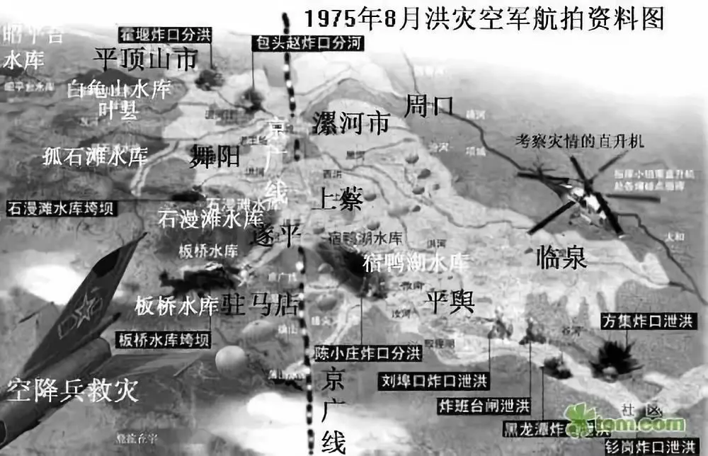
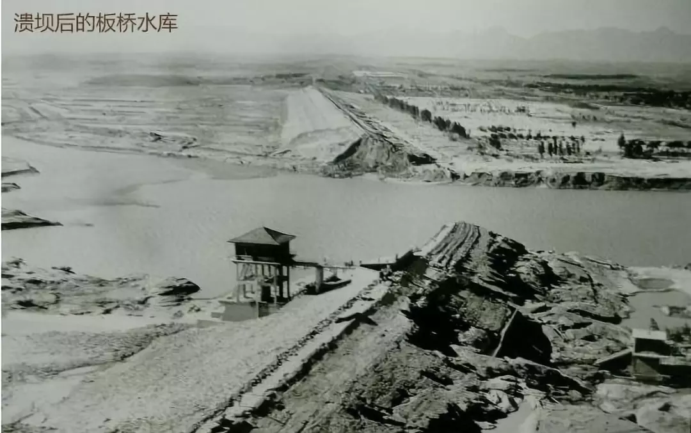

## 气候

## 概念

### [湿度](https://sspai.com/post/68027)

- 气象学上湿度 空气中水蒸气的含量，指空气中水蒸气的含量
- 绝对湿度 一定体积的空气中含有的水蒸气的质量
	- 可以理解成杯子里有多少质量的水。正如杯子里可以容纳的水是有上限的一样，一定体积的空气可以容纳的水蒸气也是有上限的，这个上限一般被称为最高湿度，超过湿度的水蒸气会凝结出来，就和超过水杯容量会流出来一样。
	- 空气中水蒸气的溶解量随温度不同而变化，温度越高可容纳的水蒸气越多，温度越低可容纳的水蒸气越少。一立方米的空气可以在摄氏 10 度下溶解 9.41 克的水，而在摄氏 30 度下则可以溶解 30.38 克的水。
- 相对湿度 从绝对湿度衍生而来，它是当前湿度和最高湿度的比值，比值越高说明空气中水蒸气的含量越多；继续用杯子举例，相对湿度就相当于水杯里的水占杯子的容积的百分比，百分比越高就说明水杯里的水越多。
- 低湿度环境下
	- 皮肤水分蒸发速度会更快，皮肤嘴唇会出现干裂、喉咙也会因此发痒
	- 粉尘花粉等物质会更容易在空气中传播，导致或是加重过敏性鼻炎
	- 会使流感病毒、致病力强的革兰氏阳性菌繁殖速度加快，导致流行疾病的传播。
- 也不是湿度越高越好
	- 一方面人主要依赖汗水带走身上的热量，高相对湿度会阻碍汗水汗水蒸发，在炎热的天气之下会让人感觉更热
	- 另一方面水蒸气会吸收空气中的热，加上水的比热容比空气大，以及水蒸气还会提高衣物的热传导率，所以寒冷气候下湿度高的地方会让人感觉到更冷，堪称魔法攻击。
- 湿度会导致实际温度和人体感觉到的温度出现差异，所以气象学上还专门设立了一个体感温度，将能更准确的表示人体感受到的问题。
- 高湿度同样会导致细菌、病毒、螨虫的繁殖速度。
	- 霉菌最适宜的湿度是 70% 及以上，长江流域的梅雨季也是因为持续下雨导致室内湿度长期位于 70% 以上，霉菌则会导致衣服墙壁的发霉。
	- 根据美国采暖、制冷与空调工程师学会的研究发现微生物和化学反应也会在湿度较高的环境下变得更为活跃，形成挥发性有机物 ，加上细菌、病毒和真菌导致的微生物污染，还会进一步加剧室内空气污染。
- 室内的湿度在 40%-60% 区间内相对比较合理，人体感觉也相对舒适。
- 加湿
	- 最典型的地区就是北方
	- 北方室外寒冷，摄氏 10 度下相对湿度有 50% 时的空气，被暖气加热到 20 度后，这部分空气的相对湿度只有 27%。不仅会带来大量的静电，人体也会感觉非常干燥。
- 除湿
	- 南方，不得不面对春天的梅雨、夏天的闷热、冬天的阴冷,湿度是导致这一切的元凶
	- 开窗通风未必有用
		- 梅雨季节，疯狂下雨以后室外肯定比室内湿度更好，这个时候开窗通风反而会让家里的湿度更高。
		- 更南方的回南天，墙壁上和地面上都会出现大量水滴，这也是因为室外的空气更热相对湿度也更高，接触到室内较冷的墙壁和地板时会因为超过墙壁和地板温度可容纳的最高湿度，最后自然会凝结成水滴附着在这些的表面。开窗通风同样没用，甚至反而会加剧这样的情况的发生。
		- 想知道开窗通风有没有用，最简单的办法就是买个湿度计，看看室内湿度和室外湿度哪个更高就行了。
- 大范围除湿
	- 首先想到的就是空调的除湿模式，事实上制冷模式也可以降低室内的湿度，只是压缩机运行和室内机送风的算法不同而已，相比之下除湿模式效率可能会更高而已。
	- 除湿原理 将水蒸气从空气中冷凝出来再排走冷凝水就好了；一般制冷和除湿时，室内的蒸发器的温度会很低，很容易让水汽饱和并凝结冷凝水。
	- 空调除湿模式最大的问题就是可能会让室内变得更冷或者温度波动变大，有不少人都会感觉空调除湿会不舒服。
	- 新的高端空调采用再热除湿的方式去降低室内湿度
		- 工作原理 把经过干燥的空气加热一次再送出来
		- 当然这类的空调价格更贵，除湿时耗电量也更大。当然还有更高级的除湿不降温的手段，比如大金的 3D 气流风管式温湿平衡内机，通过第三根管道回收外机排放的废热，再回传给对应的内机，提升出风口的温度，不仅可以减少对人体的刺激，也可以非常有效的节省电力，代价就是价格更贵。
	- 更推荐除湿机,工作原理和空调的类似，但是除湿机的蒸发器和冷凝器距离非常近，空气穿过蒸发器温度会有所降低，但是再穿过冷凝器以后温度会重新回到接近室温的温度，和大金的原理类似，很轻松地就完成了除湿不降温的任务。
- 小范围除湿
	- 独立小空间由于长期密闭，而且水汽在空气中的流动能力会弱很多，因此这样的场景更需要小范围除湿。最典型的场景就是衣橱、首饰柜、存储盒或是书柜等。
	- 除湿盒适合密闭的房间、除湿袋适合衣柜、除湿片适合抽屉、而干燥剂适合首饰盒或者存储盒。一般而言小范围除湿用到的这些都需要定期更换，不然除湿效果会大打折扣。
	- 需要存放精密仪器，比如乐器、相机、镜头等，我更建议你单独购买一个干燥箱。干燥箱不仅可以精准调控箱内的湿度，防止精密仪器外部发霉；还可以加速内部空气流通让仪器内部的水蒸气排除，防止仪器内部发霉。
- 除湿机
	- 指标 除湿量
		- 名义除湿量 是国家标准，规定在 27℃ 和 60% 相对湿度下每小时可以除湿的量，对比这个就可以知道哪台除湿机除湿效果更好
		-额定除湿量 更多时候则是从营销的角度去阐述除湿量
	- 由于压缩机的关系，所以除湿机工作时噪音也会很大，因此还需要关注工作时的噪音。
		- 由于压缩机直接做在机箱内部噪音不可避免
		- 对声音的感知也是非线性变化的，如果有两台除湿机噪声分别是的 41 dB（A）和 50 dB（A），那么请毫不犹豫地选择 41 dB（A）的，因为 50 dB（A）的听起来声音像是仿佛是大了 2 倍5一样
	- 水汽在空气中的流动能力是很弱的，所以抽湿机一般是哪个房间需要就带去哪个房间，而家里面积最大的一般就是客厅的面积，这样选购的抽湿机既可以给客厅用，还能够快速降低小房间的相对湿度。
	- 有没有轮子
	- 水箱容量，水箱容量决定使用多久需要去倒水，在钱包允许的情况下，水箱越大越好
	- 使用除湿机时也最好紧闭门窗，这样除湿实际时间可以大大缩短。当然喜欢开窗通风的也可以开着窗使用除湿机，只要外面不是大雨、或者湿度远超室内的情况下，在一段时间后室内也可以获得干爽的感觉。
- 想要换气只能打开窗户被动地接受窗外的空气，无论是室外温度过高还是过低、抑或是湿度过高或者过低，都无能为力，只能通风一段时间后再紧闭门窗打开空调或暖气调整温度，利用加湿器或除湿器调整湿度。
- 全热新风系统
	- 本身就解决没有开窗条件的换气问题的
	- 工作原理 内置全热交换模块，会把室内即将排放出去废气的温度湿度与即将送入室内新风的温度湿度做交换，使得新风获得废弃的温度和湿度。
	- 不仅做到了换气的工作，也使得室内的温度和湿度不会受到室外影响而剧烈波动。
	- 安装松下的全热新风，不管外面温度湿度波动地有多厉害，室内有没有开空调和暖气，也不担心开窗以后户外吵闹，随时都可以换气，还不用担心家里有灰尘。
	- 相比于显热新风，可以更好地维持室内湿度，显热新风会产生冷凝水，冬季容易冻结。
		- 全热新风相比于仅有过滤装置的纯换气的新风，更加节约能源，不会因为夏季换进来的热气或是冬天换进来的冷气导致空调暖气超负荷运作
		- 需要注意的就是有些纯换气的新风会同时宣传「有电热丝」和「省电」，一般省电是指加热丝不工作的状态，但是冬天怎么又能不启动加热丝呢，更别提加热丝到底能把气流加热到多少度的问题了。
	- 可以一年四季都让你享受到新鲜空气的同时节省家里的能效。它和调湿、调温装置并不冲突，在必要时还是需要使用空调、暖气、加湿器或是除湿器来改善家里的气候环境。

## 中国

### 二十四节气

- 十二个中气和十二个节气
- 每个节气约间隔半个月的时间，分列在12个月里面，每个月有两个节气

| 名称   | 时间          | 寓意                    |   |
| ---- | ----------- | --------------------- | - |
| 立春   | 2月3—5日      | 乍暖还寒 莫减衣裳             |   |
| 雨水   | 2月18—20日    | 正月中 春风送暖              |   |
| 惊蛰   | 3月5—7日      | 春雷生 万物长               |   |
| 春分   | 3月20—21日    | 春分到 农事忙               |   |
| 清明   | 4月4—6日      | 冰雪融 草木青               |   |
| 谷雨   | 4月19—21日    | 雨生百谷                  |   |
| ---- | ----------- | --------------------- |   |
| 立夏   | 5月5—7日      | 立夏至 春迟暮               |   |
| 小满   | 5月20—22日    | 物致于此小得盈满              |   |
| 芒种   | 6月5—7日      | 芒之种谷可稼种矣              |   |
| 夏至   | 6月21—22日    | 昼晷已云极 宵漏自此长           |   |
| 小暑   | 7月6—8日      | 小暑小禾黄                 |   |
| 大暑   | 7月22—24日    | 腐草为萤                  |   |
| ---- | ----------- | --------------------- |   |
| 立秋   | 8月7—9日      | 署去凉来 落叶知秋             |   |
| 处暑   | 8月22—24日    | 秋风送爽已觉迟               |   |
| 白露   | 9月7—9日      | 白露白迷迷 秋分稻秀齐           |   |
| 秋分   | 9月22—24日    | 昼夜均而寒暑平               |   |
| 寒露   | 10月8—9日     | 天高昼暖夜来凉               |   |
| 霜降   | 10月23—24日   | 枯草霜花白 寒窗月新影           |   |
| ---- | ----------- | --------------------- |   |
| 立冬   | 11月7—8日     | 北风往复几寒凉               |   |
| 小雪   | 11月22—23日   | 小雪晴沙不作泥               |   |
| 大雪   | 12月6—8日     | 至此而雪盛也                |   |
| 冬至   | 12月21—23日   | 冬至到 一阳生               |   |
| 小寒   | 1月5—7日      | 月初寒尚小                 |   |
| 大寒   | 1月20—21日    | 寒气之逆极                 |   |

>                 二十四节气歌

> 春雨惊春清谷天，夏满芒夏暑相连，
> 秋处露秋寒霜降，冬雪雪冬小大寒。
>
> 每月两节不变更，最多相差一两天。
> 上半年来六、廿一，下半年来八、廿三。

### 西北地区

- 像陕北的毛乌素这种地方的年平均降水量还能接近400毫米，那些地方的生态恢复是可能的。而敦煌年降水量不到50毫米，要想这些地方变成一片绿意盎然的地方，基本上是不可能的。
- 西北地区
  - 年平均降水量最多不超过200毫米,年蒸发量基本上是在1000毫米以上.在敦煌等等这些我用红色圈出来的地方，蒸发量甚至接近2000毫米。
  - 身处内陆，缺乏水汽，水汽要从海洋上过来，但它距离哪个大洋都非常遥远。假如只有陆地，但没有青藏高原，没有帕米尔高原，没有这些地形的阻隔，模拟出来的气候也是这样，中亚地区降水非常少。
  - 箭头表示的是风向，意味着水汽的输送方向。从印度洋来的水汽不会直接往北走，它走着走着就往东拐了，拐到了中国东部地区。
  - 焚风效应
    - 地球上的水汽分布满足比较简单的物理规律 克拉伯龙-克劳修斯方程
    - 温度越高、距离地面越近的地方，空气中可以容纳更多的水汽
    - 温度越低、距离地面越高的地方，大气中的水汽含量就越低。
    - 如果有一座山，在山的迎风坡这一面，风带着水汽过来，然后逐渐爬升。在爬升的过程中，空气的温度逐渐降低，很快就会凝结形成降雨，这时候就在迎风坡形成降水。在翻山的过程中已经把水降了出来，翻过山之后就变成了干空气。所以能看到，在迎风坡的地方，一般都非常湿润，而在背风坡的地方经常会形成干热的河谷。
    - 西北地区周围全是山，南边青藏高原，西边帕米尔高原、天山，北边也是山，东边离海非常非常遥远，所以如果有气流翻山，不管从哪儿来的，到那地方一定会变干。每一座山就像一个脱水机。
  - 大气环流
    - 假如海陆分布不发生变化，一边是亚欧大陆，一边是太平洋，南边是青藏高原，这个时候在西北这个地方的高空一定会形成一个高压中心，就像图里面给出的深色的区域。
    - 在高压区域所在的地方，空气是下沉的，而下沉的时候会容易让云消散掉，并且下沉会形成增温，所以那个地方哪怕是有点云，也会在下沉的过程中消散掉，变成无云的天气。所以西北地区基本上是阳光辐射最强的，太阳能资源最丰富的区域。
  - 远离海洋、深处内陆、周围都是高山——形成高山之后的焚风效应，让这个地方变得非常干燥。
  - 喜马拉雅山的迎风坡是世界上降水量最多的地方，年降水量超过1万毫米，就是10米左右的降水量。而到了喜马拉雅山的北边，整个一片荒芜，完全是荒漠的样子。
  - 天山的南北对比，在天山的迎风坡这一面能看得出它比较湿润，而在背风坡这一面非常干燥，一片荒芜。
- 东部的降水，水汽来自太平洋，太平洋的水汽在西进的过程中
  - 在华南的南岭、岭南和武夷山以南这个区域形成降水。这些地方的年均降水量能达到1600毫米。
  - 到了长江流域，年均降水量就降低到1000~1200毫米。南岭的这些山脉都不是特别高，最高才有几百米，就可以达到这样的脱水效果。
  - 越过巫山、云贵高原，还有太行山脉。经过这一系列的山脉脱水之后，到了陕西、山西这些地方，年均降水量就降低到500~700毫米。
- 西北的干旱历史
  - 在历史上是一个叫做副特提斯海的地方，这个海逐渐萎缩，就变成了现在的地中海，而西部地区又慢慢地从沿海地区退缩变成内陆地区。
  - 那个地方变得干燥起来之后，刮风就会把地面的土壤刮出来，然后在其他地方落下来，形成了面积非常大的黄土高原。所以考察黄土高原的历史有多长，就可以知道西北干旱的历史有多长。以现在的研究认为，黄土高原大概已经有了2200万年的历史，所以西北的干旱也有这么长的历史。
  - 随着喜马拉雅山的隆起，随着整个青藏高原的隆起，整个西北变得更加干燥。
- 如果把喜马拉雅山炸开一个50公里的口子，会不会让整个青藏高原以及青藏高原北边的西北地区变成鱼米之乡。
  - 喜马拉雅山虽然是一个很长的山脉，但实际上它也有很多的山口，很多的小口子，其中一个非常大的口子是整个雅鲁藏布江大峡谷， 从西往东流，流经大峡谷转弯，然后往南流，流出国境线。
  - 即使有这样一个口子，也没有带来整个青藏高原根本性的气候变化，唯一的影响就是让雅鲁藏布江大峡谷的两岸出现了很多高耸入云的雪山，雪山的规模和数量比其他地方要多。
  - 开宽：口子开了之后，来自北部的干空气就顺着这个口子往南走，和南边来的空气在口子里面相会，从而在南部和中部地区增加一些降水，而北部地区因为干空气的影响，反倒降水减少了。这样看起来并不能给整个西北地区带来更多的水资源。
  - 开深 降水在通道的南部地区有所增多，北部依然降水减少。原因很简单，北部的干空气进来了。那么这给我们一个启示：我们可能撼山容易，撼整个大气环流却很难，整个环流不会发生根本性的变化。
  - 原因就在于即使开了这样的口子，也无法改变西北形成干旱的根本原因。第一，它距离任何一个海洋都比较远；第二，周围全是崇山峻岭，任何翻山气流都要下沉，下沉形成增温，增温就变得非常干燥。
  - 即使没有山脉，只要有欧亚大陆和太平洋海陆分布的正常存在，这个地方就会形成高压区，高压区是下沉的气流。
- 帕米尔高原开一个大口子
  - 伊犁河谷地区，伊犁地区基本上是西北环境最好的地区。从这个图上能看出来，它是一个喇叭口的地形，向西开，让西边水汽进来，然后沿着这个喇叭口逐渐汇集，在这边形成降水。因为那边的山很高，所以不仅汇集，而且抬升，就在伊犁河谷形成了非常好的生态环境和气候环境。
  - 这里的年均降水量大概能达到400~500毫米，甚至有些地方能达到600毫米，在周围都是50毫米、100毫米降水量的地方，这简直是一个天堂。
  - 中亚地区之所以能形成一点比较湿润的地方，是因为中亚五国靠近中国这一侧是帕米尔高原的迎风坡，这个地方的地形从海拔一两千米直接升到四五千米，有非常陡峭的地形抬升。在这个抬升的过程中，哪怕空气异常干燥，经过这么大的海拔的变化，强力脱水，它也能够形成一些降水。所以中亚五国首都基本上都在迎风坡的坡底下的位置，环境还算不错。
  - 如果把整个帕米尔高原铲掉，这边的迎风坡就会消失掉，迎风坡只要消失掉，这个地方的降水就会消失，那么很大可能中亚五国难得的这一点湿润地区就会全部消失，中亚就会变成沙漠。
  - 即使有水汽进到中国来，也会发现这个地方是盆地，北边是准噶尔盆地，南边是塔里木盆地，两个盆地的海拔都比周围低，塔里木盆地的平均海拔是1100米，而准噶尔盆地平均海拔只有600多米。没有形成降水
- 西北变暖湿了吗？
  - 在这段时间里，因为全球的温度增加，西北温度增加的趋势要比全球其他地方温度增加得更快。
  - 温度增加带来了一个很大的变化，就是潜在蒸发量也在迅速增加，潜在蒸发量的增幅比降水量的增幅还要大。这意味着随着降水的增多，这个地方甚至会变得更为干燥。
- 实际上整个国家都在经历着干旱化的发展，要深刻去认识，不同地方的生态环境变化到底是因为什么。
  - 很多地方，包括陕北、河套地区，包括毛乌素沙漠这些地方，它们本来降水量就足够，一般接近400毫米，或者比400毫米还要多，这些地方只要人为不去破坏它，慢慢地生态就会恢复。所以各种退耕还林、退耕还草的措施，都会让那个地方的生态发生改变。
  - 但是西北降水量在200毫米，就不是退耕还林还草所能够恢复的，那个地方的降水量不足以支撑起树木，或者像样的草的生长，它本来就是一个荒漠。有一些地方山变得比较湿润，山顶看到的树木会多了，或者草兴盛一些了，这种很有可能是因为山上的冰川消融。而冰川消融是因为全球变暖，这并不是一件好事，反倒是整个生态系统衰退的一个迹象，你看到的是那地方变绿，实际隐藏的是一个更大的危机。
  - 西北地区有些地方降水的增加，它不是如“春雨润如油”式的慢慢地滋润，它是以暴雨的形式，突然两场暴雨，然后今年的降水就结束了，这样它不但没有缓解干旱，反而带来了洪涝的灾害。
- 西北地方充满了希望，可以用各种各样的方式来改变它的生态
  - 大水漫灌的方式，浪费非常严重，过两天就会晒得干干净净，因为那个地方的蒸发非常大。这些地方有很多的来自雪山的水资源，如果采取这种方式，那是非常大的浪费。
  - 西北地方的很多瓜果非常好，就是因为那地方的环境足够产生这样的效果。发展农业，如果能够提高整个节水灌溉的技术，比如像滴灌、喷灌等等科技的应用，加强这一部分农业的投资，这个地方一定会有很大的变化。

[[wind_flow.png|风向图]]
[[wind_circle.png|大气环流]]

## 全球气候变化

- 西伯利亚解冻
- 南极冰化
- 季风地带的极端天气一定会越来越多，原本较为干旱的北方，夏天降水占全年的80%强，基建只会越来越捉襟见肘。
- 气温每上升1摄氏度，大气中对应的水分就会增加7%

### 2021

- 年初北美超级寒潮，澳大利亚特大洪水
- 四月，强沙尘暴袭击亚洲多国；
- 六月，加拿大极以前夏天难得高温过30度今年连续三周高温都是三十五六度
- 七月，比利时、德国西部、日本熊本、美国纽约、中国河南，整个北纬40度沿线地区 特大暴雨
- 大理雨季完全没有

#### [《气候问题评估报告》](https://www.ipcc.ch/report/sixth-assessment-report-working-group-i/)

- 非常明确尖锐，结论就是四个字："大难临头"。
- 报告认为，根据各种科学研究和观测结果，可以认定 气候灾难已经发生了，并将继续加剧。 人类现在所做的种种减碳努力，并不能避免灾难，只是为了不让最糟糕的结果发生。
- 报告描绘了非常可怕的全球变暖进程，地球的平均气温，目前比工业革命前上升了1.2度，估计未来一两年内就会上升1.5度。如果温室气体排放量继续增加，2050年前将会上升2度，本世纪末之前达到3度。
- "地球将变得干燥许多，整个生态系统被破坏，导致大规模物种灭绝，并使全球的粮食保障面临巨大风险。
- 以下五种灾难现象将会越来越严重：（1）高温，（2）干旱，（3）洪水，（4）飓风，（5）海平面上升。"
- 对普通人威胁比较大的，主要还是暴雨和高温。
	- 遇到大暴雨，尽量不要进入地下空间或地势低洼处，也不要靠近山地，防止遇到山洪。
	- 居住地的选择要考虑气温，尽量选择气候凉爽的城市。中国东部沿海各省，恐怕以后夏季高温都会破40度。深圳这种北回归线以南的城市，一年可能有半年，全天气温在30度以上。

### 碳排放

- 龙源(北京)碳资产管理技术有限公司（以下简称“龙源碳资产”）的母公司是龙源电力集团股份有限公司，隶属于原国电和原神华于2017年重组而成的国家能源集团。据了解，除了发电厂，国家能源集团当前已经将化工、运输、煤炭板块纳入碳排放管理范畴，意味着集团下近300家基层企业都有碳排放管理需求，这里面蕴含着每年上亿的资产。
- 随着全国碳交易市场开市，龙源碳资产作为国家能源集团内部专业化服务公司，不仅要核算各个电厂的碳排放量，还要帮助他们开展碳交易，以及组织碳排放相关的培训工作等。
- 碳排放量的核算
	- 一般去一个电厂之前，就会发送资料清单让他们事先把各各项数据资料、原始台账等都准备好，比如煤炭消耗量、燃煤低位发热值、碳元素含量、供电量、供热量等等。
	- 过去汽车等移动源排放、天然气使用量、食堂消耗等这些都要算，然而按照最新的核算指南，这些非机组层面的排放已经不需要再核算了。
	- 把数据准备好之后，等我们到了现场再对各项数据做最终确认。
- 国家会给每个控排企业发放碳排放配额，如果某火电厂某年的排放配额是100万吨，但该厂只排放了90万吨，这样就有10万吨可以卖，按近期每吨50元左右的碳价算，就是500万元的收益。
- 至于国家分发是90万吨的配额还是100万吨的配额，这个是根据配额分配方法计算的。根据企业生产情况，通过发电量、供热量以及结合一些修正系数计算出的。

## 公共建设

- 在国内三线以上城市搞海绵城市是学、商、政三方合谋圈钱的诈骗项目，海绵城市只适合小村镇，大城市必须靠大型排水管廊，欧美小城镇市中心那么点大，绿化面积还很高，海绵效应当然有，但在中国城市搞只能是杯水车薪，而在编制报告和诸多基础系数的选择上，都在往有效方向上选、编

### 水坝

- 弗雷德·皮尔斯在《水问：全球水资源危机》中提出了“大坝引发洪水”的洞见：
  - - “在降雨非常集中的时候，大坝的蓄水能力成为一种威胁。随着水位上涨至大坝顶端，管理者面临着选择，要么一旦漫溢出现灾难性垮坝的风险，要么利用泄洪道进行紧急泄洪。
  - 通常他们做出重大决策时已经为时过晚，后果就是下泄的洪水比河流自然泛滥时来得更大、更突然。”🐱时代农业建设的基本抓手之一，便是举国之力开展的大规模群众性农田水利工程建设。从水库到灌渠，将农业产区武装到牙齿。地处版图中央的的夏粮主产区河南，年景丰歉则关乎国本，牵系民生。
  - 今天分布豫东，豫南大地上诸多的平原水库，正是这一国家工程的历史遗产。而其中的大多数位于淮河上游向豫东平原过渡的浅山地带。
  - 在此后淮河流域更大尺度的生态变迁和河流治理中，拦坝蓄水，喝涸淀干，盈亏溢满的自然节律遭遇巨大的干扰，“根治”治死了河流的生命。河流冬春季节基本无水，河床萎缩，排洪能力逐年递减，形成了后来数十年间致命的“肠梗阻”。
  - 当“千年不遇”的特大灾难猝然降临，多米诺骨牌倒下。浊浪滔天，席卷平原。望不到边的水，成了望不尽的愁。 真是砌成此恨无重数。 一次又一次，这片与中国同样古老的土地，江河横溢，人或为鱼鳖。
  - 历史不断重复昨天的故事。到底，这是天灾，还是人祸？ 无论是政策制定，政策研究，学术讨论还是公众认知，我们所有人，都应当从血写的史书里，切切实实地补上“发展学”这一课。
- 爸爸家族里三代人都是做水利的，洪水从不是陌生的话题，王家坝每年泄洪，有人说为保江浙沪，村民只得在那么固定几天离开自己原本的家去往等待救援的地方，随之而来的是农田毁坏，经济损失。必须要理解一些人好像没有经历过什么，就长出一副悲情，痛苦的脸，年纪轻轻，言语间就透露着愤世嫉俗，因为他们生来就与苦难绑在了一起，这从来不是可以被选择的事情。
- 水库是有死水位，兴利水位，防洪水位，设计水位等等不同的水位。河南地处中原大陆性季风气候，夏季水库用于蓄水到兴利水位保证发电站的运行。一旦有突发降雨水库也会排水。另外排水也是划分蓄洪区，滞洪区，洪泛区的。这次已经提前动用到荥阳洪泛区。最后我想说各个部门真的很重视，我好多赶水利的朋友每年夏天都是吃住在坝上两个月，各个行政部门的应急也是保证在一小时以内传达给上级。

### 三峡

- 多么美的大好山河，我亲眼目睹“大江截流高峡平湖”真是的眼泪最不值的，留不住啊！
- 一次又一次喜欢朝天门码头啊一去没有啦！永远是没有了，我们那丰都万县😭😭😭算了说了都是泪！祈望万里大坝文文不倒！阿门

## 灾害

- 希望每一场灾难成为进步的起点，而不是用人体铺就的感动之路

### 法国马尔巴塞溃坝，1959年

- 马尔巴塞(Malpasset)大坝的失事是世界拱坝建筑史上的一次恶性事故，比起此前上世纪20至30年代现代水坝事故记录上的4次美国大坝大事故均要严重。
- 这座大坝位于法国南部瓦尔省莱兰河上，该坝仅是为供水、灌溉而修建，由当时法国著名土木工程师科依内（André Coyne ）设计，他一生在14个国家领导修造了70座水坝。
- 大坝坝高约66米，坝顶宽约223米。1952年开工，1954年建成，使用钢筋混凝土，由于当时法国政治局势动荡，迟至1958年底始投入运转。
- 1959年12月，当地曾持续暴雨，12月2日中午，水库达到了最高水位。水库工程师安德烈·费罗（André Ferro）随即要求开闸卸洪，但领导迟迟不批准。直到那天下午6点，领导批准开闸后，卸洪速度太慢，3小时水位下降仅数厘米，为时已晚。
- 当天晚9点多，马尔巴塞坝突然崩溃，随着一声巨响，携带着钢筋混凝土碎块的高约40米的巨浪以每小时70公里的高速冲出溃坝突破口，随着由此产生的巨大空气冲击波，在半个多小时内将里在坝下游约10公里处的弗雷茄斯小城变成废墟，附近的建筑、公路、铁路、供电和供水线路几乎全部冲毁，大水最后冲入十多公里外的大海。
- 官方统计这次事故造成包括一百多位儿童在内的423人直接死亡，多人失踪，更多人受伤。
- 设计大坝的工程师科依内在事故发生半年后辞世，后来有调查报告认为他的设计并没有问题。之后几十年，国际和法国国内专家们一直在讨论事故的原因，总结出各种地质、工程的各种可能原因。有专家认为大坝建前没有充分的地质钻探，建后又无观测设备进行系统监测，有关责任方采取了对民众生命财产不负责的态度。

### “世界之最”意大利瓦依昂大坝 1963年

- 瓦依昂坝（Vajont Dam）位于风景秀丽的阿尔卑斯山区中，距离著名的威尼斯不到100公里。
- 意大利第二次世界大战后进入一个高速发展的时期，北部城市的工业发展对电力的需求与日俱增，瓦依昂峡谷造坝地理条件得天独厚，早在二战前政府和工程师已经提出建造有发电及水库功能的大坝的设想和工程方案。
- 这个当时世界上最高大坝最终使用的混凝土双曲拱坝设计结构的受力条件非常优秀，以至于水库塌方造成灾难后，大坝仍屹立不倒。但大坝两边的山体却承受不住建坝和水库之重。
- 大坝由垄断意大利北方私营电力的公司始建于1957年，后期大坝工程公司改变了原先设计，大坝高度从230米提高到262米，库容也因此增大到初始设计的3倍。随着水库蓄水不断增高，大坝周围的地质结构出现了不稳。
- 1962年底，意大利国家电力公司买下了水库，为了尽快验收，加速蓄水。
- 1963年9月28日起，瓦依昂地区连降大雨。山体滑移速度越来越快，附近人们开始听到瓦依昂山谷中传来奇怪的声音。有关当局决定降低水库水位，为时已晚。
- 1963年10月9日夜里，水库周围2.6亿立方米山体大滑坡，45秒内填满大半个水库，瞬间漫出的大水形成250米高的巨浪和如同原子弹爆炸般的空气冲击波，冲击淹没了附近小镇村庄，造成近两千人死亡。当时在水库岸边管理大楼、办公室等地60多名技术及管理人员，除1人幸存外，其余全部死亡。
- 尽管失去了蓄水或发电机能。完好的大坝至今保留在原地，成为一个当地旅游点。2008年联合国教科文组织在推出“国际地球年”活动之际，将瓦依昂大坝悲剧列为“因工程师和地质学家失误”造成的人类工程悲剧之一。

### [河南驻马店溃坝事件，1975年](https://mp.weixin.qq.com/s/3mOouBzyxPoUGCRtqme9EA)

- 中国在改革开放前数十年的极左时代在水利建设上犯下很多不讲科学、盲目相信苏联专家、唯领导好恶设计、修建、管理水库大坝的错误，酿成致命后果。
  - 1950年10月14日，政务院发布《关于治理淮河的决定》，制定了上中下游按不同情况实施蓄泄兼筹的方针。新中国水利建设事业的第一个大工程拉开了帷幕。治理淮河的第二期工程中，民工在河南省泌阳县板桥水库工地施工。新华社发
  - 上世纪50年代末河南总结山区水利的经验“以蓄为主，以小型为主，以社队自办为主”。
  - 当时已经有少数懂水利和建设的专家和工程师提出反对意见，但无人理会。
  - 到20世纪60年代末，驻马店地区新增水库100多座，工程管理十分混乱，但当地河流的排洪能力非但没有增强，反而年年递减，孕育着严重危机。
- 史无前例的大雨
  - 1975年8月，一场超强台风给河南带来当时突破中国与世界最高降雨量记录的特大暴雨，引发淮河上游大洪水
  - 1975年7月31日，福建晋江。3号台风在太平洋上空形成。1975年8月4日，该年度中国内地第3号台风(“7503号”台风)在福建晋江登陆。台风没有像通常那样在陆地上迅速消失，却以罕见的强力，越江西，穿湖南，在常德附近突然转向，北渡长江直入中原腹地。
  - 强烈低气压和南下的冷空气形成对峙，热低压从海洋携带的大量水汽，遭遇强冷空气，受到桐柏山、伏牛山组成的“喇叭口”地形的抬升，罕见的大暴雨形成。
  - 那场雨有多大？后来的气象专家统计的数字显示，1975年8月5、6、7三日的降水量超过中国大陆以往的正式记录，最大的暴雨中心为河南泌阳林庄，8月7日一天降下1005.4毫米，其中6小时降雨为830.1毫米，超过了世界纪录。林庄，一位当地农民式的水文工作者记录下的那三天的降水量为1606.1毫米，是当地正常年份两年的降水量。
  - 8月5日中午，方城县黄土岗山谷里的村庄到处是巨大的雷声和闪电，小孩子们都胆小地躲在门后，在农村传言，雷电是天上的龙，要抓坏人，孩子们没有一个不偷过邻居的果树和玉米的。
  - 到8月6日清晨，里面的堰塘憋开了。山洪的速度极快，平时一跃可过的小河，已经成了十几丈宽的大河。洪水跳跃着窜向下游5公里左右的黄土岗水库。
  - 十里铺 8月7日深夜，从宿鸭湖大坝上赶下来的父亲有些慌张，催促家人赶紧向宿鸭湖大坝跑。宿鸭湖的水位疯了一样，一会儿一个样子。家距离大坝只有250米左右的距离，但对于这个庞大的村庄来说，坝体无疑是一座脆弱的山。随时可以倾倒淹没这个村庄。母亲甚至来不及叫醒女儿，就背在背上，拉着大女儿和儿子们，向大坝上跑去——宿鸭湖平地起了一个大坝，对这里的居民来说，此刻不论生死，就系与这个人类的奇迹上。大坝是惟一一个可以活命的地方，即使大坝决口，也有生存的机会。
  - 7日下午，板桥水库渔业生产队发现有鱼从溢洪道流出，领导要人开着最好的机船，在溢洪道里挂上网挡雨，到处都是水，生产队职工陈志家就和一群工人去收拾渔网。到黄昏的时候，拖船上装满了渔网，但是许多人都跑掉了，只剩下七个人，于是陈志家也上了船，大风大雨的，也没有什么事儿。要把船开到坝南的溢洪道，拦网挂鱼。此刻，是晚上8点钟左右。在巨大的风浪中，大船摇摇摆摆地驶入浊浪之中。
  - 悲剧率先在确山发生，近在咫尺的板桥和遂平没有得到任何消息：确山经过两轮暴雨袭击后，降雨达1100多毫米，山洪暴发，山体滑坡，水库溃坝，塘堰坝溃决，几十吨重的钢筋水泥军用设施顺水漂走。军方的武器和装备被洪水卷走。8月7日，京广线上一列火车被洪水推出轨道，翻沉在马庄河下。
  - 8月6日子夜，板桥公社一名干部蹚着齐腰深的积水赶到水库管理局，转达了泌阳县委转来的省、地防汛指挥部指示：板桥水库开闸泄洪，最大泄量开到400立方米/秒——— 这是一个令台风和暴雨耻笑的决定。
  - 7日天刚蒙蒙亮，水库管理局动员保护国家财产，组织家属转移。中午，陈彬召集驻军、水库、板桥公社领导人会议，商讨应急措施。宣布水库处于紧急状态，通知下游群众转移。同时催促地委立即向驻军求援，派军队到水库抢险，抢修通讯线路，运送草袋、发电机组和其它防汛器材。
  - 8月7日，板桥水库管理局与上游龙王庙、桃花店等雨量站全部失去联系。与下游的遂平县，也是去了电话、电报、陆路联系。
  - 7日21时前，确山、泌阳已有7座小型水库溃坝，22时，中型水库竹沟水库溃坝。
  - 从福建晋江，到河南方城，到几百平方公里的板桥水库容水区域。从8月5日开始的72小时时间里，所有的指针都向着一个方向：板桥水库，遂平，豫南驻马店平原，这里居住着1000万的人民，以及数不清的生灵。
- 毫无准备的防守
  - 台风带来的数以百亿吨水计算的云，一股脑地将数以百亿计立方米的水，汇拢在自伏牛山余脉直桐柏山脉之间狭长地带，进而在坡级递降的海拔高程中，加速向驻马店地区流动。然而淮河任何一个可以筑坝的地方，都已经构筑了拦水大坝，加上平原地带的积水顶抬，淮河上游，聚集了令人可怕的水能。
  - 板桥水库设计最大库容为4.92亿立方米，从8月5日晨板桥水库水位开始上涨到8日凌晨1时，最高水位117.94米，设计最高蓄水位110.88米。暴雨已经让它承受的洪水总量为7.012亿立方米，而上游逐渐崩塌的小型水坝以及径流汇聚，致使洪峰流量达1.7万立方米每秒，是板桥水库设计最大泄量(1720立方米每秒)的100倍。
  - 7日19时30分，驻军向上级部门发出特急电称：“板桥水库水位急遽上升，情况十分危急，水面离坝顶只有1.3米，再下300毫米雨量水库就有溃坝危险！”
  - 8日零时20分，水库第二次向上级部门发出特特急电，请求用飞机炸掉副溢洪道。同第一封急电一样，这封电报同样没能传到上级部门领导手中。
  - 22：00，在水库方面的要求下，调集驰援水库防守的驻军在大坝南端升起了两颗红色信号弹，并举枪对空扫射报警——没有人弄清楚摇曳的红色信号弹以及隐隐约约的枪声，是什么意思。
  - 22：10，水库管理局收到了驻军转来的地区防汛指挥部电报，指示打开闸门，以450立方米/秒的速度泄洪，不考虑其它影响，全力以赴保证大坝安全——距6日指示最大开闸400立方米秒，多出了50立方米秒的泄洪量。
  - 接报后，陈斌、张群生、陈付安等人联名向中央、省委、地委发出的这份特告急电，通过军队发出，在历史档案残缺不全的材料中，河南日报记者于为民找到过这样一份电文，这是板桥水库历史上，最后一纸救命的莫尔斯电码：“板桥水库处于特别危机状态库水位已过坝顶即将漫过防浪墙主副溢洪道已全部运用要通知沿河社队注意抢险转移水库防汛指挥部在大坝南头请求空军支援”。
  - 0：20，水库电站因形势危急，停止发电。大坝陷入黑暗。此时，板桥水库大坝上大批水库职工、家属这时正被转移到附近的高地。库水一厘米一厘米地上涨，淹至脚面、脚踝、小腿、膝盖……库水迅速平坝，坝体受水面，水舌舔着防浪墙，将防浪墙上的沙壳一块块掏空，一千多米的大坝，闪电之下发亮的水漫过来，形成了一块巨大的瀑布。
  - 一道闪电。一串雷之后，突然天地噤声——奇怪的事情发生了：暴雨骤止，夜幕中出现闪烁的星斗。妇女儿童们惊喜地发现，埋没膝盖的水，落到了脚踝甚至脚面上。惊喜的喊声响起：“水落啦……”陈斌突然觉得脚下一晃，他听到了天崩地陷般一声巨响，板桥大坝，像是打了个趔趄，洪水已经翻过防浪墙，剥去沙土层，从大坝跨越汝河的地段推开了缺口。
  - 板桥大坝在微弱的星光之下，瀑布般的水幕消失，积攒了几天的近亿立方米库水，在上游来水不断地推托之下，以撕裂一切的力量，推开了板桥大坝。
  - 板桥水库水文站的职工们，几乎来不及想任何东西，他们的职责，是记录水落水涨的水位。他们默默地拿起石块，水下去，做个记号，下去，再做记号。他们跟了几个小时，直到水库，露出清晰的，原来叫“沙河”的河床。
  - 灾害发生时，17个泄洪闸只有5个能开启。水库管理人员在没有得到上级命令的情况下，不敢大量排水泄洪，而上游石漫滩水库的大量洪水急骤流入板桥水库。
  - 就在板桥水库溃坝之际，它北偏西的石漫滩水库亦溃坝，同时，河南中部两座中型水库、58座小型水库相继溃决，近100亿立方米(注，加上此前暴雨已经滞留在平原地区的均一米左右的积水)的洪水肆意横流。
- 8月8日凌晨，河南驻马店地区板桥水库因特大暴雨引发溃坝，9县1镇东西150公里、南北75公里范围内顿时一片汪洋。
- 溃决时最大出库瞬间流量为7.81万立方米每秒，在6小时内向下游倾泻7.01亿立方米洪水。溃坝洪水进入河道后，又以平均每秒6米的速度冲向下游，在大坝至京广铁路直线距离45公里之间形成一股水头高达5- 9米、流宽12-15公里的水流。
- 从路尽头这个叫魏湾的村庄以上十多公里处，死神起步开始旅行：以下百多公里的华中平原，在数亿立方米的溃坝之水覆盖之下，数不清的人们瞬间毙命。在几个小时内淹没河南、安徽省29个县市。
  - 告急电报辗转到达北京时，洪水的巨浪继续东进，在扫荡了上蔡、汝南之后，于8月9日深夜，洪水淹没了平舆县城。至此，板桥水库溃水，完成了对驻马店地区生灵肆无忌惮的涂炭。

　- 可以查询到的档案资料显示，在那几天里：汝南，10万人被淹(指尚漂浮在水中)，已救4万，还有6万人困在树上，要求急救；全县20万人脸浮肿；新蔡，30万人尚在堤上、房上、筏上，20个公社全被水围住，许多群众5昼夜没有饭吃；上蔡，60万人被水包围。华陂公社刘连玉大队4000人已把树叶吃光，黄铺公社张桥大队水闸上有300人6天7夜没有吃饭；平舆，40万人在水里……
　- 水坑里、田埂边、桥洞中、到处都是死尸，横七竖八惨不忍睹，有的死尸倒悬在树上。卡在柴草堆里。埋尸队员们开始小心翼翼地将尸体集中在一起，给赤裸的尸体裹上随手都可以拾到的破被子、烂床单和衣服，掩埋起来，在地上留起坟头。但尸体太多，有的已无法辨认，更无法挪动，只好在水坑里，路边上挖几锹土，就地掩埋。在车站，铁路两旁、车辆里，淤积了大量尸体，既无法挪动，又无法掩埋，只好浇上汽油点火烧掉。逐渐发臭变烂甚至产生毒素的人和动物的尸体，弥漫着人们说不清楚的雾气。

- 由于细菌的吞噬，天蒸地热，尸体正在可怕地威胁着无衣无食，体能消耗过大抵抗力越来越弱的存活者。大量蚊蝇滋生，树上的苍蝇结成辫，滚成团，压弯了树枝和高压线。
- 虽然中国军队大批救援部队和数千名医护人员从8日当天开始昼夜兼程陆续抵达河南灾区救灾，灾害之惨重远远超出其预料。
- 从8月9日至22日，卫生部、解放军总后勤部、北京、湖北、河北、山西、武汉军区、广州军区、河南省军区及全国各地市的198个医疗卫生部门，派出三千多名医务工作者先后抵达灾区。空军从9月1日至6日连续出动飞机248架次，喷洒可湿性“六六六”粉248吨，覆盖了宿鸭湖以西250平方公里的地区。
- 到8月21日尚有数十万灾民泡在水中。而洪水退去的地方，到处可见人畜尸体。饥荒和瘟疫接踵而来。
- 这是中华人民共和国成立以来受灾面积最大，死亡人数最多的一次水灾。当时被中国政府以国家机密为由没有公布，直到改革开放后逐渐透露出来。据中国当时的水利部长钱正英作序的、1999年出版的《中国历史大洪水》书中称，河南省有1100万人受灾，伤亡惨重，1700万亩农田被淹，倒塌房屋596万间，冲走耕畜30.23万头，猪72万头，纵贯中国南北的京广线被冲毁102公里，中断行车18天，影响运输48天，超过2.6万人死难。史称“75.8”大洪水。
- 中国媒体在2010年之后报道称，1980年代后，中国多位全国政协委员在文章中披露，河南“75.8”水灾死亡人数高达23万人。
- 75.8台风引起板桥，石漫滩水库特大溃坝。
- 《河南“75·8”特大洪水灾害》

### 灾难应急

- 降雨量确实很大，城市排水系统无法应付。但这不是，成为“失败主义”的理由。如果说起天灾，更多要思考人在其中的因素————首先，需要更多的事实，比如具体的伤亡情况，他们在什么情境下，死去的。这次暴雨，在五天前早有预报，政府有哪些预案和准备？暴雨是百年一遇，“无法抵挡的”，那么又有哪些关键的死角，可以更多减少损失？比如，人们被困在地铁车厢的时候。哪怕，地铁网络无法阻挡大水漫入，那为什么这种时候，车门不能被打开？有些人从车厢逃离到地铁站口，刷票的闸机是否被设置好了，能直接通过？我以为，没有任何一种灾难，会贬损追问的价值。
- 出现一种论调，认为灾难当前，应该搁置争议专注救灾，所以不该开始对程序，数据，处理方式发出质问，所有注意力和内容都要指向救灾。这也是一种粗暴的闭嘴逻辑，而且实际上昨晚大概八点以后转发的所有“自救知识”，“救助电话整理”，99%都是冗余和重复（很客气的说法了）。不要高看在外面的人靠这些转发到底帮了什么忙，相反在外面的人，思考和关注程序，数据，处理方式，恐怕才是最大的帮忙。
- 危机发生时，如何最高效的收集信息及协调资源，理应是有成熟的渠道和方案的，这是异常时刻的组织力，不管是由官方还是由独立社团承接这部分责任。包括但不限于快速反应决策（关停地铁）、统一指导避险（开放体育馆等大型场所）、紧急物资调配（医院）。突然冒出的自发自救志愿互助，是这些责任（本该有人承担，体现为当有这样的需求时人人都知道去找谁）失灵后的无奈应对。一发生大灾各受灾体第一时间向公众寻求捐款捐物更是匪夷所思。这是最不应该由个人向个人求救的部分。我们对危机中的组织责任理解有分歧。

## 图书

- 《大家小书•天道与人文》  竺可桢
  - 许多文史工作者在选用素材时，都有“六经注我”或堆砌编排的特点，其最终分析可能失之偏颇。竺可桢选用材料十分讲究，对历史的分析基本上做到了唯材料是举。《中国近五千年来气候变迁的初步研究》一文，对气候变迁的分期，既不是根据温度变迁的周期，也不是根据历史朝代的不同，更不是根据纪年方式的变更。而纯粹是“根据手边材料的性质”。把气候时期分为“考古时期”、“物候时期”、“方志时期”、“仪器观测时期”，这种分期方式与气候变迁本身并无关系，表面上看来极不合自然逻辑，但在实际操作中却是最方便实用且能最接近客观真实的一种方式，典型地体现了他所反复提倡的“求是”精神。
- 中国气象灾害大典 河南卷
