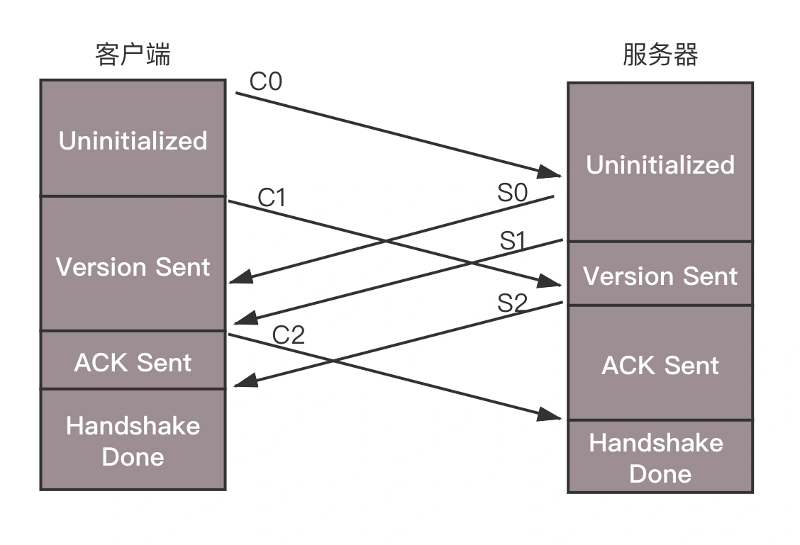
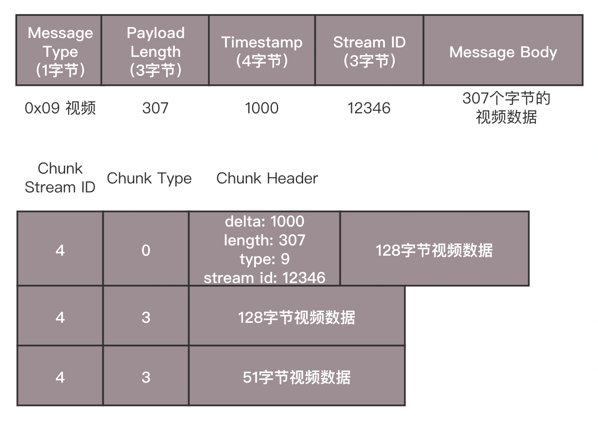

# Video

## 概念

- 帧 每一张图片，每一张图片，都是由像素组成
- 每个像素由 RGB 组成，每个 8 位，共 24 位
- 分辨率
  - 720P(1280 × 720个像素)
  - 1080P（1920 ×1080个像素）
  - 4K（3840 × 2160 有的人称为2160P）
  - 8K 7680x4320，4块4K屏幕的所有像素加一起才能满足的，换句话说大约16块1080P画面所能承载的画面信息。对显卡要求暂且不提，仅仅是“实时传输这个画面到电视上”这个需求就已经突破当今HDMI和DP线缆的带宽极限（通常要四根或者八根叠加使用，或者像苹果一样研制专属线缆），就更不要提主机渲染这些信息时所需要的硬件能力
- 码率 单位时间内传输数据位数，单位 kbps
  - 比特率:播放一段视频每秒所需的数据量 比特率 = 宽 * 高 * 颜色深度 * 帧每秒
  - 视频图片平均都是由 1024x768 像素组成,一秒钟视频的容量:`30*1024*768*24 bit = 566,231,040 bit = 70,778,880 Byte = 67.5 MB`
  - 基本算法：码率(kbps)=文件大小(KB) * 8 / 时间(秒)。如果同一部电影的分辨率相同，码率不一样，也会影响画面的质量。因为码率越高，单位时间内传输的画面信息也就越丰富
  - 隔行扫描:将视频的感官帧率加倍而没有消耗额外带宽,在一个时间点发送一个画面——画面用于填充屏幕的一半，而下一个时间点发送的画面用于填充屏幕的另一半
- 帧率 FPS 图像领域中的定义，指画面每秒传输帧数
  - 通俗来讲就是指动画或视频的画面数。
  - 由于人类眼睛的特殊生理结构，如果所看画面的帧率高于每秒约10至12帧的时候，就会认为是连贯的。
  - FPS 是测量用于保存、显示动态视频的信息数量
  - 每秒钟帧数愈多，所显示的动作就会越流畅。
  - 要避免动作不流畅的最低是30
  - FPS”也可以理解为常说的“刷新率（单位为Hz）”，例如常在CS游戏里说的“FPS值”。
  - 在装机选购显卡和显示器的时候，都会注意到“刷新率”。一般设置缺省刷新率都在75Hz（即75帧/秒）以上。例如：75Hz的刷新率刷也就是指屏幕一秒内只扫描75次，即75帧/秒。
  - 当刷新率太低时肉眼都能感觉到屏幕的闪烁，不连贯，对图像显示效果和视觉感观产生不好的影响
  - 电影：24fps
  - 电视（PAL）：25fps
  - 电视（NTSL）：30fps
  - CRT显示器：75Hz以上
  - 液晶显示器：一般为60Hz
  - 没必要追求太高的刷新率：在显示“分辨率”不变的情况下，FPS越高，则对显卡的处理能力要求越高。幕上每个像素的填充都得由显卡来进行计算、输出。当画面的分辨率是1024×768时，画面的刷新率要达到24帧/秒，那么显卡在一秒钟内需要处理的像素量就达到了“1024×768×24=18874368”
  - 刷新频率越低，图像闪烁和抖动的就越厉害，眼睛疲劳得就越快。采用70Hz以上的刷新频率时才能基本消除闪烁，显示器最好稳定工作在允许的最高频率下，一般是85Hz。刷新频率，指的就是振荡电路的频率。刷新频率的计算公式是：水平同步扫描线X帧频=刷新频率
- 蓝光原盘开始支持4K高清内容，新标准称为Ultra HD Blu-ray，4K蓝光原盘影片的压制采用H.265/HEVC高效率编码格式，能达到H.264两倍的压缩率，分辨率为3840 x 2160，帧率最高能达到60FPS

## 编码

- 一个压缩的过程
- 空间冗余|帧内预测
  - 图像的相邻像素之间有较强的相关性，一张图片相邻像素往往是渐变的，不是突变的，没必要每个像素都完整地保存，可以隔几个保存一个，中间的用算法计算出来
  - 预测:帧中的颜色在垂直方向上保持一致，这意味着未知像素的颜色与临近的像素相同。
  - 利用这项技术（帧内预测），然后减去实际值，算出残差，得出的矩阵比原始数据更容易压缩。
- 时间冗余|帧间预测
  - 视频序列的相邻图像之间内容相似。一个视频中连续出现的图片也不是突变的，可以根据已有的图片进行预测和推断
  - 帧间预测：尝试花费较少的数据量去编码在时间上连续的 0 号帧和 1 号帧
  - 用 0 号帧减去 1 号帧，得到残差，就只需要对残差进行编码
  - 运动预测：将0 号帧 视为一个个分块的集合，然后尝试将 帧 1 和 帧 0 上的块相匹配
- 视觉冗余
  - 人的视觉系统对某些细节不敏感，因此不会每一个细节都注意到，可以允许丢失一些数据。和区分颜色相比，区分亮度要更加敏锐
- 编码冗余
  - 不同像素值出现的概率不同，概率高的用的字节少，概率低的用的字节多，类似霍夫曼编码（Huffman Coding）的思路。


```sh
ffmpeg -i /files/v/small_bunny_1080p_30fps.mp4 -vf "split=2[a][b],[b]histogram,format=yuv420p[hh],[a][hh]overlay" /files/v/small_bunny_yuv_histogram.mp4

ffmpeg -debug vis_mb_type -i /files/v/small_bunny_1080p_30fps.mp4 /files/v/small_bunny_1080p_30fps_vis_mb.mp4
ffmpeg -flags2 +export_mvs -i /files/v/small_bunny_1080p_30fps.mp4 -vf codecview=mv=pf+bf+bb /files/v/small_bunny_1080p_30fps_vis_mv.mp4
```

#### 视频编码标准

- ITU（International Telecommunications Union）的 VCEG（Video Coding Experts Group）国际电联下的 VCEG
  - 既然是电信，最初做视频编码，主要侧重传输。
  - 制定标准。H.261、 H.262、H.263、H.264、H.265
  - H.261 诞生在 1990（技术上是 1988），被设计为以 64 kbit/s 的数据速率工作。它已经使用如色度子采样、宏块，等等理念。
  - 在 1995 年，H.263 视频编解码器标准被发布，并继续延续到 2001 年
- ISO（International Standards Organization）的 MPEG（Moving Picture Experts Group） ISO 旗下的 MPEG
  - 本来是做视频存储的。例如，编码后保存在 VCD 和 DVD 中。后来也慢慢侧重视频传输。
  - 制定的标准 MPEG-1、MPEG-2、MPEG-4、MPEG-7
- 后来，ITU-T（国际电信联盟电信标准化部门，ITU Telecommunication Standardization Sector）与 MPEG 联合制定 H.264/MPEG-4 AVC
  - 经过编码之后，生动活泼的一帧一帧的图像，就变成了一串串让人看不懂的二进制，这个二进制可以放在一个文件里面，按照一定的格式保存起来，AVI、MPEG、RMVB、MP4、MOV、FLV、WebM、WMV、ASF、MKV
  - 其实这些就是视频保存成文件的格式。例如，前几个字节是什么意义，后几个字节是什么意义，然后是数据，数据中保存的就是编码好的结果。
- H.264/MPEG-4 AVC
  - 在 2003 年 H.264/AVC 的第一版被完成
  - 机制
    - 图片分区：将帧分成几个分区，子分区甚至更多
    - 分割图片时，可以更精确的处理预测，在微小移动的部分使用较小的分区，而在静态背景上使用较大的分区
    - 将这些分区组织成切片（或瓦片），宏（或编码树单元）和许多子分区。这些分区的最大大小有所不同，HEVC 设置成 64x64，而 AVC 使用 16x16，但子分区可以达到 4x4 的大小
  - 预测
    - 对于帧间预测，需要发送运动向量和残差
    - 帧内预测，需要发送预测方向和残差
  - 转换
    - 离散余弦变换（DCT），主要功能有：
      - 将像素块转换为相同大小的频率系数块。
      - 压缩能量，更容易消除空间冗余。
      - 可逆的，也意味着可以还原回像素。
  - 量化
    - 选择性地剔除信息（有损部分）或者简单来说将量化系数以实现压缩
    - 均匀量化：们取一个块并将其除以单个的值（10），并舍入值
  - 熵编码
  - 比特流格式
- AVI (Audio Video Interleave) .avi
  - 由微软开发。所有运行 Windows 的计算机都支持 AVI 格式。因特网上很常见的格式，但非 Windows 计算机并不总是能够播放
- WMV .wmv  Windows Media 格式
  - 由微软开发的。Windows Media 在因特网上很常见，但是如果未安装额外的（免费）组件，就无法播放 Windows Media 电影。
  - 一些后期的 Windows Media 电影在所有非 Windows 计算机上都无法播放，因为没有合适的播放器。
- MPEG (Moving Pictures Expert Group)  .mpg .mpeg
  - 因特网上最流行的格式。它是跨平台的，得到了所有最流行的浏览器的支持。
- QuickTime .mov
  - 由苹果公司开发的。QuickTime 是因特网上常见的格式，但是 QuickTime 电影不能在没有安装额外的（免费）组件的 Windows 计算机上播放
- RealVideo .rm .ram
  - 由 Real Media 针对因特网开发的。该格式允许低带宽条件下（在线视频、网络电视）的视频流。由于是低带宽优先的，质量常会降低
- Flash .swf .flv
  - Flash (Shockwave) 格式是由 Macromedia 开发的。
  - Shockwave 格式需要额外的组件来播放。但是该组件会预装到 Firefox 或 IE 之类的浏览器上
- Mpeg-4 (with H.264 video compression)  .mp4
  - 一种针对因特网的新格式。事实上，YouTube 推荐使用 MP4。YouTube 接收多种格式，然后全部转换为 .flv 或 .mp4 以供分发。
  - 越来越多的视频发布者转到 MP4，将其作为 Flash 播放器和 HTML5 的因特网共享格式
- 在 2003 年，一家叫做 TrueMotion 的公司发布了他们的免版税有损视频压缩的视频编解码器，称为 VP3。在 2008 年，Google 收购了这家公司，在同一年发布 VP8。在 2012 年 12 月，Google 发布了 VP9，市面上大约有 3/4 的浏览器（包括手机）支持
- AV1 由 Google, Mozilla, Microsoft, Amazon, Netflix, AMD, ARM, NVidia, Intel, Cisco 等公司组成的开放媒体联盟（AOMedia）设计的一种新的视频编解码器，免版税，开源。第一版 0.1.0 参考编解码器发布于 2016 年 4 月 7
- 2015 年早期，Google 正在 VP10 上工作，Xiph (Mozilla) 正在 Daala 上工作，Cisco 开源了它的称为 Thor 的免版税视频编解码器

### 编码

- 将视频序列分成三种帧
  - I 帧|关键帧 帧内编码
    - 里面是完整的图片，只需要本帧数据，就可以完成解码。
    - 第一帧肯定是I帧
    - 定期插入其它类型的帧之间
  - P 帧|前向预测编码帧
    - 表示的是这一帧跟之前的一个关键帧（或 P 帧）的差别，
    - 解码时需要用之前缓存的画面，叠加上和本帧定义的差别，生成最终画面。
    - 不能做第一帧
  - B 帧|双向预测内插编码帧
    - B 帧记录的是本帧与前后帧的差别。
    - 要解码 B 帧，不仅要取得之前的缓存画面，还要解码之后的画面，通过前后画面的数据与本帧数据的叠加，取得最终的画面。
    - 不能做第一和最后一帧
- 通过时序进行编 压缩后帧的序列，应该是在 IBBP 的间隔出现
- 帧=>多个片=>每个片中分成多个宏块=>每个宏块分成多个子块，方便进行空间上编码
- 时空非常立体地组成一个序列，压缩成一个二进制流
  - 流的结构是一个个的网络提取层单元（NALU，Network Abstraction Layer Unit）
  - 变成这种格式为了传输，因为网络上的传输，默认的是一个个的包，因而这里也就分成了一个个的单元
  - 一个视频拆分成一系列帧，每一帧拆分成一系列片，每一片都放在一个 NALU 里面，NALU 之间都是通过特殊的起始标识符分隔，在每一个 I 帧第一片前面，要插入单独保存 SPS 和 PPS 的 NALU，最终形成一个长长的 NALU 序列
- 每一个 NALU
  - 起始标识符，用于标识 NALU 之间间隔
  - NALU 头，配置 NALU 类型 NAL Typ
    - 0x07 表示 SPS，是序列参数集， 包括一个图像序列的所有信息，如图像尺寸、视频格式等。
    - 0x08 表示 PPS，是图像参数集，包括一个图像的所有分片的所有相关信息，包括图像类型、序列号等。
    - 传输视频流之前，必须要传输这两类参数，不然无法解码。
    - 为保证容错性，每一个 I 帧前面，都会传一遍这两个参数集合
  - Payload 里面是 NALU 承载数据
    - 如果 NALU Header 里面表示类型是 SPS 或者 PPS，则 Payload 中就是真正的参数集的内容。
    - 如果类型是帧，则 Payload 中才是正的一帧一帧视频数据，每一个 NALU 里面保存的是一片。
    - 对于每一片，到底是 I 帧，还是 P 帧，还是 B 帧，在片结构里面也有个 Header，里面有个类型，然后是片的内容。

- VCD 视频影片由于只能采用MPEG1等老式视频编码，分辨率只能达到300X100多，清晰度很差，几乎遭到淘汰
- DVD 采用MPEG2编码，体积较大，一部120分钟的影片需要4-5G.经过Xvid或者DivX重编码后，一部120分钟的影片只有700-1400M，清晰度跟采用MPEG2的一样
- 蓝光光碟（Blu-ray Disc）是DVD之后的下一代光盘格式，简称蓝光。 在各大电影公司纷纷推出蓝光光碟之后，一部电影的容量最高可以达到40G左右
  - 对蓝光光碟的内容进行重新编码缩小体积，最常见的编码技术是H264，也叫AVC、MPEG-4.压制完成的视频有1080P和720P，这种小体积高质量的视频也同样适合收藏和观看。现在看到的大部分视频都是在蓝光的基础的上进行压制的，各大资源网站提供的最新电影都是搬自国内外这些压制组.例如 Confidential.Assignment.2017.1080p.BluRay.h264-WiKi.mkv就是指H264编码的1080P蓝光电影，一部2个小时的电影一般1080P文件大小15G左右，720P文件大小8G左右。低于这个大小的基本上都是虚标，清晰度远远达不到高清标准

## 流媒体 streaming media

- 采用流式传输技术在网络上连续实时播放的媒体格式，如音频、视频或多媒体文件，采用流媒体技术使得数据包得以像流水一样发送
- 直播往时延:从主播端采集视频到观众端开始播放相应应视频的时间差
- 录入
  - 采样
  - [编码](#编码)
  - [推流](#RTMP) 将二进制的流打包成网络包进行发送
- 接流
  - 在服务器上运行同样协议的服务端来接收这些网络包，从而得到里面的视频流。
  - CDN 还提供预处理服务
- 分发
  - 流媒体（视频、音频等大文件）数据量大，如果出现回源，压力会比较大，往往采取主动推送模式
  - 边缘层服务器部署在全国各地及横跨各大运营商里，和用户距离很近。
  - 中心层是流媒体服务集群，负责内容的转发。
	  - 智能负载均衡系统，根据用户的地理位置信息，就近选择边缘服务器，为用户提供推 / 拉流服务。
	  - 中心层也负责转码服务，例如，把 RTMP 协议的码流转换为 HLS 码流。
  - CDN 提供预处理服务，即文件在分发之前，经过一定的处理
- 拉流
  - 流处理完毕之后，就可以等待观众的客户端来请求这些视频流
  - 解码
  - 播放

### 类型

#### HTTP 视频协议

- 通用的 HTTP 文件渐进式下载，支持范围请求（Range Request）
- 范围请求 请求文件的部分数据，可以在 HTTP 请求头中通过 Range 字段设置偏移量来实现

#### RTMP

- Real Time Messaging Protocol 实时消息传送协议
- Adobe Systems 公司为 Flash播放器和服务器之间音频、视频和数据传输 开发的开放协议
- 工作在 TCP 之上的明文协议,需要双方建立一个 TCP 的连接
- 在有 TCP 的连接的基础上，还需要建立一个 RTMP 的连接，也即在程序里面需要调用 RTMP 类库的 Connect 函数创建一个连接,端口 1935,客户端与服务器需要商量一些事情，以保证后续的传输能正常进行
  - RTMP 协议的版本号，如果客户端、服务器的版本号不一致，则不能工作
  - 时间戳，视频播放中，时间是很重要的，后面的数据流互通的时候，经常要带上时间戳的差值，因而一开始双方就要知道对方的时间戳
- 沟通这些事情，需要发送六条消息：客户端发送 C0、C1、 C2，服务器发送 S0、 S1、 S2。
  - 客户端发送 C0 表示自己的版本号，不必等对方的回复，然后发送 C1 表示自己的时间戳。
  - 服务器只有在收到 C0 的时候，才能返回 S0，表明自己的版本号，如果版本不匹配，可以断开连接。
  - 服务器发送完 S0 后，也不用等什么，就直接发送自己的时间戳 S1。
  - 客户端收到 S1 的时候，发一个知道了对方时间戳的 ACK C2。
  - 服务器收到 C1 的时候，发一个知道了对方时间戳的 ACK S2。
- 握手之后，双方需要互相传递一些控制信息，例如 Chunk 块的大小、窗口大小等。
- 真正传输数据的时候，还是需要创建一个流 Stream，然后通过这个 Stream 来推流 publish
- 将 NALU 放在 Message|TMP Packet 包 里面
  - 0x08 音频
  - 0x09 视频
- 发送
  - 去掉 NALU 起始标识符。对于 RTMP 协议来讲没有用。将 SPS 和 PPS 参数集封装成一个 RTMP 包发送，然后发送一个个片 NALU
- RTMP 在收发数据的时候并不是以 Message 为单位的，而是把 Message 拆分成 Chunk 发送，而且必须在一个 Chunk 发送完成之后，才能开始发送下一个 Chunk。每个 Chunk 中都带有 Message ID，表示属于哪个 Message，接收端也会按照这个 ID 将 Chunk 组装成 Message。将大的消息变为小的块再发送，可以在低带宽的情况下，减少网络拥塞。
  - 一个视频的消息长度为 307， Chunk 大小约定为 128，会拆分为三个 Chunk
  - 第一个 Chunk 的 Type＝0，表示 Chunk 头是完整的；头里面 Timestamp 为 1000，总长度 Length 为 307，类型为 9，是个视频，Stream ID 为 12346，正文部分承担 128 个字节的 Data。
  - 第二个 Chunk 也要发送 128 个字节，Chunk 头由于和第一个 Chunk 一样，因此采用 Chunk Type＝3，表示头一样就不再发送了。
  - 第三个 Chunk 要发送的 Data 的长度为 307-128-128=51 个字节，还是采用 Type＝3
- 封装在 TCP 请求之中，可穿越防火墙
- RTMPS 类似 RTMP，但使用 HTTPS 连接
- 市面上绝大多数部分 PC 秀场使用的技术栈, 有低延迟(2秒左后), 稳定性高, 技术完善, 高支持度, 编码兼容性高等特点
- 采用实时流式传输，所以不会缓存文件到客户端，因此用户想下载 RTMP 协议下的视频是比较难的，
- 该协议下的视频流可以随便拖动，可以从任意时间点向服务器发送请求进行播放，并不需要视频有关键帧
- 缺点
	- 基于 tcp 连接，不适合做实时流传输

  
  

  | Message Type | Payload Length | TImestamp | Stream ID | Message Body  |
  | :----------- | :------------- | --------- | --------- | ------------- |
  | 1 Byte       | 3 Byte         | 4 Byte    | 3 byte    | 影视频内容         |
  | 0x09         | 307            | 1000      | 12346     | 307 byte 视频数据 |

#### FLV (Flash Video)

- Adobe 公司推出的另一种视频格式，是一种在网络上传输的流媒体数据存储容器格式
- HTTP-FLV 即将流媒体数据封装成 FLV 格式，然后通过 HTTP 协议传输给客户端
- HTTP-FLV这种方式较RTMP协议好的就是它采用公共的HTTP80端口, 有效避免被防火墙拦截, 可以通过 HTTP 302 跳转灵活调度/负载均衡，支持使用 HTTPS 加密传输
- 缺点
  - 视频的内容会缓存到用户本地, 保密性不好
  - IOS不支持
- HTTP-FLV的整体流程和RTMP协议一致, 但在客户端播放有些差异, 在MSE出现以前市场上一般都是用flash播放器去播放, MSE出现以后以及推广HTML5播放器的原因, 市场上开始使用JS软解FLV的方式, 通过HTMLVideoElement去播放

#### HLS HTTP Live Streaming

- 由苹果公司提出的基于HTTP的流媒体网络传输协议，用于在 iOS 系统中实现流媒体的直播和点播
- 支持MPEG-2 TS标准(WWDC16 苹果宣布支持 Fragmented MP4), 移动端支持良好, 现在已经成为移动端H5直播的主要技术
- 工作原理是把整个流分成一个个小的基于HTTP的文件来下载，每次只下载一些
- 当媒体流正在播放时，客户端可以选择从许多不同的备用源中以不同的速率下载同样的资源，允许流媒体会话适应不同的数据速率
- 在开始一个流媒体会话时，客户端会下载一个包含元数据的extended M3U (m3u8)playlist文件，用于寻找可用的媒体流
- 主要是为了解决RTMP协议存在的一些问题, 比如RTMP协议不使用标准的HTTP接口传输数据(TCP、UDP端口：1935)，所以在一些特殊的网络环境下可能被防火墙屏蔽掉。但是HLS由于使用的HTTP协议传输数据(80端口)，不会遇到被防火墙屏蔽的情况
- 需软解吗（延时大），PC端不支持
- HLS 直播最大的不同在于，直播客户端获取到的并不是一个完整的数据流，HLS协议在服务器端将直播数据流存储为连续的、很短时长的媒体文件（MPEG-TS格式），而客户端则不断下载并播放这些小文件。因为服务器总是会将最新的直播数据生成新的小文件，这样客户端只要不停地按顺序播放从服务器获取到的文件，就实现了直播

#### HDS Http Dynamic Streaming

- 由Adobe公司模仿HLS协议提出的另一个基于Http的流媒体传输协议。其模式跟HLS类似，但是又要比HLS协议复杂一些，也是索引文件和媒体切片文件结合的下载方式。
  - 在服务器端降一个视频文件分割成segment节，segment节表示的是这个视频的几种不同的分辨率模式
  - 针对某种分辨率的segment节，可以再划分成fragmen片段，每个片段都是视频的一小段时间，分段后每个片段会有segment+fragment的索引，客户端会根据索引请求视频片段
  - 索引文件可以是.f4m的manifest文件，也可以是.bootstrap文件，视频文件是使用附加的基于标准的MP4片段格式（ISO / IEC 14496-12：2008）扩展F4V格式，扩展名为.f4f

#### RTP 与 RTCP

- RTP（Real-time Transport Protocol，实时传输协议）是互联网上针对多媒体数据流的一种实时传输协议。RTP 由紧密连接的两个部分组成：
  - RTP 协议：传送具有实时属性的数据；
  - RTP 控制协议（简称 RTCP）：监控服务质量并传送正在进行的会话参与者的相关信息

#### RTSP（Real Time Streaming Protocol，实时流协议）协议

- 最早的视频传输协议，定义了一对多应用程序如何有效通过 IP 网络传输多媒体数据。RTSP 在体系结构上位于 RTP 和 RTCP 之上，是一种双向实时数据传输协议，它允许客户端向服务器端发送请求，如回放、快进、倒退等操作。RTSP 可基于 RTP 来传送数据，还可以选择 TCP、UDP、组播 UDP 等通道来发送数据，具有很好的扩展性
  +RTSP 协议的优势在于可以控制到视频帧，因此可以承载实时性很高的应用，这个优点也是相对于 HTTP 传输方式的最大优点。不过 iOS 系统不支持该协议，Andriod 系统原生支持

#### DASH MPEG-DASH

- Dynamic Adaptive Streaming over HTTP ，是国际标准组 MPEG 2014年推出的技术标准
- 主要目标是形成IP网络承载单一格式的流媒体并提供高效与高质量服务的统一方案, 解决多制式传输方案(HTTP Live Streaming, Microsoft Smooth Streaming, HTTP Dynamic Streaming)并存格局下的存储与服务能力浪费、运营高成本与复杂度、系统间互操作弱等问题
- 基于HTTP的动态自适应的比特率流技术，使用的传输协议是TCP(有些老的客户端直播会采用UDP协议直播, 例如YY, 齐齐视频等). 和HLS, HDS技术类似， 都是把视频分割成一小段一小段， 通过HTTP协议进行传输，客户端得到之后进行播放
- 支持MPEG-2 TS、MP4等多种格式, 可以将视频按照多种编码切割, 下载下来的媒体格式既可以是ts文件也可以是mp4文件, 所以当客户端加载视频时, 按照当前的网速和支持的编码加载相应的视频片段进行播放
- 客户端加载mpd文件，解析MPD文件, 组成文件下载链接，当前的网速和支持的编码加载相应的视频片段进行播放。
- MPD：字段说明
  - profiles: 不同的profile对应不同的MPD要求和Segment格式要求
  - mediaPresentationDuration:整个节目的时长
  - minBufferTime: 至少需要缓冲的时间
  - type:点播对应static，直播对应dynamic
  - availabilityStartTime=2019-05-22T22:16:57Z:如果是直播流的话,则必须提供,代表MPD中所有Seg从该时间开始可以request了
  - minimumUpdatePeriod=PT10H:至少每隔这么长时间,MPD就有可能更新一次,只用于直播流
  - Period 区段：一条完整的mpeg dash码流可能由一个或多个Period构成，每个Period代表某一个时间段
  - AdaptationSet 自适应子集：一个Period由一个或者多个Adaptationset组成。Adaptationset由一组可供切换的不同码率的码流（Representation)组成，这些码流中可能包含一个（ISO profile)或者多个(TS profile)media content components，因为ISO profile的mp4或者fmp4 segment中通常只含有一个视频或者音频内容，而TS profile中的TS segment同时含有视频和音频内容. 当同时含有多个media component content时，每个被复用的media content component将被单独描述。
    - segmentAlignment: 如果为true,则代表该AS中的segment互不重叠
    - startWithSAP: 每个Segment的第一帧都是关键帧
    - mimeType AdaptationSet 的媒体类型
    - minWidth 最小宽度
    - par 宽高比
    - contentType: 内容类型
  - media content component 媒体内容：一个media content component表示表示一个不同的音视频内容，比如不同语言的音轨属于不同的media content component,而同一音轨的不同码率（mpeg dash中叫做Representation)属于相同的media content component。如果是TS profile，同一个码率可能包括多个media content components。
  - segment 切片：每个Representation由一个或者多个segment组成，每个segment由一个对应的URL指定，也可能由相同的URL+不同的byte range指定。dash 客户端可以通过HTTP协议来获取URL（+byte range）对应的分片数据
- fMP4（fragmented MP4）：可以简单理解为分片化的MP4，是DASH采用的媒体文件格式，文件扩展名通常为（.m4s或直接用.mp4）, 或者分别切分成mpa(音频), m4v(视频)
- 前端工作
  - 加载视频说明mpd文件
  - 识别mpd内容
  - 判断网速加载第一个适合该网速的视频片段, 解析视频数据
  - 视频数据通过 MSE(Media Source Extensions) API 把视频数据传输给Video播放
  - 不断通过加载视频片段大小/下载时间得出网速, 下载相应码率的视频
- demo
  - <http://reference.dashif.org/dash.js/nightly/samples/dash-if-reference-player/index.html>
  - <http://demo.theoplayer.com/test-your-stream-with-statistics>
  - <https://bitmovin.com/demos/stream-test>


## 应用

- 视频直接拖可以播放不卡

```sh
docker run --name video -v /Users/tangqingsong/files:/root/videos -d -i -p 8081:8081 -p 1935:1935 ubuntu:18.04 && docker ps
docker exec -it video bash

wget https://github.com/winshining/nginx-http-flv-module/archive/master.zip ; unzip master.zip
wget http://nginx.org/download/nginx-1.17.6.tar.gz && tar -zxvf nginx-1.17.6.tar.gz
vim objs/Makefile # 删除里面的-Werror删除

./configure --add-module=../nginx-http-flv-module-master

rtmp {                #RTMP服务
   server {
       listen 1935;  #//服务端口
        chunk_size 4096;   #//数据传输块的大小

        application vod {
                play /opt/video/vod; #//视频文件存放位置。
        }
   }
}

# vlc
rtmp://localhost/vod/out.mp4
```

## 资源

- TED
- YouTube
- [Hashem AL-ghaili](https://youtube.com/user/hashemalghaili)
- [Vimeo](https://vimeo.com/)
- [iTunes Movie Trailers](http://trailers.apple.com/):苹果官网里的一个电影预告片页面
- [Sandwichvideo](https://sandwichvideo.com/):演示短片
- [Arc](http://thisisarc.com/):集合了超多优秀的短片制作公司，绝对是视频从业者的宝库
- [ivideo](https://github.com/phobal/ivideo):一个可以观看国内主流视频平台所有视频的客户端（Mac、Windows、Linux），包括 VIP 资源
- [Bilibili](https://www.bilibili.com/)
- [BBC-Future](link)
- [twitch](https://www.twitch.tv/)
- [prageru](https://www.prageru.com)
- [99美剧网](https://www.jjmeiju.com/)
- [Roku](https://www.roku.com/)
- IPTV
  - [iptv](https://github.com/iptv-org/iptv):Collection of 8000+ publicly available IPTV channels from all over the world
  - [awesome-iptv](https://github.com/iptv-org/awesome-iptv):A curated list of resources related to IPTV
- [real-live](https://github.com/parzulpan/real-live) 跨平台网络直播聚合平台，支持视频直播、高清电视和广播电台等。A cross-platform webcast aggregation platform that supports live video, high-definition TV and radio stations.

## 工具

- [obs-studio](https://github.com/obsproject/obs-studio):OBS Studio - Free and open source software for live streaming and screen recording <https://obsproject.com/>
- [SRS(Simple Realtime Server)](https://github.com/ossrs/srs)a RTMP/HLS/WebRTC/SRT/GB28181 streaming cluster, high efficiency, stable and simple. <https://ossrs.net/>
- [hls.js](https://github.com/video-dev/hls.js):JavaScript HLS client using Media Source Extension <https://hls-js.netlify.com/demo>
- [flv.js](https://github.com/Bilibili/flv.js)HTML5 FLV Player
- 播放器
  - [Video.js](https://github.com/videojs/video.js)open source HTML5 & Flash video player <https://videojs.com/>
  - [xbmc](https://github.com/xbmc/xbmc):Kodi is an award-winning free and open source home theater/media center software and entertainment hub for digital media. With its beautiful interface and powerful skinning engine, it's available for Android, BSD, Linux, macOS, iOS and Windows. <https://kodi.tv/>
  - [iina](https://github.com/iina/iina):The modern video player for macOS. <https://iina.io>
  - [annie](https://github.com/iawia002/annie):space_invader Fast, simple and clean video downloader
  - [mpv](https://github.com/mpv-player/mpv):🎥 Command line video player <https://mpv.io/>
  - [GSYVideoPlayer](https://github.com/CarGuo/GSYVideoPlayer):视频播放器（IJKplayer、ExoPlayer、MediaPlayer），HTTPS，支持弹幕，支持滤镜、水印、gif截图，片头广告、中间广告，多个同时播放，支持基本的拖动，声音、亮度调节，支持边播边缓存，支持视频自带rotation的旋转（90,270之类），重力旋转与手动旋转的同步支持，支持列表播放 ，列表全屏动画，视频加载速度，列表小窗口支持拖动，动画效果，调整比例，多分辨率切换，支持切换播放器，进度条小窗口预览，列表切换详情页面无缝播放，rtsp、concat、mpeg。
  - [DPlayer](https://github.com/MoePlayer/DPlayer):🍭 Wow, such a lovely HTML5 danmaku video player <http://dplayer.js.org>
  - [ZY-Player](https://github.com/Hunlongyu/ZY-Player):arrow_forward 跨跨平台桌面端视频资源播放器.简洁无广告.免费高颜值. film_strip
- [lossless-cut](https://github.com/mifi/lossless-cut):Save space by quickly and losslessly trimming video and audio files
- [operationRecord](https://github.com/asdjgfr/operationRecord):记录产品，测试的沙雕操作，方便debugger
- [SmarterStreaming](https://github.com/daniulive/SmarterStreaming):国内外为数不多致力于极致体验的超强全自研跨平台(windows/android/iOS)流媒体内核，通过模块化自由组合，支持实时RTMP推流、RTSP推流、RTMP播放器、RTSP播放器、录像、多路流媒体转发、音视频导播、动态视频合成、音频混音、直播互动、内置轻量级RTSP服务等，比快更快，业界真正靠谱的超低延迟直播SDK(1秒内，低延迟模式下200~400ms)。 <https://www.daniulive.com>
- [TRAKT](https://trakt.tv/) Automatically track what you're watching. Find where to watch TV & movies and discover what's hot.
- [parse 视频解析网 video](https://pv.vlogdownloader.com/?)
- [WebTorrent Desktop](https://webtorrent.io/):Streaming torrent app
- [openh264](https://github.com/cisco/openh264):Open Source H.264 Codec
- [potplayercn](http://www.potplayercn.com/)
  - [Tvlist-awesome-m3u-m3u8](https://github.com/billy21/Tvlist-awesome-m3u-m3u8):直播源相关资源汇总
- [html5-dash-hls-rtmp](https://github.com/Tinywan/html5-dash-hls-rtmp):🌻 HTML5播放器、M3U8直播/点播、RTMP直播、低延迟、推流/播流地址鉴权 <https://github.tinywan.com/html5-dash-hls-rtmp/>
- 切片
  - [FFmpeg](../tools/FFmpeg.md)
  - MP4Box
- 录屏
  - Ocam:录屏软件
  - Quicktime:切分音视频，可以录屏
- [owncast](https://github.com/owncast/owncast):Take control over your live stream video by running it yourself. Streaming + chat out of the box. <http://owncast.online/>

## 参考

- [digital_video_introduction](https://github.com/leandromoreira/digital_video_introduction):A hands-on introduction to video technology: image, video, codec (av1, vp9, h265) and more (ffmpeg encoding).
- [insecam](https://www.insecam.org/en/):The world biggest directory of online surveillance security cameras
- 企鹅ins:@nicholascullenphotography
- 钢管舞 ig@suen_9920
